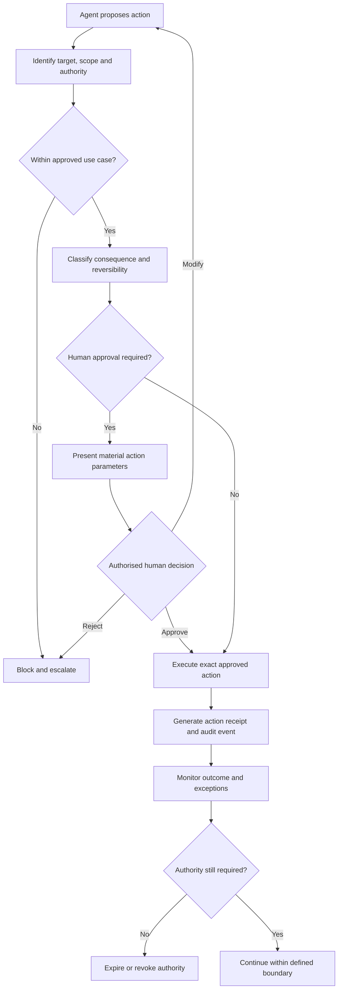

# AI Agent Governance Controls — EU AI Act Implementation Module

**Manual:** Manual 01 — EU AI Act Practical Implementation Guide  
**Module type:** Reusable operational control module  
**Controlled language:** English  
**Status:** Draft implementation control layer; not legal advice  
**Legal baseline:** Regulation (EU) 2024/1689, consolidated text current to 27 July 2026, plus applicable amending legislation and official Commission implementation material  

> This module translates human-oversight, transparency, traceability, risk-management, and deployer responsibilities into practical controls for AI systems that can initiate, recommend, sequence, or execute actions. The agent-control patterns below are implementation measures. They must not be represented as direct quotations from, or independent legal requirements of, the EU AI Act unless a specific provision supports that statement.

## 1. Why agent governance needs a separate control layer

Traditional AI governance often assumes that an AI system produces an output and a person decides what to do next. Agentic systems can go further: they can call tools, access external systems, create or modify records, communicate with third parties, execute multi-step tasks, or operate under standing authority.

That creates additional governance questions:

- What is the agent allowed to see?
- What is the agent allowed to do?
- Which actions require a person before execution?
- How long does authority last?
- How can authority be revoked immediately?
- How is an irreversible or high-impact action prevented from being executed casually?
- How does the organization distinguish trusted instructions from untrusted content?
- What evidence proves what the agent did and under whose authority?

The purpose of this module is to turn those questions into auditable controls.

## 2. EU AI Act anchors

The control architecture in this module should be read together with the operative legal text. Important anchors include:

| EU AI Act anchor | Operational relevance |
|---|---|
| Article 12 — Record-keeping | High-risk AI systems must technically allow automatic recording of events appropriate to traceability and monitoring. Agent actions should therefore be designed so consequential events can be reconstructed where the Article applies. |
| Article 13 — Transparency and information to deployers | Deployers need information sufficient to interpret outputs and use systems appropriately. Agent interfaces should expose relevant limitations, authority boundaries, and oversight instructions. |
| Article 14 — Human oversight | High-risk AI systems must be capable of effective oversight by natural persons, with measures proportionate to risk, autonomy, and context. Agent autonomy settings and approval gates are implementation mechanisms that can support this objective. |
| Article 26 — Obligations of deployers of high-risk AI systems | Where applicable, deployers must operate systems according to instructions, assign oversight to competent persons, monitor operation, and retain logs under their control. Agent operating procedures and evidence retention should support those duties. |

**Control boundary:** Not every AI agent is legally a high-risk AI system. Apply the EU AI Act classification and actor-role analysis before asserting a legal obligation. Organizations may still adopt these controls voluntarily for lower-risk systems as a governance maturity measure.

## 3. Common agent-governance control set

### AG-01 — Human approval for consequential actions

**Objective:** Prevent an AI agent from independently executing an action that could materially affect rights, safety, employment, finances, access to essential services, legal position, security posture, regulated data, or other high-impact interests unless the approved use case explicitly permits it and applicable law allows it.

**Minimum implementation:**

1. Identify consequential action classes during use-case approval.
2. Define which classes are `automatic`, `human approval required`, or `prohibited`.
3. Present the proposed action and material parameters to the approver before execution.
4. Require a named, authorised person to approve, reject, modify, or escalate.
5. Record the decision, actor, time, action parameters, and outcome.

**Evidence:** approval policy; use-case risk assessment; approval logs; exception records; sampled action receipts.

**Audit test:** sample consequential actions and verify that required approval occurred before execution and that the approved parameters match the executed action.

---

### AG-02 — Scoped least-privilege authority

**Objective:** Limit the agent to the minimum data and actions needed for the approved task.

**Minimum implementation:**

- separate read, create/write, update, send/execute, and delete permissions;
- scope access to the narrowest feasible resource, tenant, folder, label, project, environment, or record set;
- keep write, execution, and delete access disabled unless specifically required;
- prevent the agent from receiving authority that the delegating user does not possess;
- review scopes when the use case changes.

**Evidence:** permission matrix; IAM or tool configuration; role definition; access review; change record.

**Audit test:** compare granted permissions to approved task requirements and test whether the agent can access an unrelated resource or action.

---

### AG-03 — Temporary and standing authority controls

**Objective:** Ensure delegated authority lasts no longer than necessary.

**Minimum implementation:**

- default to one-time, task-scoped, or session-scoped authority;
- require an explicit decision for standing authority;
- document the business reason, scope, owner, start date, and expiration or review date;
- do not treat a previous one-time approval as permission for future materially different actions;
- periodically reconfirm long-lived grants.

**Evidence:** delegation register; expiration settings; approval record; periodic review evidence.

**Audit test:** select standing grants and verify continuing need, named owner, defined scope, and timely review.

---

### AG-04 — Immediate revocation and pause

**Objective:** Allow an authorised person to stop agent activity and revoke delegated authority promptly.

**Minimum implementation:**

- provide a documented pause or disable mechanism;
- provide revocation for standing permissions and tokens;
- define emergency suspension triggers;
- verify that revocation propagates to connected tools and sessions;
- document who may invoke emergency suspension.

**Evidence:** revocation procedure; IAM records; kill-switch or disable test; incident evidence.

**Audit test:** perform a controlled revocation test and verify that subsequent agent actions fail closed.

---

### AG-05 — Credential separation

**Objective:** Prevent long-lived human secrets from being exposed to, stored by, or unnecessarily processed through an AI agent.

**Minimum implementation:**

- use OAuth, scoped tokens, service identities, workload identity, passkeys, delegated sessions, or equivalent mechanisms;
- do not place reusable passwords, private keys, recovery codes, or payment credentials directly in prompts or agent memory;
- rotate and revoke delegated credentials according to policy;
- keep privileged credentials outside the agent execution context where feasible.

**Evidence:** authentication architecture; secret-management configuration; token-scope documentation; credential review.

**Audit test:** inspect representative integrations for credential type, scope, storage location, rotation, and revocation capability.

---

### AG-06 — Untrusted-instruction and prompt-injection handling

**Objective:** Prevent instructions embedded in untrusted content from silently expanding the agent's authority or changing an approved task.

**Minimum implementation:**

- classify email, web pages, documents, chat messages, retrieved files, and tool outputs as untrusted instruction sources unless explicitly trusted by design;
- separate data from instructions where technically feasible;
- block untrusted content from granting new permissions or changing authority boundaries;
- require human review when untrusted content requests a consequential or out-of-scope action;
- log material injection detections and attempted authority escalation.

**Evidence:** threat model; prompt-injection controls; test cases; alert records; incident records.

**Audit test:** test representative injected instructions and verify that the agent does not gain new authority or perform an unapproved consequential action.

---

### AG-07 — Action logging and traceability

**Objective:** Make consequential agent activity reconstructable.

**Minimum implementation:**

For material actions, record where appropriate:

- agent/system identity;
- initiating user or process;
- authority or approval basis;
- tool or system called;
- material parameters;
- timestamp;
- result or error;
- reviewer or approver where applicable;
- relevant policy/control decision;
- correlation or transaction identifier.

Retention must follow applicable law, privacy requirements, security policy, contractual requirements, and the AI Act where applicable.

**Evidence:** system logs; audit trails; retention policy; sample transactions.

**Audit test:** reconstruct a sampled agent transaction from initiation through outcome and verify continuity of the evidence chain.

---

### AG-08 — Post-action receipts

**Objective:** Provide a clear record of what the agent actually did, not merely what it intended to do.

**Minimum implementation:**

Each consequential action should produce a receipt or equivalent record containing:

- action performed;
- target or recipient;
- time;
- status;
- authority used;
- relevant approver;
- result;
- undo or remediation path when genuinely available.

**Evidence:** action receipts; user-visible history; backend audit records.

**Audit test:** compare the action receipt to backend logs and the approved action parameters.

---

### AG-09 — Irreversible and high-impact action gate

**Objective:** Apply stronger confirmation when an action cannot be readily reversed or could cause significant harm.

**Minimum implementation:**

1. Classify action reversibility and consequence.
2. Require explicit review for irreversible or high-impact actions.
3. Display the material consequences before approval.
4. Require deliberate confirmation proportionate to risk.
5. Exclude such actions from bulk or blanket approval.

Examples may include deletion of critical records, production security changes, external legal submissions, financial transfers, termination decisions, or irreversible publication.

**Evidence:** action-classification matrix; approval UX; logs; test results.

**Audit test:** verify that high-impact actions cannot be executed through a lower-friction pathway intended for routine activity.

---

### AG-10 — Safe batch-action controls

**Objective:** Prevent bulk approval mechanisms from bypassing review of exceptional or high-risk items.

**Minimum implementation:**

- classify routine and exceptional items before batch approval;
- exclude high-risk or anomalous items from `approve all` operations;
- show the number and type of items in the batch;
- retain per-item evidence of execution;
- require individual review where policy or law requires it.

**Evidence:** batch-control logic; screenshots or UI specification; execution logs; exception queue.

**Audit test:** introduce a flagged high-risk item into a test batch and verify that it cannot be swept into bulk approval.

---

### AG-11 — Oversight interface accessibility and comprehension

**Objective:** Ensure human oversight is usable in practice, including by people with disabilities and people under operational time pressure.

**Minimum implementation:**

- do not convey risk or permission state by colour alone;
- use explicit action labels such as `Approve transfer`, `Reject request`, or `Revoke access`, rather than ambiguous labels such as `OK`;
- make material consequences available in accessible text;
- support keyboard operation and appropriate focus management;
- avoid confirmation mechanisms that create unnecessary accessibility barriers;
- provide sufficient information for the reviewer to understand what is being approved.

**Evidence:** accessibility review; interface specification; usability testing; remediation records.

**Audit test:** verify that the approval path is operable without colour dependence and that the reviewer receives the material decision information before approval.

---

### AG-12 — Authority-boundary monitoring

**Objective:** Detect whether an agent attempts or succeeds in operating outside its approved purpose, scope, toolset, or risk boundary.

**Minimum implementation:**

Monitor for:

- denied permission requests;
- attempted scope expansion;
- unexpected tool use;
- abnormal action volume;
- repeated approval requests;
- policy overrides;
- injection detections;
- emergency stops;
- anomalous use of standing authority.

Material events must feed incident management, corrective action, and use-case reassessment.

**Evidence:** monitoring rules; alerts; dashboards; incident tickets; corrective actions.

**Audit test:** review a period of monitoring data and trace selected boundary events through investigation and closure.

## 4. Agent authority decision workflow



**Accessible explanation:** The agent first proposes an action. The organization checks whether the action is inside the approved use case and classifies its consequence. Actions requiring human approval are shown to an authorised reviewer before execution. The executed action must match the approved action, produce an audit record, and be monitored. Temporary authority expires or is revoked when it is no longer required.

## 5. Size-scaled implementation

| Capability | Level 1 — Micro/small | Level 2 — Growing/midsize | Level 3 — Large/complex |
|---|---|---|---|
| Agent register | Spreadsheet or controlled Markdown register | Central GRC register | Integrated GRC/CMDB/service inventory |
| Permissions | Named accounts and documented scopes | Central IAM groups and scoped integrations | Policy-based identity, PAM, workload identity, continuous access evaluation |
| Approval | Manual named approval | Workflow approval with logs | Risk-based policy engine with segregated duties |
| Logging | Platform logs retained and reviewed | Central log collection | Correlated SIEM/data-lake evidence with automated control monitoring |
| Revocation | Documented disable procedure | Central token/access revocation | Automated revocation and emergency containment |
| Injection testing | Scenario checklist | Repeatable test suite | Continuous adversarial testing/red-team program |
| Audit evidence | Sample approvals and logs | Control evidence repository | Automated evidence collection plus independent assurance |

Organization size changes implementation sophistication, not the need to understand applicable legal duties and risk.

## 6. Evidence package structure

Recommended repository structure:

```text
evidence/
  agent-governance/
    AG-01-human-approval.md
    AG-02-permission-scope.md
    AG-03-standing-authority.md
    AG-04-revocation.md
    AG-05-credential-separation.md
    AG-06-injection-response.md
    AG-07-action-logging.md
    AG-08-action-receipts.md
    AG-09-high-impact-gate.md
    AG-10-batch-actions.md
    AG-11-accessible-oversight.md
    AG-12-boundary-monitoring.md
```

Each evidence file should contain:

- control ID and objective;
- control owner;
- systems and use cases in scope;
- implementation description;
- evidence required;
- test procedure;
- exceptions and compensating controls;
- review frequency;
- last test date and result;
- remediation owner and due date for failures;
- framework mappings.

## 7. Cross-framework mapping model

The common control IDs above are designed to be reusable. Exact mappings must be validated against authoritative versions before publication.

| Common control | EU AI Act | ISO/IEC 42001 | NIST AI RMF | NIST CSF 2.0 |
|---|---|---|---|---|
| AG-01 Human approval | Human oversight / deployer operation where applicable | Human oversight and operational governance mapping to be validated | GOVERN / MANAGE mapping to be validated | GV / PR mapping to be validated |
| AG-02 Least privilege | Supports controlled use and oversight | Access/governance mapping to be validated | GOVERN / MANAGE | PR.AA mapping to be validated |
| AG-04 Revocation | Supports effective intervention and stop capability | Operational control mapping to be validated | MANAGE | PR.AA / RS mapping to be validated |
| AG-07 Action logging | Article 12 and deployer log obligations where applicable | Monitoring/evidence mapping to be validated | MEASURE / MANAGE | DE / GV mapping to be validated |
| AG-06 Injection handling | Supports robustness, cybersecurity, and controlled operation | Risk/security mapping to be validated | MANAGE | PR / DE mapping to be validated |
| AG-08 Action receipts | Governance evidence and traceability support | Documentation/evidence mapping to be validated | GOVERN / MEASURE | GV / DE mapping to be validated |

**Publication rule:** Replace every `mapping to be validated` statement only after checking the authoritative framework source and recording the source/version in the repository source registry.

## 8. Auditor procedure — minimum test set

For each material agentic AI use case, an auditor should be able to answer:

1. Is the system and actor role documented?
2. What actions may the agent perform automatically?
3. What actions require prior human approval?
4. What actions are prohibited?
5. Are permissions narrower than or equal to the delegating user's authority?
6. Are write, execute, and delete permissions separately controlled?
7. Does standing authority have a documented owner and review or expiration mechanism?
8. Can an authorised person revoke access and stop operation?
9. Are reusable credentials kept outside prompts and agent memory?
10. Can untrusted content alter instructions or expand authority?
11. Are consequential actions reconstructable from logs?
12. Does the recorded action match what the reviewer approved?
13. Are irreversible or high-impact actions excluded from routine batch approval?
14. Is the approval interface accessible and sufficiently informative?
15. Are boundary violations, overrides, complaints, errors, and incidents monitored and remediated?

A failed test should produce a finding with severity, evidence, owner, remediation action, target date, and retest result.

## 9. Relationship to the existing human-oversight baseline

This module extends `EU_AI_Act_Verified_Regulatory_Baseline_and_Human_Oversight.md`.

The baseline answers: **Where must a qualified person remain responsible and capable of intervention?**

This module adds: **What authority did the AI agent receive, what may it execute, when must it stop and ask, how is that authority revoked, and what evidence proves what happened?**

Both layers are required for a mature agent-governance implementation.

## 10. Maintenance rule

Review this module whenever any of the following changes:

- the operative EU AI Act text or application timeline;
- Commission or AI Office guidance relevant to high-risk systems, deployers, transparency, human oversight, serious incidents, or post-market monitoring;
- ISO/IEC 42001 mapping sources;
- NIST AI RMF or NIST CSF mapping sources;
- the organization's agent architecture, tool permissions, identity model, or approval mechanisms;
- material prompt-injection or agent-security threat intelligence.

Legal requirements, official guidance, implementation recommendations, and maturity enhancements must remain visibly distinguishable throughout maintenance.
