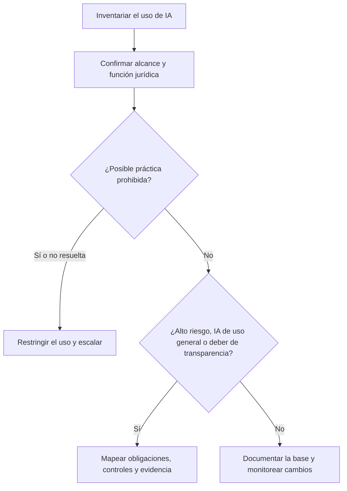
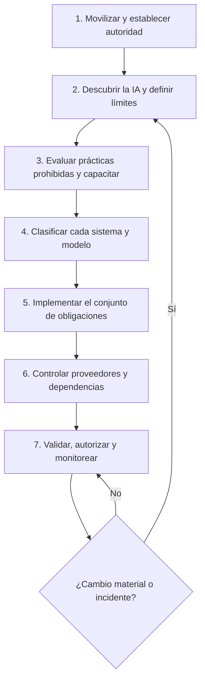

# Manual 01 — Rutas prácticas de implementación de la Ley de IA de la UE

**Idioma controlado de esta edición:** español neutro de América Latina (`es-419`)

**Audiencia:** organizaciones de cualquier tamaño que provean, desplieguen, importen, distribuyan o utilicen de otra manera sistemas de IA o modelos de IA de uso general en un contexto relacionado con la Unión Europea

**Base jurídica verificada:** 24 de agosto de 2026

**Estado:** punto de entrada para la implementación; debe utilizarse junto con el manual completo de 138 capítulos y los apéndices A–Z

> Este documento ofrece orientación operativa y no constituye asesoría legal. El tamaño de una organización cambia la forma de asignar los recursos, pero no elimina por sí mismo una obligación. Determine el actor jurídico aplicable, la categoría del sistema o modelo, la conexión jurisdiccional y la fecha de aplicación mediante el texto consolidado vigente.

## 1. Comience por la función y el alcance, no por el tamaño de la empresa

Complete un registro para cada sistema, modelo, servicio, función, piloto y caso de uso material de IA. No clasifique un producto una sola vez si la organización desempeña más de una función.

| Pregunta | Resultado requerido |
|---|---|
| ¿La Ley de IA de la UE se aplica territorial o extraterritorialmente? | Decisión de aplicabilidad con hechos, responsable, revisor, fecha y fuente jurídica |
| ¿La organización es proveedor, responsable del despliegue, importador, distribuidor, fabricante del producto, representante autorizado o proveedor posterior? | Registro de la función jurídica para cada sistema o modelo |
| ¿El elemento es un sistema de IA, un modelo de IA de uso general, ambos por integración, o queda fuera de la definición? | Clasificación y límite documentados |
| ¿Existe relación con una práctica prohibida? | Decisión de evaluación firmada y registro de suspensión o escalamiento inmediato cuando corresponda |
| ¿El sistema es de alto riesgo, está sujeto a obligaciones de transparencia o no pertenece a ninguna de esas categorías? | Decisión sobre la categoría de riesgo con la base jurídica pertinente |
| ¿Participa un tercero? | Registro del proveedor, contrato, documentación, dependencia y notificación de cambios |
| ¿Qué disposiciones se aplican ahora y cuáles se aplicarán después? | Registro de fechas de aplicación, disposición por disposición |

Cuando una respuesta sea incierta, márquela como **no resuelta** y restrinja el despliegue según corresponda. No clasifique silenciosamente la incertidumbre como riesgo bajo.

### Guía visual — Clasificación y ruta de decisión

**Explicación accesible:** Cada uso de IA ingresa al inventario y recibe una decisión sobre alcance y función jurídica. Una posible práctica prohibida se restringe y escala. Los demás usos se evalúan para determinar obligaciones de alto riesgo, IA de uso general y transparencia; las obligaciones aplicables se convierten en controles y evidencia, mientras las demás decisiones permanecen documentadas y bajo monitoreo.

## 2. Ciclo mínimo de implementación

### Puerta 1 — Movilizar y establecer autoridad

1. Designe un patrocinador ejecutivo responsable y un propietario operativo.
2. Apruebe una carta breve de gobierno de IA y una ruta de escalamiento.
3. Identifique apoyo calificado en asuntos legales, privacidad, seguridad, derechos fundamentales, producto y aseguramiento.
4. Cree una ubicación controlada para la evidencia y un registro de decisiones.

**Evidencia de salida:** carta de gobierno, matriz de responsabilidades, contactos de escalamiento, registro de fuentes jurídicas y plan de implementación aprobado.

### Puerta 2 — Descubrir la IA y definir sus límites

1. Inventaríe la IA adquirida, desarrollada internamente, incorporada en productos, experimental y adoptada directamente por empleados.
2. Registre la finalidad prevista, usuarios, personas afectadas, entradas, salidas, fuentes de datos, dependencias de modelos, jurisdicciones y proveedores.
3. Asigne cada sistema y modelo a una o más funciones jurídicas.
4. Establezca un proceso de ingreso para impedir que compras, ingeniería, las áreas de negocio o los empleados introduzcan IA fuera del inventario.

**Evidencia de salida:** inventario de IA, diagramas de límites, certificaciones de propietarios, lista de proveedores y conciliación del descubrimiento.

### Puerta 3 — Evaluar prácticas prohibidas y establecer alfabetización en materia de IA

1. Evalúe cada caso de uso frente a las disposiciones vigentes sobre prácticas prohibidas.
2. Suspenda, restrinja o escale cualquier uso que pueda estar prohibido.
3. Proporcione alfabetización en materia de IA basada en las funciones, considerando el conocimiento del personal, el contexto de uso y las personas afectadas.
4. Conserve la evidencia de las evaluaciones y de la capacitación.

**Evidencia de salida:** lista de verificación de prácticas prohibidas, registros de excepciones o escalamiento, matriz de capacitación, registros de finalización y comprobaciones de competencia.

### Puerta 4 — Clasificar cada sistema y modelo

Clasifique, como mínimo:

- la función o las funciones jurídicas;
- la actividad excluida o fuera de alcance y sus fundamentos;
- la exposición a prácticas prohibidas;
- la categoría de sistema de alto riesgo y cualquier análisis de excepción;
- las obligaciones de transparencia;
- la participación de modelos de IA de uso general y, cuando sea pertinente, las consideraciones de riesgo sistémico;
- las dependencias relacionadas con datos personales, empleo, biometría, seguridad, consumidores, accesibilidad y derechos fundamentales;
- el riesgo de modificación sustancial; y
- las fechas de aplicación de las disposiciones conforme al texto consolidado vigente.

**Evidencia de salida:** registro de clasificación aprobado, fuente citada, revisor, fecha de revisión, eventos que activan una nueva revisión y fecha de la siguiente revisión.

### Puerta 5 — Implementar el conjunto de obligaciones

Para cada función y categoría aplicable, convierta el requisito jurídico en un control con responsable, frecuencia, evidencia, método de prueba, proceso de excepciones y dependencias.

La preparación de un proveedor de sistemas de alto riesgo puede requerir controles sobre gestión de riesgos, datos y gobierno de datos, documentación técnica, conservación de registros, transparencia e instrucciones de uso, supervisión humana, exactitud, solidez, ciberseguridad, gestión de la calidad, evaluación de conformidad, registro, vigilancia poscomercialización y gestión de incidentes graves. Aplique solamente las obligaciones que la legislación vigente atribuya a la organización y al sistema.

La preparación del responsable del despliegue puede incluir el uso conforme a las instrucciones, la asignación de supervisión humana competente, controles de los datos de entrada cuando correspondan, monitoreo, conservación de registros cuando estén bajo su control, información a los trabajadores, evaluación de impacto sobre los derechos fundamentales cuando sea obligatoria y escalamiento de incidentes o riesgos.

La preparación para IA de uso general y para transparencia debe distinguir las obligaciones del proveedor de las del proveedor posterior o del responsable del despliegue. Trate las directrices oficiales y los códigos de prácticas como ayudas de implementación no vinculantes, salvo que un instrumento vinculante les otorgue otro efecto jurídico.

**Evidencia de salida:** registro de artículos y controles, procedimientos, evaluaciones completadas, registros técnicos, avisos, aprobaciones, bitácoras, resultados de pruebas y registros de remediación.

### Puerta 6 — Controlar proveedores y la cadena de suministro de IA

1. Identifique cada modelo, conjunto de datos, plataforma, API, integrador, evaluador, proveedor de alojamiento y subcontratista material.
2. Obtenga la documentación necesaria para que la organización pueda realizar su propia clasificación y cumplir sus obligaciones.
3. Defina derechos contractuales sobre evidencia de auditoría, notificación de incidentes, cooperación regulatoria, seguridad, uso de datos, propiedad intelectual, cambios de modelo o servicio, localización, subcontratistas, continuidad y terminación.
4. Monitoree los cambios que puedan modificar la finalidad prevista, el desempeño, el riesgo, la función jurídica o la condición de modificación sustancial.
5. Mantenga un plan para reemplazar, aislar o desactivar dependencias críticas.

**Evidencia de salida:** expediente de debida diligencia, lista contractual aprobada, mapa de dependencias, resultados de monitoreo, evaluaciones de cambios y plan de salida.

### Puerta 7 — Validar, autorizar y monitorear

1. Pruebe el diseño de los controles antes del despliegue.
2. Pruebe su eficacia operativa mediante evidencia representativa.
3. Exija la aprobación de los responsables y una revisión independiente proporcional al riesgo.
4. Monitoree incidentes, desempeño, sesgo y efectos desiguales, seguridad, deriva, quejas, anulaciones humanas, cambios de proveedores, cambios legales y cambios regulatorios.
5. Vuelva a clasificar después de cambios materiales; no trate la aprobación inicial como permanente.

**Evidencia de salida:** plan y resultados de pruebas, registro de aprobación, decisión sobre riesgo residual, plan de monitoreo, procedimiento de incidentes, pista de auditoría e historial de reclasificaciones.

### Guía visual — Siete puertas de implementación

**Explicación accesible:** El programa avanza por siete puertas controladas, desde la movilización del gobierno hasta el monitoreo continuo. Un cambio material o incidente devuelve el sistema al descubrimiento, la clasificación y los controles afectados; si no ocurre, el monitoreo continúa.

## 3. Tres rutas de implementación

Las siguientes rutas describen modelos de asignación de recursos. No sustituyen la clasificación jurídica anterior.

| Capacidad | Micro y pequeña organización | Organización mediana | Empresa grande o compleja |
|---|---|---|---|
| Responsabilidad | Un patrocinador ejecutivo y un responsable de controles de IA; pueden combinarse funciones si se documentan los conflictos | Grupo transversal de gobierno de IA con propietarios de productos y procesos de negocio | Modelo operativo aprobado por el consejo, comité ejecutivo y responsabilidades formales de tres líneas |
| Inventario | Hoja de cálculo controlada o registro GRC sencillo, con certificación mensual del propietario | Registro central integrado con compras, privacidad, seguridad y gestión de cambios | Descubrimiento automatizado, inventario empresarial y mapeo por entidad y jurisdicción |
| Apoyo jurídico | Especialista externo para asuntos no resueltos, prohibidos, de alto riesgo, IA de uso general y derechos fundamentales | Responsable jurídico o de privacidad interno con escalamiento a especialistas | Asesoría regulatoria dedicada y función coordinada de cambios jurídicos en varias jurisdicciones |
| Evaluación de riesgos | Cuestionario estándar y aprobación documentada; pruebas especializadas externas | Flujo formal de evaluación con revisores de seguridad, privacidad, datos y derechos fundamentales | Programa integrado de evaluación de impacto, riesgo de modelos, seguridad, privacidad y derechos fundamentales |
| Aseguramiento técnico | Evidencia del proveedor y pruebas independientes específicas para usos de mayor riesgo | Capacidad interna de pruebas con especialistas externos cuando sea necesario | Equipos independientes de validación, entornos controlados, pruebas de equipo rojo y monitoreo continuo |
| Control de proveedores | Lista aprobada, cuestionario estándar, cláusulas mínimas y revisión al renovar | Debida diligencia por nivel de riesgo, estándares contractuales y monitoreo continuo | Programa empresarial de riesgo de terceros de IA con concentración, cuartas partes, resiliencia y salida |
| Evidencia | Repositorio compartido restringido, con reglas de nomenclatura y retención | Biblioteca GRC vinculada con controles, sistemas, responsables y hallazgos | Arquitectura empresarial de evidencia con linaje, registros inmutables cuando sea necesario y capacidad de respuesta regulatoria |
| Aseguramiento | Revisión independiente anual y revisión activada por eventos | Auditoría interna basada en riesgos y pruebas de controles | Monitoreo continuo de controles más aseguramiento interno y externo independiente |

### Micro y pequeña organización: conjunto mínimo viable de controles

Utilice esta ruta cuando la organización tenga personal limitado y la clasificación jurídica y de riesgos permita este modelo.

1. Mantenga un único inventario completo de IA.
2. Designe un patrocinador responsable y un propietario operativo.
3. Adopte una política de uso y adquisición de IA.
4. Complete la evaluación de prácticas prohibidas y de función o categoría antes de utilizar la IA.
5. Capacite a todas las personas que adquieran, configuren, supervisen o utilicen resultados de IA.
6. Utilice el cuestionario de proveedores y la lista contractual de los apéndices O y P.
7. Obtenga apoyo legal o técnico externo para casos no resueltos o de alto impacto.
8. Almacene aprobaciones, evidencia de proveedores, avisos, pruebas, incidentes y cambios en una ubicación controlada.
9. Revise el inventario por lo menos trimestralmente y después de todo cambio material.

No utilice la ruta para empresas pequeñas con el fin de evitar documentación, pruebas, supervisión humana o evaluación de conformidad que sean jurídicamente aplicables.

### Organización mediana: programa administrado

1. Establezca un foro mensual de gobierno de IA.
2. Integre el ingreso de IA con compras, gestión de cambios, privacidad, seguridad, recursos humanos y gobierno de productos.
3. Asigne un propietario del sistema y un responsable de cada control para todo uso material de IA.
4. Utilice revisiones por nivel de riesgo y evaluación independiente.
5. Mantenga una biblioteca común de controles y un registro de evidencia.
6. Pruebe trimestralmente una muestra de controles y realice una auditoría anual basada en riesgos.
7. Monitoree cambios en proveedores, modelos, datos, desempeño, legislación e incidentes.
8. Informe a los ejecutivos sobre integridad del inventario, clasificaciones no resueltas, remediaciones vencidas, incidentes y resultados de pruebas de controles.

### Empresa grande o compleja: programa integrado

1. Establezca supervisión del consejo y de los ejecutivos para todas las entidades y jurisdicciones.
2. Opere un sistema formal de gestión de IA alineado, cuando sea útil, con ISO/IEC 42001, sin afirmar que esa alineación por sí sola demuestra cumplimiento de la Ley de IA de la UE.
3. Automatice el descubrimiento y conecte el inventario de IA con los registros de activos, modelos, datos, proveedores, privacidad, seguridad, productos y obligaciones regulatorias.
4. Mantenga responsabilidades separadas para la administración, la revisión independiente de riesgos y cumplimiento, y la auditoría interna.
5. Realice validaciones especializadas de seguridad, ciberseguridad, solidez, explicabilidad, sesgo, accesibilidad, supervisión humana y derechos fundamentales cuando correspondan.
6. Mantenga procedimientos para exámenes regulatorios, incidentes graves, retiro o acciones correctivas y conservación de evidencia.
7. Monitoree la concentración y las dependencias sistémicas de IA de uso general, nube, datos y cadenas de suministro de modelos.
8. Proporcione informes consolidados que permitan profundizar hasta el sistema, entidad, función, obligación, control, evidencia, hallazgo y remediación.

## 4. Hitos internos sugeridos del programa

Estos son objetivos de gestión, no fechas legales. Las fechas vinculantes deben mantenerse en el registro controlado de fechas jurídicas.

| Período | Resultado mínimo |
|---|---|
| Días 1–30 | Patrocinador, responsable, base jurídica, inicio del inventario, evaluación de prácticas prohibidas, restricciones urgentes, plan de alfabetización en IA y ubicación de evidencia |
| Días 31–90 | Clasificación de funciones y riesgos, proceso de ingreso, controles de proveedores, políticas básicas, mapeo de controles y remediación priorizada |
| Meses 4–6 | Conjuntos de obligaciones implementados, pruebas técnicas y de supervisión humana, remediación contractual, monitoreo y primera revisión de eficacia de controles |
| Meses 7–12 | Cierre de brechas prioritarias, aseguramiento independiente, informes repetibles, preparación para respuestas regulatorias y plan aprobado de mejora continua |

## 5. Índice de evidencia para cada sistema de IA

Cada registro de sistema debe enlazar los siguientes elementos. Marque un elemento como **no aplicable** únicamente con una justificación aprobada:

- decisión de aplicabilidad y función jurídica;
- finalidad prevista y límite del sistema;
- evaluación de prácticas prohibidas;
- clasificación de alto riesgo y transparencia;
- evaluación de dependencias de IA de uso general;
- evaluaciones de datos, privacidad, seguridad y derechos fundamentales, cuando correspondan;
- debida diligencia de proveedores y controles contractuales;
- documentación técnica e instrucciones;
- diseño de supervisión humana y capacitación;
- resultados y limitaciones de las pruebas;
- aprobación y decisión sobre riesgo residual;
- avisos, etiquetas, registros o evidencia de conformidad, cuando correspondan;
- despliegue, monitoreo, bitácoras, anulaciones, quejas e incidentes;
- evaluaciones de cambios y modificaciones sustanciales;
- acciones correctivas y evidencia de cierre; y
- decisión de retención y eliminación.

## 6. Métricas que muestran la calidad de la implementación

- porcentaje de sistemas de IA con propietario confirmado;
- finalización de certificaciones del inventario y excepciones de conciliación;
- clasificaciones no resueltas de función, alcance y riesgo;
- evaluaciones de prácticas prohibidas completadas antes del despliegue;
- finalización de alfabetización en IA por función y resultados de competencia;
- obligaciones de alto riesgo mapeadas a controles implementados y probados;
- sistemas con evidencia de proveedores o remediación contractual vencida;
- hallazgos críticos abiertos y antigüedad promedio de la remediación;
- cambios no aprobados de modelo, datos, finalidad o proveedor;
- incidentes, quejas, anulaciones y excepciones de monitoreo; y
- revisiones de fuentes jurídicas completadas antes de su vencimiento.

Evite un único porcentaje de cumplimiento que oculte inventarios desconocidos, preguntas jurídicas no resueltas o controles no probados.

## 7. Fuentes controladas

Utilice los identificadores de `.compliance/authoritative-sources.json`:

- `eu-ai-act-consolidated-2026-07-27` — Reglamento (UE) 2024/1689 consolidado vigente;
- `eu-ai-omnibus-2026-1744` — modificación vinculante de 2026;
- `ec-eu-ai-act-implementation` — panorama oficial de implementación, no vinculante salvo cuando describe legislación vinculante;
- `ec-eu-ai-act-enforcement` — panorama oficial de aplicación y supervisión, tratado como orientación no vinculante; y
- `ec-eu-ai-transparency-code-2026` — código voluntario de transparencia y material oficial relacionado.

El flujo de trabajo dedicado verifica que estas fuentes, este punto de entrada, el manual completo y los principales apéndices de evidencia permanezcan presentes y conectados. Superar las verificaciones demuestra integridad del repositorio, no una determinación jurídica de cumplimiento.

## 8. Componentes relacionados del manual

- [Fundamento canónico](../../../EU_AI_Act_GRC_Manual_Foundation_CORRECTED_MASTER.md)
- [Cronograma de aplicación y reglas transitorias](../../../chapters/06_Application_Timeline_and_Transitional_Rules_CORRECTED.md)
- [Primeros 30 días](../../../chapters/129_First_30_Days_CORRECTED_MASTER.md)
- [Ruta de preparación para alto riesgo](../../../chapters/133_High_Risk_Readiness_Roadmap_CORRECTED_MASTER.md)
- [Ruta de preparación para IA de uso general](../../../chapters/134_GPAI_Readiness_Roadmap_CORRECTED_MASTER.md)
- [Ruta de preparación para transparencia](../../../chapters/135_Transparency_Readiness_Roadmap_CORRECTED_MASTER.md)
- [Cuestionario para proveedores de IA](../../../appendices/Appendix_O_AI_Vendor_Questionnaire_CORRECTED_MASTER.md)
- [Lista de cláusulas contractuales](../../../appendices/Appendix_P_Contract_Clause_Checklist_CORRECTED_MASTER.md)
- [Ruta general de implementación](../../../appendices/Appendix_Z_Implementation_Roadmap_CORRECTED_MASTER.md)
