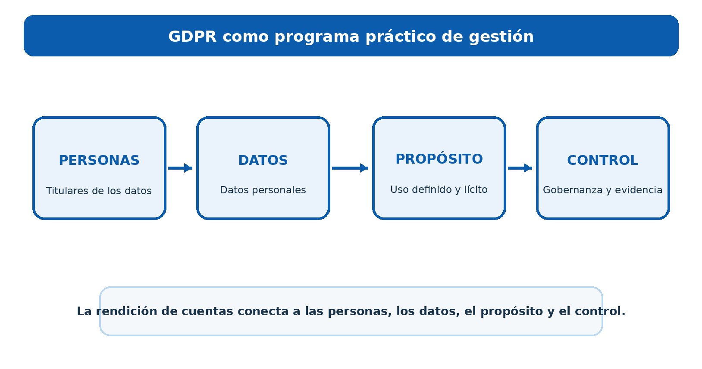
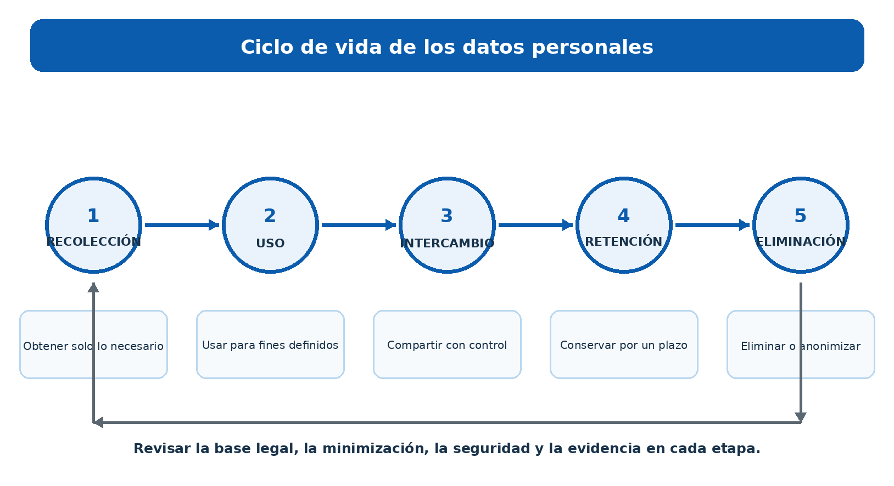
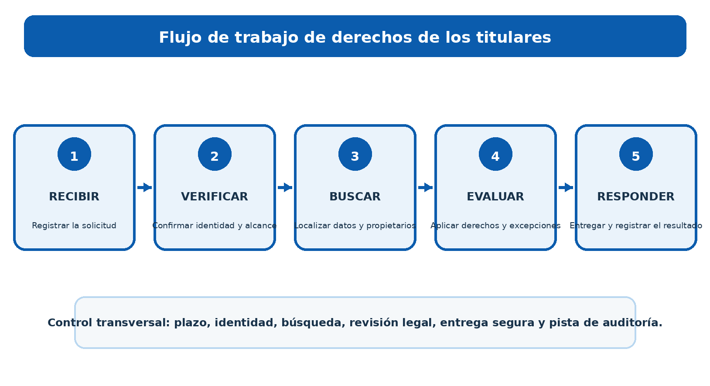
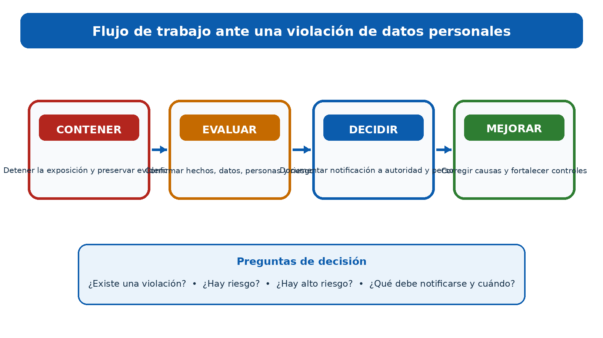
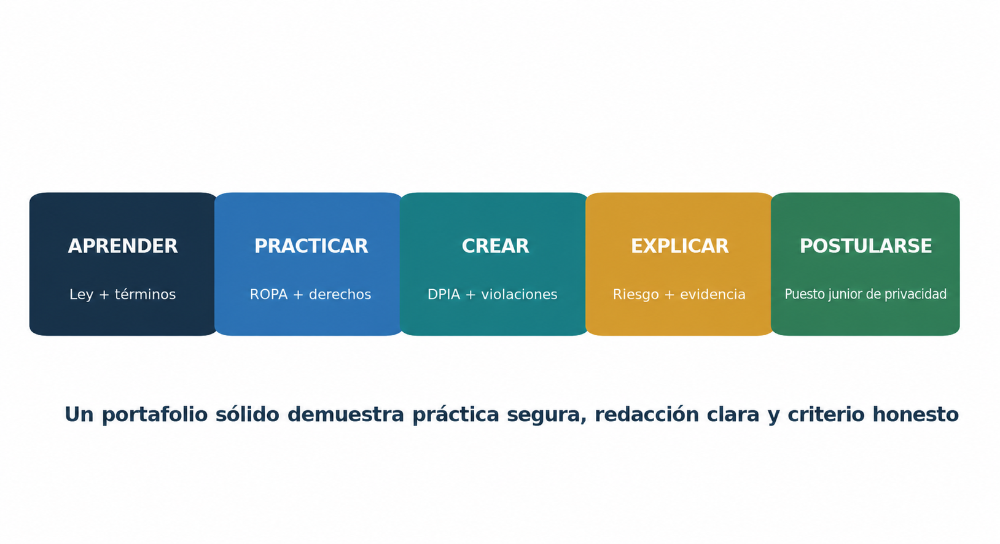

> **Estado de revisión:** Borrador de traducción asistida por máquina. Requiere revisión humana de terminología, significado, enlaces, formato y vigencia técnica antes de marcarse como edición final.

**CYBERSECURITY, PRIVACY &amp; COMPLIANCE SERIES**

**GDPR**

**Un manual práctico para administradores y analistas jóvenes**

*Cómo se desarrolla, opera, demuestra y mejora el trabajo de privacidad*

**Alberto (Al) Leiva**

Primera edición • Julio 2026

| **Inside:** Plain-English GDPR artículos • Manual de gestión • Herramientas de código abierto • Ejemplos de evidencia • Laboratorios de analista junior • Preparación de entrevistas |
|. |

# Publication and Use Notice

Autor: Alberto (Al) Leiva

Edición: Primera edición, Julio 2026

Propósito: Educación gratuita y práctica para directivos, estudiantes, cambiadores de carrera, analistas juniores, profesionales de la privacidad y profesionales de la ciberseguridad.

## Aviso educativo y legal

Este manual proporciona información educativa general. No es un consejo legal y no reemplaza el asesoramiento de un abogado calificado o del oficial de protección de datos de una organización. Las obligaciones de GDPR dependen de hechos, la legislación de los Estados Miembros, la orientación de los reguladores, los contratos y las decisiones judiciales. Siempre verifique las fuentes oficiales actuales antes de actuar en un asunto real.

## Uso ético y autorizado

Usar herramientas y ejercicios sólo con autorización escrita y sólo con datos ficticios, sintéticos o adecuadamente sanitarios. Los datos personales pueden dañar a las personas cuando se expone o se usa indebidamente. La habilidad técnica no crea permiso.

# Prefacio

*Una introducción acogedora al trabajo práctico de privacidad.*

GDPR puede parecer una pared de lenguaje legal. En el trabajo diario, se convierte en un conjunto de preguntas prácticas: ¿Qué datos personales utilizamos? ¿Por qué lo necesitamos? ¿Quién puede verlo? ¿Cuánto tiempo tenemos? ¿Cómo lo protegemos? ¿Cómo puede una persona ejercer un derecho? ¿Cómo demostramos que nuestras respuestas son verdaderas?

Los administradores necesitan una propiedad clara, decisiones de riesgo honestas, recursos adecuados y pruebas fiables. Los analistas juniores necesitan mapear el procesamiento, revisar los avisos y contratos, coordinar las solicitudes de derechos, apoyar a los DPIA, organizar los hechos de violación y comunicarse sin ocultar incertidumbre.

Este manual sigue un enfoque basado en la metodología. Las herramientas pueden ayudar a descubrir datos, controlar el acceso, encontrar debilidades y organizar registros. No pueden elegir una base legal, decidir si se respetan los derechos de una persona o sustituir el juicio legal y profesional.

| **Lección central:** El cumplimiento de GDPR no es un proyecto de documento único. Es un programa continuo para el uso legal, justo, transparente, seguro y responsable de los datos personales. |
Respuesta

*— Alberto (Al) Leiva*

Cómo utilizar este manual

Los administradores deben comenzar con los capítulos 1 a 8 y utilizar el libro de juegos y las plantillas como referencias de trabajo.

Los analistas junior deben estudiar los derechos, la evidencia, la guía de artículos, las herramientas, el laboratorio ficticio, los proyectos de portafolio y el capítulo de entrevistas.

Los lectores técnicos deben conectar cada herramienta a un propósito definido, riesgo, control, propietario y proceso de revisión.

Los equipos jurídicos y de privacidad deberían verificar las normas de los Estados Miembros y la orientación actual de la Junta de Desarrollo Internacional o la autoridad supervisora.

| ** Nota de edición:** La tabla final de contenidos incluye números de página verificados para esta edición. Si el manual es editado, confirme el nuevo diseño y actualice las referencias de la página. |
Respuesta

# Tabla de contenidos

[Notificación de publicación y uso [2](#publication-and-use-notice)](#publication-and-use-notice)

[Notificación económica y jurídica [2](#educational-and-legal-notice)](#educational-and-legal-notice)

[Uso electrónico y autorizado [2] (#ethical-and-authorized-use)](#ethical-and-authorized-use)

[Prefacio [3] (#preface)](#preface)

[Cómo utilizar este manual [4](#how-to-use-this-manual)](#how-to-use-this-manual)

[Tabla de contenidos [4](#table-of-contents)](#table-of-contents)

[1. GDPR Foundations [9](#gdpr-foundations)](#gdpr-foundations)

[1.1 Lo que GDPR protege [9](#what-gdpr-protects)](#what-gdpr-protects)

[1.2 El cumplimiento es más que la seguridad [9](#compliance-is-more-than-security)](#compliance-is-more-than-security)

[1.3 Lo que GDPR no significa [9](#what-gdpr-does-not-mean)](#what-gdpr-does-not-mean)

[2. Alcance, Papeles y Definiciones [10](#scope-roles-and-definitions)](#scope-roles-and-definitions)

[2.1 Cuestiones de alcance [10](#scope-questions)](#scope-questions)

[2.2 Funciones básicas [10](#core-roles)](#core-roles)

[2.3 Datos personales, especiales y penales [10](#personal-special-category-and-criminal-data)](#personal-special-category-and-criminal-data)

[3. Principios y bases legítimas [11](#principles-and-lawful-bases)](#principles-and-lawful-bases)

[3.1 Principios del artículo 5 [11](#article-5-principles)](#article-5-principles)

[3.2 Bases legales en virtud del artículo 6 [11](#lawful-bases-under-article-6)](#lawful-bases-under-article-6)

[3.3 Datos confidenciales y de consentimiento [12](#consent-and-sensitive-data)](#consent-and-sensitive-data)

[4. Data Subject Rights [13](#data-subject-rights)](#data-subject-rights)

[4.1 El reloj de solicitud [13](#the-request-clock)](#the-request-clock)

[4.2 Un archivo de solicitud defensible [14](#a-defensible-request-file)](#a-defensible-request-file)

[5. Controller and Processor Governance [15](#controller-and-processor-governance)](#controller-and-processor-governance)

[5.1 Registros de actividades de procesamiento [15](#records-of-processing-activities)](#records-of-processing-activities)

[5.2 Procesador de diligencia debida y contratos del artículo 28 [15](#processor-due-diligence-and-article-28-contracts)](#processor-due-diligence-and-article-28-contracts)

[5.3 Registros de responsabilidad [15](#accountability-records)](#accountability-records)

[6. Seguridad y Datos Personales Breaches [16](#security-and-personal-data-breaches)](#security-and-personal-data-breaches)

[6.1 Artículo 32 seguridad [16](#article-32-security)](#article-32-security)

[6.2 Decisiones de Breach [16](#breach-decisions)](#breach-decisions)

[7. DPIAs, Privacy by Design, and the DPO [17](#dpias-privacy-by-design-and-the-dpo)](#dpias-privacy-by-design-and-the-dpo)

[7.1 flujo de trabajo DPIA [17](#dpia-workflow)](#dpia-workflow)

[7.2 Privacidad por diseño y por defecto [17](#privacy-by-design-and-default)](#privacy-by-design-and-default)

[7.3 DPO independence [17](#dpo-independence)](#dpo-independence)

[8. Transferencias internacionales de datos [18](#international-data-transfers)](#international-data-transfers)

[8.1 Flujo de trabajo de transferencia [18](#transfer-workflow)](#transfer-workflow)

[8.2 Pruebas comunes de transferencia [18](#common-transfer-evidence)](#common-transfer-evidence)

[9. Guía completa del artículo por artículo [19](#complete-article-by-article-guide)](#complete-article-by-article-guide)

[9.1 Capítulo I - Disposiciones generales [19](#chapter-i-general-provisions)](#chapter-i-general-provisions)

[9.2 Capítulo II - Principios [19](#chapter-ii-principles)](#chapter-ii-principles)

[9.3 Capítulo III - Derechos del interesado [19](#chapter-iii-rights-of-the-data-subject)](#chapter-iii-rights-of-the-data-subject)

[9.4 Capítulo IV — Contralor y procesador [20] (#chapter-iv-controller-and-processor)](#chapter-iv-controller-and-processor)

[9.5 Capítulo V - Transferencias a terceros países o organizaciones internacionales [21](#chapter-v-transfers-to-third-countries-or-international-organizations)](#chapter-v-transfers-to-third-countries-or-international-organizations)

[9.6 Capítulo VI - Autoridades de supervisión independientes [22] (#chapter-vi-independent-supervisory-authorities)] (#chapter-vi-independent-supervisory-authorities)

[9.7 Capítulo VII - Cooperación y coherencia [22](#chapter-vii-cooperation-and-consistency)](#chapter-vii-cooperation-and-consistency)

[9.8 Capítulo VIII - Remedios, responsabilidad y sanciones [23](#chapter-viii-remedies-liability-and-penalties)](#chapter-viii-remedies-liability-and-penalties)

[9.9 Capítulo IX — Situaciones específicas de procesamiento [23] (#chapter-ix-specific-processing-situations)](#chapter-ix-specific-processing-situations)

[9.10 Capítulo X — Actos delegados e implementados [24](#chapter-x-delegated-and-implementing-acts)](#chapter-x-delegated-and-implementing-acts)

[9.11 Capítulo XI - Disposiciones finales [24](#chapter-xi-final-provisions)](#chapter-xi-final-provisions)

[10. Manual del GDPR para gerentes [25](#managers-gdpr-playbook)](#managers-gdpr-playbook)

[10.1 Preguntas para cada propietario del procesamiento [25](#questions-for-every-processing-owner)](#questions-for-every-processing-owner)

[10.2 Dashboard mensual [25](#monthly-dashboard)](#monthly-dashboard)

[10.3 Errores comunes de gestión [25](#common-management-mistakes)](#common-management-mistakes)

[11. From Beginner to Junior Privacy Analyst [26](#from-beginner-to-junior-privacy-analyst)](#from-beginner-to-junior-privacy-analyst)

[11.1 Títulos de trabajo [26](#job-titles)](#job-titles)

[11.2 Trabajo junior típico [26](#typical-junior-work)](#typical-junior-work)

[11.3 Habilidades que los empleadores pueden observar [27](#skills-employers-can-observe)](#skills-employers-can-observe)

[12. Herramientas de código abierto para GDPR Work [28](#open-source-tools-for-gdpr-work)](#open-source-tools-for-gdpr-work)

[12.1 Auxiliar de CISO [28](#ciso-assistant)](#ciso-assistant)

[Inicio rápido [28](#quick-start)](#quick-start)

[Evidencia para retener [28](#evidence-to-retain)](#evidence-to-retain)

[12.2 OpenMetadata [28](#openmetadata)](#openmetadata)

[Inicio rápido [29](#quick-start-1)](#quick-start-1)

[Evidencia para retener [29](#evidence-to-retain-1)](#evidence-to-retain-1)

[12.3 Microsoft Presidio [29](#microsoft-presidio)](#microsoft-presidio)

[Inicio rápido [29](#quick-start-2)](#quick-start-2)

[Evidencia para retener [29](#evidence-to-retain-2)](#evidence-to-retain-2)

[12.4 ARX [29](#arx)](#arx)

[Inicio rápido [29](#quick-start-3)](#quick-start-3)

[Evidencia para retener [29](#evidence-to-retain-3)](#evidence-to-retain-3)

[12.5 Keycloak [29](#keycloak)](#keycloak)

[Inicio rápido [30](#quick-start-4)](#quick-start-4)

[Evidencia para retener [30](#evidence-to-retain-4)](#evidence-to-retain-4)

[12.6 Wazuh [30](#wazuh)](#wazuh)

[Inicio rápido [30](#quick-start-5)](#quick-start-5)

[Evidencia para retener [30](#evidence-to-retain-5)](#evidence-to-retain-5)

[12.7 OWASP ZAP [30](#owasp-zap)](#owasp-zap)

[Inicio rápido [30](#quick-start-6)](#quick-start-6)

[Evidencia para retener [30](#evidence-to-retain-6)](#evidence-to-retain-6)

[12.8 Trivy [30](#trivy)](#trivy)

[Inicio rápido [30](#quick-start-7)](#quick-start-7)

[Evidencia para retener [31](#evidence-to-retain-7)](#evidence-to-retain-7)

[12.9 Agente de política abierta [31](#open-policy-agent)](#open-policy-agent)

[Inicio rápido [31](#quick-start-8)](#quick-start-8)

[Evidencia para retener [31](#evidence-to-retain-8)](#evidence-to-retain-8)

[12.10 Klaro! [31](#klaro)](#klaro)

[Inicio rápido [31](#quick-start-9)](#quick-start-9)

[Evidencia para retener [31](#evidence-to-retain-9)](#evidence-to-retain-9)

[12.11 Greenbone Community Edition [31](#greenbone-community-edition)](#greenbone-community-edition)

[Inicio rápido [31](#quick-start-10)](#quick-start-10)

[Evidencia para retener [32](#evidence-to-retain-10)](#evidence-to-retain-10)

[12.12 Lista de verificación de la gobernanza de los instrumentos [32](#tool-governance-checklist)](#tool-governance-checklist)

[13. Fictional SaaS Laboratory and Portfolio [33](#fictional-saas-laboratory-and-portfolio)](#fictional-saas-laboratory-and-portfolio)

[Proyecto 1 — Alcance y funciones [33](#project-1-scope-and-roles)](#project-1-scope-and-roles)

[Proyecto 2 — ROPA [33](#project-2-ropa)](#project-2-ropa)

[Proyecto 3 — Derechos [33](#project-3-rights)](#project-3-rights)

[Proyecto 4 — DPIA [33](#project-4-dpia)](#project-4-dpia)

[Proyecto 5 — Breach [33](#project-5-breach)](#project-5-breach)

[Proyecto 6 — Vendor y transferencia [33](#project-6-vendor-and-transfer)](#project-6-vendor-and-transfer)

[Proyecto 7 — Herramientas [33](#project-7-tools)](#project-7-tools)

[13.1 Portfolio ethics [33](#portfolio-ethics)](#portfolio-ethics)

[14. Plan de aprendizaje de 30 días [34] (#thirty-day-learning-plan)](#thirty-day-learning-plan)

[14.1 hábito diario [34](#daily-habit)](#daily-habit)

[15. Preparación de entrevistas [35](#interview-preparation)](#interview-preparation)

[¿Qué son los datos personales? [35](#what-is-personal-data)](#what-is-personal-data)

[Controlador versus procesador? [35](#controller-versus-processor)](#controller-versus-processor)

[¿Es necesario el consentimiento siempre? [35](#is-consent-always-needed)](#is-consent-always-needed)

[¿Qué es un ROPA? [35](#what-is-a-ropa)](#what-is-a-ropa)

[¿Cómo se maneja una solicitud de derechos? [35](#how-do-you-handle-a-rights-request)](#how-do-you-handle-a-rights-request)

[¿Cuándo se necesita un DPIA? [35](#when-is-a-dpia-needed)](#when-is-a-dpia-needed)

[¿Qué es una brecha de datos personales? [35](#what-is-a-personal-data-breach)](#what-is-a-personal-data-breach)

[¿Qué sucede a las 72 horas? [35](#what-happens-at-72-hours)](#what-happens-at-72-hours)

[¿Cómo demuestras el cumplimiento? [35](#how-do-you-prove-compliance)](#how-do-you-prove-compliance)

[15.1 Respuesta de 60 segundos del administrador [36](#managers-60-second-answer)](#managers-60-second-answer)

[16. Plantillas y listas de verificación [37](#templates-and-checklists)](#templates-and-checklists)

[16.1 ROPA fields [37](#ropa-fields)](#ropa-fields)

[16.2 Registro [37](#rights-request-register)](#rights-request-register)

[16.3 Pantalla DPIA [37](#dpia-screen)](#dpia-screen)

[16.4 Hoja de datos Breach [38](#breach-fact-sheet)](#breach-fact-sheet)

[16.5 Lista de comprobación previa al lanzamiento [38](#manager-pre-launch-checklist)](#manager-pre-launch-checklist)

[17. GDPR, AI y Analytics [39](#gdpr-ai-and-analytics)](#gdpr-ai-and-analytics)

[17.1 Cuestiones de examen práctico [39](#practical-review-questions)](#practical-review-questions)

[18. Glosario [40](#glossary)](#glossary)

[19. Índice de asunto [42](#subject-index)](#subject-index)

[20. Referencias oficiales y estudio ulterior [43](#official-references-and-further-study)](#official-references-and-further-study)

# 1. GDPR Foundations

*Lo que la ley protege, lo que significa el cumplimiento, y lo que los administradores poseen.*

{width=6.15in height=3.23744in}

Figura 1. GDPR como un programa de gestión práctica

## 1.1 What GDPR protects

GDPR protege a las personas naturales cuando se procesan sus datos personales. Los datos personales son información relativa a una persona identificada o identificable. Puede incluir nombres, identificadores, datos de ubicación, identificadores en línea, registros de empleo, detalles financieros, imágenes, datos de dispositivos y muchos otros hechos.

## 1.2 El cumplimiento es más que seguridad

Cuestiones de seguridad, pero GDPR también requiere procesamiento legal y justo, información clara, respeto a los derechos, límites de propósito, minimización de datos, control de retención y rendición de cuentas.

## 1.3 What GDPR does not mean

- El consentimiento no es la única base legal.

- Encriptación sola no crea cumplimiento.

- Un aviso de privacidad no resuelve el procesamiento ilegal.

- Un contrato de procesador no elimina la responsabilidad del controlador.

- Una herramienta no puede garantizar que los datos personales hayan sido completamente descubiertos o eliminados.

- Una multa no es el único riesgo; la gente puede sufrir daño material o no material.

2. Alcance, roles y definiciones

*Cómo decidir si GDPR aplica y quién es responsable*.

## 2.1 Cuestiones de alcance

1. Identificar los establecimientos de la UE de la organización.

2. Identificar ofertas de bienes o servicios a personas de la UE.

3. Identificar el monitoreo del comportamiento en la UE.

4. El documento excluye las actividades y la razón de exclusión.

5. Revisar las leyes de los Estados Miembros y otras normas sectoriales.

## 2.2 Funciones básicas

| **Rol** | **Significado claro** |**
|------------------------------------------------------------------------ |
TENCIÓN DE LOS Datos sometidos La persona que los datos se relacionan con los derechos del ejercicio Silencioso y reciben información clara
Silencioso Controlador | Decide por qué y los medios esenciales para procesar la legalidad, los derechos, el diseño, los proveedores, la evidencia Silencioso
tención Controladores conjuntos tención Dos o más partes deciden conjuntamente el propósito y los medios
TEN Procesador | Procesa datos personales para un controlador TEN Seguir instrucciones, proteger datos, ayudar al controlador |
| Subprocesador | Procesador comprometido por otro procesador | Conocer los deberes contractuales y de seguridad aprobados
TEN DPO | Asesor y monitor independiente donde se designa TENA AVISO, monitoree, apoye a DPIAs, coopere con la autoridad |
| Autoridad supervisora | Regulador independiente de privacidad Silencioso guía, investigación, acción correctiva, cumplimiento 

## 2.3 Datos personales, especiales y penales

Los datos personales son más amplios que la información que nombre directamente a alguien. Los datos especiales incluyen información sobre el origen racial o étnico, opiniones políticas, religión o creencias, membresía sindical, genética, biometría utilizada para la identificación única, salud, vida sexual o orientación sexual. Los datos sobre condenas y delitos penales tienen controles separados en virtud del artículo 10.

| **Punto de control para gerentes:** Requiere un análisis por escrito del alcance y la función antes de aprobar un nuevo producto, proveedor, tecnología de seguimiento, caso de uso de inteligencia artificial o flujo internacional de datos. |
|. |

# 3. Principios y bases legales

*Las reglas que conforman cada propósito de procesamiento.*

{width=6.15in height=3.34699in}

Gráfico 2 Ciclo de vida de datos personales

## 3.1 Artículo 5 Principios

| **Principio** | **Pregunta principal**
|... |
¿El uso sería legal, honesto y comprensible para la persona? ← Registro legal de la base, aviso, revisión de la equidad
← Limitación de la finalidad ¿El propósito es específico, declarado y compatible con uso posterior? tención Declaración de propósito, revisión de compatibilidad
← minimización de datos | ¿Recogemos sólo lo que se necesita? tención Revisión de campo, decisión de diseño de formularios
¿Cómo corrigimos o actualizamos datos importantes? Reglas de validación, registro de corrección
¿Cuándo lo eliminaremos o lo anonimato? Programa de retención, prueba de eliminación
| Integridad y confidencialidad | ¿Son las medidas de seguridad adecuadas para el riesgo? evaluación del riesgo, pruebas de control, pruebas
¿Podemos probar lo anterior? TEN ROPA, aprobaciones, comentarios, entrenamiento, pista de auditoría |

## 3.2 Bases legales en virtud del artículo 6

| **Basis** | **Uso cuando** Silencioso**
|......... |
| La persona tiene una opción real y puede retirar | No hacer un paquete o presión consentimiento
← Contrato | Procesamiento es objetivamente necesario para un contrato con la persona o los pasos previos solicitados | no es la necesidad
← La obligación legal Silencioso La UE o la ley del Estado miembro requiere procesamiento | Recordar la fuente legal
← Los intereses vitales   Necesitan proteger la vida u otro interés vital
tención tarea pública ← Requerido para una tarea de interés público o autoridad oficial fundada en la ley
← Los intereses legítimos | Un interés real es necesario y no está anulado por los derechos de la persona | Complete y mantenga una prueba de equilibrio |

## 3.3 Datos confidenciales y de consentimiento

El consentimiento debe ser específico, informado, inequívoco, dado libremente y demostrable. Los datos especiales de la categoría suelen necesitar una base legal del artículo 6 y una condición del artículo 9. El retiro debe ser tan fácil como dar consentimiento.

4. Derechos de Asunto de datos

*Cómo recibir, evaluar, completar y documentar solicitudes*.

{width=6.15in height=3.34699in}

Figure 3. Data-subject-rights workflow

| **Justo** Silencioso **Trabajo práctico** |
|. |
| Información | Dar avisos claros y oportunos | Avisos, niños, colección indirecta |
← Acceso | Buscar, revisar, redactar donde lícito, y entregar de forma segura Derechos de otras personas, identidad, sistemas completos
| Rectificación | Datos inexactos o incompletos
← Borrar la vida útil Eliminar donde se aplica el derecho a la vida Legal sostiene, reclamos, interés público y otras excepciones
viv Restriction tención Limit use while an issue is resolved tención Flags must work across systems tención
TEN Portability | Proporcionar datos de calificación en un formato reutilizable TEN Sólo ciertos procesamiento automatizado y datos suministrados/observados |
TENCIÓN | Evaluar el uso público-tarea o legítimo-interés; detener la comercialización directa TENCIÓN Fundamentos y excepciones de investigación
← Decisiones automatizadas tención Proporcionar salvaguardias para calificar decisiones automatizadas únicamente

## 4.1 El reloj de petición

El período de respuesta normal es un mes después de la recepción. Puede prorrogarse dos meses más cuando sea necesario por la complejidad y el número de solicitudes, pero la persona debe ser contada en el primer mes. Los cheques de identidad deben ser proporcionales. Las tasas o la negativa se limitan a casos manifiestamente infundados o excesivos, especialmente debido a la repetición.

## 4.2 Un archivo de solicitud defensible

1. Fecha de solicitud y recepción

2. Decisión de control de identidad

3. Sistemas, proveedores y propietarios registrados

4. Términos de búsqueda y rangos de fechas

5. Cuestiones jurídicas, exenciones y redes de acción

6. Entrega aprobada y segura

7. Fecha de respuesta y resultado retenido

# 5. Controller and Processor Governance

*Los registros operativos, contratos, funciones y exámenes que hacen real la rendición de cuentas*.

## 5.1 Registros de actividades de procesamiento

Un ROPA es más que una hoja de cálculo de aplicaciones. Conecta propósitos, categorías de personas y datos, receptores, transferencias, retención, seguridad, propietarios y razonamiento legal. Mantenga los registros del controlador y del procesador separados cuando sea necesario.

## 5.2 Procesador de diligencia debida y contratos con el artículo 28

Evaluar la experiencia, fiabilidad, seguridad, ubicación, subprocesadores e historial de incidentes.

Documentar materia, duración, naturaleza, propósito, tipos de datos, personas y derechos de control.

Exigir instrucciones, confidencialidad, seguridad, controles del subprocesador, asistencia en materia de derechos, ayuda en caso de incumplimiento, supresión o devolución e información de auditoría.

Supervisar los cambios materiales y retener las decisiones.

## 5.3 Accountability records

| **Record** |
La vida... la vida... la muerte... la muerte...
TEN ROPA | Programa de privacidad + propietario de negocios | Nuevo o cambiado proceso
| Avisos de privacidad | Legal/privacy + producto | Propósito, fuente, destinatario o cambio de derecho |
Silencioso Registro del vendedor Silencioso Adquisiciones/privacia/seguridad
| Programa de retención Silenciosos Registros/legales/privacy ← Legal, system, or business change |
tención Derechos legales confidencialidad Operaciones de privacidad | Solicitud, queja, retraso
| DPIA registre | Privacidad/DPO | Función de alto riesgo o cambio material

# 6. Seguridad y Datos Personales

* Salvaguardias basadas en el ruido, hechos de incidentes, decisiones de notificación y pruebas*.

{width=6.15in height=3.45654in}

Gráfico 4 Flujo de trabajo de los datos personales

Artículo 32 seguridad

Los controladores y los procesadores deben utilizar medidas técnicas y de organización apropiadas para el riesgo. Considere la confidencialidad, integridad, disponibilidad, resiliencia, restauración, pruebas regulares, estado del arte, costos y la naturaleza, alcance, contexto y propósitos de procesamiento.

## 6.2 Breach decisions

| **Pregunta** |
|---------------------------------------------------------------------------------------------------------------------------------------------------------------------------------------------- La vida eterna... |
¿Había destrucción, pérdida, alteración, revelación no autorizada o acceso no autorizado a datos personales? | Si es así, puede ser una violación de datos personales TENED hechos incidentes, sistemas afectados y datos
¿Es improbable el riesgo para la gente? No es posible que no sea necesaria la notificación de la Autoridad Permanente, sino que documente la decisión
¿Hay riesgo para la gente? tención Notificar a la autoridad sin demora indebida y, cuando sea posible, dentro de las 72 horas
¿Es probable que tenga un alto riesgo? tención Comuníquese claramente a las personas afectadas a menos que se aplique una excepción TEN Comunicación decisión y prueba de entrega

**Importante:** Un procesador debe notificar al controlador sin demora indebida después de darse cuenta de una violación de datos personales. El controlador sigue siendo responsable de la decisión del artículo 33.
|. |

# 7. DPIA, Privacy by Design, and the DPO

*Cómo encontrar el procesamiento temprano de alto riesgo y establecer salvaguardias en las decisiones*.

## 7.1 DPIA workflow

- Describir el procesamiento, propósito, sistemas, datos, personas, receptores, ubicaciones y ciclo de vida.

- Evaluar la necesidad y la proporcionalidad.

- Identificar riesgos para los derechos y libertades, no sólo riesgos para la empresa.

- Seleccione salvaguardias y propietarios.

- Evaluar el riesgo residual.

- Busque el consejo del DPO cuando sea aplicable.

- Consultar a la autoridad antes de procesar si sigue existiendo un alto riesgo.

- Revise cuándo cambia el riesgo o el procesamiento.

## 7.2 Privacidad por diseño y por defecto

Minimizar campos y acceso por defecto.

Identificadores separados donde sea práctico.

Hacer trabajo de retención y eliminación técnicamente.

Evitar el intercambio opcional hasta que se haga una opción válida.

Test notices, rights, exports, deletion, and logs before launch.

Recordar decisiones de diseño y opciones rechazadas.

## 7.3 DPO independence

El DPO debe participar de manera oportuna, recibir recursos y acceso, informar al más alto nivel de gestión y evitar conflictos de interés. La dirección tiene decisiones. El DPO asesora y supervisa, pero no debe ser considerado responsable con fines empresariales o los medios de procesamiento.

# 8. Transferencias internacionales de datos

*Cómo identificar las transferencias y utilizar herramientas legales de transferencia.*

## 8.1 Transfer workflow

1. Exportadores de mapas, importadores, acceso remoto, emplazamientos de apoyo, subprocesadores y transferencias en marcha.

2. Confirmar las funciones y los países.

3. Revisar una decisión adecuada.

4. En caso necesario, seleccione las salvaguardias apropiadas, como los CCE o los BCR aprobados.

5. Evaluar si la salvaguardia funciona en la práctica e identificar medidas complementarias.

6. Use las derogaciones del artículo 49 únicamente cuando se apliquen sus condiciones estrechas.

7. Supervisar los cambios jurídicos, de proveedores y técnicos.

## 8.2 Common transfer evidence

**Item** | **Lo que debe mostrarse**
|... |
| Mapa de Transferencia Silenciosos Datos, propósito, sistemas, países, receptores, acceso remoto, transferencias hacia adelante |
mecanismo de transferencia permanente Silencioso, módulo SCC, BCR, código/certificación aprobado o derogación estrecha
| ANTERIOR ANTERIOR DE LA LEY Y LA Práctica, peticiones, salvaguardias, riesgos y conclusión |
← Medidas complementarias ← Encriptación, control clave, minimización, pseudonymización, políticas y procedimientos de desafío
Silenciosos de vigilancia Silenciosos Cambios en la ley, importador, subprocesador, ubicación, servicio y acceso Silencioso

9. Guía completa del artículo por artículo

*Una guía de trabajo concisa para todos los artículos 99 GDPR. Utilice el texto legal oficial para el análisis legal real.*

**Cómo leer este capítulo:** La tabla explica cada artículo en lenguaje claro. Las columnas de acción y evidencia del administrador son puntos de partida prácticos, no una opinión jurídica completa. |
|. |

Capítulo I - Disposiciones generales

| **Art.** | ** Tema del artículo**
|---------------------------------------------------------------------------------------------------------------------------------------------------------------------------------------------------------------------------------------------------------------------------------------------------------------------------------------------------------------------------------------------------------------------------------------- |
| 1 | Tema-materia y objetivos | Establece el propósito del Reglamento: proteger a las personas y permitir el movimiento legal de datos personales. tención Confirme la aplicabilidad, alcance y definiciones; documente la decisión. ¦ Scope memo, mapa de servicios, mapa de datos |
TEN 2 | Material scope TENENCIA Explica que se cubre el procesamiento manual automatizado y estructurado y que actividades están excluidas. tención Confirme la aplicabilidad, alcance y definiciones; documente la decisión. ¦ Scope memo, mapa de servicios, mapa de datos |
| 3 | Alcance territorial | Puede aplicarse a los establecimientos de la UE y a algunas organizaciones fuera de la UE que ofrecen bienes o servicios a, o monitorean, personas en la UE. tención Confirme la aplicabilidad, alcance y definiciones; documente la decisión. | Scope memo, mapa de servicio, mapa de datos
| 4 | Definiciones | Define datos personales, procesamiento, controlador, procesador, consentimiento, incumplimiento, perfilado y otros términos clave. tención Confirme la aplicabilidad, alcance y definiciones; documente la decisión. ¦ Scope memo, mapa de servicios, mapa de datos |

## 9.2 Capítulo II - Principios

| **Art.** | ** Tema del artículo**
La vida-------------------------------------------------------------------------------------------------------------------------------------------------------------------------------------------------------------------------------------------------------------------------------------------------- La vida--
TEN 5 ANTERIOR Principios relativos al procesamiento TENENCIA Requiere legalidad, equidad, transparencia, limitación de propósito, minimización, precisión, límites de almacenamiento, seguridad y rendición de cuentas. | Mapa de cada propósito, tipo de datos, base legal, salvaguardia y prueba. ← ROPA, registro legal, consentimiento o prueba de excepción
TEN 6 | Abogado del procesamiento ANTERI Requiere al menos una base legal válida para cada propósito de procesamiento. | Mapa de cada propósito, tipo de datos, base legal, salvaguardia y prueba. ← ROPA, registro legal, consentimiento o prueba de excepción
| 7 | Condiciones para el consentimiento | Consentimiento debe ser demostrable, claro, separado cuando sea apropiado, y tan fácil de retirar en cuanto a dar. | Mapa de cada propósito, tipo de datos, base legal, salvaguardia y prueba. ← ROPA, registro legal, consentimiento o prueba de excepción
| 8 | El consentimiento de los niños para los servicios de información-sociedad | establece reglas para el consentimiento de un niño en ciertos servicios en línea y permite a los Estados Miembros fijar la edad de 13 a 16. | Mapa de cada propósito, tipo de datos, base legal, salvaguardia y prueba. ← ROPA, registro legal, consentimiento o prueba de excepción
TEN 9 | Categorías especiales de datos personales | Generalmente, prohíbe el procesamiento de datos sensibles a menos que se aplique una excepción. | Mapa de cada propósito, tipo de datos, base legal, salvaguardia y prueba. ← ROPA, registro legal, consentimiento o prueba de excepción
| 10 | Penal-condena y datos de delitos | Limita este procesamiento a la autoridad oficial o al procesamiento autorizado por la ley con salvaguardias. | Mapa de cada propósito, tipo de datos, base legal, salvaguardia y prueba. ← ROPA, registro legal, consentimiento o prueba de excepción
| 11 | Procesar no requerir identificación | No requiere mantener datos de identificación adicionales sólo para cumplir cuando no se necesita identificación. | Mapa de cada propósito, tipo de datos, base legal, salvaguardia y prueba. ← ROPA, registro legal, consentimiento o prueba de excepción

## 9.3 Capítulo III - Derechos del sujeto de datos

| **Art.** | ** Tema del artículo**
|---------------------------------------------------------------------------------------------------------------------------------------------------------------------------------------------------------------------------------------------------------------------------------------------------------------- |
TEN 12 | Transparent information, communication and modalities TEN Requiere avisos claros y métodos prácticos para que las personas puedan ejercer sus derechos. | Construir un proceso de derechos rastreados con cheques de identidad, plazos, decisiones y entrega segura. | Aviso, solicitud de registro, control de identidad, búsqueda y respuesta
| 13 | Información recopilada de los datos sujetos | Listas notan información para dar cuando los datos personales provienen directamente de la persona. | Construir un proceso de derechos rastreados con cheques de identidad, plazos, decisiones y entrega segura. | Aviso, solicitud de registro, control de identidad, búsqueda y respuesta
| 14 | Información no obtenida del sujeto de datos | Listas notan información y fechas cuando los datos provienen de otra fuente. | Construir un proceso de derechos rastreados con cheques de identidad, plazos, decisiones y entrega segura. | Aviso, solicitud de registro, control de identidad, búsqueda y respuesta
TEN 15 | Derecho de acceso | Permitamos que una persona confirme el procesamiento y obtenga información y una copia de datos personales, sujetos a límites. | Construir un proceso de derechos rastreados con cheques de identidad, plazos, decisiones y entrega segura. | Aviso, solicitud de registro, control de identidad, búsqueda y respuesta
| 16 | Derecho a la rectificación | Vamos a corregir datos inexactos y completar datos incompletos. | Construir un proceso de derechos rastreados con cheques de identidad, plazos, decisiones y entrega segura. | Aviso, solicitud de registro, control de identidad, búsqueda y respuesta
TEN 17 ANTERIENTE Derecho a la erradicación de la vida Requiere la supresión en situaciones enumeradas, sujetas a excepciones legales. | Construir un proceso de derechos rastreados con cheques de identidad, plazos, decisiones y entrega segura. | Aviso, solicitud de registro, control de identidad, búsqueda y respuesta
| 18 | Derecho a la restricción del procesamiento | Limitemos el procesamiento de personas mientras se verifican ciertos problemas. | Construir un proceso de derechos rastreados con cheques de identidad, plazos, decisiones y entrega segura. | Aviso, solicitud de registro, control de identidad, búsqueda y respuesta
| 19 | Notificación relativa a la rectificación, borrado o restricción | Requiere contar a los destinatarios sobre cambios a menos que sea imposible o desproporcionado. | Construir un proceso de derechos rastreados con cheques de identidad, plazos, decisiones y entrega segura. | Aviso, solicitud de registro, control de identidad, búsqueda y respuesta
TEN 20 | Derecho a la portabilidad de datos ANTE Proporciona ciertos datos en un formato estructurado, comúnmente utilizado, legible a máquina cuando se aplican las condiciones. | Construir un proceso de derechos rastreados con cheques de identidad, plazos, decisiones y entrega segura. | Aviso, solicitud de registro, control de identidad, búsqueda y respuesta
TEN 21 | Derecho a objetar ANTERIENTE La gente se opone a algún proceso público-tarea, interés legítimo, investigación y marketing directo. | Construir un proceso de derechos rastreados con cheques de identidad, plazos, decisiones y entrega segura. | Aviso, solicitud de registro, control de identidad, búsqueda y respuesta
| 22 | Automatización de la toma de decisiones y la elaboración de perfiles | Proporciona salvaguardias contra ciertas decisiones automatizadas con efectos legales o igualmente significativos. | Construir un proceso de derechos rastreados con cheques de identidad, plazos, decisiones y entrega segura. | Aviso, solicitud de registro, control de identidad, búsqueda y respuesta
| 23 | Restricciones | permite a la Unión o a la ley del Estado Miembro restringir los derechos enumerados sólo cuando se cumplan las salvaguardias y condiciones legales. | Construir un proceso de derechos rastreados con cheques de identidad, plazos, decisiones y entrega segura. | Aviso, solicitud de registro, control de identidad, búsqueda y respuesta

## 9.4 Capítulo IV - Controlador y procesador

| **Art.** | ** Tema del artículo**
|-------------------------------------------------------------------------------------------------------------------------------------------------------------------------------------------------------------------------------------------------------------------------------------------------------------------------------------------------------------------------------------------------------------------------------------------------------------------------- |
| 24 | Responsabilidad del controlador | Requiere medidas basadas en el riesgo y prueba de que el procesamiento cumple. tención Assign roles, contratos, instrucciones, registros y rendición de cuentas. tención de políticas, RACI, contratos, instrucciones, ROPA
TEN 25 TENCIÓN Protección de datos por diseño y por defecto TEN Requiere salvaguardias de privacidad en el diseño del sistema y configuración predeterminada de protección de privacidad. tención Assign roles, contratos, instrucciones, registros y rendición de cuentas. tención de políticas, RACI, contratos, instrucciones, ROPA
| 26 | Controles conjuntos tención Requiere controladores conjuntos para definir las responsabilidades de manera transparente y proporcionar la esencia del arreglo a las personas. tención Assign roles, contratos, instrucciones, registros y rendición de cuentas. tención de políticas, RACI, contratos, instrucciones, ROPA
| 27 | Representantes fuera de la Unión Silencioso Requiere a algunos controladores y procesadores no UE para nombrar a un representante de la UE, con excepciones declaradas. tención Assign roles, contratos, instrucciones, registros y rendición de cuentas. tención de políticas, RACI, contratos, instrucciones, ROPA
| 28 | Procesador | Requiere procesadores adecuados y contratos detallados u otros actos legales que rigen el procesamiento. | Asignar funciones, contratos, instrucciones, registros y responsabilidad. tención de políticas, RACI, contratos, instrucciones, ROPA
| 29 | Procesamiento bajo autoridad | Limita personal y procesadores a instrucciones a menos que la ley requiera otra cosa. tención Assign roles, contratos, instrucciones, registros y rendición de cuentas. tención de políticas, RACI, contratos, instrucciones, ROPA
| 30 | Registros de actividades de procesamiento | Requiere el controlador y los registros de procesadores, con una excepción de pequeña organización limitada que a menudo no se aplica. tención Assign roles, contratos, instrucciones, registros y rendición de cuentas. tención de políticas, RACI, contratos, instrucciones, ROPA
| 31 | Cooperación con la autoridad supervisora | Requiere cooperación con el regulador cuando se le solicite. tención Assign roles, contratos, instrucciones, registros y rendición de cuentas. tención de políticas, RACI, contratos, instrucciones, ROPA
| 32 | Seguridad del procesamiento | Requiere seguridad apropiada para el riesgo, incluyendo resiliencia, restauración, pruebas y medidas tales como encriptación cuando sea adecuado. | Operar la seguridad basada en el riesgo y un proceso de respuesta al incumplimiento probado. | Evaluación de riesgos, controles, registros, incidentes e infracciones
TEN 33 | Notificación de una violación a la autoridad supervisora TEN Requiere notificación del controlador sin demora indebida y, cuando sea factible, dentro de 72 horas a menos que la violación no pueda crear riesgo. | Operar la seguridad basada en el riesgo y un proceso de respuesta al incumplimiento probado. | Evaluación de riesgos, controles, registros, incidentes e infracciones
TEN 34 | Comunicación de una violación a los datos sujetos TENENCIA Requiere aviso a las personas afectadas cuando es probable que una violación crea alto riesgo, sujeto a excepciones. | Operar la seguridad basada en el riesgo y un proceso de respuesta al incumplimiento probado. | Evaluación de riesgos, controles, registros, incidentes e infracciones
| 35 | Evaluación del impacto de la protección de datos | Requiere un DPIA antes de procesarlo probablemente crear un alto riesgo. tención Screen trabajo de alto riesgo, apoyar el DPO, y consultar cuando sea necesario. pantalla DPIA, DPIA, registro DPO, archivo de consulta
| 36 | Consulta previa | Requiere consultar a la autoridad antes de procesar cuando un DPIA muestra un alto riesgo no comprometido. tención Screen trabajo de alto riesgo, apoyar el DPO, y consultar cuando sea necesario. pantalla DPIA, DPIA, registro DPO, archivo de consulta
TEN 37 | Designación del oficial de protección de datos | Listas cuando se debe nombrar un DPO y permitir el nombramiento voluntario. | Analice el trabajo de alto riesgo, apoye el DPO y consulte cuando sea necesario. pantalla DPIA, DPIA, registro DPO, archivo de consulta
La posición del oficial de protección de datos que vive protege la independencia, el acceso, los recursos y la presentación directa de informes. | Analice el trabajo de alto riesgo, apoye el DPO y consulte cuando sea necesario. pantalla DPIA, DPIA, registro DPO, archivo de consulta
TEN 39 | Tareas del oficial de protección de datos | Listas consejos, monitoreo, DPIA, cooperación y funciones regulador-contacto. tención Screen trabajo de alto riesgo, apoyar el DPO, y consultar cuando sea necesario. pantalla DPIA, DPIA, registro DPO, archivo de consulta
| 40 | Códigos de conducta | Permite que los códigos sectoriales ayuden a aplicar los requisitos GDPR. | Utilice códigos o certificación sólo con alcance claro, supervisión y prueba. | Alcance de código o certificación, monitoreo y conclusiones
TEN 41 | Monitoreo de códigos aprobados | Establece requisitos para los órganos que supervisan el cumplimiento de los códigos aprobados. | Utilice códigos o certificación sólo con alcance claro, supervisión y prueba. | Alcance de código o certificación, monitoreo y conclusiones
| 42 | Certificación | Permite la certificación voluntaria de mecanismos, sellos y marcas sin reducir la responsabilidad del controlador o del procesador. | Utilice códigos o certificación sólo con alcance claro, supervisión y prueba. | Alcance de código o certificación, monitoreo y conclusiones
| 43 | Órganos de certificación | Establece acreditación y requisitos operativos para los órganos de certificación. | Utilice códigos o certificación sólo con alcance claro, supervisión y prueba. | Alcance de código o certificación, monitoreo y conclusiones

## 9.5 Capítulo V - Transferencias a terceros países o organizaciones internacionales

| **Art.** | ** Tema del artículo**
|------------------------------------------------------------------------------------------------------------------------------------------------------------------------------------------------------------------------------------------------------------------------------------------------------------------------------------------------------------------------ La vida-- |
| 44 | Principio general para las transferencias | Requiere condiciones Capítulo V para las transferencias preservando al mismo tiempo todos los demás deberes GDPR. tención Transferencias de mapa y validar la herramienta de transferencia legal y las salvaguardias. Silencioso mapa de transferencia, adequacy/SCC/BCR archivo, evaluación y salvaguardias
| 45 | Transferencias basadas en una decisión de adecuación TEN permite transferencias donde la Comisión reconoce una protección adecuada. tención Transferencias de mapa y validar la herramienta de transferencia legal y las salvaguardias. Silencioso mapa de transferencia, adequacy/SCC/BCR archivo, evaluación y salvaguardias
| 46 | Transferencias sujetas a las salvaguardias adecuadas | Permite las transferencias usando salvaguardias tales como SCCs o BCRs con derechos y remedios ejecutables. tención Transferencias de mapa y validar la herramienta de transferencia legal y las salvaguardias. Silencioso mapa de transferencia, adequacy/SCC/BCR archivo, evaluación y salvaguardias
| 47 | Normas corporativas vinculantes | Establece aprobación y requisitos de contenido para los BCR dentro de grupos corporativos. tención Transferencias de mapa y validar la herramienta de transferencia legal y las salvaguardias. Silencioso mapa de transferencia, adequacy/SCC/BCR archivo, evaluación y salvaguardias
TEN 48 | Las transferencias o revelaciones no autorizadas por la Ley de la Unión | Las órdenes de la corte o autoridad extranjeras por sí solas no son una base de transferencia a menos que estén respaldadas por un acuerdo internacional aplicable. tención Transferencias de mapa y validar la herramienta de transferencia legal y las salvaguardias. Silencioso mapa de transferencia, adequacy/SCC/BCR archivo, evaluación y salvaguardias
| 49 | Derogaciones para situaciones específicas | Proporciona excepciones y condiciones de transferencia estrechas cuando la adecuación o las salvaguardias no están disponibles. tención Transferencias de mapa y validar la herramienta de transferencia legal y las salvaguardias. Silencioso mapa de transferencia, adequacy/SCC/BCR archivo, evaluación y salvaguardias
| 50 | Cooperación internacional | Alienta la cooperación con países y organizaciones no pertenecientes a la UE en materia de aplicación de la privacidad. tención Transferencias de mapa y validar la herramienta de transferencia legal y las salvaguardias. Silencioso mapa de transferencia, adequacy/SCC/BCR archivo, evaluación y salvaguardias

Capítulo VI - Autoridades de supervisión independientes

| **Art.** | ** Tema del artículo**
|---------------------------------------------------------------------------------- La vida-------------------------------------------------------------- El sufrimiento---- |
TEN 51 TERRITORIO DE LA SUPERVISIÓN Requiere a cada Estado Miembro que proporcione una o más autoridades públicas independientes. | Conocer el regulador, el camino de cooperación y los registros necesarios para asuntos transfronterizos. | Autoridad correspondencia, expediente de caso, historial de cooperación
| 52 | Independencia | Requiere a las autoridades y a sus miembros actuar independientemente y sin instrucción externa. | Conocer el regulador, el camino de cooperación y los registros necesarios para asuntos transfronterizos. | Autoridad correspondencia, expediente de caso, historial de cooperación
| 53 | Condiciones generales para los miembros | Establecer condiciones para el nombramiento, la calificación y la conducta de los miembros de la autoridad. | Conocer el regulador, el camino de cooperación y los registros necesarios para asuntos transfronterizos. | Autoridad correspondencia, expediente de caso, historial de cooperación
| 54 | Reglas sobre el establecimiento | Requiere la ley de los Estados Miembros para definir el establecimiento, poderes, términos y reglas conexas. | Conocer el regulador, el camino de cooperación y los registros necesarios para asuntos transfronterizos. | Autoridad correspondencia, expediente de caso, historial de cooperación
TEN 55 | Competencia TENIENDO Define la autoridad general de cada autoridad supervisora dentro de su territorio. | Conocer el regulador, el camino de cooperación y los registros necesarios para asuntos transfronterizos. | Autoridad correspondencia, expediente de caso, historial de cooperación
TEN 56 | autoridad de supervisión de plomo | Establece las reglas de autoría de una sola planta para el procesamiento transfronterizo. | Conocer el regulador, el camino de cooperación y los registros necesarios para asuntos transfronterizos. | Autoridad correspondencia, expediente de caso, historial de cooperación
TEN 57 TENIDOS Tareas TENIENDO Las funciones de regulador de listas, incluyendo monitoreo, conciencia, quejas, investigaciones y orientación. | Conocer el regulador, el camino de cooperación y los registros necesarios para asuntos transfronterizos. | Autoridad correspondencia, expediente de caso, historial de cooperación
TEN 58 TERRITORIDADES TENIDA Listas facultades de investigación, corrección, autorización y asesoramiento. | Conocer el regulador, el camino de cooperación y los registros necesarios para asuntos transfronterizos. | Autoridad correspondencia, expediente de caso, historial de cooperación
TEN 59 | Informes de actividad TEN Requiere informes públicos anuales de las autoridades supervisoras. | Conocer el regulador, el camino de cooperación y los registros necesarios para asuntos transfronterizos. | Autoridad correspondencia, expediente de caso, historial de cooperación

Capítulo VII - Cooperación y coherencia

| **Art.** | ** Tema del artículo**
|------------------------------------------------------------------------------------------------------------------------------------------------------------------------------------------------------------------------------------------------------------------------------------------------ La vida-- |
tención 60 | Cooperación entre las autoridades principales y las autoridades interesadas | Crea el proceso de cooperación para casos transfronterizos. Conocer el regulador, el camino de cooperación y los registros necesarios para asuntos transfronterizos. | Autoridad correspondencia, expediente de caso, historial de cooperación
| 61 | Asistencia mutua | Requiere a las autoridades proporcionar información y asistencia pertinentes unos a otros. | Conocer el regulador, el camino de cooperación y los registros necesarios para asuntos transfronterizos. | Autoridad correspondencia, expediente de caso, historial de cooperación
TEN 62 ANTE LAS ACTIVIDADES Conjuntas | Permite investigaciones conjuntas y trabajos de ejecución. Conocer el regulador, el camino de cooperación y los registros necesarios para asuntos transfronterizos. | Autoridad correspondencia, expediente de caso, historial de cooperación
TEN 63 | Mecanismo de coherencia ANTE Crea un proceso para la aplicación constante de GDPR en toda la UE. | Conozca al regulador, vía de cooperación y registros necesarios para asuntos transfronterizos. | Autoridad correspondencia, expediente de caso, historial de cooperación
| 64 | Opinión de la Junta Silenciosa Listas asuntos que requieren o permiten una opinión de EDPB. | Conocer el regulador, el camino de cooperación y los registros necesarios para asuntos transfronterizos. | Autoridad correspondencia, expediente de caso, historial de cooperación
TEN 65 | Solución de controversias por la Junta Permanente permite decisiones vinculantes de EDPB en determinadas controversias de autoridad. Conocer el regulador, el camino de cooperación y los registros necesarios para asuntos transfronterizos. | Autoridad correspondencia, expediente de caso, historial de cooperación
TEN 66 | Procedimiento de Urgencia ANTE Permite la adopción urgente de medidas provisionales o finales y la acción urgente de la EDPB. Conocer el regulador, el camino de cooperación y los registros necesarios para asuntos transfronterizos. | Autoridad correspondencia, expediente de caso, historial de cooperación
TEN 67 | Intercambio de información ANTE permite a la Comisión definir formatos y procedimientos para los intercambios de autoridad. Conocer el regulador, el camino de cooperación y los registros necesarios para asuntos transfronterizos. | Autoridad correspondencia, expediente de caso, historial de cooperación
| 68 | European Data Protection Board tención Establece el EDPB como un organismo de la UE con personalidad jurídica. Conocer el regulador, el camino de cooperación y los registros necesarios para asuntos transfronterizos. | Autoridad correspondencia, expediente de caso, historial de cooperación
tención 69 Silenciosos Independencia de la Junta Requiere el desempeño independiente de las funciones de EDPB. Conocer el regulador, el camino de cooperación y los registros necesarios para asuntos transfronterizos. | Autoridad correspondencia, expediente de caso, historial de cooperación
TEN 70 | Tareas de la Junta | Listas de orientación, consistencia, disputa, acreditación y tareas de asesoramiento. | Conocer el regulador, el camino de cooperación y los registros necesarios para asuntos transfronterizos. | Autoridad correspondencia, expediente de caso, historial de cooperación
TEN 71 | Informes ANTERI Requiere un informe anual de EDPB sobre protección de datos personales. | Conocer el regulador, el camino de cooperación y los registros necesarios para asuntos transfronterizos. | Autoridad correspondencia, expediente de caso, historial de cooperación
TEN 72 | Procedimiento | Establecer reglas de votación EDPB. Conocer el regulador, el camino de cooperación y los registros necesarios para asuntos transfronterizos. | Autoridad correspondencia, expediente de caso, historial de cooperación
| 73 | Presidente | Requiere la elección de un presidente y dos subpresidentes. Conocer el regulador, el camino de cooperación y los registros necesarios para asuntos transfronterizos. | Autoridad correspondencia, expediente de caso, historial de cooperación
TEN 74 | Tareas de la Presidencia | Listas reunión, aviso y funciones de desempeño de la presidencia. | Conocer el regulador, el camino de cooperación y los registros necesarios para asuntos transfronterizos. | Autoridad correspondencia, expediente de caso, historial de cooperación
| 75 | Secretaría | Proporciona una secretaría suministrada por EDPS bajo la dirección de la silla. | Conocer el regulador, el camino de cooperación y los registros necesarios para asuntos transfronterizos. | Autoridad correspondencia, expediente de caso, historial de cooperación
| 76 | Confidencialidad | Establece reglas de confidencialidad para las discusiones de la Junta y acceso a documentos. | Conoce el regulador, ruta de cooperación y registros necesarios para asuntos transfronterizos. | Autoridad correspondencia, expediente de caso, historial de cooperación

## 9.8 Capítulo VIII - Remedios, responsabilidad y sanciones

| **Art.** | ** Tema del artículo**
|--------------------------------------------------------------------------------------------------------------------------------------------------------------------------------------------------------------------------------------------------------------------------------------------------------------------------------------------------------------------------------------------------------------------|
TEN 77 | Derecho a presentar una queja | Permite a una persona quejarse ante una autoridad supervisora, especialmente donde viven, trabajan o creen que se produjo una violación. Mantener procedimientos de denuncia, litigio, responsabilidad y respuesta a la ejecución. ← Reclamación, retención legal, decisión, remediación y registro de pagos
tención 78 Silencioso recurso judicial contra una autoridad supervisora | Proporciona recursos judiciales contra decisiones de autoridad jurídicamente vinculante y ciertos retrasos. Mantener procedimientos de denuncia, litigio, responsabilidad y respuesta a la ejecución. ← Reclamación, retención legal, decisión, remediación y registro de pagos
tención 79 Silencioso recurso judicial contra un controlador o procesador | Proporciona recursos judiciales cuando una persona cree que los derechos GDPR fueron violados. Mantener procedimientos de denuncia, litigio, responsabilidad y respuesta a la ejecución. ← Reclamación, retención legal, decisión, remediación y registro de pagos
| 80 | Representación de temas de datos | Permite a los organismos sin fines de lucro calificados representar a las personas, con sujeción a las normas nacionales. Mantener procedimientos de denuncia, litigio, responsabilidad y respuesta a la ejecución. ← Reclamación, retención legal, decisión, remediación y registro de pagos
| 81 Silencioso de los procedimientos | Ayuda a los tribunales coordinar los casos relacionados GDPR en diferentes Estados Miembros. Mantener procedimientos de denuncia, litigio, responsabilidad y respuesta a la ejecución. ← Reclamación, retención legal, decisión, remediación y registro de pagos
TEN 82 | Compensación y responsabilidad | Proporciona compensación por daños materiales o no materiales y asigna responsabilidad del controlador y del procesador. Mantener procedimientos de denuncia, litigio, responsabilidad y respuesta a la ejecución. ← Reclamación, retención legal, decisión, remediación y registro de pagos
TEN 83 | Condiciones generales para las multas administrativas ANTE Requiere multas para ser efectivas, proporcionadas y disuasivas y enumera factores y niveles máximos. Mantener procedimientos de denuncia, litigio, responsabilidad y respuesta a la ejecución. ← Reclamación, retención legal, decisión, remediación y registro de pagos
TEN 84 TERRITORIDADES TENIENTES Requiere a los Estados Miembros que establezcan otras sanciones eficaces, proporcionadas y disuasivas por infracciones no previstas en el artículo 83. Mantener procedimientos de denuncia, litigio, responsabilidad y respuesta a la ejecución. ← Reclamación, retención legal, decisión, remediación y registro de pagos

Capítulo IX - Situaciones específicas de procesamiento

| **Art.** | ** Tema del artículo**
|-------------------------------------------------------------------------------------------------------------------------------------------------------------------------------------------------------------------------------------- La vida... |
| 85 | Libertad de expresión e información | Requiere a los Estados Miembros que concilian la protección de datos con los derechos de expresión e información. tención Compruebe las reglas aplicables de los Estados Miembros y documente las salvaguardias especiales. tención Revisión de la legislación nacional, salvaguardias, aprobaciones
| 86 | Acceso público a documentos oficiales | Permite a las normas nacionales conciliar el acceso a documentos públicos con la protección de datos. tención Compruebe las reglas aplicables de los Estados Miembros y documente las salvaguardias especiales. tención Revisión de la legislación nacional, salvaguardias, aprobaciones
| 87 | Número de identificación nacional | Permite a los Estados Miembros establecer condiciones y salvaguardias específicas. tención Compruebe las reglas aplicables de los Estados Miembros y documente las salvaguardias especiales. tención Revisión de la legislación nacional, salvaguardias, aprobaciones
| 88 | contexto de empleo | Permite normas más específicas de acuerdo nacional o colectivo con salvaguardias para los datos de los empleados. tención Compruebe las reglas aplicables de los Estados Miembros y documente las salvaguardias especiales. tención Revisión de la legislación nacional, salvaguardias, aprobaciones
TEN 89 | Archiving, research and statistics TEN Requires safeguards and allows certain rights exceptions under stated conditions. tención Compruebe las reglas aplicables de los Estados Miembros y documente las salvaguardias especiales. tención Revisión de la legislación nacional, salvaguardias, aprobaciones
| 90 | Obligaciones del secreto | Permite reglas que equilibran el acceso de los reguladores con el secreto profesional. tención Compruebe las reglas aplicables de los Estados Miembros y documente las salvaguardias especiales. tención Revisión de la legislación nacional, salvaguardias, aprobaciones
| 91 | Iglesias y asociaciones religiosas | Permite que las reglas de protección integral de datos existentes continúen si están alineadas con GDPR y supervisadas independientemente. tención Compruebe las reglas aplicables de los Estados Miembros y documente las salvaguardias especiales. tención Revisión de la legislación nacional, salvaguardias, aprobaciones

## 9.10 Capítulo X - Actos delegados e implementados

| **Art.** | ** Tema del artículo**
|------------------------------------------------------------------------------------------------------------------------------------------------------------------------------------------------------------------------------------------------------------------------------------------------------------------------------------------------------------------------------------------------------------------------------------------------------------------------------------------------------------------------------------------------------------------------------------------------------------------------------------------------------------------------------------------------------------------------------------------------------------------------------------------------------ |
TEN 92 | Ejercicio de la delegación TEN establece cómo la Comisión puede ejercer facultades delegadas en virtud de artículos especificados. | Seguimiento de la norma jurídica y de cualquier acción de la Comisión o de los Estados Miembros que afecte a la organización. | Registro legal, notas de revisión, decisión de gestión
tención 93 procedimiento del Comité Permanente | Establece el proceso del comité de apoyo a la Comisión de la aplicación de los actos. Seguimiento de la norma jurídica y de cualquier acción de la Comisión o de los Estados Miembros que afecte a la organización. | Registro legal, notas de revisión, decisión de gestión

Capítulo XI - Disposiciones finales

| **Art.** | ** Tema del artículo**
|------------------------------------------------------------------------------------------------------------------------------------------------------------------------------------------------------------------------------------------------------------------------------------------------------------------------------------------------------------------------------------------------------------------------------------------------------------------------------------------------------------------------------------------------------------------------------------------------------------------------------------------------------------------------------------------------------------------------------------------------------------------------------------------------------------------------------------------------------------------------------------------------------------------------------------------------------------------------------------------------------------------------------------------------------------------------------------------------------------------------------------------------------ |
TEN 94 | Repetición de la Directiva 95/46/EC TENCIÓN Repeti la antigua Directiva de Protección de Datos y preserva la continuidad de referencia. | Seguimiento de la norma jurídica y de cualquier acción de la Comisión o de los Estados Miembros que afecte a la organización. | Registro legal, notas de revisión, decisión de gestión
| 95 | Relación con la Directiva de ePrivacidad tención Evita obligaciones extra GDPR donde los derechos específicos de las comunicaciones electrónicas ya cubren el mismo asunto. | Seguimiento de la norma jurídica y de cualquier acción de la Comisión o de los Estados Miembros que afecte a la organización. | Registro legal, notas de revisión, decisión de gestión
| 96 | Acuerdos previamente concertados tención Permite que los acuerdos internacionales pre-24 de mayo de 2016 permanezcan hasta que sean cambiados o reemplazados. | Seguimiento de la norma jurídica y de cualquier acción de la Comisión o de los Estados Miembros que afecte a la organización. | Registro legal, notas de revisión, decisión de gestión
Ø 97 tención La Comisión informa de la existencia de informes periódicos de evaluación, especialmente sobre transferencias y cooperación. | Seguimiento de la norma jurídica y de cualquier acción de la Comisión o de los Estados Miembros que afecte a la organización. | Registro legal, notas de revisión, decisión de gestión
TEN 98 | Revisión de otros actos jurídicos de la Unión ANTE Requiere revisión y posible enmienda de otras leyes de protección de datos de la UE para la coherencia. | Seguimiento de la norma jurídica y de cualquier acción de la Comisión o de los Estados Miembros que afecte a la organización. | Registro legal, notas de revisión, decisión de gestión
| 99 | Entrada en vigor y aplicación | Estados entrar en vigor y aplicación desde el 25 de mayo de 2018. | Seguimiento de la norma jurídica y de cualquier acción de la Comisión o de los Estados Miembros que afecte a la organización. | Registro legal, notas de revisión, decisión de gestión

# 10. Manual del GDPR para gerentes

*Preguntas, reuniones, métricas, decisiones y señales de advertencia para la gestión*.

## 10.1 Preguntas para cada propietario del procesamiento

- ¿Cuál es el propósito exacto?

- ¿Qué datos personales se utilizan y sobre quién?

- ¿Cuál es la base legal y, si es necesario, la condición del artículo 9?

- ¿Qué aviso se da?

- ¿Quién recibe o accede a los datos?

- ¿Dónde está almacenado o accedido remotamente?

- ¿Cuánto tiempo se mantiene y cómo se prueba la eliminación?

- ¿Qué derechos se aplican y cómo trabajarán?

- ¿Qué podría dañar a la gente?

- ¿Qué propietario revisa pruebas y cambios?

## 10.2 Dashboard mensual

**Area** | ** Cuestión del personal**
|---------------------------------- |
¿Se registran nuevas y modificadas actividades? Verde / Amarillo / Rojo
← Derechos de Vida ¿Las solicitudes son completas y puntuales? Verde / Amarillo / Rojo
TEN DPIAs | ¿Los cambios de alto riesgo se analizan antes del lanzamiento? Verde / Amarillo / Rojo
¿Las decisiones son oportunas y apoyadas? Verde / Amarillo / Rojo
viv Vendors | ¿Hay contratos, subprocesadores y ubicaciones actuales? Verde / Amarillo / Rojo
← Transferencias | ¿Están vigentes los mecanismos y evaluaciones? Verde / Amarillo / Rojo
Retención permanente ¿Están operando y revisando trabajos de supresión? Verde / Amarillo / Rojo
← Formación permanente ¿Está completa la formación y el seguimiento basados en el papel? Verde / Amarillo / Rojo

## 10.3 Errores comunes de gestión

- Tratar el consentimiento como respuesta a cada propósito.

- Mantener datos porque puede ser útil algún día.

- Comprar una herramienta de privacidad antes de definir el proceso operativo.

- Lanzamiento del procesamiento de alto riesgo antes del DPIA.

- Ignorar los datos de contacto de empleados y negocios.

- Firmar SCC sin mapear transferencias o evaluar salvaguardias prácticas.

- Tomar decisiones del DPO.

- Contratar incidentes o retrasar la escalada mientras los hechos son incompletos.

# 11. From Beginner to Junior Privacy Analyst

*Un camino seguro y honesto de aprender la ley a demostrar la capacidad de entrada*.

{width=6.15in height=3.34699in}

Figura 5. Vía de análisis de privacidad junior

## 11.1 Títulos de trabajo

**Análisis de privacidad de los jóvenes**

* Analista de Protección de Datos*

*Análisis de Operaciones de Privación*

**GRC Analyst — Privacy**

*Data Governance Analyst*

**Third-Party Privacy Analyst**

** Analista de Privacía y Seguridad**

**Privacy Program Coordinator**

## 11.2 Típico trabajo junior

- Actualizar los registros de ROPA de las entrevistas del propietario.

- Revisa los avisos contra los hechos de procesamiento.

- Lograr, coordinar y documentar solicitudes de derechos.

- Reunir procesador, seguridad y transferir pruebas.

- Realizar pruebas de detección y preparar proyectos de revisión.

- Mantener hechos de incumplimiento y plazos de decisión.

- Rastrear acciones, propietarios, fechas y retests.

- Preparar informes claros sin tomar conclusiones legales sin apoyo.

## 11.3 Habilidades que los empleadores pueden observar

Silencioso**
|. |
tención cartografía de datos ← HAP y diagrama de ciclo de vida
tención Legal razonando | FORMULARIO-basis legal y ejemplos de interés legítimo con suposiciones |
← Operaciones de derechos | Solicitud de registro, decisión de identidad, lista de verificación de búsqueda, respuesta ante el proyecto
tención de riesgo | DPIA pantalla y DPIA ficticio completo
Ø Incidentes ← Breach ficha informativa, evaluación del riesgo, decisión de notificación
| Comunicación | Resumen del administrador de una página y explicación de entrevista

| **Honestidad profesional:** Un portafolio de laboratorio no equivale a experiencia laboral profesional. Identifíquelo claramente como práctica, utilice datos ficticios y explique qué aprendió y qué requirió revisión de especialistas. |
Respuesta

Herramientas de código abierto para el trabajo GDPR

*Lo que cada herramienta puede soportar, cómo comenzar con seguridad, y qué evidencia conservar.*

tención **Metodología primero:** Una herramienta puede apoyar el descubrimiento, acceso, seguridad, anonimato o evidencia. No puede determinar el cumplimiento legal por sí mismo. |
|. |

| **Herramienta** |
|------------------------------------------------------------------------------ |
TEN CISO Assistant TEN GRC y registros de control TENIS Accountability, security, minimization, rights, or privacy-by-design evidence
| OpenMetadata | Catálogo de datos y linaje | Responsabilidad, seguridad, minimización, derechos o evidencia de privacidad por diseño
TEN Microsoft Presidio | PII Detección y Deidentificación Ø Responsabilidad, seguridad, minimización, derechos, o evidencia de privacidad por diseño
TEN ARX | Anonimización de datos y análisis de riesgos
TEN Keycloak TENRI Identidad y gestión del acceso TEN Soportabilidad, seguridad, minimización, derechos o evidencia de privacidad por diseño
tención Wazuh Silencioso Vigilancia de la seguridad Silencioso Responsabilidad, seguridad, minimización, derechos o evidencia de privacidad por diseño
| OWASP ZAP | Pruebas web autorizadas ← Rendición de cuentas, seguridad, minimización, derechos o evidencia de privacidad por diseño
tención Trivy | Código, imagen, secreto y configuración escaneando Silencioso Contabilidad, seguridad, minimización, derechos o evidencia de privacidad por diseño TEN-
TEN Open Policy Agent TEN como código TEN Accountability, security, minimization, rights, or privacy-by-design evidence
TEN Klaro! | Apoyo de interfaz consentimiento TEN Responsabilidad, seguridad, minimización, derechos o evidencia de privacidad por diseño |
TEN Greenbone Community Edition TEN Vulnerability scan TEN Accountability, security, minimization, rights, or privacy-by-design evidence ←

## 12.1 CISO Assistant

GRC y registros de control.

**Documentación y configuración oficiales** Abra la guía oficial de asistentes CISO(https://intuitem.gitbook.io/ciso-assistant)

### Inicio rápido

Crear una organización ficticia, mapear un requisito GDPR para un control, asignar un propietario, y adjuntar evidencia sanitaria.

## Evidencia para retener

Grabar el propósito aprobado, propietario, alcance, datos utilizados, herramienta y versión de contenido, configuración, resultado completo, revisor, decisión, acción correctiva y retest. Proteger informes que contengan datos personales, credenciales o vulnerabilidades.

## 12.2 OpenMetadata

Catálogo de datos y linaje.

**Documentación y configuración oficiales:** [Seguridad]Abre la guía oficial OpenMetadata realizada/u contacto](https://docs.open-metadata.org/)

### Inicio rápido

Implementar un catálogo de laboratorio, registrar un activo de datos de muestra, añadir un propietario, clasificación, nota de propósito y etiqueta de retención.

## Evidencia para retener

Grabar el propósito aprobado, propietario, alcance, datos utilizados, herramienta y versión de contenido, configuración, resultado completo, revisor, decisión, acción correctiva y retest. Proteger informes que contengan datos personales, credenciales o vulnerabilidades.

## 12.3 Microsoft Presidio

Detección y desidentificación de PII.

**Documentación y configuración oficiales:** [Seguridad]Abre la guía oficial de Microsoft Presidio realizada/u contacto](https://microsoft.github.io/presidio/)

### Inicio rápido

Ejecutar texto de muestra que contiene identificadores inventados, detecciones de revisión, aplicar enmascaramiento y registrar falsos positivos y faltas.

## Evidencia para retener

Grabar el propósito aprobado, propietario, alcance, datos utilizados, herramienta y versión de contenido, configuración, resultado completo, revisor, decisión, acción correctiva y retest. Proteger informes que contengan datos personales, credenciales o vulnerabilidades.

## 12.4 ARX

Anonimato de datos y análisis de riesgos.

**Documentación y configuración oficiales** Abra la guía oficial ARX efectuada/u fiel](https://arx.deidentifier.org/anonymization-tool/)

### Inicio rápido

Cargue un conjunto de datos sintético, identificadores de marca y cuantificadores, aplique un modelo de privacidad y compare la utilidad y el riesgo.

## Evidencia para retener

Grabar el propósito aprobado, propietario, alcance, datos utilizados, herramienta y versión de contenido, configuración, resultado completo, revisor, decisión, acción correctiva y retest. Proteger informes que contengan datos personales, credenciales o vulnerabilidades.

## 12.5 Keycloak

Gestión de identidad y acceso.

**Característica y configuración:** [ejecutado]Abre la guía oficial de Keycloak realizada/u contacto](https://www.keycloak.org/guides)

### Inicio rápido

Crear un reino de laboratorio, usuarios, roles y MFA; probar menos privilegio y exportar la configuración y revisar evidencia.

## Evidencia para retener

Grabar el propósito aprobado, propietario, alcance, datos utilizados, herramienta y versión de contenido, configuración, resultado completo, revisor, decisión, acción correctiva y retest. Proteger informes que contengan datos personales, credenciales o vulnerabilidades.

## 12.6 Wazuh

Vigilancia de la seguridad.

**Documentación y configuración oficiales** Abra la guía oficial Wazuh realizada/u título](https://documentation.wazuh.com/current/quickstart.html)

### Inicio rápido

Conecta un endpoint de laboratorio, crea un evento inofensivo, revisa la alerta y salva el evento, la decisión analista y el seguimiento.

## Evidencia para retener

Grabar el propósito aprobado, propietario, alcance, datos utilizados, herramienta y versión de contenido, configuración, resultado completo, revisor, decisión, acción correctiva y retest. Proteger informes que contengan datos personales, credenciales o vulnerabilidades.

## 12.7 OWASP ZAP

Pruebas web autorizadas.

**Documentación y configuración oficiales** Abra la guía oficial OWASP ZAP efectuada / u fiel](https://www.zaproxy.org/getting-started/)

### Inicio rápido

Proxy a local training application, start with passive findings, validate one result, and export the approved scope and report.

## Evidencia para retener

Grabar el propósito aprobado, propietario, alcance, datos utilizados, herramienta y versión de contenido, configuración, resultado completo, revisor, decisión, acción correctiva y retest. Proteger informes que contengan datos personales, credenciales o vulnerabilidades.

## 12.8 Trivy

Código, imagen, secreto y análisis de configuración.

**Documentación y configuración oficiales** Abra la guía oficial Trivy realizada/u título](https://trivy.dev/latest/)

### Inicio rápido

Escanear una imagen o repositorio de laboratorio, proteger informes, validar un hallazgo, arreglarlo y volver a escanear.

## Evidencia para retener

Grabar el propósito aprobado, propietario, alcance, datos utilizados, herramienta y versión de contenido, configuración, resultado completo, revisor, decisión, acción correctiva y retest. Proteger informes que contengan datos personales, credenciales o vulnerabilidades.

## 12.9 Agente de política abierta

Política como código.

**Documentación y configuración oficiales** Abra la guía oficial de Agentes de Política Abierta(https://www.openpolicyagent.org/docs)

### Inicio rápido

Escribir una regla de laboratorio que niega un recurso de datos sin un propietario o etiqueta de retención; probar los insumos permitidos y negados.

## Evidencia para retener

Grabar el propósito aprobado, propietario, alcance, datos utilizados, herramienta y versión de contenido, configuración, resultado completo, revisor, decisión, acción correctiva y retest. Proteger informes que contengan datos personales, credenciales o vulnerabilidades.

## 12.10 Klaro!

Soporte de interfaz de consentimiento.

**Documentación y configuración oficiales** Abrir la guía oficial Klaro!

### Inicio rápido

Configurar una página de laboratorio para que los servicios opcionales permanezcan fuera hasta que la elección; probar aceptar, rechazar, cambiar y retirar caminos.

## Evidencia para retener

Grabar el propósito aprobado, propietario, alcance, datos utilizados, herramienta y versión de contenido, configuración, resultado completo, revisor, decisión, acción correctiva y retest. Proteger informes que contengan datos personales, credenciales o vulnerabilidades.

## 12.11 Greenbone Community Edition

Escaneo de vulnerabilidad.

**Documentación y configuración oficiales:** [Seguridad]Abre la guía oficial Greenbone Community Edition realizada/u contactos](https://greenbone.github.io/docs/latest/)

### Inicio rápido

Escanear sólo un objetivo de laboratorio aprobado, validar un hallazgo, corregirlo, cambiar y registrar el alcance, versión, resultado y revisor.

## Evidencia para retener

Grabar el propósito aprobado, propietario, alcance, datos utilizados, herramienta y versión de contenido, configuración, resultado completo, revisor, decisión, acción correctiva y retest. Proteger informes que contengan datos personales, credenciales o vulnerabilidades.

## 12.12 Lista de verificación de la gobernanza de la herramienta

- Utilizar datos ficticios o sanitarios en el entrenamiento.

- Aprobar el propósito, propietario, alcance, acceso, alojamiento y retención antes del uso de la producción.

- Revisar licencias, fuentes de software, versiones, sumas de comprobación y dependencias.

- Prueba la exactitud de detección y documenta falsos positivos y falsos negativos.

- Restrict and log administrative access.

- Definir los procesos de examen humano, escalada, corrección y eliminación.

- No suba datos personales a un servicio externo sin una revisión legal, de seguridad y transferencia aprobada.

# 13. Laboratorio de SaaS Ficcional y Portfolio

*Una empresa de práctica completa utilizando sólo información sintética.*

Blue Lantern Analytics es un proveedor ficticio de SaaS con 30 empleados. Sirve para clientes empresariales, utiliza proveedores de alojamiento y soporte en la nube, monitorea la actividad de aplicación, envía mensajes de producto y planea una función de soporte de IA. No tiene clientes reales ni datos personales reales.

## Project 1 — Scope and roles

Definir establecimientos, objetivos, servicios, roles, sistemas, personas y datos.

Proyecto 2 - ROPA

Crear 12 actividades de procesamiento con propósito, base, datos, destinatarios, transferencias, retención, seguridad y propietarios.

Proyecto 3 - Derechos

Completas solicitudes de acceso ficticio, corrección, eliminación, objeción y portabilidad.

Proyecto 4 - DPIA

Evaluar el monitoreo o la función de soporte de IA y definir salvaguardias.

Proyecto 5 - Breach

Evaluar una exportación de soporte perdido, construir el cronograma, decidir las notificaciones y escribir un informe de gerente.

## Project 6 — Vendor and transfer

Revise un procesador ficticio, términos del artículo 28, ubicación, módulo SCC, evaluación y salvaguardias.

## Project 7 — Tools

Use tres herramientas Capítulo 12 en un laboratorio aislado y limitaciones de documentos y pruebas.

## 13.1 Portfolio ethics

- Nunca publicar datos de empleados reales, clientes, solicitantes, pacientes o usuarios.

- Etiqueta todos los archivos como trabajo de entrenamiento ficticio.

- No copie el aviso confidencial de una empresa, DPIA, contrato o informe de incidentes.

- Explicar suposiciones, incertidumbre y cuándo se necesitaría un examen jurídico.

# 14. Plan de aprendizaje de 30 días

*Un mes realista de estudio, práctica, trabajo de portafolio y preparación para entrevistas.*

| **Week** |**
|-------------------------------- |
tención Semana 1 | Alcance, roles, definiciones, principios, bases legales | Scope memo, mapa de roles, ejemplos legales-basis
Silencioso Semana 2 Silencioso Derechos, ROPA, retención, procesadores
Silencioso Semana 3 Silencioso Seguridad, incumplimiento, DPIA, diseño, transferencias Silencioso archivo Breach, DPIA, mapa de transferencia
TEN Week 4 | Herramientas, portafolio, entrevista, aplicación | Portafolio y respuestas practicadas

## 14.1 hábitos diarios

1. Lea una sección de origen oficial.

2. Explique un concepto en sus propias palabras.

3. Crear un pequeño disco ficticio.

4. Revisar el registro de claridad y evidencia.

5. Añadir una mejora al portafolio.

15. Preparación de entrevistas

*Preguntas y respuestas cortas para analistas y administradores junior*.

## ¿Qué son los datos personales?

Información relativa a una persona física identificada o identificable. Cuestiones de contexto; identificadores indirectos también pueden hacer que alguien sea identificable.

## Controller versus procesador?

Un controlador decide el propósito y los medios esenciales. Un procesador actúa en nombre del controlador bajo instrucciones.

## ¿Siempre es necesario el consentimiento?

No. El artículo 6 establece seis bases legales. El consentimiento es apropiado sólo cuando se cumplen sus condiciones y la verdadera elección.

## ¿Qué es un ROPA?

A record of processing activities that helps explain purposes, people, data, recipients, transfers, retention, security, and roles.

## ¿Cómo se maneja una solicitud de derechos?

Log it, verifique la identidad proporcionalmente, esclare el alcance si es necesario, busque sistemas completos y proveedores, revise las cuestiones jurídicas, responda de forma segura y mantenga la pista de decisión.

## ¿Cuándo se necesita un DPIA?

Antes de procesar es probable que resulte en alto riesgo para los derechos y libertades de las personas.

## ¿Qué es una brecha de datos personales?

Una violación de la seguridad que cause destrucción, pérdida, alteración, divulgación no autorizada o acceso a datos personales.

## ¿Qué pasa a las 72 horas?

Un controlador notifica la autoridad cuando sea necesario sin demora indebida y, cuando sea posible, dentro de las 72 horas siguientes a la conciencia. Deben explicarse las razones de retraso.

## ¿Cómo demuestras el cumplimiento?

Con registros fiables y fechados que conectan el requisito, procesamiento, control, propietario, examen, decisión, acción y resultado.

## 15.1 Respuesta del administrador de 60 segundos

| **Entrevista de la respuesta:** Trato a GDPR como un programa operativo. Definir el alcance y las funciones, el procesamiento de mapas y las bases legales, hacer labores de derechos y eliminación, evaluar cambios de alto riesgo, gestionar procesadores y transferencias, operar la seguridad basada en el riesgo y la respuesta a las infracciones, y exigir pruebas. The DPO and legal team provide independent advice, while management owns business decisions and resources. |
RespuestaRespuesta

# 16. Plantillas y listas de verificación

* Estructuras prácticas para copiar en un sistema de organización aprobado*.

## 16.1 ROPA fields

- Actividad y propietario

- Función de control/procesador

- Propósito

- categorías de personas y datos

- Base legal y condición del artículo 9/10

- Recipientes y procesadores

- Países y herramienta de transferencia

- Retención y eliminación

- Medidas de seguridad

- Proceso de notificación y derechos

- Situación del DPIA

- Última revisión y próxima revisión

## 16.2 Right-request register

- Solicitud de identificación y fecha de recepción

- Persona y derecha

- Decisión de identidad

- Aclaraciones de alcance

- Sistemas, propietarios y procesadores buscados

- Examen jurídico y redes de acción

- Extensión o decisión de honorarios

- Respuesta y entrega segura

- Fecha final y resultado

## 16.3 Pantalla DPIA

- Evaluación o puntuación

- Decisiones automatizadas con efecto significativo

- Supervisión sistemática

- Datos sensibles o altamente personales

- Gran escala

- Conjuntos de datos coincidentes

- Gente vulnerable

- Nueva tecnología

- Impide el acceso al servicio o derecho

- El gatillo de la lista de supervisión-autoridad

## 16.4 Breach fact sheet

| **Field** | **Información requerida**
|. |
Silencioso Cuando el controlador se puso al tanto y por qué
| Lo que sucedió y la contención actual |
| Datos y personas | Categorías, números aproximados, sensibilidad, contexto
← Consecuencias
prehensión de riesgo tóxico probabilidad, severidad, análisis de alto riesgo
| permanente Autoridad y decisiones de notificación de la persona |
tención, recuperación, protección, corrección, lecciones
← Aprobación Silencioso Propietario de la decisión, entrada legal/DPO, fechas

## 16.5 Lista de verificación previa al lanzamiento para gerentes

- Propósito y propietario aprobado

- Análisis completo del alcance y el papel

- Base legal y condiciones de datos sensibles registradas

- Aviso preciso

- Campos y ajustes predeterminados minimizados

- Derechos y eliminación probados

- Revisiones de procesamiento y transferencia completas

- Evaluación del riesgo de seguridad

- DPIA complete si es necesario

- Fecha de prueba y revisión retenida

# 17. GDPR, AI y Analytics

*Aplicar las obligaciones establecidas GDPR a modelos, datos de capacitación, monitoreo y decisiones automatizadas*.

AI no crea una excepción a GDPR. Comience con las mismas preguntas: alcance, roles, propósito, base legal, equidad, transparencia, minimización, precisión, derechos, retención, seguridad, transferencias y rendición de cuentas. A continuación, evaluar riesgos específicos para el modelo y el caso de uso.

## 17.1 Preguntas de revisión práctica

- ¿Qué datos personales entran en la formación, el ajuste, la recuperación, los impulsos, los registros, la evaluación y la salida?

- ¿El propósito es compatible con la fuente y el aviso?

- ¿Puede la gente entender razonablemente el procesamiento y las consecuencias?

- ¿Podría revelar, inferir o falsos hechos sensibles al estado?

- ¿Existe únicamente una toma de decisiones automatizada con efectos significativos legales o similares?

- ¿Puede el acceso, corrección, objeción, supresión y restricción trabajar en la práctica?

- ¿Qué datos deja la organización o atraviesa fronteras?

- ¿Cubre el DPIA el error modelo, la discriminación, la seguridad, el uso indebido y los efectos sobre las personas vulnerables?

- ¿Qué examen humano es significativo, entrenado, autorizado y documentado?

| **No asuma:** La eliminación de nombres directos puede no hacer que los datos sean anónimos. Los datos pseudónimos siguen siendo datos personales cuando pueden vincularse con información adicional. |
|. |

# 18. Glosario

*Definiciones en inglés de GDPR importantes y términos de privacidad.*

**Cuentabilidad.** El deber de cumplir y ser capaz de demostrar el cumplimiento.

*Anonimato* Procesamiento que hace que una persona ya no sea identificable por medios razonablemente probables. Los datos verdaderamente anónimos quedan fuera de GDPR.

**Binding corporate rules.** Reglas de transferencia interna aprobadas para grupos de empresas.

**Consentimiento.** Una indicación libremente dada, específica, informada e inequívoca de los deseos mediante una declaración o una acción afirmativa clara.

Controlador. El partido decide por qué y medios esenciales de procesamiento.

** Evaluación del impacto de la protección de datos** Una evaluación escrita del procesamiento de alto riesgo previsto, necesidad, proporcionalidad, riesgos y salvaguardias.

Oficial de protección de datos** Un asesor independiente y un monitor requerido en ciertos casos o nombrado voluntariamente.

Tema de datos.** La persona natural se relaciona con los datos personales.

**EDPB.** La Junta Europea de Protección de Datos.

**Transferencia internacional** Poner los datos personales a disposición de un destinatario en un tercer país o organización internacional con arreglo al Capítulo V.

Base legal. Un artículo 6 que permite el procesamiento con un propósito definido.

** Evaluación legítima de los intereses** A documented purpose, need, and balancing analysis for Article 6(1)(f).

*Datos personales* Información relativa a una persona física identificada o identificable.

Incumplimiento de datos personales** Una violación de la seguridad que cause destrucción, pérdida, alteración, divulgación no autorizada o acceso accidental o ilícito.

**Procesamiento.** Casi cualquier operación realizada en datos personales, incluyendo recopilación, uso, almacenamiento, divulgación o eliminación.

Procesador. Una parte procesa datos personales para un controlador.

Profiling. Tratamiento automatizado utilizado para evaluar ciertos aspectos personales.

**Pseudonymization.** Separar la información identificativa para que los datos no puedan vincularse a una persona sin información adicional mantenida por separado.

**ROPA.** Record of processing activities under Article 30.

**SCCs.** Las cláusulas contractuales estándar de la Comisión Europea se utilizan como salvaguardia de transferencia apropiada cuando se cumplen sus condiciones.

** Datos especiales de la categoría.** Categorías sensibles enumeradas en el artículo 9.

** Autoridad supervisora.** Un regulador independiente de privacidad pública.

** Evaluación del impacto de la transferencia** Una evaluación práctica de si una salvaguardia de transferencia puede funcionar en el contexto de destino y de qué medidas adicionales se necesitan.

# 19. Índice de asunto

*Una guía alfabética para los principales temas. Referencias apuntan a secciones para que el índice siga siendo útil después de la edición.*

* Tema* *Tema* *Las secciones** *Tema*
|... |
Silencioso rendición de cuentas
| IA y análisis | 17 | Personal data | 1, 2, 18 |
| Artículo 28 Contrato Silencioso 5.2, 9.4 Silencioso Privacidad por diseño | 7.2, 9.4
TENIDA Decisiones automatizadas | 4, 9,3, 17 Silencioso Procesador
← Breach Silencioso 6, 9,4, 16.4 Silencioso
| Consentimiento | 3.2-3.3, 9.2 ANTERIOR Registros de procesamiento TEN 5.1, 9.4, 16.1
| EL CONTROL | 2.2, 5, 9.4
tención al mínimo de datos
tención Derechos relacionados con los datos
| DPIA | 7.1, 9.4, 16.3 Silencioso autoridad de supervisión
| DPO | 7.3, 9.4 | Tabla de contenidos ANTERI Cómo utilizar |
| Transferencias internacionales | 8, 9.5 | Herramientas | 12
Silencioso analista junior Silencioso 11, 13–15
TENIDA Bases legítimas | 3.2, 9.2 ANTERIOR Gestión de proveedores

# 20. Referencias oficiales y estudio ulterior

*Derecho obligatorio, orientación de la UE y documentación oficial de proyectos utilizada para la verificación y el estudio ulterior*.

[ ]](https://eur-lex.europa.eu/eli/reg/2016/679/oj/eng)

[Según el resumen GDPR actualizado Marzo 2026 interpretado/u fieltro](https://eur-lex.europa.eu/EN/legal-content/summary/general-data-protection-regulation-gdpr.html)

[Seguido](https://www.edpb.europa.eu/edpb_en)

[Se indica](https://www.edpb.europa.eu/sme-data-protection-guide/home_en)

[Notificación de incumplimiento](https://www.edpb.europa.eu/our-work-tools/our-documents/guidelines/guidelines-92022-personal-data-breach-notification-under_en)

[Según datos](https://commission.europa.eu/law/law-topic/data-protection_en)

[Sección Europea](https://commission.europa.eu/law/law-topic/data-protection/international-dimension-data-protection/standard-contractual-clauses-scc_en)

[Sección adecuada](https://commission.europa.eu/law/law-topic/data-protection/international-dimension-data-protection/adequacy-decisions_en)

[ indicau] — Manual sobre la seguridad de los datos personales que procesan](https://www.enisa.europa.eu/publications/handbook-on-security-of-personal-data-processing)

[ ]](https://intuitem.gitbook.io/ciso-assistant)

[ ]](https://docs.open-metadata.org/)

[Se indica](https://microsoft.github.io/presidio/)

[Se indica](https://arx.deidentifier.org/anonymization-tool/)

[Se indica](https://www.keycloak.org/guides)

[Se indica](https://documentation.wazuh.com/current/quickstart.html)

[Se indica](https://www.zaproxy.org/getting-started/)

[Se indica](https://trivy.dev/latest/)

[ ]](https://www.openpolicyagent.org/docs)

[ ]](https://klaro.org/docs/)

[Se indica](https://greenbone.github.io/docs/latest/)

| **Recuerdo final:** Cambio de derecho, orientación, tecnología y hechos. Verificar el texto jurídico oficial, la orientación actual de EDPB y la autoridad de supervisión, la legislación de los Estados Miembros y el asesoramiento jurídico calificado antes de actuar en un asunto real. |
Respuesta
