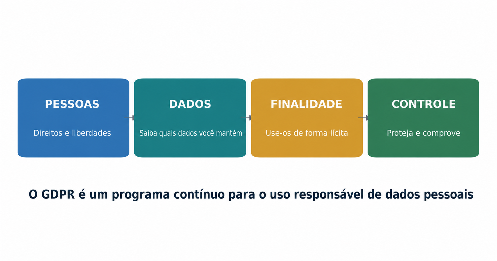
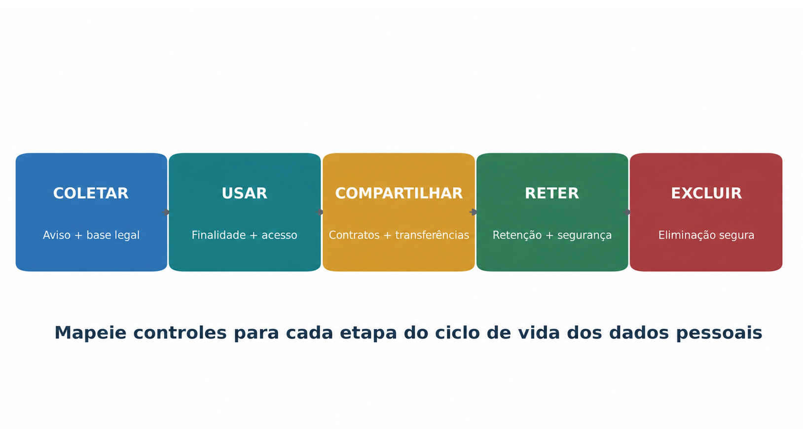
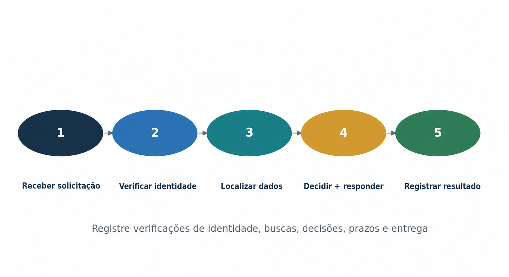
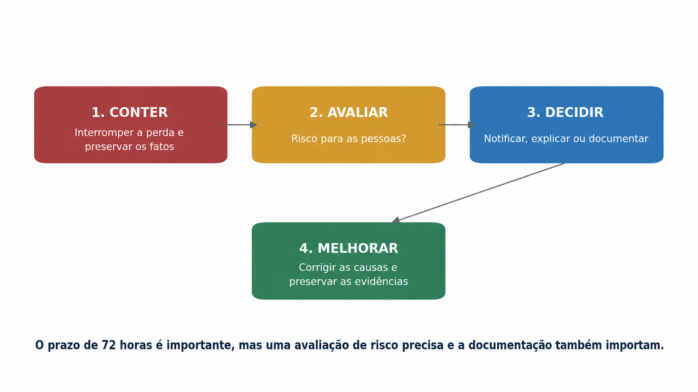
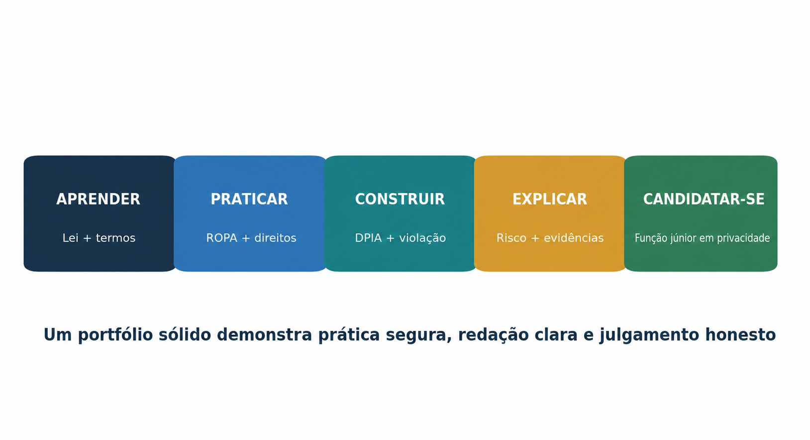

> **Status da revisão:** Rascunho de tradução assistida por máquina. Requer revisão humana de terminologia, significado, links, formatação e atualidade técnica antes de ser marcado como edição final.

** SÉRIES PRÁTICAS DE CIBERSegurança, PRIVACIDADE E CONFORMIDADE

**GDPR**

**Um manual prático para gerentes e analistas júnior**

* Como o trabalho de privacidade é escopo, operado, evidenciado e melhorado - explicado em linguagem profissional clara *

** Alberto (Al) Leiva**

Primeira edição • Julho de 2026

□ **Inside:**Plain-English GDPR artigos •Jogador de livros • Ferramentas de código aberto • Exemplos de evidência • Laboratórios de analistas júnior • Preparação de entrevistas
□-------------------------------------------------------------------------------------------------------------------------------------------------------------------------------------------------------------------

# Publicação e Aviso de Uso

Autor: Alberto (Al) Leiva

Edição: Primeira Edição, Julho 2026

Objetivo: Educação gratuita e prática para gestores, estudantes, mudadores de carreira, analistas júnior, profissionais de privacidade e profissionais de segurança cibernética.

# # Aviso educacional e legal

Este manual fornece informações educacionais gerais. Não é aconselhamento legal e não substitui o conselho de um conselheiro qualificado ou oficial de proteção de dados de uma organização. As obrigações da GDPR dependem dos factos, da legislação dos Estados-Membros, das orientações regulamentares, dos contratos e das decisões judiciais. Verifique sempre as fontes oficiais atuais antes de agir sobre um assunto real.

# # Uso ético e autorizado

Use ferramentas e exercícios apenas com autorização escrita e apenas com dados ficcionais, sintéticos ou devidamente higienizados. Os dados pessoais podem prejudicar as pessoas quando são expostos ou mal utilizados. A habilidade técnica não cria permissão.

Prefácio

* Uma introdução acolhedora ao trabalho prático de privacidade.*

GDPR pode parecer uma parede de linguagem legal. No trabalho diário, torna-se um conjunto de questões práticas: Que dados pessoais usamos? Porque precisamos dele? Quem pode vê-lo? Quanto tempo o guardamos? Como o protegemos? Como se pode exercer um direito? Como provamos que nossas respostas são verdadeiras?

Os gerentes precisam de propriedade clara, decisões de risco honestas, recursos adequados e evidências confiáveis. Os analistas júnior precisam mapear o processamento, revisar anúncios e contratos, coordenar solicitações de direitos, apoiar DPIAs, organizar fatos de violação e comunicar sem esconder incertezas.

Este manual segue uma metodologia-primeira abordagem. Ferramentas podem ajudar a descobrir dados, controlar o acesso, encontrar fraquezas e organizar registros. Eles não podem escolher uma base legal, decidir se os direitos de uma pessoa foram respeitados, ou substituir julgamento legal e profissional.

Lição central:** Compliance GDPR não é um projeto de documento único. É um programa contínuo para uso legal, justo, transparente, seguro e responsável de dados pessoais. □
O que é que se passa?

*— Alberto (Al) Leiva*

Como usar este manual

Os gerentes devem começar com Capítulos 1 a 8 e usar o playbook e modelos como referências de trabalho.

Os analistas júnior devem estudar os direitos, evidências, guia de artigos, ferramentas, laboratório fictício, projetos de portfólio e capítulo de entrevista.

Os leitores técnicos devem conectar cada ferramenta a um objetivo definido, risco, controle, proprietário e processo de revisão.

As equipas jurídicas e de privacidade deverão verificar as regras dos Estados-Membros e as atuais orientações da AEPD ou da autoridade de supervisão.

Nota de edição:** O índice final inclui números de página verificados para esta edição. Se o manual for editado, confirme o novo layout e atualize as referências da página. □
O que é que se passa?

Sumário

[Comunicação de publicação e utilização [2](#publication-and-use-notice)](#publication-and-use-notice)

[Comunicação educativa e jurídica [2](#educational-and-legal-notice)](#educational-and-legal-notice)

[Utilização ética e autorizada [2](#ethical-and-authorized-use)](#ethical-and-authorized-use)

[Prefácio [3](#preface)](#preface)

[Como usar este manual [4](#how-to-use-this-manual)](#how-to-use-this-manual)

[Quadro de conteúdos [4](#table-of-contents)](#table-of-contents)

[1. Fundação GDPR [9](#gdpr-foundations)](#gdpr-foundations)

[1. 1 O que o GDPR protege [9](#what-gdpr-protects)](#what-gdpr-protects)

[1.2 A conformidade é superior à segurança [9](#compliance-is-more-than-security)](#compliance-is-more-than-security)

[1.3 O que GDPR não significa [9](#what-gdpr-does-not-mean)](#what-gdpr-does-not-mean)

[2. Âmbito, funções e definições [10](#scope-roles-and-definitions)](#scope-roles-and-definitions)

[2.1 Questões de âmbito [10](#scope-questions)](#scope-questions)

[2.2 Funções principais [10](#core-roles)](#core-roles)

[2.3 Dados pessoais, de categoria especial e criminais [10](#personal-special-category-and-criminal-data)](#personal-special-category-and-criminal-data)

[3. Princípios e bases jurídicas [11](#principles-and-lawful-bases)](#principles-and-lawful-bases)

[3.1 Princípios do artigo 5.o [11](#article-5-principles)](#article-5-principles)

[3.2 Bases jurídicas nos termos do artigo 6.o [11](#lawful-bases-under-article-6)](#lawful-bases-under-article-6)

[3.3 Consentimento e dados sensíveis [12](#consent-and-sensitive-data)](#consent-and-sensitive-data)

[4. Direitos dos titulares de dados [13](#data-subject-rights)](#data-subject-rights)

[4.1 O relógio de pedido [13](#the-request-clock)](#the-request-clock)

[4.2 Um ficheiro de pedido defensável [14](#a-defensible-request-file)](#a-defensible-request-file)

[5. Governança do Controlador e do Processador [15](#controller-and-processor-governance)](#controller-and-processor-governance)

[5.1 Registos das actividades de transformação [15](#records-of-processing-activities)](#records-of-processing-activities)

[5.2 Diligenciamento do processador e contratos do artigo 28.o [15](#processor-due-diligence-and-article-28-contracts)](#processor-due-diligence-and-article-28-contracts)

[5.3 Registos de responsabilidade [15](#accountability-records)](#accountability-records)

[6. Violações de segurança e dados pessoais [16](#security-and-personal-data-breaches)](#security-and-personal-data-breaches)

[6.1 Garantia do artigo 32.o [16](#article-32-security)](#article-32-security)

[6.2 Decisões de violação [16](#breach-decisions)](#breach-decisions)

[7. DPIAs, Privacy by Design, and the DPO [17](#dpias-privacy-by-design-and-the-dpo)](#dpias-privacy-by-design-and-the-dpo)

[7,1 fluxo de trabalho DPIA [17](#dpia-workflow)](#dpia-workflow)

[7.2 Privacidade por design e padrão [17](#privacy-by-design-and-default)](#privacy-by-design-and-default)

[7.3 Independência do DPO [17](#dpo-independence)](#dpo-independence)

[8. Transferências internacionais de dados [18](#international-data-transfers)](#international-data-transfers)

[8,1 fluxo de trabalho de transferência [18](#transfer-workflow)](#transfer-workflow)

[8,2 Provas comuns de transferência [18](#common-transfer-evidence)](#common-transfer-evidence)

[9. Guia completo do artigo por artigo [19](#complete-article-by-article-guide)](#complete-article-by-article-guide)

[9.1 Capítulo I — Disposições gerais [19](#chapter-i-general-provisions)](#chapter-i-general-provisions)

[9.2 Capítulo II — Princípios [19](#chapter-ii-principles)](#chapter-ii-principles)

[9.3 Capítulo III — Direitos do titular dos dados [19](#chapter-iii-rights-of-the-data-subject)](#chapter-iii-rights-of-the-data-subject)

[9,4 Capítulo IV — Controlador e processador [20](#chapter-iv-controller-and-processor)](#chapter-iv-controller-and-processor)

[9.5 Capítulo V — Transferências para países terceiros ou organizações internacionais [21](#chapter-v-transfers-to-third-countries-or-international-organizations)](#chapter-v-transfers-to-third-countries-or-international-organizations)

[9,6 Capítulo VI — Autoridades de supervisão independentes [22](#chapter-vi-independent-supervisory-authorities)](#chapter-vi-independent-supervisory-authorities)

[9.7 Capítulo VII — Cooperação e coerência [22](#chapter-vii-cooperation-and-consistency)](#chapter-vii-cooperation-and-consistency)

[9.8 Capítulo VIII — Medidas corretivas, responsabilidade e sanções [23](#chapter-viii-remedies-liability-and-penalties)](#chapter-viii-remedies-liability-and-penalties)

[9.9 Capítulo IX — Situações específicas de transformação [23](#chapter-ix-specific-processing-situations)](#chapter-ix-specific-processing-situations)

[9.10 Capítulo X — Actos delegados e de execução [24](#chapter-x-delegated-and-implementing-acts)](#chapter-x-delegated-and-implementing-acts)

[9.11 Capítulo XI — Disposições finais [24](#chapter-xi-final-provisions)](#chapter-xi-final-provisions)

[10. Manual do GDPR para gerentes [25](#managers-gdpr-playbook)](#managers-gdpr-playbook)

[10.1 Perguntas para cada proprietário de processamento [25](#questions-for-every-processing-owner)](#questions-for-every-processing-owner)

[10,2 Painel mensal [25](#monthly-dashboard)](#monthly-dashboard)

[15](#common-management-mistakes)](#common-management-mistakes)

[11. Do Iniciante ao Analista de Privacidade Júnior [26](#from-beginner-to-junior-privacy-analyst)](#from-beginner-to-junior-privacy-analyst)

[11.1 Títulos de trabalho [26](#job-titles)](#job-titles)

[11.2 Trabalho júnior típico [26](#typical-junior-work)](#typical-junior-work)

[11.3 Os empregadores de competências podem observar [27](#skills-employers-can-observe)](#skills-employers-can-observe)

[12. Ferramentas de código aberto para GDPR Work [28](#open-source-tools-for-gdpr-work)](#open-source-tools-for-gdpr-work)

[12,1 Assistente CISO [28](#ciso-assistant)](#ciso-assistant)

[Início rápido [28](#quick-start)](#quick-start)

[Evidência para reter [28](#evidence-to-retain)](#evidence-to-retain)

[12.2 OpenMetadata [28](#openmetadata)](#openmetadata)

[Início rápido [29](#quick-start-1)](#quick-start-1)

[Evidência para reter [29](#evidence-to-retain-1)](#evidence-to-retain-1)

[12.3 Microsoft Presidio [29](#microsoft-presidio)](#microsoft-presidio)

[Início rápido [29](#quick-start-2)](#quick-start-2)

[Evidência para reter [29](#evidence-to-retain-2)](#evidence-to-retain-2)

[12.4 ARX [29](#arx)](#arx)

[Início rápido [29](#quick-start-3)](#quick-start-3)

[Evidência para reter [29](#evidence-to-retain-3)](#evidence-to-retain-3)

[12,5 Keycloak [29](#keycloak)](#keycloak)

[Início rápido [30](#quick-start-4)](#quick-start-4)

[Evidência para reter [30](#evidence-to-retain-4)](#evidence-to-retain-4)

[12,6 Wazuh [30](#wazuh)](#wazuh)

[Início rápido [30](#quick-start-5)](#quick-start-5)

[Evidência para reter [30](#evidence-to-retain-5)](#evidence-to-retain-5)

[12,7 OWASP ZAP [30](#owasp-zap)](#owasp-zap)

[Início rápido [30](#quick-start-6)](#quick-start-6)

[Evidência para reter [30](#evidence-to-retain-6)](#evidence-to-retain-6)

[12.8 Trivy [30](#trivy)](#trivy)

[Início rápido [30](#quick-start-7)](#quick-start-7)

[Evidência para reter [31](#evidence-to-retain-7)](#evidence-to-retain-7)

[12.9 Agente de política aberta [31](#open-policy-agent)](#open-policy-agent)

[Início rápido [31](#quick-start-8)](#quick-start-8)

[Evidência para reter [31](#evidence-to-retain-8)](#evidence-to-retain-8)

[12,10 Klaro! [31] (#klaro)] (#klaro)

[Início rápido [31](#quick-start-9)](#quick-start-9)

[Evidência para reter [31](#evidence-to-retain-9)](#evidence-to-retain-9)

[12,11 Greenbone Community Edition [31](#greenbone-community-edition)](#greenbone-community-edition)

[Início rápido [31](#quick-start-10)](#quick-start-10)

[Evidência para conservar [32](#evidence-to-retain-10)](#evidence-to-retain-10)

[12.12 Lista de verificação da governação da ferramenta [32](#tool-governance-checklist)](#tool-governance-checklist)

[13. Laboratório e Portfólio Ficcional SaaS [33](#fictional-saas-laboratory-and-portfolio)](#fictional-saas-laboratory-and-portfolio)

[Projeto 1 — Âmbito e funções [33](#project-1-scope-and-roles)](#project-1-scope-and-roles)

[Projeto 2 — ROPA [33](#project-2-ropa)](#project-2-ropa)

[Projecto 3 — Direitos [33](#project-3-rights)](#project-3-rights)

[Projeto 4 — DPIA [33](#project-4-dpia)](#project-4-dpia)

[Projeto 5 — Violação [33](#project-5-breach)](#project-5-breach)

[Projeto 6 — Fornecedor e transferência [33](#project-6-vendor-and-transfer)](#project-6-vendor-and-transfer)

[Projeto 7 — Ferramentas [33](#project-7-tools)](#project-7-tools)

[13.1 Ética em carteira [33](#portfolio-ethics)](#portfolio-ethics)

[14. Plano de aprendizagem de trinta dias [34](#thirty-day-learning-plan)](#thirty-day-learning-plan)

[14,1 hábito diário [34](#daily-habit)](#daily-habit)

[15. Preparação da entrevista [35](#interview-preparation)](#interview-preparation)

[O que são dados pessoais? [35](#what-is-personal-data)](#what-is-personal-data)

[Controlador versus processador? [35] (#controller-versus-processor)] (#controller-versus-processor)

[O consentimento é sempre necessário? [35](#is-consent-always-needed)](#is-consent-always-needed)

[O que é um ROPA? [35](#what-is-a-ropa)](#what-is-a-ropa)

[Como você lida com uma solicitação de direitos? [35](#how-do-you-handle-a-rights-request)](#how-do-you-handle-a-rights-request)

[Quando é necessário um DPIA? [35](#when-is-a-dpia-needed)](#when-is-a-dpia-needed)

[O que é uma violação de dados pessoais? [35](#what-is-a-personal-data-breach)](#what-is-a-personal-data-breach)

[O que acontece às 72 horas? [35](#what-happens-at-72-hours)](#what-happens-at-72-hours)

[Como você prova conformidade? [35](#how-do-you-prove-compliance)](#how-do-you-prove-compliance)

[15.1 Resposta de 60 segundos [36](#managers-60-second-answer)](#managers-60-second-answer)

[16. Modelos e listas de verificação [37](#templates-and-checklists)](#templates-and-checklists)

[16.1 Campos ROPA [37](#ropa-fields)](#ropa-fields)

[16.2 Registo de pedidos de direitos [37](#rights-request-register)](#rights-request-register)

[16,3 tela DPIA [37](#dpia-screen)](#dpia-screen)

[16.4 Ficha técnica de violação [38](#breach-fact-sheet)](#breach-fact-sheet)

[16.5 Lista de verificação pré-lançamento [38](#manager-pre-launch-checklist)](#manager-pre-launch-checklist)

[17. GDPR, AI e Analytics [39](#gdpr-ai-and-analytics)](#gdpr-ai-and-analytics)

[17.1 Questões práticas de revisão [39](#practical-review-questions)](#practical-review-questions)

[18. Glossário [40](#glossary)](#glossary)

[19. Índice de assuntos [42](#subject-index)](#subject-index)

[20. Referências oficiais e estudo complementar [43](#official-references-and-further-study)](#official-references-and-further-study)

# 1. Fundação GDPR

*O que a lei protege, o que significa conformidade e o que os gestores possuem.*

{width=6.15in height=3.23744in}

Figura 1. GDPR como um programa prático de gestão

# # 1.1 O que GDPR protege

GDPR protege pessoas singulares quando seus dados pessoais são processados. Os dados pessoais são informações relativas a uma pessoa identificada ou identificável. Ele pode incluir nomes, identificadores, dados de localização, identificadores online, registros de emprego, detalhes financeiros, imagens, dados do dispositivo e muitos outros fatos.

## 1.2 Conformidade é mais do que segurança

Segurança importa, mas GDPR também requer processamento legal e justo, informações claras, respeito aos direitos, limites de finalidade, minimização de dados, controle de retenção e responsabilização.

# # 1.3 O que GDPR não significa

- O consentimento não é a única base legal.

- A criptografia sozinha não cria conformidade.

- Um aviso de privacidade não corrige o processamento ilegal.

- Um contrato de processador não elimina a responsabilidade do controlador.

- Uma ferramenta não pode garantir que os dados pessoais foram totalmente descobertos ou apagados.

- A multa não é o único risco; as pessoas podem sofrer danos materiais ou não materiais.

# 2. Escopo, Funções e Definições

* Como decidir se GDPR se aplica e quem é responsável.*

## 2.1 Questões de âmbito

1. Identificar os estabelecimentos da UE da organização.

2. Identificar as ofertas de bens ou serviços às pessoas na UE.

3. Identificar o acompanhamento do comportamento na UE.

4. O documento excluiu as atividades e o motivo da exclusão.

5. Verificar as legislações dos Estados-Membros e outras regras sectoriais.

2.2 Funções principais

* ** ** ** ** ** ** Responsabilidade chave**
----------------------------------------------------------------------------------------------------
□ Assunto dos dados A pessoa que os dados referem-se ao exercício de direitos e receber informações claras
O Controlador decide por que e os meios essenciais de processar
2 ou mais partes decidem em conjunto a finalidade e os meios
Processos de dados pessoais para um controlador Seguir instruções, proteger dados, auxiliar o controlador
O Subprocessador O Processador Engajado por outro processador
□ DPO □ Conselheiro independente e monitor onde indicado Aconselhar, monitorar, apoiar DPIAs, cooperar com a autoridade
Autoridade Supervisora Autoridade Independente de privacidade Orientação, investigação, medidas corretivas, execução

## 2.3 Dados pessoais, de categoria especial e criminais

Dados pessoais são mais amplos do que informações que nomeiam diretamente alguém. Dados de categoria especial incluem informações sobre origem racial ou étnica, opiniões políticas, religião ou crenças, filiação sindical, genética, biometria utilizada para identificação única, saúde, vida sexual ou orientação sexual. Os dados relativos à condenação criminal e à infracção têm controlos separados ao abrigo do artigo 10.o.

*Controle de gestão:** Requer uma análise de escopo e função escrita antes de aprovar um novo produto, fornecedor, tecnologia de rastreamento, caso de uso de IA ou fluxo de dados internacional. □
--------------------------------------------------------------------------------------------------------------------------------------------------------------------------------

3. Princípios e Bases Legais

* As regras que moldam cada finalidade de processamento.*

{width=6.15in height=3.34699in}

Figura 2. Ciclo de vida dos dados pessoais

§ 3.1 Princípios do artigo 5.o

* ** ** ** ** ** ** ** ** ** ** ** ** **
--------------------------------------------------------------------------------------------------------------------------------------------------------------------------------------------------------------------------------------------------------------------------------------------------------------------------------
□ Legalidade, justiça, transparência □ O uso seria legal, honesto e compreensível para a pessoa? O registro de base legal, aviso, revisão da justiça
Limitação da finalidade O propósito é específico, indicado e compatível com uso posterior? Declaração de finalidade, revisão de compatibilidade
* Minimização de dados * Coletamos apenas o que é necessário? Revisão de campo, decisão de projeto de formulário
Como corrigir ou atualizar dados importantes? □ Regras de validação, registo de correcção
□ Limitação de armazenamento Quando vamos excluí-lo ou anonimizá-lo? Programa de retenção, prova de exclusão
• Integridade e confidencialidade; • As medidas de segurança são adequadas para o risco? Avaliação de risco, provas de controlo, testes
□ Responsabilidade □ Podemos provar o acima? ROPA, aprovações, revisões, treinamento, trilha de auditoria

3.2 Bases jurídicas previstas no artigo 6.o

** ** ** ** ** ** ** ** ** ** ** **
------------------------------------------------------------------------------------------------------------------------------------------------------------------------------------------------------------
□ Consentimento A pessoa tem uma escolha real e pode retirar □ Não bundle ou consentimento de pressão
O processamento é objetivamente necessário para um contrato com a pessoa ou as etapas de pré-contrato solicitadas
O direito da UE ou dos Estados-Membros exige o tratamento
Os interesses vitais são necessários para proteger a vida ou outro interesse vital.
□ Tarefa pública • Obrigação de uma missão de interesse público ou de uma autoridade oficial fundamentada na lei
Os interesses legítimos Um interesse real é necessário e não ultrapassado pelos direitos da pessoa

## 3.3 Consentimento e dados sensíveis

O consentimento deve ser específico, informado, inequívoco, livremente dado e demonstrável. Os dados da categoria especial necessitam normalmente de uma base legal do artigo 6.o e de uma condição do artigo 9.o. A retirada deve ser tão fácil como dar consentimento.

# 4. Direitos dos titulares de dados

* Como receber, avaliar, completar e solicitar documentos.*

{width=6.15in height=3.34699in}

Figura 3. Fluxo de trabalho de dados-sujeitos-direitos

* ** Direito** ** Trabalho prático** ** ** Cuidado com**
---------------------------------------------------------------------------------------------------------------------------------------------
Informação Dê avisos claros, em tempo hábil, avisos, crianças, coleta indireta
Acesse o acesso Pesquisa, revisão, redigir onde legal, e entregar de forma segura Direitos das outras pessoas, identidade, sistemas completos
• Retificação (correct impreciso ou incompleto )
Apagar onde o direito aplica-se
Limitar o uso enquanto um problema é resolvido .
Portabilidade Fornecer dados qualificados em formato reutilizável Apenas certos dados automatizados e fornecidos/observados
Objeção □ Avaliar a tarefa pública ou o uso de interesses legítimos; parar o marketing direto; Compelir motivos e exceções de pesquisa
□ Decisões automatizadas □ Fornecer salvaguardas para qualificar decisões exclusivamente automatizadas

## 4.1 O relógio de solicitação

O período normal de resposta é de um mês após a recepção. Pode ser prorrogado por mais dois meses, quando necessário devido à complexidade e ao número de pedidos, mas a pessoa deve ser informada no primeiro mês. Os controlos de identidade devem ser proporcionais. Taxas ou recusa são limitadas a casos manifestamente infundados ou excessivos, especialmente por causa da repetição.

4.2 Um arquivo de solicitação defensável

1. Data de solicitação e recebimento

2. Decisão de verificação de identidade

3. Sistemas, fornecedores e proprietários pesquisados

4. Termos de pesquisa e intervalos de datas

5. Questões jurídicas, isenções e redações

6. Aprovação e entrega segura

7. Data de resposta e resultado retido

# 5. Controlador e Governança do Processador

* Os registros operacionais, contratos, papéis e revisões que tornam a responsabilização real.*

## 5.1 Registros de atividades de processamento

Um ROPA é mais do que uma planilha de aplicativos. Ele conecta propósitos, categorias de pessoas e dados, destinatários, transferências, retenção, segurança, proprietários e raciocínio legal. Mantenha os registros do controlador e do processador separados onde necessário.

## 5.2 Due diligence do processador e contratos Artigo 28

Avaliar experiência, confiabilidade, segurança, localização, subprocessadores e histórico de incidentes.

Objeto do documento, duração, natureza, finalidade, tipos de dados, pessoas e direitos de controlador.

Requer instruções, confidencialidade, segurança, controles de subprocessador, assistência de direitos, ajuda de violação, exclusão ou retorno e informações de auditoria.

Monitore as mudanças materiais e mantenha as decisões.

5.3 Registos de responsabilidade

* ** ** ** ** ** ** ** ** ** ** ** ** **
---------------------------------------------------------
Programa de privacidade + proprietário de negócios □ Processamento novo ou alterado
□ Avisos de privacidade □ Legal/privacy + produto
Novo fornecedor, subprocessador, localização, incidente
Programação de retenção; Registros/legal/privacy; Legal, sistema ou mudança de negócio;
O registro de direitos Operações de privacidade O pedido, queixa, item atrasado
• Registro DPIA • Privacidade / DPO

6. Segurança e Violação de Dados Pessoais

* salvaguardas baseadas no risco, fatos incidentes, decisões de notificação e prova.*

{width=6.15in height=3.45654in}

Figura 4. Fluxo de trabalho de violação de dados pessoais

6.1 Segurança do artigo 32.o

Os controladores e os transformadores devem utilizar medidas técnicas e organizacionais adequadas ao risco. Considere confidencialidade, integridade, disponibilidade, resiliência, restauração, testes regulares, o estado da arte, custos e a natureza, escopo, contexto e finalidades do processamento.

6.2 Decisões de violação

* Questão** ** ** Resultado possível** ** ** Prova**
--- ---------------------------------------------------------------------------------------------------------------------------------------
• Houve destruição, perda, alteração, divulgação não autorizada ou acesso não autorizado a dados pessoais? □ Em caso afirmativo, pode ser uma violação de dados pessoais.
É improvável o risco para as pessoas? Notificação da autoridade pode não ser necessária, mas documentar a decisão .
Há risco para as pessoas? Notificar a autoridade sem demora injustificada e, se possível, no prazo de 72 horas
É provável que seja de alto risco? □ Comunicar claramente às pessoas afetadas, a menos que uma exceção se aplique

*Importante:** Um processador deve notificar o responsável pelo tratamento sem demora injustificada, após ter tomado conhecimento de uma violação de dados pessoais. O responsável pelo tratamento continua a ser responsável pela decisão do artigo 33.o
---------------------------------------------------------------------------------------------------

# 7. DPIAs, Privacy by Design, and the DPO

* Como encontrar processamento de alto risco precoce e construir salvaguardas em decisões.*

## 7.1 fluxo de trabalho DPIA

- Descreva o processamento, finalidade, sistemas, dados, pessoas, destinatários, locais e ciclo de vida.

- Avaliar a necessidade e proporcionalidade.

- Identificar riscos para os direitos e liberdades, não apenas riscos para a empresa.

- Selecione salvaguardas e proprietários.

- Avalie o risco residual.

- Se for caso disso, consulte o DPO.

- Consultar a autoridade antes de processar se permanecerem riscos elevados.

- Reveja quando o risco ou processamento mudar.

## 7.2 Privacidade por design e padrão

Minimize os campos e o acesso por padrão.

Identificadores separados quando práticos.

Faça a retenção e eliminação funcionar tecnicamente.

Evitar o compartilhamento opcional até que uma escolha válida seja feita.

Avisos de teste, direitos, exportações, exclusão e logs antes do lançamento.

Recorde decisões de design e opções rejeitadas.

## 7.3 Independência do DPO

O DPO deve ser envolvido de forma oportuna, receber recursos e acesso, relatar ao mais alto nível de gestão e evitar conflitos de interesses. A administração é dona de decisões. O DPO aconselha e monitoriza, mas não deve ser responsabilizado por fins comerciais ou meios de processamento.

# 8. Transferências Internacionais de Dados

* Como identificar transferências e usar ferramentas de transferência legais.*

## 8.1 Transferência de fluxo de trabalho

1. Exportadores de mapas, importadores, acesso remoto, locais de apoio, subprocessadores, e transferências adiante.

2. Confirme os papéis e os países.

3. Verificar uma decisão de adequação.

4. Se necessário, selecione salvaguardas adequadas, tais como SCCs ou BCRs aprovados.

5. Avaliar se a salvaguarda funciona na prática e identificar medidas complementares.

6. Use o artigo 49.o derrogações apenas quando as suas condições estreitas se aplicam.

7. Monitore as mudanças legais, de fornecedores e técnicas.

# 8.2 Evidências comuns de transferência

* Item** ** O que deveria mostrar**
-----------------------------------------------------------------------------------------------------------------------------------------------------------------
Mapa de transferências □ Dados, finalidade, sistemas, países, destinatários, acesso remoto, transferências em curso
□ Mecanismo de transferência □ Adequação, módulo SCC, BCR, código/certificação aprovado ou derrogação restrita
Avaliar A lei e a prática relevantes, pedidos, salvaguardas, riscos e conclusão
□ Medidas suplementares □ Criptografia, controle de chaves, minimização, pseudônimos, políticas e procedimentos de desafio
• Monitoramento de alterações na lei, importador, subprocessador, localização, serviço e acesso

9. Guia completo do artigo por artigo

* Um guia de trabalho conciso para todos os 99 artigos GDPR. Use o texto legal oficial para uma análise jurídica real.*

Como ler este capítulo: ** A tabela explica cada artigo em linguagem simples. As colunas de ação e evidência do gerente são pontos de partida práticos, não uma opinião jurídica completa. □
□-------------------------------------------------------------------------------------------------------------------------------------------------------------------------------------------------------------------------------------------------------------------------------------------------

9.1 Capítulo I — Disposições gerais

* Art.** Art.** Art.** Art.
---------------------------------------------------------------------------------------------------------------------------------------------------------------------------------------------------------------
Objecto e objectivos O regulamento define o objectivo: proteger as pessoas e permitir a circulação legal de dados pessoais. Confirmar aplicabilidade, escopo e definições; documentar a decisão. Memo de escopo, mapa de serviço, mapa de dados
• 2 • Âmbito material • Explica qual o processamento manual automatizado e estruturado e quais as atividades excluídas. Confirmar aplicabilidade, escopo e definições; documentar a decisão. Memo de escopo, mapa de serviço, mapa de dados
O âmbito territorial pode aplicar-se aos estabelecimentos da UE e a algumas organizações fora da UE que ofereçam bens ou serviços a pessoas na UE ou que as acompanhem. Confirmar aplicabilidade, escopo e definições; documentar a decisão. □ Memo de escopo, mapa de serviço, mapa de dados
4 Definições Define dados pessoais, processamento, controlador, processador, consentimento, violação, perfilamento e outros termos-chave. Confirmar aplicabilidade, escopo e definições; documentar a decisão. Memo de escopo, mapa de serviço, mapa de dados

9.2 Capítulo II — Princípios

* Art.** Art.** Art.** Art.
---------------------------------------------------------------------------------------------------------------------------------------------------------------------------------------------------------------------------------------------------------
5 Princípios relativos ao processamento Requer legalidade, justiça, transparência, limitação de propósito, minimização, precisão, limites de armazenamento, segurança e responsabilização. □ Mapear cada finalidade, tipo de dados, base legal, salvaguarda e prova. ROPA, registro de base legal, consentimento ou prova de exceção
6 . . Legalidade do processamento . Requer pelo menos uma base legal válida para cada finalidade de processamento. □ Mapear cada finalidade, tipo de dados, base legal, salvaguarda e prova. ROPA, registro de base legal, consentimento ou prova de exceção
O consentimento deve ser demonstrável, claro, separado quando apropriado, e tão fácil de retirar como dar. □ Mapear cada finalidade, tipo de dados, base legal, salvaguarda e prova. ROPA, registro de base legal, consentimento ou prova de exceção
O consentimento das crianças para os serviços de informação-sociedade define regras para o consentimento de uma criança em determinados serviços em linha e permite aos Estados-Membros fixar a idade de 13 a 16. □ Mapear cada finalidade, tipo de dados, base legal, salvaguarda e prova. ROPA, registro de base legal, consentimento ou prova de exceção
.9 . Categorias especiais de dados pessoais .Geralmente, proíbe o processamento de dados sensíveis a menos que uma exceção listada se aplique. □ Mapear cada finalidade, tipo de dados, base legal, salvaguarda e prova. ROPA, registro de base legal, consentimento ou prova de exceção
10 □ Dados de condenação criminal e de delito □ Limita este processamento a autoridade oficial ou processamento autorizado por lei com salvaguardas. □ Mapear cada finalidade, tipo de dados, base legal, salvaguarda e prova. ROPA, registro de base legal, consentimento ou prova de exceção
O processamento não requer identificação Não requer manter dados de identificação extra apenas para cumprir quando a identificação não é necessária. □ Mapear cada finalidade, tipo de dados, base legal, salvaguarda e prova. ROPA, registro de base legal, consentimento ou prova de exceção

9.3 Capítulo III — Direitos do titular dos dados

* Art.** Art.** Art.** Art.
-----------------------------------------------------------------------------------------------------------------------------------------------------------------------------------------------------------------------------------------------------------------------------------------------------------------------------------------------------------------------------------------------------------------------------------------------------------------------------------------------------------------------------------------------------------------------
. 12 . Informação transparente, comunicação e modalidades . Requer avisos claros e métodos práticos para que as pessoas exerçam direitos. □ Crie um processo de direitos rastreados com verificações de identidade, prazos, decisões e entrega segura. □ Aviso, pedido de registro, verificação de identidade, pesquisa e resposta .
Informação recolhida do titular dos dados Listas informam informações a fornecer quando os dados pessoais provêm directamente da pessoa. □ Crie um processo de direitos rastreados com verificações de identidade, prazos, decisões e entrega segura. □ Aviso, pedido de registro, verificação de identidade, pesquisa e resposta .
Informação não obtida do titular dos dados Listas notam informações e timing quando os dados vêm de outra fonte. □ Crie um processo de direitos rastreados com verificações de identidade, prazos, decisões e entrega segura. □ Aviso, pedido de registro, verificação de identidade, pesquisa e resposta .
O direito de acesso , Vamos confirmar o processamento e obter informações e uma cópia de dados pessoais, sujeitos a limites. □ Crie um processo de direitos rastreados com verificações de identidade, prazos, decisões e entrega segura. □ Aviso, pedido de registro, verificação de identidade, pesquisa e resposta .
16 . Direito de rectificação . Vamos pessoas corrigir dados imprecisos e completar dados incompletos. □ Crie um processo de direitos rastreados com verificações de identidade, prazos, decisões e entrega segura. □ Aviso, pedido de registro, verificação de identidade, pesquisa e resposta .
O direito de apagamento requer exclusão em situações listadas, sujeitas a exceções legais. □ Crie um processo de direitos rastreados com verificações de identidade, prazos, decisões e entrega segura. □ Aviso, pedido de registro, verificação de identidade, pesquisa e resposta .
O direito de restrição de processamento . Vamos limitar o processamento de pessoas enquanto certos problemas são verificados. □ Crie um processo de direitos rastreados com verificações de identidade, prazos, decisões e entrega segura. □ Aviso, pedido de registro, verificação de identidade, pesquisa e resposta .
Notificação sobre a retificação, apagamento ou restrição □ Crie um processo de direitos rastreados com verificações de identidade, prazos, decisões e entrega segura. □ Aviso, pedido de registro, verificação de identidade, pesquisa e resposta .
O direito à portabilidade de dados . Fornece certos dados em um formato estruturado, comumente usado, legível por máquina quando as condições se aplicam. □ Crie um processo de direitos rastreados com verificações de identidade, prazos, decisões e entrega segura. □ Aviso, pedido de registro, verificação de identidade, pesquisa e resposta .
O direito de se opor Vamos pessoas objetar a alguma tarefa pública, interesse legítimo, pesquisa e processamento de marketing direto. □ Crie um processo de direitos rastreados com verificações de identidade, prazos, decisões e entrega segura. □ Aviso, pedido de registro, verificação de identidade, pesquisa e resposta .
□ 22 □ Tomada de decisão e perfil automatizados Fornece salvaguardas contra certas decisões exclusivamente automatizadas com efeitos jurídicos ou igualmente significativos. □ Crie um processo de direitos rastreados com verificações de identidade, prazos, decisões e entrega segura. □ Aviso, pedido de registro, verificação de identidade, pesquisa e resposta .
23 Restrições O direito da União ou dos Estados-Membros só pode restringir os direitos listados quando forem cumpridas as garantias e condições legais. □ Crie um processo de direitos rastreados com verificações de identidade, prazos, decisões e entrega segura. □ Aviso, pedido de registro, verificação de identidade, pesquisa e resposta .

## 9.4 Capítulo IV — Controlador e processador

* Art.** Art.** Art.** Art.
-----------------------------------------------------------------
24 . . Responsabilidade do controlador . Requer medidas baseadas em risco e prova de que o processamento cumpre. □ Atribuir funções, contratos, instruções, registros e prestação de contas. Políticas, RACI, contratos, instruções, ROPA
A proteção de dados por design e por padrão requer salvaguardas de privacidade no design do sistema e configurações padrão de proteção de privacidade. □ Atribuir funções, contratos, instruções, registros e prestação de contas. Políticas, RACI, contratos, instruções, ROPA
Os controladores conjuntos são necessários para definir as responsabilidades de forma transparente e fornecer a essência do arranjo às pessoas. □ Atribuir funções, contratos, instruções, registros e prestação de contas. Políticas, RACI, contratos, instruções, ROPA
Os representantes fora da União exigem que alguns controladores e processadores não comunitários nomeiem um representante da UE, com as excepções indicadas. □ Atribuir funções, contratos, instruções, registros e prestação de contas. Políticas, RACI, contratos, instruções, ROPA
O processador é um processador que requer processadores adequados e contratos detalhados ou outros atos legais que regem o processamento. □ Atribuir funções, contratos, instruções, registros e responsabilidade. Políticas, RACI, contratos, instruções, ROPA
O processamento sob a autoridade do pessoal e dos processadores limita as instruções a menos que a lei exija o contrário. □ Atribuir funções, contratos, instruções, registros e prestação de contas. Políticas, RACI, contratos, instruções, ROPA
O registro das atividades de processamento requer registros de controladores e processadores, com uma exceção limitada de pequena organização que muitas vezes não se aplica. □ Atribuir funções, contratos, instruções, registros e prestação de contas. Políticas, RACI, contratos, instruções, ROPA
A cooperação com a autoridade de supervisão requer cooperação com o regulador quando solicitado. □ Atribuir funções, contratos, instruções, registros e prestação de contas. Políticas, RACI, contratos, instruções, ROPA
A segurança do processamento requer segurança adequada ao risco, incluindo resiliência, restauração, testes e medidas como criptografia quando apropriado. □ Operar a segurança baseada no risco e um processo de violação-resposta testado. □ Avaliação de risco, controles, logs, incidente e registro de violação
Notificação de uma violação à autoridade de supervisão □ Operar a segurança baseada no risco e um processo de violação-resposta testado. □ Avaliação de risco, controles, logs, incidente e registro de violação
A comunicação de uma violação ao titular dos dados requer aviso às pessoas afetadas quando uma violação é susceptível de criar alto risco, sujeito a exceções. □ Operar a segurança baseada no risco e um processo de violação-resposta testado. □ Avaliação de risco, controles, logs, incidente e registro de violação
A avaliação do impacto da proteção de dados requer um DPIA antes do processamento provável de criar alto risco. □ Tela de trabalho de alto risco, suporte o DPO e consulte quando necessário. Tela do DPIA, DPIA, registro do DPO, arquivo de consulta
Consulta prévia (36 ) Requer consultar a autoridade antes de processar quando um DPIA apresenta risco elevado. □ Tela de trabalho de alto risco, suporte o DPO e consulte quando necessário. Tela do DPIA, DPIA, registro do DPO, arquivo de consulta
• 37 • Designação do responsável pela protecção de dados • Listas quando um DPO deve ser nomeado e permite a nomeação voluntária. □ Tela trabalho de alto risco, suporte o DPO, e consulte quando necessário. Tela do DPIA, DPIA, registro do DPO, arquivo de consulta
Posição 38 do oficial de proteção de dados Protege a independência do DPO, acesso, recursos e relatórios diretos. □ Tela trabalho de alto risco, suporte o DPO, e consulte quando necessário. Tela do DPIA, DPIA, registro do DPO, arquivo de consulta
As tarefas do oficial de proteção de dados Lista conselhos, monitoramento, DPIA, cooperação e funções de contato com reguladores. □ Tela de trabalho de alto risco, suporte o DPO e consulte quando necessário. Tela do DPIA, DPIA, registro do DPO, arquivo de consulta
Códigos de conduta . Permite códigos de setor para ajudar a aplicar os requisitos GDPR. □ Use códigos ou certificação apenas com escopo claro, supervisão e prova. □ Código ou âmbito de certificação, monitorização e conclusões
O monitoramento de códigos aprovados define os requisitos para os organismos que monitoram o cumprimento dos códigos aprovados. □ Use códigos ou certificação apenas com escopo claro, supervisão e prova. □ Código ou âmbito de certificação, monitorização e conclusões
□ 42 □ Certificação □ Permite mecanismos voluntários de certificação, selos e marcas sem reduzir a responsabilidade do controlador ou processador. □ Use códigos ou certificação apenas com escopo claro, supervisão e prova. □ Código ou âmbito de certificação, monitorização e conclusões
Os organismos de certificação definem os requisitos de acreditação e de funcionamento dos organismos de certificação. □ Use códigos ou certificação apenas com escopo claro, supervisão e prova. □ Código ou âmbito de certificação, monitorização e conclusões

9.5 Capítulo V — Transferências para países terceiros ou organizações internacionais

* Art.** Art.** Art.** Art.
---------------------------------------------------------------------------------------------------------------------------------------------------------------------------------------------------------------------------------------------------------------------------------------------------------------------------------------------------------------------------------------
O princípio geral para as transferências requer as condições do Capítulo V para as transferências, preservando todas as outras obrigações GDPR. O mapa de transferências e validação da ferramenta de transferência legal e salvaguardas. Mapa de transferência, arquivo de adequação/SCC/BCR, avaliação e salvaguardas
As transferências baseadas numa decisão de adequação permitem transferências em que a Comissão reconhece uma protecção adequada. O mapa de transferências e validação da ferramenta de transferência legal e salvaguardas. Mapa de transferência, arquivo de adequação/SCC/BCR, avaliação e salvaguardas
As transferências sujeitas a salvaguardas adequadas permitem transferências utilizando salvaguardas como SCCs ou BCRs com direitos e remédios aplicáveis. O mapa de transferências e validação da ferramenta de transferência legal e salvaguardas. Mapa de transferência, arquivo de adequação/SCC/BCR, avaliação e salvaguardas
. 47 . . Regras corporativas vinculantes . Define requisitos de aprovação e conteúdo para BCRs dentro de grupos corporativos. O mapa de transferências e validação da ferramenta de transferência legal e salvaguardas. Mapa de transferência, arquivo de adequação/SCC/BCR, avaliação e salvaguardas
As transferências ou divulgações não autorizadas pelo direito da União , por si só, não são uma base de transferência, a menos que sejam apoiadas por um acordo internacional aplicável. O mapa de transferências e validação da ferramenta de transferência legal e salvaguardas. Mapa de transferência, arquivo de adequação/SCC/BCR, avaliação e salvaguardas
. 49 . Derrogações para situações específicas . Fornece exceções e condições de transferência estreitas quando a adequação ou salvaguardas não estão disponíveis. O mapa de transferências e validação da ferramenta de transferência legal e salvaguardas. Mapa de transferência, arquivo de adequação/SCC/BCR, avaliação e salvaguardas
• Cooperação internacional • Incentivar a cooperação com países e organizações não comunitários em matéria de aplicação da privacidade. O mapa de transferências e validação da ferramenta de transferência legal e salvaguardas. Mapa de transferência, arquivo de adequação/SCC/BCR, avaliação e salvaguardas

9.6 Capítulo VI — Autoridades de supervisão independentes

* Art.** Art.** Art.** Art.
------------------------------------------------------------------------------------------------------------------------------------------------------------------------------------------------------------------------------------------------------------------------------
A autoridade de supervisão exige que cada Estado-Membro forneça uma ou mais autoridades públicas independentes. □ Conhecer o regulador, o caminho da cooperação e os registos necessários para as questões transfronteiriças. □ Correspondência da autoridade, processo, registo de cooperação
A independência requer que as autoridades e seus membros ajam de forma independente e sem instrução externa. □ Conhecer o regulador, o caminho da cooperação e os registos necessários para as questões transfronteiriças. □ Correspondência da autoridade, processo, registo de cooperação
As condições gerais para os membros são definidas como condições de nomeação, qualificação e conduta para os membros da autoridade. □ Conhecer o regulador, o caminho da cooperação e os registos necessários para as questões transfronteiriças. □ Correspondência da autoridade, processo, registo de cooperação
As regras relativas ao estabelecimento exigem que o direito dos Estados-Membros defina o estabelecimento, os poderes, os termos e as regras conexas. □ Conhecer o regulador, o caminho da cooperação e os registos necessários para as questões transfronteiriças. □ Correspondência da autoridade, processo, registo de cooperação
A autoridade geral de cada autoridade de supervisão no seu território define a competência . □ Conhecer o regulador, o caminho da cooperação e os registos necessários para as questões transfronteiriças. □ Correspondência da autoridade, processo, registo de cooperação
A autoridade supervisora principal define as regras de autoridade responsável pelo tratamento transfronteiras. □ Conhecer o regulador, o caminho da cooperação e os registos necessários para as questões transfronteiriças. □ Correspondência da autoridade, processo, registo de cooperação
57 tarefas Lista funções de regulador, incluindo monitoramento, conscientização, reclamações, investigações e orientação. □ Conhecer o regulador, o caminho da cooperação e os registos necessários para as questões transfronteiriças. □ Correspondência da autoridade, processo, registo de cooperação
58 Poderes Listas poderes investigativos, corretivos, de autorização e consultivos. □ Conhecer o regulador, o caminho da cooperação e os registos necessários para as questões transfronteiriças. □ Correspondência da autoridade, processo, registo de cooperação
( 59 ) Relatórios de actividade ( 59 ) Requer relatórios públicos anuais das autoridades de supervisão. □ Conhecer o regulador, o caminho da cooperação e os registos necessários para as questões transfronteiriças. □ Correspondência da autoridade, processo, registo de cooperação

9.7 Capítulo VII — Cooperação e coerência

* Art.** Art.** Art.** Art.
--------------------------------------------------------------------------------------------------------------
A cooperação entre as autoridades responsáveis e as autoridades interessadas cria o processo de cooperação para casos transfronteiriços. Conheça o regulador, caminho de cooperação e registros necessários para questões transfronteiriças. □ Correspondência da autoridade, processo, registo de cooperação
A assistência mútua requer que as autoridades forneçam informações e assistência relevantes umas às outras. □ Conhecer o regulador, o caminho da cooperação e os registos necessários para as questões transfronteiriças. □ Correspondência da autoridade, processo, registo de cooperação
As operações conjuntas permitem investigações conjuntas e trabalhos de execução. Conheça o regulador, caminho de cooperação e registros necessários para questões transfronteiriças. □ Correspondência da autoridade, processo, registo de cooperação
O mecanismo de coerência . Cria um processo para aplicação GDPR consistente em toda a UE. . Conheça o regulador, caminho de cooperação e registros necessários para questões transfronteiriças. □ Correspondência da autoridade, processo, registo de cooperação
Opinião do Conselho de Administração Lista as questões que exigem ou permitem um parecer da EDPB. □ Conhecer o regulador, o caminho da cooperação e os registos necessários para as questões transfronteiriças. □ Correspondência da autoridade, processo, registo de cooperação
• 65 • Resolução de litígios pelo Conselho de Administração • Permite decisões vinculativas da EDPB em litígios de autoridade específicos. Conheça o regulador, caminho de cooperação e registros necessários para questões transfronteiriças. □ Correspondência da autoridade, processo, registo de cooperação
O processo de urgência permite medidas provisórias ou finais urgentes e medidas urgentes da AEPD. Conheça o regulador, caminho de cooperação e registros necessários para questões transfronteiriças. □ Correspondência da autoridade, processo, registo de cooperação
O intercâmbio de informações permite à Comissão definir formas e procedimentos de intercâmbio de autoridades. Conheça o regulador, caminho de cooperação e registros necessários para questões transfronteiriças. □ Correspondência da autoridade, processo, registo de cooperação
O Conselho Europeu para a Protecção de Dados estabelece a AEPD como organismo da UE com personalidade jurídica. Conheça o regulador, caminho de cooperação e registros necessários para questões transfronteiriças. □ Correspondência da autoridade, processo, registo de cooperação
A independência do Conselho de Administração requer o desempenho independente das funções da EDPB. Conheça o regulador, caminho de cooperação e registros necessários para questões transfronteiriças. □ Correspondência da autoridade, processo, registo de cooperação
As tarefas do Conselho de Administração Listam as funções de orientação, coerência, disputa, acreditação e consultoria da EDPB. □ Conhecer o regulador, o caminho da cooperação e os registos necessários para as questões transfronteiriças. □ Correspondência da autoridade, processo, registo de cooperação
Relatórios □ Requer um relatório anual da EDPB sobre a protecção dos dados pessoais. □ Conhecer o regulador, o caminho da cooperação e os registos necessários para as questões transfronteiriças. □ Correspondência da autoridade, processo, registo de cooperação
. 72 . . Procedimento . . define as regras de votação da EDPB. Conheça o regulador, caminho de cooperação e registros necessários para questões transfronteiriças. □ Correspondência da autoridade, processo, registo de cooperação
. 73 . Cadeira . Requer eleição de uma cadeira e duas cadeiras de deputado. Conheça o regulador, caminho de cooperação e registros necessários para questões transfronteiriças. □ Correspondência da autoridade, processo, registo de cooperação
74 tarefas da cadeira Listas reunião, aviso, e funções de desempenho da cadeira. □ Conhecer o regulador, o caminho da cooperação e os registos necessários para as questões transfronteiriças. □ Correspondência da autoridade, processo, registo de cooperação
• 75 • Secretariado • Fornece um secretariado fornecido pela AEPD sob a direcção do presidente. □ Conhecer o regulador, o caminho da cooperação e os registos necessários para as questões transfronteiriças. □ Correspondência da autoridade, processo, registo de cooperação
. . 76 . . Confidencialidade . . Estabelece regras de confidencialidade para discussões do Conselho e acesso a documentos. . . Conhecer o regulador, caminho de cooperação e registros necessários para questões transfronteiriças. □ Correspondência da autoridade, processo, registo de cooperação

9.8 Capítulo VIII — Medidas corretivas, de responsabilidade e sanções

* Art.** Art.** Art.** Art.
------------------------------------------------------------------------------------------------------------------------------------------------------------------------------------------------------------------------------------------------------------------------------------------------------------------------------
O direito de apresentar uma queixa permite que uma pessoa reclame a uma autoridade de supervisão, especialmente onde vive, trabalha ou acredita que ocorreu uma violação. Manter procedimentos de reclamação, litígio, responsabilidade e execução-resposta. Queixa, posse legal, decisão, remediação e registro de pagamento
O Tribunal de Justiça decide : Manter procedimentos de reclamação, litígio, responsabilidade e execução-resposta. Queixa, posse legal, decisão, remediação e registro de pagamento
O remédio judicial contra um controlador ou processador fornece remédios judiciais quando uma pessoa acredita que os direitos GDPR foram violados. Manter procedimentos de reclamação, litígio, responsabilidade e execução-resposta. Queixa, posse legal, decisão, remediação e registro de pagamento
A representação dos titulares de dados permite que organismos qualificados sem fins lucrativos representem pessoas, sujeitas às regras nacionais. Manter procedimentos de reclamação, litígio, responsabilidade e execução-resposta. Queixa, posse legal, decisão, remediação e registro de pagamento
• 81 • Suspensão dos processos • Ajuda os tribunais a coordenar os processos GDPR relacionados em diferentes Estados-Membros. Manter procedimentos de reclamação, litígio, responsabilidade e execução-resposta. Queixa, posse legal, decisão, remediação e registro de pagamento
. 82 . . Compensação e responsabilidade . Fornece compensação por danos materiais ou não materiais e aloca responsabilidade do controlador e processador. Manter procedimentos de reclamação, litígio, responsabilidade e execução-resposta. Queixa, posse legal, decisão, remediação e registro de pagamento
Condições gerais para multas administrativas Requer multas para serem efetivas, proporcionadas e dissuasivas e lista fatores e níveis máximos. Manter procedimentos de reclamação, litígio, responsabilidade e execução-resposta. Queixa, posse legal, decisão, remediação e registro de pagamento
• 84 • Sanções • Obriga os Estados-Membros a estabelecer outras sanções efectivas, proporcionadas e dissuasivas para infracções não abrangidas pelo artigo 83.o. Manter procedimentos de reclamação, litígio, responsabilidade e execução-resposta. Queixa, posse legal, decisão, remediação e registro de pagamento

9.9 Capítulo IX — Situações específicas de processamento

* Art.** Art.** Art.** Art.
-----------------------------------------------------------------------------------------------------
A liberdade de expressão e de informação requer que os Estados-Membros conciliem a protecção de dados com os direitos de expressão e informação. □ Verificar as regras aplicáveis dos Estados-Membros e documentar as salvaguardas especiais. • Revisão do direito nacional, salvaguardas, aprovações
O acesso público aos documentos oficiais permite que as regras nacionais conciliem o acesso público aos documentos com a protecção de dados. □ Verificar as regras aplicáveis dos Estados-Membros e documentar as salvaguardas especiais. • Revisão do direito nacional, salvaguardas, aprovações
O número de identificação nacional do Estado-Membro permite que os Estados-Membros estabeleçam condições e salvaguardas específicas. □ Verificar as regras aplicáveis dos Estados-Membros e documentar as salvaguardas especiais. • Revisão do direito nacional, salvaguardas, aprovações
O contexto do emprego permite regras nacionais ou colectivas mais específicas com salvaguardas para os dados dos empregados. □ Verificar as regras aplicáveis dos Estados-Membros e documentar as salvaguardas especiais. • Revisão do direito nacional, salvaguardas, aprovações
• 89 • Arquivamento, pesquisa e estatística • Requer salvaguardas e permite certas exceções de direitos em condições definidas. □ Verificar as regras aplicáveis dos Estados-Membros e documentar as salvaguardas especiais. • Revisão do direito nacional, salvaguardas, aprovações
As obrigações de sigilo permitem que as regras equilibrem o acesso do regulador com o sigilo profissional. □ Verificar as regras aplicáveis dos Estados-Membros e documentar as salvaguardas especiais. • Revisão do direito nacional, salvaguardas, aprovações
As igrejas e as associações religiosas permitem que as regras de proteção de dados existentes continuem se alinhadas com GDPR e supervisionadas independentemente. □ Verificar as regras aplicáveis dos Estados-Membros e documentar as salvaguardas especiais. • Revisão do direito nacional, salvaguardas, aprovações

9.10 Capítulo X — Actos delegados e de execução

* Art.** Art.** Art.** Art.
-------------------------------------------------------------------------------------------------------------------------------------------------------------------------------------------
O exercício da delegação define a forma como a Comissão pode exercer poderes delegados ao abrigo de artigos específicos. □ Acompanhar a regra jurídica e qualquer acção da Comissão ou dos Estados-Membros que afecte a organização. □ Registo legal, notas de revisão, decisão de gestão
O processo de comité de apoio aos actos de execução da Comissão. Acompanhar a regra jurídica e qualquer acção da Comissão ou dos Estados-Membros que afecte a organização. □ Registo legal, notas de revisão, decisão de gestão

9.11 Capítulo XI — Disposições finais

* Art.** Art.** Art.** Art.
-----------------------------------------------------------------------------------------------------------------------------------------------------------------------------------------------------------------------------------------
A Directiva 95/46/CE revoga a antiga Directiva relativa à protecção de dados e preserva a continuidade de referência. □ Acompanhar a regra jurídica e qualquer acção da Comissão ou dos Estados-Membros que afecte a organização. □ Registo legal, notas de revisão, decisão de gestão
Relacionamento com a Diretiva ePrivacidade .Evita deveres extras GDPR onde deveres específicos de comunicações eletrônicas já cobrem a mesma questão. □ Acompanhar a regra jurídica e qualquer acção da Comissão ou dos Estados-Membros que afecte a organização. □ Registo legal, notas de revisão, decisão de gestão
Os acordos anteriores celebrados permitem que os acordos internacionais conformes antes de 24 de maio de 2016 permaneçam até serem alterados ou substituídos. □ Acompanhar a regra jurídica e qualquer acção da Comissão ou dos Estados-Membros que afecte a organização. □ Registo legal, notas de revisão, decisão de gestão
O relatório da Comissão requer relatórios periódicos de avaliação, especialmente em matéria de transferências e cooperação. □ Acompanhar a regra jurídica e qualquer acção da Comissão ou dos Estados-Membros que afecte a organização. □ Registo legal, notas de revisão, decisão de gestão
A revisão de outros actos jurídicos da União exige uma revisão e uma eventual alteração de outras leis da UE em matéria de protecção de dados para assegurar a coerência. □ Acompanhar a regra jurídica e qualquer acção da Comissão ou dos Estados-Membros que afecte a organização. □ Registo legal, notas de revisão, decisão de gestão
Entrada em vigor e aplicação dos Estados e aplicação a partir de 25 de maio de 2018. Acompanhar a regra jurídica e qualquer acção da Comissão ou dos Estados-Membros que afecte a organização. □ Registo legal, notas de revisão, decisão de gestão

# 10. Manual do GDPR para gerentes

*Perguntas, reuniões, métricas, decisões e sinais de alerta para a gestão.*

## 10.1 Perguntas para cada proprietário de processamento

- Qual é o objectivo exacto?

- Que dados pessoais são usados e sobre quem?

- Qual é a base legal e, se necessário, a condição do artigo 9o?

- Que aviso é dado?

- Quem recebe ou acessa os dados?

- Onde é armazenada ou acessada remotamente?

- Quanto tempo é mantido e como é provado a eliminação?

- Que direitos se aplicam e como irão funcionar?

- O que pode fazer mal às pessoas?

- Que proprietário analisa provas e mudanças?

# # 10.2 Painel mensal

* * * * * * * * * * * * * * * * * * * * * * * * * * * * *
------------------------------------------------------------------------------
□ ROPA □ São registradas atividades novas e alteradas? Verde / Amarelo / Vermelho
Os direitos são pedidos completos e a tempo? Verde / Amarelo / Vermelho
As alterações de alto risco são exibidas antes do lançamento? Verde / Amarelo / Vermelho
As decisões são oportunas e apoiadas? Verde / Amarelo / Vermelho
Os fornecedores □ São contratos, subprocessadores e locais atuais? Verde / Amarelo / Vermelho
• Transferências • Os mecanismos e avaliações estão em curso? Verde / Amarelo / Vermelho
* Retenção * Os trabalhos de exclusão estão operando e revistos? Verde / Amarelo / Vermelho
• Treinamento □ Treinamento baseado em papéis e acompanhamento são completos? Verde / Amarelo / Vermelho

## 10.3 Erros comuns de gestão

- Tratar o consentimento como a resposta para todos os propósitos.

- Manter dados porque pode ser útil um dia.

- Comprar uma ferramenta de privacidade antes de definir o processo operacional.

- A iniciar processamento de alto risco antes do DPIA.

- Ignorando os dados dos empregados e dos negócios.

- Assinar SCCs sem mapear transferências ou avaliar salvaguardas práticas.

- A tomar decisões de negócios.

- Esconder incidentes ou atrasar a escalada enquanto os factos estão incompletos.

# 11. Do Iniciante ao Analista de Privacidade Júnior

* Um caminho seguro e honesto de aprender a lei para demonstrar capacidade de entrada.*

{width=6.15in height=3.34699in}

Figura 5. Caminho do analista de privacidade júnior

# # 11.1 Títulos de trabalho

**Analista de Privacidade Júnior**

** Analista de Proteção de Dados**

** Analista de Operações de Privacidade **

**GRC Analista — Privacidade

** Analista de Governança de Dados**

**Analista de Privacidade da Terceira Parte**

** Analista de Privacidade e Segurança **

** Coordenador do Programa de Privacidade **

# # 11.2 Trabalho júnior típico

- Actualiza os registos da ROPA das entrevistas.

- Verificar avisos contra o processamento de factos.

- Pedidos de registo, coordenação e direitos de documentos.

- Reúna o processador, a segurança e as provas de transferência.

- Execute a triagem do DPIA e prepare rascunhos para revisão.

- Manter factos de violação e prazos de decisão.

- Rastreie ações, donos, datas de vencimento e retestes.

- Preparar relatórios claros sem conclusões legais não apoiadas.

# # 11.3 Os empregadores de competências podem observar

Competência** Comprovação de Portfólio**
□------------------------------------------------------------------------------------------------------------------------------------
Mapa de dados □ ROPA fictício e diagrama do ciclo de vida
□ Raciocínio jurídico; base jurídica e exemplos de interesses legítimos com suposições;
Operações de direitos de pedido, decisão de identidade, lista de verificação de busca, rascunho de resposta
* Risco * Tela DPIA e DPIA fictícia completa
• Incidentes • Ficha técnica de violação, avaliação de risco, decisão de notificação
• Comunicação • Resumo e explicação de um gestor de uma página

* Honestidade na carreira:** Um portfólio de laboratório não é experiência profissional. Rotule-o claramente como prática, use dados fictícios e explique o que você aprendeu e o que exigiu revisão de especialistas. □
O que é que se passa?

# 12. Ferramentas de código aberto para GDPR Work

* O que cada ferramenta pode suportar, como começar com segurança, e que evidências para reter.*

Primeiro a Metodologia:** Uma ferramenta pode suportar descoberta, acesso, segurança, anonimização ou evidência. Não pode determinar o cumprimento legal por si só. □
□------------------------------------------------------------------------------------------------------------------------------------------------------------------------------------------------------------------

• **Ferramenta ** **Purpose ** ** Suporte típico GDPR**
-----------------------------------------------------------------------------------------------------------
Assistente do CISO GRC e registros de controle □ Responsabilidade, segurança, minimização, direitos, ou evidência de privacidade por projeto
• OpenMetadata • Catálogo de dados e linhagem • Contabilidade, segurança, minimização, direitos ou evidência de privacidade por projeto
□ Microsoft Presidio □ Detecção e desidentificação de PII □ Responsabilidade, segurança, minimização, direitos ou evidência de privacidade por projeto □
□ ARX □ Anonimização de dados e análise de risco
O Keycloak O gerenciamento da identidade e do acesso O responsável, segurança, minimização, direitos ou evidência de privacidade por projeto
O Wazuh O monitoramento da segurança O monitoramento da segurança O monitoramento da responsabilidade, segurança, minimização, direitos ou evidências de privacidade por projeto
• OWASP ZAP • Testes da web autorizados • Contabilidade, segurança, minimização, direitos ou evidência de privacidade por projeto
Varredura de código, imagem, segredo, e configuração .
□ Open Policy Agent (Agente de Política Aberta) Política como código
O suporte da interface do consentimento do Klaro! O suporte do consentimento do Klaro
• Greenbone Community Edition – Varredura de vulnerabilidade – Contabilidade, segurança, minimização, direitos ou evidência de privacidade por projeto

# # 12.1 Assistente CISO

GRC e registros de controle.

** Documentação oficial e configuração:** [<u> Abra o guia oficial do Assistente CISO</u>(https://intuitem.gitbook.io/ciso-assistant)

Um começo rápido

Crie uma organização fictícia, mapeie um requisito GDPR para um controle, atribua um proprietário e anexe evidências higienizadas.

# # Provas para reter

Registre o propósito aprovado, proprietário, escopo, dados utilizados, ferramenta e versão de conteúdo, configuração, resultado completo, revisor, decisão, ação corretiva e reteste. Proteger relatórios que contenham dados pessoais, credenciais ou vulnerabilidades.

## 12.2 OpenMetadata

Catálogo de dados e linhagem.

** Documentação oficial e configuração:** [<u>Abre o guia oficial OpenMetadata</u>](https://docs.open-metadata.org/)

Um começo rápido

Implantar um catálogo de laboratório, registrar um ativo de dados de amostra, adicionar um proprietário, classificação, nota de propósito e tag de retenção.

# # Provas para reter

Registre o propósito aprovado, proprietário, escopo, dados utilizados, ferramenta e versão de conteúdo, configuração, resultado completo, revisor, decisão, ação corretiva e reteste. Proteger relatórios que contenham dados pessoais, credenciais ou vulnerabilidades.

# # 12,3 Microsoft Presidio

Detecção e desidentificação de PII.

** Documentação oficial e configuração:** [<u>Abra o guia oficial do Microsoft Presidio</u>](https://microsoft.github.io/presidio/)

Um começo rápido

Executar texto de amostra contendo identificadores inventados, deteções de revisão, aplicar mascaramento, e registrar falsos positivos e falhas.

# # Provas para reter

Registre o propósito aprovado, proprietário, escopo, dados utilizados, ferramenta e versão de conteúdo, configuração, resultado completo, revisor, decisão, ação corretiva e reteste. Proteger relatórios que contenham dados pessoais, credenciais ou vulnerabilidades.

## 12,4 ARX

Anonimização dos dados e análise de risco.

** Documentação oficial e configuração:** [<u> Abra o guia oficial ARX</u>](https://arx.deidentifier.org/anonymization-tool/)

Um começo rápido

Carregar um conjunto de dados sintético, identificadores de marca e quase-identificadores, aplicar um modelo de privacidade, e comparar utilidade e risco.

# # Provas para reter

Registre o propósito aprovado, proprietário, escopo, dados utilizados, ferramenta e versão de conteúdo, configuração, resultado completo, revisor, decisão, ação corretiva e reteste. Proteger relatórios que contenham dados pessoais, credenciais ou vulnerabilidades.

## 12,5 Keycloak

Gestão de identidade e acesso.

** Documentação oficial e configuração:** [<u>Abra o guia oficial do Keycloak</u>](https://www.keycloak.org/guides)

Um começo rápido

Crie um reino de laboratório, usuários, papéis e MFA; teste menos privilégio e exporte as evidências de configuração e revisão.

# # Provas para reter

Registre o propósito aprovado, proprietário, escopo, dados utilizados, ferramenta e versão de conteúdo, configuração, resultado completo, revisor, decisão, ação corretiva e reteste. Proteger relatórios que contenham dados pessoais, credenciais ou vulnerabilidades.

## 12.6 Wazuh

Monitorização de segurança.

** Documentação oficial e configuração:** [<u> Abra o guia oficial Wazuh</u>](https://documentation.wazuh.com/current/quickstart.html)

Um começo rápido

Conecte um endpoint de laboratório, crie um evento inofensivo, reveja o alerta e salve o evento, a decisão do analista e o acompanhamento.

# # Provas para reter

Registre o propósito aprovado, proprietário, escopo, dados utilizados, ferramenta e versão de conteúdo, configuração, resultado completo, revisor, decisão, ação corretiva e reteste. Proteger relatórios que contenham dados pessoais, credenciais ou vulnerabilidades.

# # 12,7 OWASP ZAP

Testes web autorizados.

** Documentação oficial e configuração:** [<u> Abra o guia oficial OWASP ZAP</u>](https://www.zaproxy.org/getting-started/)

Um começo rápido

Proxy uma aplicação de treinamento local, começar com descobertas passivas, validar um resultado, e exportar o escopo aprovado e relatório.

# # Provas para reter

Registre o propósito aprovado, proprietário, escopo, dados utilizados, ferramenta e versão de conteúdo, configuração, resultado completo, revisor, decisão, ação corretiva e reteste. Proteger relatórios que contenham dados pessoais, credenciais ou vulnerabilidades.

## 12.8 Trivy

Digitalização de código, imagem, segredo e configuração.

** Documentação oficial e configuração:** [<u> Abra o guia oficial Trivy</u>](https://trivy.dev/latest/)

Um começo rápido

Examine uma imagem de laboratório ou repositório, proteja relatórios, valide um achado, conserte-o e verifique novamente.

# # Provas para reter

Registre o propósito aprovado, proprietário, escopo, dados utilizados, ferramenta e versão de conteúdo, configuração, resultado completo, revisor, decisão, ação corretiva e reteste. Proteger relatórios que contenham dados pessoais, credenciais ou vulnerabilidades.

## 12.9 Agente de Política Aberta

Política como código.

** Documentação oficial e configuração:** [<u> Abra o guia oficial do Open Policy Agent</u>](https://www.openpolicyagent.org/docs)

Um começo rápido

Escreva uma regra de laboratório que negue um recurso de dados sem um proprietário ou etiqueta de retenção; teste permitido e negado entradas.

# # Provas para reter

Registre o propósito aprovado, proprietário, escopo, dados utilizados, ferramenta e versão de conteúdo, configuração, resultado completo, revisor, decisão, ação corretiva e reteste. Proteger relatórios que contenham dados pessoais, credenciais ou vulnerabilidades.

# 12.10 Klaro!

Apoio à interface de consentimento.

** Documentação oficial e configuração:** [<u> Abra o guia oficial Klaro!</u>](https://klaro.org/docs/)

Um começo rápido

Configure uma página de laboratório para que os serviços opcionais permaneçam desligados até a escolha; teste aceitar, rejeitar, alterar e retirar caminhos.

# # Provas para reter

Registre o propósito aprovado, proprietário, escopo, dados utilizados, ferramenta e versão de conteúdo, configuração, resultado completo, revisor, decisão, ação corretiva e reteste. Proteger relatórios que contenham dados pessoais, credenciais ou vulnerabilidades.

# 12.11 Greenbone Community Edition

Varredura de vulnerabilidade.

** Documentação oficial e configuração:** [<u>Abre o guia oficial da Greenbone Community Edition</u>](https://greenbone.github.io/docs/latest/)

Um começo rápido

Analise apenas um alvo de laboratório aprovado, valide um achado, corrija-o, rescan, e alcance de registro, versão, resultado e revisor.

# # Provas para reter

Registre o propósito aprovado, proprietário, escopo, dados utilizados, ferramenta e versão de conteúdo, configuração, resultado completo, revisor, decisão, ação corretiva e reteste. Proteger relatórios que contenham dados pessoais, credenciais ou vulnerabilidades.

## 12.12 Lista de verificação de governança de ferramentas

- Usar dados fictícios ou higiénicos na formação.

- Aprovar finalidade, proprietário, escopo, acesso, hospedagem e retenção antes do uso da produção.

- Reveja licenças, fontes de software, lançamentos, somas de verificação e dependências.

- A precisão do teste de detecção e documentar falsos positivos e falsos negativos.

- Limitar e registrar acesso administrativo.

- Defina processos humanos de revisão, escalada, correção e eliminação.

- Não carregue dados pessoais para um serviço externo sem uma revisão legal, de segurança e de transferência aprovada.

# 13. Laboratório Ficcional SaaS e Portfólio

* Uma empresa prática completa usando apenas informações sintéticas.*

Blue Lantern Analytics é um fornecedor fictício de SaaS virado para a UE com 30 funcionários. Ele serve clientes empresariais, usa provedores de hospedagem e suporte em nuvem, monitora a atividade da aplicação, envia mensagens de produto e planeja um recurso de suporte de IA. Não tem clientes reais ou dados pessoais reais.

# # Projeto 1 — Âmbito e funções

Defina estabelecimentos, metas, serviços, funções, sistemas, pessoas e dados.

# # Projeto 2 — ROPA

Crie 12 atividades de processamento com finalidade, base, dados, destinatários, transferências, retenção, segurança e proprietários.

# # Projeto 3 — Direitos

Acesso ficcional completo, correção, exclusão, objeção e pedidos de portabilidade.

# # Projeto 4 - DPIA

Avaliar o monitoramento ou o recurso de suporte de IA e definir salvaguardas.

# # Projeto 5 — Violação

Avaliar uma exportação de suporte perdido, construir a linha do tempo, decidir notificações e escrever um resumo do gestor.

# # Projeto 6 — Fornecedor e transferência

Reveja um processador fictício, termos do artigo 28, localização, módulo SCC, avaliação e salvaguardas.

# # Projeto 7 — Ferramentas

Use três ferramentas do Capítulo 12 em um laboratório isolado e limitações de documentos e evidências.

# # 13.1 Ética em carteira

- Nunca publique dados reais de funcionários, clientes, candidatos, pacientes ou usuários.

- Marcar todos os ficheiros como trabalhos de treino fictício.

- Não copiar o aviso confidencial de uma empresa, DPIA, contrato ou relatório de incidente.

- Explicar suposições, incerteza, e onde seria necessária uma revisão legal.

14. Plano de Aprendizagem de Trinta Dias

* Um mês realista de estudo, prática, trabalho de carteira e preparação de entrevista.*

*Semana** ** Foco** ** Saída exigida**
-------------------------------------------------------------------------------------------------------------------------------------
• Semana 1 – Escopo, funções, definições, princípios, bases legais □ Memo de escopo, mapa de funções, exemplos de base legal
• Semana 2 • Direitos, ROPA, retenção, processadores • ROPA, lista de verificação de direitos, revisão do processador
• Semana 3 • Segurança, violação, DPIA, design, transferências arquivo de violação, DPIA, mapa de transferência
• Semana 4 • Ferramentas, portfólio, entrevista, aplicação;

# # 14,1 hábito diário

1. Leia uma seção oficial da fonte.

2. Explique um conceito em suas próprias palavras.

3. Criar um pequeno registro fictício.

4. Reveja o registro para clareza e evidência.

5. Adicione uma melhoria ao portfólio.

15. Preparação da entrevista

*Perguntas e respostas curtas para analistas e gestores júnior.*

# # O que são dados pessoais?

Informações relativas a uma pessoa singular identificada ou identificável. Contexto importa; identificadores indiretos também podem tornar alguém identificável.

# # Controlador versus processador?

Um controlador decide o propósito e os meios essenciais. Um processador atua em nome do controlador sob instruções.

# # É sempre necessário o consentimento?

Não. O artigo 6o prevê seis bases legais. O consentimento só é adequado quando as suas condições e a sua escolha genuína são cumpridas.

# # O que é um ROPA?

Um registro de atividades de processamento que ajuda a explicar propósitos, pessoas, dados, destinatários, transferências, retenção, segurança e papéis.

# # Como você lida com um pedido de direitos?

Registre-o, verifique a identidade proporcionalmente, esclareça o escopo se necessário, pesquise sistemas completos e fornecedores, revise questões legais, responda com segurança e mantenha a trilha de decisão.

# # Quando é necessário um DPIA?

Antes do tratamento, provavelmente resultará em alto risco para os direitos e liberdades das pessoas.

# # O que é uma violação de dados pessoais?

Uma violação de segurança que causa destruição acidental ou ilegal, perda, alteração, divulgação não autorizada ou acesso a dados pessoais.

# # O que acontece às 72 horas?

Um responsável pelo tratamento notifica a autoridade sempre que necessário sem demora injustificada e, se possível, no prazo de 72 horas após a tomada de consciência. As razões do atraso devem ser explicadas.

# # Como você prova conformidade?

Com registros confiáveis e datados que conectam o requisito, processamento, controle, proprietário, revisão, decisão, ação e resultado.

# # 15.1 Resposta de 60 segundos do gerente

Resposta de entrevista:** Eu trato GDPR como um programa operacional. Defino escopo e funções, processamento de mapas e bases legais, faço trabalhos de direitos e exclusão, avalio mudanças de alto risco, gerencio processadores e transferências, opero segurança baseada em risco e resposta a violações, e necessito de evidências. A DPO e a equipe jurídica fornecem aconselhamento independente, enquanto a gestão possui decisões e recursos de negócios. □
□--------------------------------------------------------------------------------------------------------------------------------------------------------------------------------------------------------------------------------------------------------------------------------------------------------------------------------------------------------------------------------------------------------------------------------------------------------------------------------------------------------------------------------------------------------------------------------------------------------------------------------

# 16. Modelos e Listas de Verificação

* Estruturas práticas para copiar para um sistema organizacional aprovado.*

# # 16.1 Campos ROPA

- Actividade e proprietário

- Função do controlador/processador

- Objectivo

- Pessoas e categorias de dados

- Base jurídica e condição do artigo 9/10

- Destinatários e transformadores

- Países e ferramenta de transferência

- Retenção e eliminação

- Medidas de segurança

- Processo de notificação e de direitos

- Estado da DPIA

- Última revisão e próxima revisão

16.2 Registo dos direitos

- Pedido de identificação e data de recepção

- Pessoa e direito

- Decisão de identidade

- Clarificação do âmbito de aplicação

- Sistemas, proprietários e processadores pesquisados

- Revisão jurídica e remissões

- Prorrogação ou decisão de taxa

- Resposta e entrega segura

- Data e resultado da conclusão

# # 16,3 tela DPIA

- Avaliação ou pontuação

- Decisões automatizadas com efeito significativo

- Monitoramento sistemático

- Dados sensíveis ou altamente pessoais

- Grande escala

- Combinando conjuntos de dados

- Pessoas vulneráveis

- Nova tecnologia

- Impede o acesso ao serviço ou direito

- Lista de autoridades de supervisão

# # 16.4 Quebrar a folha de factos

Informação necessária
------------------------
Sensibilização Quando o controlador se tornou consciente e porquê
Incidente O que aconteceu e a contenção atual
□ Dados e pessoas □ Categorias, números aproximados, sensibilidade, contexto
Consequências Efeitos prováveis sobre as pessoas
□ Risco □ Probabilidade, gravidade, análise de alto risco
□ Decisões de notificação de autoridades e pessoas
□ Ação □ Contenção, recuperação, proteção, correção, lições
□ Homologação • Titular da decisão, entrada legal/DPO, datas

## 16.5 Lista de verificação pré-lançamento para gerentes

- Finalidade e proprietário aprovado

- Escopo e análise de funções completas

- Base jurídica e condição de dados sensíveis registados

- Notem com precisão

- Campos e configurações padrão minimizados

- Direitos e eliminação testados

- Processor e revisões de transferência completas

- Risco de segurança avaliado

- DPIA completa, se necessário

- Data de apresentação de provas e de revisão

# 17. GDPR, AI e Analytics

* Aplicando funções GDPR estabelecidas para modelos, dados de treinamento, monitoramento e decisões automatizadas.*

AI não cria uma exceção para GDPR. Comece com as mesmas questões: escopo, papéis, finalidade, base legal, justiça, transparência, minimização, precisão, direitos, retenção, segurança, transferências e responsabilização. Em seguida, avaliar os riscos específicos para o modelo e caso de uso.

## 17.1 Questões práticas de revisão

- Que dados pessoais entram em treinamento, ajuste, recuperação, alertas, registros, avaliação e saída?

- O objectivo é compatível com a fonte e o aviso?

- As pessoas conseguem entender o processamento e as consequências?

- A saída pode revelar, inferir ou declarar falsamente factos sensíveis?

- Existe tomada de decisão automatizada com efeito jurídico ou similar significativo?

- Pode o acesso, correção, objeção, eliminação e restrição trabalhar na prática?

- Que dados deixam a organização ou cruzam fronteiras?

- O DPIA cobre erro modelo, discriminação, segurança, mau uso e impactos sobre as pessoas vulneráveis?

- Que revisão humana é significativa, treinada, autorizada e documentada?

Não assumir:** Remover nomes diretos pode não tornar os dados anônimos. Os dados pseudonímicos permanecem dados pessoais quando podem ser ligados de volta usando informações adicionais. □
-----------------------------------

# 18. Glossário

*Definições em inglês de GDPR importantes e termos de privacidade.*

** Contabilidade. O dever de cumprir e ser capaz de provar o cumprimento.

** Anonimização. Tratamento que torna uma pessoa já não identificável por meios razoavelmente prováveis. Os dados verdadeiramente anônimos estão fora do GDPR.

** Conexão de regras corporativas. Regras de transferência interna aprovadas para grupos de empresas.

**Consent.** Uma indicação livre, específica, informada e inequívoca dos desejos através de uma declaração ou de uma acção afirmativa clara.

** Controller.** A parte que decide por que e meios essenciais de processamento.

** Avaliação do impacto da protecção de dados. ** Uma avaliação escrita do processamento de alto risco planejado, necessidade, proporcionalidade, riscos e salvaguardas.

** Oficial de protecção de dados. Um conselheiro e um monitor independentes exigidos em certos casos ou nomeados voluntariamente.

** Assunto dos dados. A pessoa singular a que os dados pessoais se referem.

**EDPB.** Conselho Europeu de Protecção de Dados.

** Transferência internacional. Disponibilização de dados pessoais a um destinatário num país terceiro ou organização internacional nos termos do capítulo V.

** Base jurídica. Um fundamento do artigo 6.o que permita o processamento para um fim definido.

** Avaliação dos interesses legítimos. Uma finalidade, necessidade e análise de equilíbrio documentadas para o artigo 6.o, n.o 1, alínea f).

Dados pessoais. Informações relativas a uma pessoa singular identificada ou identificável.

** Violação de dados pessoais. Uma violação de segurança causando destruição acidental ou ilegal, perda, alteração, divulgação não autorizada, ou acesso.

** Processamento. Quase qualquer operação realizada em dados pessoais, incluindo coleta, uso, armazenamento, divulgação ou eliminação.

**Processor.** Uma parte que processa dados pessoais para um controlador.

** Perfil. Processamento automatizado usado para avaliar certos aspectos pessoais.

** Pseudonimização. Separando informações de identificação para que os dados não possam ser vinculados a uma pessoa sem informações adicionais mantidas separadamente.

**ROPA.** Registo das actividades de transformação ao abrigo do artigo 30.o

** SCCs.** As cláusulas contratuais-tipo da Comissão Europeia utilizadas como uma salvaguarda adequada da transferência quando estiverem reunidas as suas condições.

** Dados da categoria especial. Categorias sensíveis enumeradas no artigo 9.o

** Autoridade de supervisão. Um regulador independente da privacidade pública.

** Avaliação do impacto da transferência. ** Uma avaliação prática de se uma salvaguarda da transferência pode funcionar no contexto do destino e de que medidas adicionais são necessárias.

# 19. Índice de assuntos

* Um guia alfabético para tópicos principais. As referências apontam para seções para que o índice permaneça útil após a edição.*

Secções
-----------------------------------------------------------------------------------------------------------------------------------------------
Accountability 1 , 3, 5, 9 , 10 .
I.A. e analytics I.A. 17 Dados pessoais I.E.
• Artigo 28.o contrato • 5.2, 9.4 • Privacidade por projecto • 7.2, 9.4
□ Decisões automatizadas □ 4, 9.3, 17 □ Processador □ 2.2, 5.2, 9.4
* Violação * 6, 9.4, 16.4 * Pseudonimização * 6, 7, 18 *
. Consentimento .. 3.2–3.3, 9.2 .. Registros de processamento .. 5.1, 9.4, 16.1 .
Controlador de Retenção
* Minimização de dados * 3.1, 7.2 * Segurança * 6, 9.4 *
□ Direitos dos titulares de dados
Autoridade Supervisora
Como usar
• Transferências internacionais
• Analista júnior ; 11, 13–15 ;
□ Bases legais ; 3.2, 9.2 ; Gestão de fornecedores ; 5.2, 8, 10 ;

# 20. Referências Oficiais e Estudo Adicional

* Direito autoritário, orientação da UE e documentação oficial do projecto utilizada para verificação e estudo posterior.*

[<u>EUR-Lex — Regulamento (UE) 2016/679</u>](https://eur-lex.europa.eu/eli/reg/2016/679/oj/eng)

[<u>EUR-Lex — Resumo GDPR actualizado em Março de 2026</u>](https://eur-lex.europa.eu/EN/legal-content/summary/general-data-protection-regulation-gdpr.html)

[<u>Conselho Europeu de Protecção de Dados</u>](https://www.edpb.europa.eu/edpb_en)

[<u>Guia de Proteção de Dados das PME do EDPB</u>](https://www.edpb.europa.eu/sme-data-protection-guide/home_en)

[<u>EDPB notification guidelines 9/2022</u>](https://www.edpb.europa.eu/our-work-tools/our-documents/guidelines/guidelines-92022-personal-data-breach-notification-under_en)

[<u>Comissão Europeia — Protecção de dados</u>](https://commission.europa.eu/law/law-topic/data-protection_en)

[<u>Comissão Europeia — Cláusulas contratuais normalizadas</u>](https://commission.europa.eu/law/law-topic/data-protection/international-dimension-data-protection/standard-contractual-clauses-scc_en)

[<u>Comissão Europeia — Decisões de adequação</u>](https://commission.europa.eu/law/law-topic/data-protection/international-dimension-data-protection/adequacy-decisions_en)

[<u>ENISA — Manual sobre Segurança do Tratamento de Dados Pessoais</u>](https://www.enisa.europa.eu/publications/handbook-on-security-of-personal-data-processing)

[<u>Documentação do Assistente CISO</u>](https://intuitem.gitbook.io/ciso-assistant)

[<u>Documentação OpenMetada</u>](https://docs.open-metadata.org/)

[<u>Microsoft Presidio documentation</u>](https://microsoft.github.io/presidio/)

[<u>Documentação ARX</u>](https://arx.deidentifier.org/anonymization-tool/)

[<u>Documentação do keycloak</u>](https://www.keycloak.org/guides)

[<u>Documentação wazuh</u>](https://documentation.wazuh.com/current/quickstart.html)

[<u>OWASP documentação ZAP</u>](https://www.zaproxy.org/getting-started/)

[<u>Documentação trivy</u>](https://trivy.dev/latest/)

[<u>Documentação do agente de política aberta</u>](https://www.openpolicyagent.org/docs)

[<u>Documentação do Klaro!</u>](https://klaro.org/docs/)

[<u>Documentação da edição comunitária de Greenbone</u>](https://greenbone.github.io/docs/latest/)

**Lembramento final:** Lei, orientação, tecnologia e fatos mudam. Verificar o texto jurídico oficial, as orientações actuais da AEPD e das autoridades de supervisão, o direito dos Estados-Membros e os pareceres jurídicos qualificados antes de agirem em matéria real. □
O que é que se passa?
