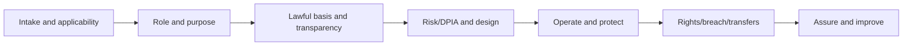
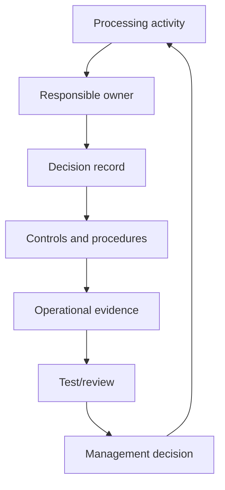
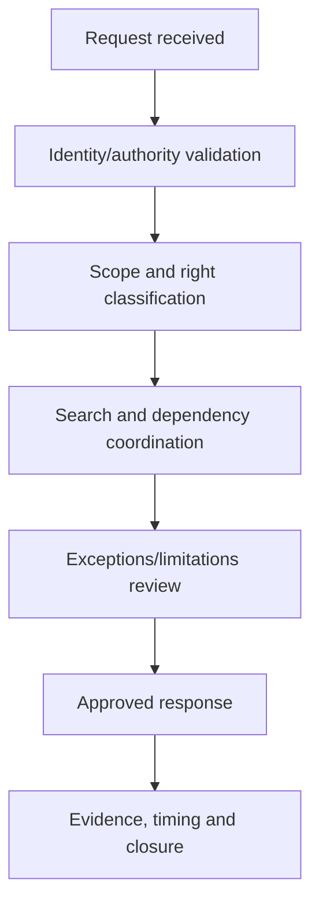

# Manual 11 — GDPR Implementation Paths

These paths scale implementation depth without changing the underlying legal obligations. Applicability and legal interpretation remain organization-specific and require competent human judgment.

## Path A — Essential

Designed for smaller or less complex organizations that process personal data in a comparatively bounded environment.

Minimum operating package:
- processing inventory and accountable owners;
- applicability and role analysis;
- documented lawful-basis decisions;
- privacy notices and rights-request workflow;
- processor register and core contractual controls;
- retention/deletion rules;
- security-of-processing baseline;
- breach assessment/escalation workflow;
- DPIA screening and escalation criteria;
- international-transfer inventory and review;
- evidence register and periodic management review.

## Path B — Structured

Designed for organizations with multiple systems, business units, suppliers, jurisdictions, data types, or higher processing complexity.

Add:
- formal privacy governance committee or equivalent;
- structured records of processing activities (ROPA);
- data-flow maps and system-to-purpose mappings;
- lawful-basis and legitimate-interest decision records;
- special-category and children-data controls where applicable;
- privacy-by-design gates in product/project lifecycle;
- DPIA methodology, review board, and remediation tracking;
- rights-request metrics and quality review;
- processor/subprocessor due diligence and monitoring;
- transfer mechanism and transfer-risk governance;
- breach tabletop exercises and decision logs;
- privacy control testing and internal audit readiness;
- training by role and risk.

## Path C — Enhanced

Designed for large, complex, highly regulated, multinational, data-intensive, AI-enabled, or high-risk environments.

Add:
- enterprise privacy architecture and control framework;
- integrated privacy/security/data/AI governance;
- automated ROPA/data-discovery support with human validation;
- advanced data lineage and provenance;
- formal model for privacy risk and residual-risk acceptance;
- high-risk processing portfolio governance;
- independent DPIA challenge for material processing;
- algorithmic/automated-decision governance;
- AI/web-scraping/anonymisation/pseudonymisation specialist review;
- continuous processor and transfer monitoring;
- regulatory-response playbooks;
- evidence automation with provenance controls;
- privacy metrics tied to outcomes, not activity counts alone;
- independent assurance and executive reporting;
- crosswalks to ISO/IEC 27701, NIST Privacy Framework, ISO/IEC 27001, sector regulations, and organizational policies where useful.

## Seven-gate operating lifecycle

**Accessible explanation:** GDPR implementation moves from applicability and role analysis through purpose/lawful-basis/transparency, privacy risk and design, operational controls, rights/breach/transfer handling, and finally assurance and improvement. A material defect at an earlier gate should be corrected before relying on later-stage evidence.

## Accountability and evidence loop

**Accessible explanation:** Each processing activity needs accountable ownership, documented decisions, implemented controls, operational evidence, review/testing, and management action. The loop repeats as processing, law, technology, risk, or guidance changes.

## Rights-request routing

**Accessible explanation:** A rights request should be validated, classified, scoped across systems and processors, reviewed for applicable limitations or exceptions, approved by accountable personnel, and closed with evidence of timing, search, decision, and response.

## Fail-closed release boundary

Automated checks can verify that required fields, workflow stages, source-state labels, files, and evidence relationships exist. They cannot determine legal sufficiency or automatically make organization-specific GDPR decisions. Human legal/privacy review and Final Human Release Approval remain mandatory.
