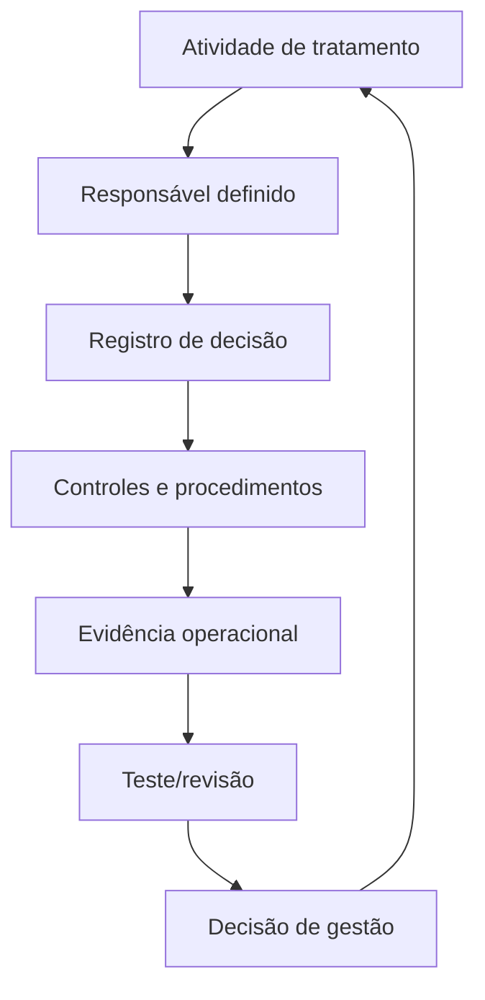
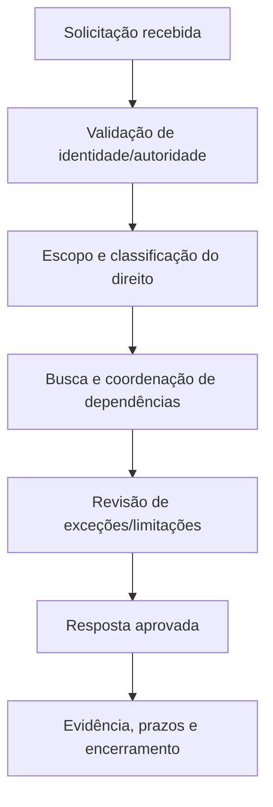

# Manual 11 — Caminhos de implementação do RGPD

> **Rascunho controlado assistido por máquina (`pt-BR`).** A edição em inglês continua sendo a fonte controlada. Esta localização não constitui aprovação jurídica, semântica ou terminológica humana e permanece sujeita a revisão competente antes da publicação.

Estes caminhos dimensionam a profundidade da implementação sem alterar as obrigações jurídicas subjacentes. A aplicabilidade e a interpretação jurídica permanecem específicas de cada organização e exigem julgamento humano competente.

## Caminho A — Essencial

Projetado para organizações menores ou menos complexas que tratam dados pessoais em um ambiente comparativamente delimitado.

Pacote operacional mínimo:
- inventário de atividades de tratamento e responsáveis definidos;
- análise de aplicabilidade e papéis;
- decisões documentadas sobre base legal;
- avisos de privacidade e fluxo de solicitações de direitos;
- registro de operadores e controles contratuais essenciais;
- regras de retenção e eliminação;
- linha de base de segurança do tratamento;
- fluxo de avaliação e escalonamento de violações;
- critérios de triagem e escalonamento de AIPD/DPIA;
- inventário e revisão de transferências internacionais;
- registro de evidências e revisão periódica de gestão.

## Caminho B — Estruturado

Projetado para organizações com múltiplos sistemas, unidades de negócio, fornecedores, jurisdições, tipos de dados ou maior complexidade de tratamento.

Adicione:
- comitê formal de governança de privacidade ou equivalente;
- registros estruturados das atividades de tratamento (ROPA);
- mapas de fluxo de dados e relações sistema-finalidade;
- registros de decisões sobre base legal e interesse legítimo;
- controles para categorias especiais de dados e dados de crianças quando aplicável;
- pontos de controle de privacidade desde a concepção no ciclo de vida de produtos/projetos;
- metodologia de AIPD/DPIA, instância de revisão e acompanhamento de remediação;
- métricas e revisão de qualidade das solicitações de direitos;
- due diligence e monitoramento de operadores/suboperadores;
- governança do mecanismo de transferência e do risco de transferência;
- exercícios de mesa sobre violações e registros de decisões;
- testes de controles de privacidade e prontidão para auditoria interna;
- treinamento por função e risco.

## Caminho C — Aprimorado

Projetado para ambientes grandes, complexos, altamente regulados, multinacionais, intensivos em dados, habilitados por IA ou de alto risco.

Adicione:
- arquitetura corporativa de privacidade e framework de controles;
- governança integrada de privacidade, segurança, dados e IA;
- suporte automatizado a ROPA e descoberta de dados com validação humana;
- linhagem e proveniência avançadas de dados;
- modelo formal de risco de privacidade e aceitação de risco residual;
- governança do portfólio de tratamentos de alto risco;
- revisão independente de AIPD/DPIA para tratamentos materiais;
- governança de decisões algorítmicas/automatizadas;
- revisão especializada de IA, web scraping, anonimização e pseudonimização;
- monitoramento contínuo de operadores e transferências;
- playbooks de resposta regulatória;
- automação de evidências com controles de proveniência;
- métricas de privacidade vinculadas a resultados, e não apenas a contagens de atividade;
- asseguração independente e relatórios executivos;
- crosswalks com ISO/IEC 27701, NIST Privacy Framework, ISO/IEC 27001, regulamentações setoriais e políticas organizacionais quando útil.

## Ciclo operacional de sete pontos de controle

**Explicação acessível:** A implementação do RGPD avança da análise de aplicabilidade e papéis para finalidade, base legal e transparência; risco de privacidade e design; controles operacionais; tratamento de direitos, violações e transferências; e finalmente asseguração e melhoria. Um defeito material em um ponto de controle anterior deve ser corrigido antes de se confiar em evidências de etapas posteriores.

## Ciclo de responsabilidade e evidência

**Explicação acessível:** Cada atividade de tratamento precisa de responsabilidade definida, decisões documentadas, controles implementados, evidência operacional, revisão/testes e ação de gestão. O ciclo se repete quando mudam o tratamento, a lei, a tecnologia, o risco ou a orientação oficial.

## Roteamento de solicitações de direitos

**Explicação acessível:** Uma solicitação de direitos deve ser validada, classificada e delimitada entre sistemas e operadores; revisada quanto a limitações ou exceções aplicáveis; aprovada por pessoal responsável; e encerrada com evidência de prazos, busca, decisão e resposta.

## Limite de liberação fail-closed

Verificações automatizadas podem confirmar a existência de campos obrigatórios, etapas de fluxo, rótulos de estado de fontes, arquivos e relações de evidência. Elas não podem determinar suficiência jurídica nem tomar automaticamente decisões específicas de uma organização sob o RGPD. A revisão humana competente de privacidade/jurídica permanece obrigatória. A autorização final de liberação do proprietário aplica-se conforme o procedimento de autorização permanente do repositório quando todos os pontos de controle substantivos anteriores estiverem verdes.
