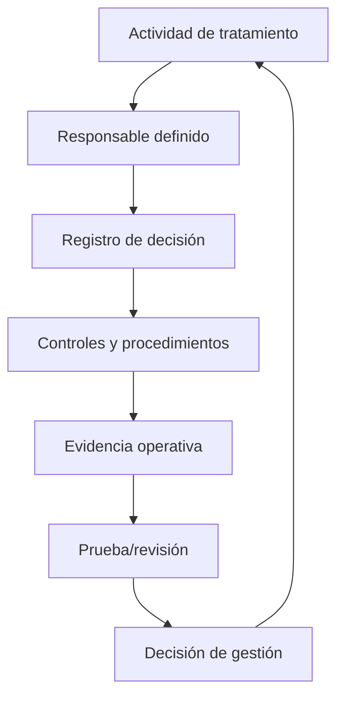
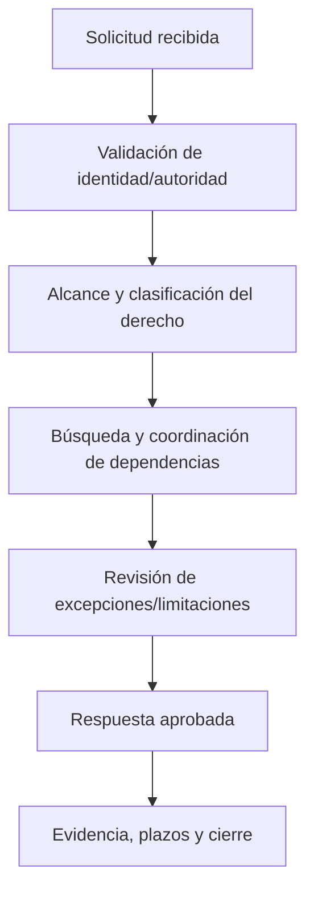

# Manual 11 — Rutas de implementación del RGPD

> **Borrador controlado asistido por máquina (`es-419`).** La edición en inglés sigue siendo la fuente controlada. Esta localización no constituye aprobación jurídica, semántica o terminológica humana y permanece sujeta a revisión competente antes de publicación.

Estas rutas escalan la profundidad de implementación sin modificar las obligaciones jurídicas subyacentes. La aplicabilidad y la interpretación jurídica siguen siendo específicas de cada organización y requieren juicio humano competente.

## Ruta A — Esencial

Diseñada para organizaciones más pequeñas o menos complejas que tratan datos personales en un entorno comparativamente acotado.

Paquete operativo mínimo:
- inventario de tratamientos y responsables definidos;
- análisis de aplicabilidad y roles;
- decisiones documentadas sobre base jurídica;
- avisos de privacidad y flujo de solicitudes de derechos;
- registro de encargados y controles contractuales esenciales;
- reglas de conservación y eliminación;
- línea base de seguridad del tratamiento;
- flujo de evaluación y escalamiento de brechas;
- criterios de selección y escalamiento de EIPD/DPIA;
- inventario y revisión de transferencias internacionales;
- registro de evidencias y revisión periódica de gestión.

## Ruta B — Estructurada

Diseñada para organizaciones con múltiples sistemas, unidades de negocio, proveedores, jurisdicciones, tipos de datos o mayor complejidad de tratamiento.

Añada:
- comité formal de gobierno de privacidad o equivalente;
- registros estructurados de actividades de tratamiento (ROPA);
- mapas de flujo de datos y relaciones sistema-propósito;
- registros de decisiones sobre base jurídica e interés legítimo;
- controles para categorías especiales de datos y datos de niños cuando corresponda;
- compuertas de privacidad desde el diseño en el ciclo de vida de productos/proyectos;
- metodología de EIPD/DPIA, instancia de revisión y seguimiento de remediación;
- métricas y revisión de calidad de solicitudes de derechos;
- debida diligencia y monitoreo de encargados/subencargados;
- gobierno del mecanismo de transferencia y del riesgo de transferencia;
- ejercicios de mesa sobre brechas y registros de decisiones;
- pruebas de controles de privacidad y preparación para auditoría interna;
- capacitación por rol y nivel de riesgo.

## Ruta C — Mejorada

Diseñada para entornos grandes, complejos, altamente regulados, multinacionales, intensivos en datos, habilitados por IA o de alto riesgo.

Añada:
- arquitectura empresarial de privacidad y marco de controles;
- gobierno integrado de privacidad, seguridad, datos e IA;
- apoyo automatizado para ROPA y descubrimiento de datos con validación humana;
- linaje y procedencia avanzados de datos;
- modelo formal de riesgo de privacidad y aceptación de riesgo residual;
- gobierno de cartera de tratamientos de alto riesgo;
- revisión independiente de EIPD/DPIA para tratamientos materiales;
- gobierno de decisiones algorítmicas/automatizadas;
- revisión especializada de IA, web scraping, anonimización y seudonimización;
- monitoreo continuo de encargados y transferencias;
- playbooks de respuesta regulatoria;
- automatización de evidencias con controles de procedencia;
- métricas de privacidad vinculadas a resultados y no solo a conteos de actividad;
- aseguramiento independiente e informes ejecutivos;
- cruces con ISO/IEC 27701, NIST Privacy Framework, ISO/IEC 27001, regulaciones sectoriales y políticas organizacionales cuando sea útil.

## Ciclo operativo de siete compuertas

**Explicación accesible:** La implementación del RGPD avanza desde el análisis de aplicabilidad y roles hacia propósito, base jurídica y transparencia; riesgo de privacidad y diseño; controles operativos; gestión de derechos, brechas y transferencias; y finalmente aseguramiento y mejora. Un defecto material en una compuerta anterior debe corregirse antes de depender de evidencia de etapas posteriores.

## Ciclo de responsabilidad y evidencia

**Explicación accesible:** Cada actividad de tratamiento necesita responsabilidad definida, decisiones documentadas, controles implementados, evidencia operativa, revisión/pruebas y acción de gestión. El ciclo se repite cuando cambian el tratamiento, la ley, la tecnología, el riesgo o la orientación oficial.

## Enrutamiento de solicitudes de derechos

**Explicación accesible:** Una solicitud de derechos debe validarse, clasificarse y delimitarse entre sistemas y encargados; revisarse frente a limitaciones o excepciones aplicables; aprobarse por personal responsable; y cerrarse con evidencia de plazos, búsqueda, decisión y respuesta.

## Límite de liberación con falla cerrada

Las verificaciones automatizadas pueden confirmar que existan campos requeridos, etapas de flujo, etiquetas de estado de fuentes, archivos y relaciones de evidencia. No pueden determinar suficiencia jurídica ni tomar automáticamente decisiones específicas de una organización bajo el RGPD. La revisión humana competente de privacidad/jurídica sigue siendo obligatoria. La autorización final de liberación del propietario se aplica conforme al procedimiento de autorización permanente del repositorio una vez que las compuertas sustantivas precedentes estén en verde.
