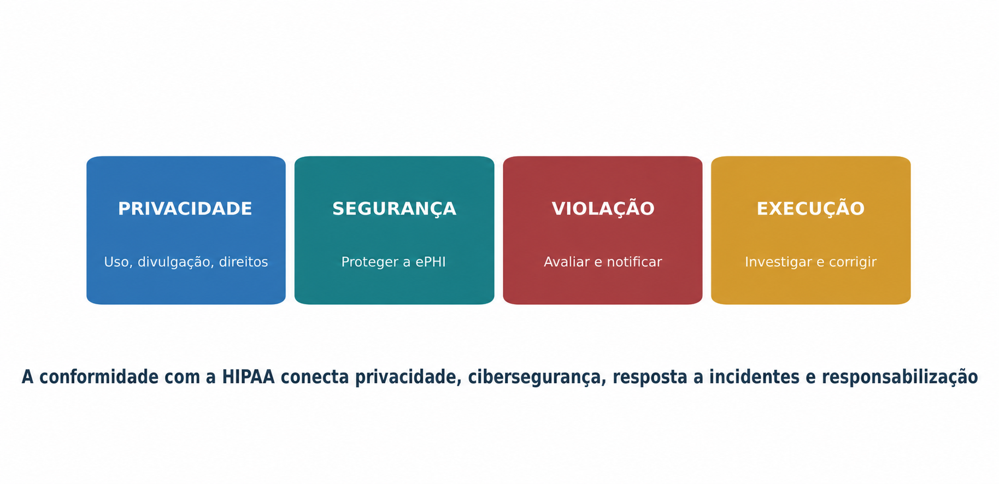
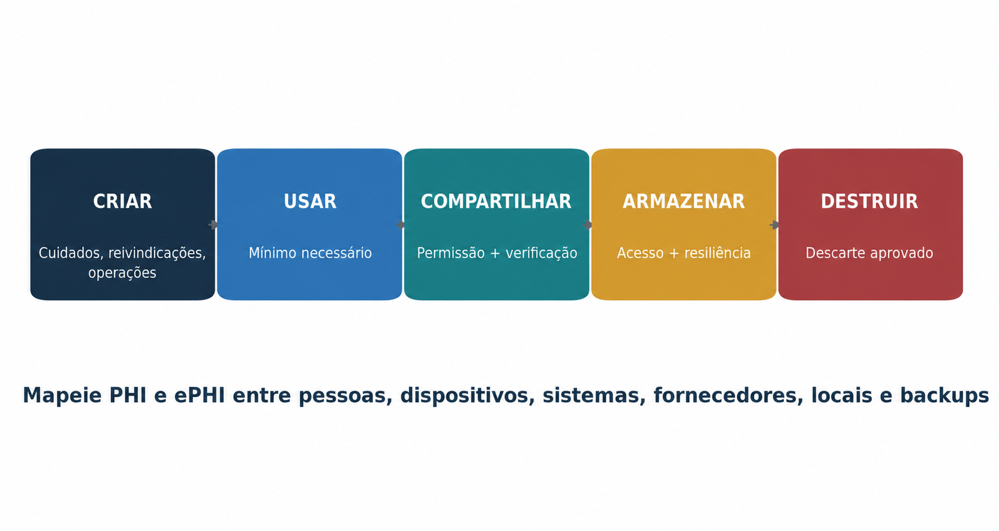
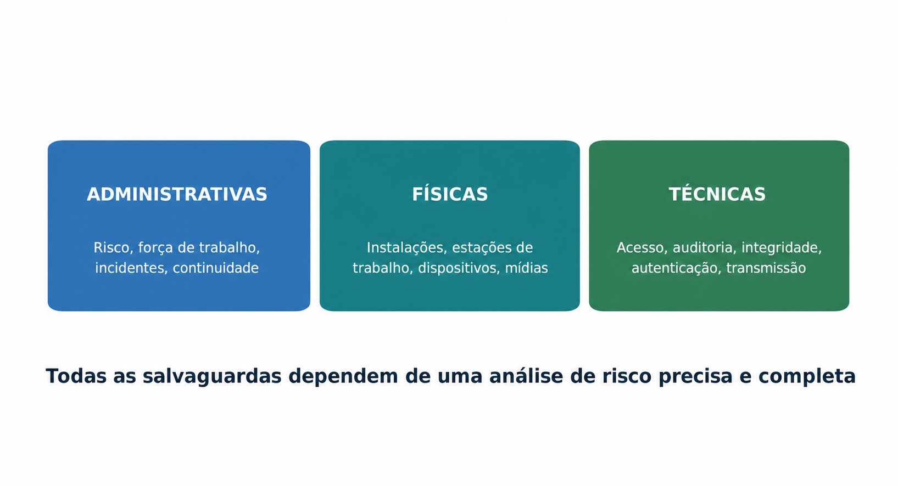
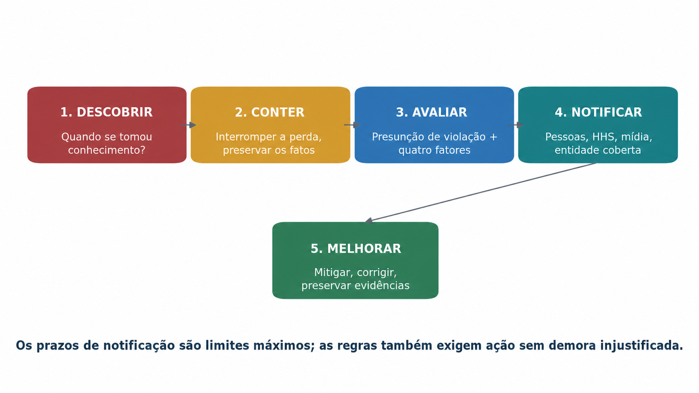
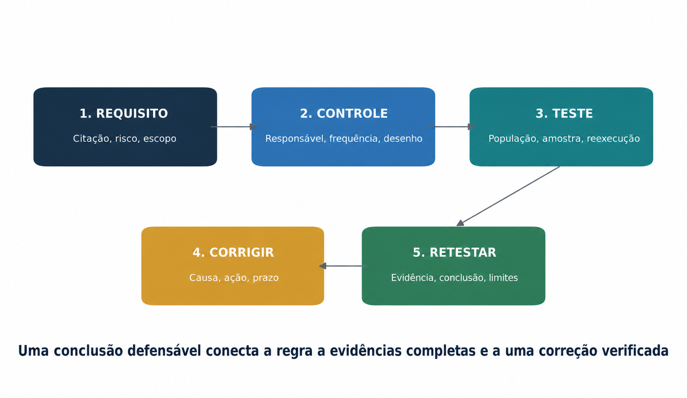
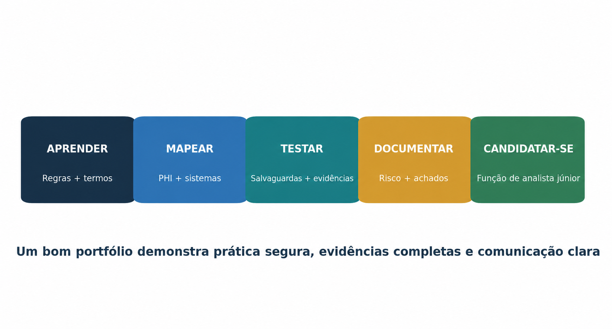
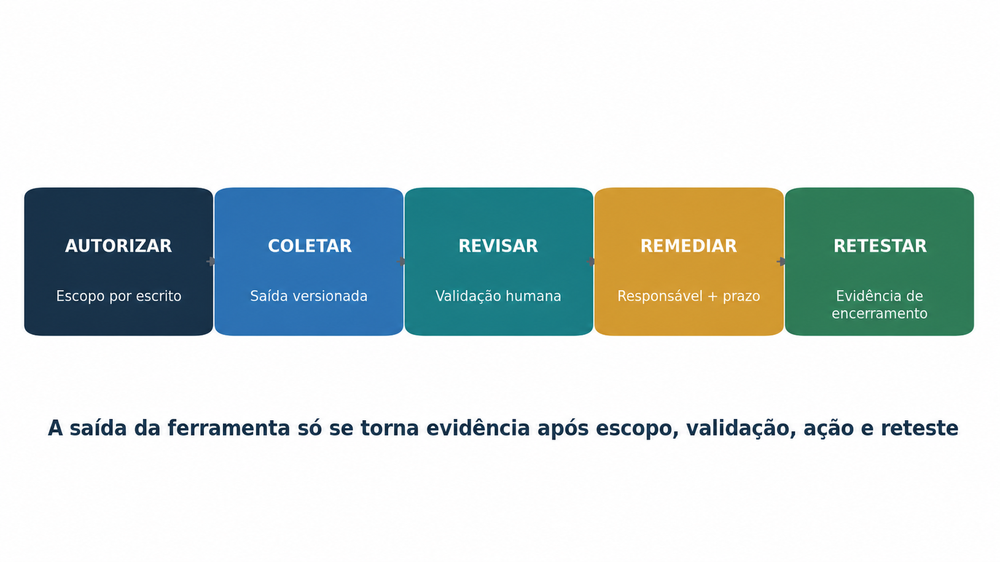

> **Status da revisão:** Rascunho de tradução assistida por máquina. Requer revisão humana de terminologia, significado, links, formatação e atualidade técnica antes de ser marcado como edição final.

** SÉRIES PRÁTICAS DE CIBERSegurança, PRIVACIDADE E CONFORMIDADE

**HIPAA**

**Manual prático de conformidade e segurança para gerentes e analistas júnior**

* Como a privacidade da informação de saúde, segurança, resposta à violação, evidências e supervisão funcionam na prática*

** Alberto (Al) Leiva**

Primeira edição • Julho de 2026

• Regra de privacidade • Regra de segurança • Notificação de violação • Parte 2 • Manual do gestor • Ferramentas de código aberto • Laboratórios de analistas júnior • Preparação para entrevistas
--------------------------------------------------------------------------------------------------------------------------------------------------------------------------------------------------------------------------------------------------------------------------------------------------------------------------------------------------------------------------

# Publicação e Aviso de Uso

Autor: Alberto (Al) Leiva

Edição: Primeira Edição, Julho 2026

Objetivo: Educação gratuita e prática para gestores, estudantes, mudadores de carreira, analistas júnior, profissionais de privacidade e profissionais de segurança cibernética.

# # Aviso educacional e legal

Este manual fornece informações educacionais gerais. Não é aconselhamento legal e não substitui aconselhamento de advogados qualificados, oficiais de privacidade, agentes de segurança ou profissionais de informação de saúde. Os deveres do HIPAA dependem de fatos, papéis, contratos, regulamentos federais e orientações atuais, leis estaduais e outras regras de informação sobre saúde.

# # Uso ético e autorizado

Utilizar ferramentas técnicas e exercícios apenas com autorização escrita e apenas com dados fictícios, sintéticos ou adequadamente desidentificados. Nunca coloque informações reais do paciente em um repositório público, laboratório de treinamento, demonstração, portfólio ou serviço não aprovado. A habilidade técnica não cria permissão.

Prefácio

* Uma introdução acolhedora ao trabalho prático HIPAA.*

HIPAA é muitas vezes reduzido para uma frase: não partilha a informação do doente. Isso está incompleto. O trabalho real do HIPAA inclui compreender quem é regulado, quais informações são protegidas, que usa e divulgações são permitidas, como os direitos individuais funcionam, como o PHI eletrônico é garantido, como os incidentes são avaliados e como as evidências provam que os controles realmente funcionam.

Os gestores devem atribuir responsabilidade, financiar salvaguardas razoáveis, remover obstáculos, rever honestamente o risco e tomar decisões oportunas. Os analistas júnior suportam o mapeamento de dados e sistemas, análises de acesso, análise de risco, evidências políticas, solicitações de direitos, arquivos associados de negócios, fatos incidentes, registros de treinamento e ações corretivas.

Este manual segue uma metodologia-primeira abordagem. Uma ferramenta de digitalização pode identificar uma fraqueza, mas não pode decidir se toda a análise de risco é precisa e completa. Um repositório de contratos pode armazenar um BAA, mas não pode provar que o fornecedor o segue. Um painel pode mostrar o status verde, mas o gerenciamento continua responsável pelo que esse status significa.

Lição central:** Compliance HIPAA é um programa de gerenciamento contínuo que conecta privacidade de informações de saúde, segurança cibernética, comportamento da força de trabalho, fornecedores, direitos do paciente, resposta incidente e evidência.
------------------------------------------------------------------------------------------------------------------------------------------------------------------------------------------------

*— Alberto (Al) Leiva*

Como usar este manual

Os gerentes devem começar com Capítulos 1 a 13 e usar o playbook e modelos como referências de trabalho.

Os analistas júnior devem estudar o guia regulatório, evidências, ferramentas, laboratório ficcional, projetos de portfólio e capítulo de entrevista.

Os leitores técnicos devem conectar cada achado técnico ao ePHI, um risco, uma salvaguarda, um proprietário, evidência de revisão e correção.

Equipes jurídicas e de privacidade devem verificar as atuais orientações do HHS, texto eCFR, leis estaduais e outras regras de informação especializada em saúde.

Nota de edição:** O guia de capítulo visível contém números de página verificados para esta edição. O campo nativo do Word pode ser atualizado após a edição selecionando Update Table, em seguida, Atualizar tabela inteira.
----------------------------------------------------------------------/-----------------------------------------------------------------------------------------------------------------------------------------------------------------------------------------

Sumário

[Comunicação de publicação e utilização [2](#publication-and-use-notice)](#publication-and-use-notice)

[Comunicação educativa e jurídica [2](#educational-and-legal-notice)](#educational-and-legal-notice)

[Utilização ética e autorizada [2](#ethical-and-authorized-use)](#ethical-and-authorized-use)

[Prefácio [3](#preface)](#preface)

[Como usar este manual [4](#how-to-use-this-manual)](#how-to-use-this-manual)

[Quadro de conteúdos [4](#table-of-contents)](#table-of-contents)

[1. Fundação HIPAA [9](#hipaa-foundations)](#hipaa-foundations)

[1.1 Regras HIPAA [9](#the-hipaa-rules)](#the-hipaa-rules)

[1.2 HIPAA não é uma lei geral de dados de saúde [9](#hipaa-is-not-a-general-health-data-law)](#hipaa-is-not-a-general-health-data-law)

[1.3 Controlo da legislação actual [9](#current-law-checkpoint)](#current-law-checkpoint)

[2. Âmbito, funções, PHI e ePHI [10](#scope-roles-phi-and-ephi)](#scope-roles-phi-and-ephi)

[2.1 Entidades cobertas [10](#covered-entities)](#covered-entities)

[2.2 Parceiros comerciais [10](#business-associates)](#business-associates)

[2.3 PHI e ePHI [10](#phi-and-ephi)](#phi-and-ephi)

[2.4 Desidentificação [11](#de-identification)](#de-identification)

[3. Regra de privacidade: Usos e Divulgação [12](#privacy-rule-uses-and-disclosures)](#privacy-rule-uses-and-disclosures)

[3.1 Requerido versus permitido [12](#required-versus-permitted)](#required-versus-permitted)

[3.2 Operações de tratamento, pagamento e cuidados de saúde [12](#treatment-payment-and-health-care-operations)](#treatment-payment-and-health-care-operations)

[3.3 Autorização [12](#authorization)](#authorization)

[3,4 Necessidade mínima [12](#minimum-necessary)](#minimum-necessary)

[3.5 Divulgações especiais autorizadas [12](#special-permitted-disclosures)](#special-permitted-disclosures)

[4. Direitos individuais e operações de privacidade [13](#individual-rights-and-privacy-operations)](#individual-rights-and-privacy-operations)

[4.1 Visão geral dos direitos [13](#rights-overview)](#rights-overview)

[4.2 Acesso não é o mesmo que autorização [13](#access-is-not-the-same-as-authorization)](#access-is-not-the-same-as-authorization)

[4.3 Ficheiro de pedido defensável [13](#defensible-request-file)](#defensible-request-file)

[5. Fundações das regras de segurança [14](#security-rule-foundations)](#security-rule-foundations)

[5.1 Requisitos gerais [14](#general-requirements)](#general-requirements)

[5.2 Requerido e endereçável [14](#required-and-addressable)](#required-and-addressable)

[5.3 Análise e gestão dos riscos [14](#risk-analysis-and-risk-management)](#risk-analysis-and-risk-management)

[6. Salvaguardas administrativas [16](#administrative-safeguards)](#administrative-safeguards)

[6.1 Revisão da actividade do sistema de informação [16](#information-system-activity-review)](#information-system-activity-review)

[6.2 Provas de contingência [16](#contingency-evidence)](#contingency-evidence)

[7. Salvaguardas físicas e técnicas [17](#physical-and-technical-safeguards)](#physical-and-technical-safeguards)

[7.1 Princípios de controlo técnico [17](#technical-control-principles)](#technical-control-principles)

[8. Regra de notificação de violação [18](#breach-notification-rule)](#breach-notification-rule)

[8.1 Presunção de violação e avaliação de quatro fatores [18](#breach-presumption-and-four-factor-assessment)](#breach-presumption-and-four-factor-assessment)

[8,2 Excepções [18](#exceptions)](#exceptions)

[9. Associados às Empresas e Superintendência do Fornecedor [19](#business-associates-and-vendor-oversight)](#business-associates-and-vendor-oversight)

[9.1 Conteúdos do acordo de associação de empresas [19](#business-associate-agreement-contents)](#business-associate-agreement-contents)

[9.2 Due diligence [19](#due-diligence)](#due-diligence)

[10. Parte 2 e Informação Especial sobre a Saúde [20](#part-2-and-special-health-information)](#part-2-and-special-health-information)

[10,1 42 CFR Parte 2 [20](#cfr-part-2)](#cfr-part-2)

[10.2 Regras especializadas e de estado [20](#specialized-and-state-rules)](#specialized-and-state-rules)

[20](#reproductive-health-rule-status)](#reproductive-health-rule-status)

[11. Aplicação da legislação estatal e desenvolvimentos actuais [21](#enforcement-state-law-and-current-developments)](#enforcement-state-law-and-current-developments)

[11.1 Execução OCR [21](#ocr-enforcement)](#ocr-enforcement)

[11,2 Níveis de penalização [21](#penalty-tiers)](#penalty-tiers)

[11.3 Preempção estatal [21](#state-law-preemption)](#state-law-preemption)

[11.4 Regra de segurança NPRM [21](#security-rule-nprm)](#security-rule-nprm)

[11.5 Tecnologias de seguimento online [21](#online-tracking-technologies)](#online-tracking-technologies)

[12. Guia completo dos requisitos regulamentares [22](#complete-regulatory-requirements-guide)](#complete-regulatory-requirements-guide)

[12.1 Regra de segurança [22](#security-rule)](#security-rule)

[12.2 Regra de privacidade [22](#privacy-rule)](#privacy-rule)

[12.3 Regra de notificação por violação [23](#breach-notification-rule-1)](#breach-notification-rule-1)

[12.4 Execução e prevenção [23](#enforcement-and-preemption)](#enforcement-and-preemption)

[12.5 Método de verificação da conformidade [24](#compliance-verification-method)](#compliance-verification-method)

[12.6 Testes práticos de verificação [25](#practical-verification-tests)](#practical-verification-tests)

[12.7 Fiabilidade dos elementos de prova [25](#evidence-reliability)](#evidence-reliability)

[13. HIPAA Playbook [26](#managers-hipaa-playbook)](#managers-hipaa-playbook)

[13.1 Perguntas para cada proprietário [26](#questions-for-every-owner)](#questions-for-every-owner)

[13.2 Painel mensal [26](#monthly-dashboard)](#monthly-dashboard)

[13.3 Erros comuns de gestão [26](#common-management-mistakes)](#common-management-mistakes)

[14. Do Iniciante ao Júnior Analista HIPAA [27](#from-beginner-to-junior-hipaa-analyst)](#from-beginner-to-junior-hipaa-analyst)

[14,1 Títulos de trabalho [27](#job-titles)](#job-titles)

[14,2 Trabalho júnior típico [27](#typical-junior-work)](#typical-junior-work)

[14.3 Prova de carteira [28](#portfolio-proof)](#portfolio-proof)

[15. Ferramentas de código aberto para HIPAA Work [29](#open-source-tools-for-hipaa-work)](#open-source-tools-for-hipaa-work)

[15.1 Matriz de verificação da ferramenta ao requisito [29](#tool-to-requirement-verification-matrix)](#tool-to-requirement-verification-matrix)

[15.2 Como validar uma ferramenta antes de confiar nela [30](#how-to-validate-a-tool-before-relying-on-it)](#how-to-validate-a-tool-before-relying-on-it)

[15.3 Pacote de provas da ferramenta [31](#tool-evidence-package)](#tool-evidence-package)

[15,4 Assistente CISO [31](#ciso-assistant)](#ciso-assistant)

[Início rápido [31](#quick-start)](#quick-start)

[Evidência para reter [31](#evidence-to-retain)](#evidence-to-retain)

[15.5 Wazuh [32](#wazuh)](#wazuh)

[Início rápido [32](#quick-start-1)](#quick-start-1)

[Evidência para conservar [32](#evidence-to-retain-1)](#evidence-to-retain-1)

[15.6 OpenSCAP [32](#openscap)](#openscap)

[Início rápido [32](#quick-start-2)](#quick-start-2)

[Evidência para conservar [32](#evidence-to-retain-2)](#evidence-to-retain-2)

[15.7 Greenbone Community Edition [32](#greenbone-community-edition)](#greenbone-community-edition)

[Início rápido [32](#quick-start-3)](#quick-start-3)

[Evidência para conservar [32](#evidence-to-retain-3)](#evidence-to-retain-3)

[15,8 osquery [32](#osquery)](#osquery)

[Início rápido [33](#quick-start-4)](#quick-start-4)

[Evidência para reter [33](#evidence-to-retain-4)](#evidence-to-retain-4)

[15.9 Trivy [33](#trivy)](#trivy)

[Início rápido [33](#quick-start-5)](#quick-start-5)

[Evidência para reter [33](#evidence-to-retain-5)](#evidence-to-retain-5)

[15,10 OWASP ZAP [33](#owasp-zap)](#owasp-zap)

[Início rápido [33](#quick-start-6)](#quick-start-6)

[Evidência para reter [33](#evidence-to-retain-6)](#evidence-to-retain-6)

[15.11 Keycloak [33](#keycloak)](#keycloak)

[Início rápido [34](#quick-start-7)](#quick-start-7)

[Evidência para reter [34](#evidence-to-retain-7)](#evidence-to-retain-7)

[15.12 DefectDojo [34](#defectdojo)](#defectdojo)

[Início rápido [34](#quick-start-8)](#quick-start-8)

[Evidência para reter [34](#evidence-to-retain-8)](#evidence-to-retain-8)

[15.13 Velociraptor [34](#velociraptor)](#velociraptor)

[Início rápido [34](#quick-start-9)](#quick-start-9)

[Evidência para reter [34](#evidence-to-retain-9)](#evidence-to-retain-9)

[15.14 Agente de política aberta [34](#open-policy-agent)](#open-policy-agent)

[Início rápido [34](#quick-start-10)](#quick-start-10)

[Evidência para reter [35](#evidence-to-retain-10)](#evidence-to-retain-10)

[15.15 Recurso público livre [35](#free-government-resource)](#free-government-resource)

[15.16 Lista de verificação da governação da ferramenta [35](#tool-governance-checklist)](#tool-governance-checklist)

[16. Laboratório Ficcional de Saúde e Portfólio [36](#fictional-healthcare-laboratory-and-portfolio)](#fictional-healthcare-laboratory-and-portfolio)

[Projeto 1 — Âmbito e funções [36](#project-1-scope-and-roles)](#project-1-scope-and-roles)

[Projeto 2 — Análise de risco [36](#project-2-risk-analysis)](#project-2-risk-analysis)

[Projeto 3 — Salvaguardas de segurança [36](#project-3-security-safeguards)](#project-3-security-safeguards)

[Projeto 4 — Direitos de privacidade [36](#project-4-privacy-rights)](#project-4-privacy-rights)

[Projeto 5 — Violação [36](#project-5-breach)](#project-5-breach)

[Projeto 6 — Fornecedor [36](#project-6-vendor)](#project-6-vendor)

[Projeto 7 — Ferramentas [36](#project-7-tools)](#project-7-tools)

[16.1 Ética em carteira [36](#portfolio-ethics)](#portfolio-ethics)

[17. Plano de Aprendizagem de Trinta Dias [37](#thirty-day-learning-plan)](#thirty-day-learning-plan)

[17.1 Costumes diários [37](#daily-habit)](#daily-habit)

[18. Preparação da entrevista [38](#interview-preparation)](#interview-preparation)

[Quem deve cumprir com HIPAA? [38](#who-must-comply-with-hipaa)](#who-must-comply-with-hipaa)

[O que é o PHI? [38](#what-is-phi)](#what-is-phi)

[PHI versus ePHI? [38](#phi-versus-ephi)](#phi-versus-ephi)

[O que é mínimo necessário? [38](#what-is-minimum-necessary)](#what-is-minimum-necessary)

[O que é uma análise de risco HIPAA? [38](#what-is-a-hipaa-risk-analysis)](#what-is-a-hipaa-risk-analysis)

[Isso significa opcional? [38](#does-addressable-mean-optional)](#does-addressable-mean-optional)

[Qual é o padrão de violação? [38](#what-is-the-breach-standard)](#what-is-the-breach-standard)

[Como os associados de negócios suportam a conformidade? [38](#how-do-business-associates-support-compliance)](#how-do-business-associates-support-compliance)

[Como você prova que uma proteção funciona? [38](#how-do-you-prove-a-safeguard-works)](#how-do-you-prove-a-safeguard-works)

[18.1 Resposta de 60 segundos [39](#managers-60-second-answer)](#managers-60-second-answer)

[19. Modelos e listas de verificação [40](#templates-and-checklists)](#templates-and-checklists)

[19,1 campos de inventário ePHI [40](#ephi-inventory-fields)](#ephi-inventory-fields)

[19.2 Campos de registo de risco [40](#risk-register-fields)](#risk-register-fields)

[19,3 Ficha técnica de violação [40](#breach-fact-sheet)](#breach-fact-sheet)

[19.4 Lista de verificação BAA [40](#baa-checklist)](#baa-checklist)

[19.5 Lista de verificação pré-auditoria [41](#manager-pre-audit-checklist)](#manager-pre-audit-checklist)

[20. Glossário [42](#glossary)](#glossary)

[21. Índice de assuntos [44](#subject-index)](#subject-index)

[22. Referências oficiais e estudo complementar [45](#official-references-and-further-study)](#official-references-and-further-study)

# 1. Fundação HIPAA

* O que HIPAA cobre, o que não cobre, e como suas principais regras funcionam juntas.*

Figura 1. As principais áreas de conformidade HIPAA

## 1.1 Regras HIPAA

Local** Local** Local** Local** Local** Local
---------------------------------------------
• Regra de privacidade – Limita os usos e divulgações e dá direitos individuais – PHI em formato eletrônico, papel e oral –
Regra de segurança , protege PHI eletrônico , salvaguardas administrativas, físicas e técnicas ,
Regra de Notificação por Violação (Breach Notification Rule) Requer avaliação e notificação após certas violações (PHI não seguros) e decisões de risco documentadas (SIG)
□ Regra de execução; Explica investigações e sanções; Queixas, revisões de conformidade, evidência, correção;
As operações e conjuntos de códigos normalizam as transacções electrónicas de saúde

## 1.2 HIPAA não é uma lei geral de dados de saúde

HIPAA aplica-se a entidades cobertas, associados comerciais e certos acordos relacionados. Um aplicativo de fitness, empregador, escola, seguro de vida ou serviço direto ao consumidor pode conter dados de saúde sensíveis sem ser uma entidade coberta HIPAA. Outras leis federais e estaduais ainda podem ser aplicadas.

## 1.3 Controlo da lei actual

*Importante:** A atualização da regra de segurança HIPAA de dezembro de 2024 é uma regra proposta, não a atual regra final de segurança. Este manual explica a regra atual e claramente rotula a proposta como um item de desenvolvimento futuro.
-------------------------------------------------------------------------------------------------------------------------------------------------------------------------------------------------------------

# 2. Escopo, Funções, PHI, e PHI

* Como identificar entidades regulamentadas, informações protegidas, fronteiras e responsabilidades.*

Figura 2. Ciclo de vida da IPH

2.1 Entidades cobertas

- Planos de saúde

- Centros de limpeza de cuidados de saúde

- Prestadores de cuidados de saúde que transmitem informações de saúde electronicamente relacionadas com uma transacção abrangida

## 2.2 Parceiros de negócios

Uma associada de negócio desempenha determinadas funções ou serviços para uma entidade coberta que envolve o PHI. Um subcontratante que crie, receba, mantenha ou transmita o PHI em nome de um sócio de negócios também pode ser sócio de negócios. O estatuto provém dos factos e regras, não apenas da assinatura de um contrato.

## 2.3 PHI e ePHI

As informações de saúde protegidas são informações de saúde identificáveis individualmente detidas ou transmitidas por uma entidade ou associação de empresas abrangidas, sujeitas a exclusões, tais como determinados registos de educação e emprego. ePHI é PHI mantido ou transmitido eletronicamente. A Regra de Segurança protege o ePHI; a Regra de Privacidade protege o PHI de qualquer forma.

2.4 Desidentificação

* Metodologia** Metodologia** Metodologia** Evidência**
--------------------------------------------------------------------------------------------------------------------------------------------------------------------------------------------------------------------------------------------------
• Determinação de especialistas □ Um perito qualificado determina e documenta que o risco de identificação é muito pequeno □ Qualificações, método, pressupostos, relatório
O porto seguro Remova os identificadores listados e não tenha conhecimento real de que as informações restantes identificam uma pessoa.

*Controle de gestão:** Exigir um escopo escrito e análise de função para cada entidade jurídica, serviço, produto, função empregador, atividade de pesquisa, fornecedor e fluxo de dados.
--------------------------------------------------------------------------------------------------------------------------------------------------------------------------------

3. Regra de privacidade: Usos e Divulgação

* Usos autorizados, autorizações, mínimo necessário, verificação, avisos e situações especiais.*

## 3.1 Necessário versus permitido

A Regra de Privacidade requer divulgação ao indivíduo em certas situações de direitos e ao HHS para execução. Permite muitos outros usos e divulgações quando as condições são cumpridas. A divulgação permitida nem sempre é obrigatória; outras leis e deveres profissionais podem afetar a decisão.

## 3.2 Tratamento, pagamento e operações de saúde

Entidades cobertas podem usar e divulgar PHI para tratamento, pagamento e operações de saúde sob a regra. As equipes ainda devem confirmar a finalidade, o destinatário, o papel, a regra mínima necessária aplicável, avisos e outras condições.

## 3.3 Autorização

- Descreva as informações de forma específica e significativa.

- Nome ou descrição de quem pode divulgar e receber.

- Declare o propósito, a validade e as declarações exigidas.

- Use linguagem simples e obter assinatura e data.

- Revogação e confiança já tomadas.

- Aplicar regras especiais para notas de psicoterapia, marketing e venda de PHI.

3.4 Necessidade mínima

Quando se aplica a norma mínima necessária, limitar as utilizações, as divulgações e os pedidos ao PHI razoavelmente necessários para o efeito. Defina funções de força de trabalho, protocolos de rotina, revisão não rotineira e confiança razoável. O padrão tem exceções, incluindo divulgações ou solicitações de tratamento por um profissional de saúde.

3.5 Divulgações especiais permitidas

**Situação**
------------------------------------------------------------------------------------------------------------------------------------------------------
- Obrigatório por lei - Identifique o requisito legal exato e limite a divulgação
• Saúde pública • Verificar autoridade receptora e finalidade permitida
• Abuso, negligência ou violência doméstica
• Superintendência da saúde
• Processo judicial ou administrativo; • Ordem de revisão, intimação, aviso, ordem de proteção e condições de objeção;
□ Aplicação da lei; Identifique a permissão precisa e verifique o solicitante;
Pesquisa Confirmar autorização, renúncia, revisão preparatória, ou condições descendentes
□ Ameaça grave; Aplicar condições de boa-fé e de lei aplicável;
□ Compensação dos trabalhadores

# 4. Direitos individuais e operações de privacidade

* Como receber, verificar, completar e documentar solicitações de pacientes e membros.*

## 4.1 Visão geral dos direitos

* Direito** ** Prazo típico** ** Trabalho operacional**
-------------------------------------------------------------------------------------------------------------------------------------------------------------------------------------------------------------------------------------------------------------------------------------------------
Aviso de práticas de privacidade No serviço obrigatório, inscrição, postagem e pontos de revisão
O acesso geralmente 30 dias; uma extensão de 30 dias com aviso escrito oportunamente Verifique, busca conjunto de registros designado, exclusões de revisão, formato, taxas, entrega
* Emenda * Geralmente 60 dias; uma extensão de 30 dias com aviso * Revisão, aceitação ou negação, registros de ligação, notificar as partes
□ Contabilidade de divulgações □ Geralmente 60 dias; uma extensão de 30 dias com aviso □ Registros de divulgação de pesquisa, aplicar exceções, entregar contabilidade
• Solicitação de restrição; reveja e responda; certas restrições pagas em plano de saúde completo devem ser aceitas;
□ Comunicações confidenciais □ Acomodar pedidos razoáveis sob a regra aplicável
• Reclamação • Sem retaliação; processo sob política • Registre, investigue, responda, mitigue, retenha evidências

## 4.2 Acesso não é o mesmo que autorização

O direito de acesso de uma pessoa ao abrigo de 45 CFR 164,524 tem o seu próprio âmbito, calendário, negação, formato e regras de taxa. Não aplicar automaticamente um processo de autorização ou criar barreiras que a regra de acesso não permite.

## 4.3 Arquivo de solicitação defensável

- Data de pedido e de recepção

- Identidade e decisão pessoal-representativa

- Conjunto de registos designado e sistemas pesquisados

- Exclusões, negação e análise jurídica

- Formato, método de entrega e cálculo de taxas

- Aviso de extensão quando utilizado

- Resposta, prova de entrega e data de conclusão

# 5. Fundações de Regras de Segurança

* Requisitos gerais, flexibilidade, especificações necessárias e endereçáveis, e provas.*

Figura 3. HIPAA Salvaguardas das regras de segurança

5.1 Requisitos gerais

Garantir a confidencialidade, integridade e disponibilidade do ePHI.

Proteger contra ameaças e perigos razoavelmente previstos.

Proteger contra utilizações ou divulgações impermissíveis razoavelmente antecipadas.

Assegurar o cumprimento da força de trabalho.

## 5.2 Obrigatório e endereçável

O endereço não significa opcional:** Para uma especificação endereçável, avaliar se é razoável e adequado. Implemente-o quando estiver. Caso contrário, documento por que e implementar uma alternativa razoável e adequada equivalente quando existir. □
□------------------------------------------------------------------------------------------------------------------------------------------------------------------------------------------------------------------------------------------------------------------------------------------------------------------

5.3 Análise de riscos e gestão de riscos

1. Defina todos os limites de ePHI e de entidade regulamentada.

2. Sistemas de mapas, aplicações, dispositivos, pessoas, locais, fornecedores, redes, interfaces, backups e mídia.

3. Identificar ameaças, vulnerabilidades, medidas existentes, probabilidade e impacto.

4. Determinar risco consistentemente.

5. Atribuir tratamentos, proprietários, recursos, datas e autoridade de aceitação.

6. Reteste e atualização após mudanças, incidentes, novas ameaças e falhas de controle.

A atual Regra de Segurança não estabelece uma frequência fixa de análise de risco. A orientação do HHS indica que o processo deve ser contínuo e atualizado conforme necessário.

6. Salvaguardas administrativas

* Os processos de gestão que transformam a política em proteção repetitiva.*

* ** ** ** ** ** ** ** ** ** ** ** ** ** ** ** ** ** **
--------------------------------------------------------------------------------------------------------------------------------------------------------------------------------------------------------------------------------------
.164.308(a)(1) .. Processo de gestão de segurança ..Execute análise de risco, gestão de risco, sanções e revisão da atividade do sistema de informação. □ Análise de risco, plano de tratamento, sanções, evidência de revisão de log
□ 164.308(a)(2) □ Responsabilidade atribuída em matéria de segurança □ Designe o funcionário responsável pelas políticas e procedimentos das Regras de Segurança. □ Descrição do papel, nomeação, linha de notificação .
□ 164.308(a)(3) □ Segurança da força de trabalho □ Autorizar, supervisionar, limpar e remover prontamente o acesso à força de trabalho. □ Aprovações de acesso, rastreio, provas de rescisão
.164.308(a)(4) ..Gestão de acesso à informação ..Controle o acesso com base no papel e necessidade, incluindo estabelecimento e modificação. □ Matriz de acesso, aprovações, revisões periódicas
□ 164.308(a)(5) □ Conscientização e treinamento de segurança □ Treine a força de trabalho e enderece lembretes, malware, monitoramento de login e gerenciamento de senhas. □ Treinamento, simulações, lembretes, acompanhamento
.164.308(a)(6) Procedimentos de incidente de segurança . Identifique, responda, mitigue, documento e relate incidentes. □ Plano de incidentes, bilhetes, provas, lições
O Plano de Contingência Opere backups, recuperação de desastres, modo de emergência, testes e análise de criticidade. Relatórios de backup, restaurar testes, exercícios, planos de recuperação
.164.308(a)(8) Avaliação .. Realizar avaliação técnica e não técnica periódica após alterações relevantes. • Âmbito de avaliação, conclusões, plano de correcção
(b) (b) (n) (n) (n)) (n) (n) (n) (n) (n) (n) (n) (n) (n) (n) (n) (n) (n) (n) (n) (n) (n) (n)) (n) (n) (n) (n) (n) (n) (n) (n) (n) (n) (n) (n) (n) (n) (n) (n) (n) (n) (n) (n) (n) (n) (n) (n) (n) (n) (n) (n) (n) (n) (n) (n) (n) (n) (n) (n) (n)) (n) (n) (n) (n) (n) (n)) (n) (n) (n) (n) (n) (n) (n)) (n) (n) (n) (n) (n) (n) (n) (n) (n) (n) (n BAA, diligência devida, acompanhamento

6.1 Revisão da actividade do sistema de informação

Defina quais registros de auditoria, relatórios de acesso, eventos de segurança, relatórios de exceção e alertas são revisados; com que frequência; por quem; como as evidências são mantidas; e como a atividade suspeita se torna um incidente ou ação corretiva.

6.2 Evidências de contingência

- Cópia de segurança e relatórios de falhas

- Projeto de backup offline ou protegido de outra forma

- Testes de restauração documentados

- Procedimentos de modo de emergência

- Exercícios de recuperação de desastres

- Aplicação crítica e análise de dados

- Lições, donos e datas de vencimento

7. Salvaguardas físicas e técnicas

* Facilidades, estações de trabalho, mídia, identidade, acesso, auditoria, integridade e controles de transmissão.*

* ** ** ** ** ** ** ** ** ** ** ** ** ** ** ** ** ** **
------------------------------------------------------------------------------------------------------------------------------------------------------------------------------------------------------------------------------------------------
(a) (a) (a) (controlos de acesso à instalação) (a) (a) (a) (a) (a) (controlos de acesso à instalação) (a) (a) (a) (a) (a)) (a) (a) (a)) (a) (a) (a) (a) (a) (a) (a) (a) (a)) (a) (a) (a) (a)) (a) (a)) (a) (a) (a)) (a) (a) (a)) (a)) (a)) (a) (a) (ou) (a) (a) (a)) (a)) (a)) (a) (a)) (a) () (a)) (a)) (a)) (a)) (a) (a)) (a)) (a) () (a)) (a) () (a)) (a) (a) (a) () ()) () () () () () (a) (a) Plano de instalação, registros de visitantes, registros de manutenção
.164.310(b) .Uso de estação de trabalho .Defina funções adequadas e ambiente físico para estações de trabalho usando ePHI. Política de estação de trabalho, formação, observações
(c) (c) (Segurança da estação de trabalho) (Restringir o acesso físico às estações de trabalho que acedem ao ePHI. □ Locais seguros, telas, controles de dispositivo
Controle de recepção, movimento, reutilização, backup, eliminação e responsabilização. □ Inventário, cadeia de custódia, limpeza e prova de destruição
O controle de acesso .Use IDs exclusivos, acesso de emergência e controles de logoff e criptografia adequados. Configurações do IAM, teste de emergência, registro de criptografia
(b) (b) (Controles de auditoria) (Recordar e examinar a actividade em sistemas contendo ou utilizando o ePHI. □ Diários, calendário de revisão, registos de investigação
□ 164.312(c) □ Integridade • Controlos de integridade, controlos de alterações, validação
□ 164.312(d) □ Autenticação de pessoa ou entidade □ Configurações de autenticação, MFA, registros de identidade
.164.312(e) .Segurança de transmissão . Proteger o ePHI contra acesso não autorizado durante a transmissão. □ Criptografia, protocolos seguros, testes de arquitetura
.164.314 .Requisitos organizacionais . Contratos, documentos do plano, revisões
□ 164.316 □ Políticas, procedimentos e documentação Implementar políticas razoáveis e manter a documentação necessária por seis anos. □ Políticas aprovadas, versões, evidência de retenção de seis anos

7.1 Princípios de controlo técnico

- Dar a cada utilizador uma identidade única.

- Use menos privilégio e remoção oportuna.

- Proteger o acesso privilegiado e de emergência.

- Gravar actividade significativa e revê-la.

- Use autenticação forte adequado para o risco.

- Proteger o ePHI em repouso e em trânsito com base na análise documentada.

- Teste a integridade, recuperação e eficácia de controle.

- Gerencie exceções com proprietário, razão, controles compensadores, expiração e aprovação.

# 8. Regra de violação da notificação

* Como avaliar incidentes PHI não seguros e cumprir as obrigações de notificação.*

Figura 4. Fluxo de trabalho de violação HIPAA

## 8.1 Presunção de violação e avaliação de quatro fatores

Presume-se que uma utilização ou divulgação impermissível do PHI constitui uma violação, a menos que a entidade ou a associada comercial abrangida demonstre uma baixa probabilidade de o PHI ter sido comprometido. Avaliar, pelo menos, a natureza e extensão da IPH e a probabilidade de reidentificação, a pessoa não autorizada, se a IPH foi realmente adquirida ou vista, e a extensão da mitigação.

Notificação** Notificação** Notificação** Notificação** Notificação**
-----------------------------------------------------------------------
□ Indivíduos □ Sem atraso razoável e o mais tardar 60 dias após a descoberta
□ HHS — 500 ou mais □ De acordo com o calendário de reporte contemporâneo da regra .
Relatório anual , o mais tardar 60 dias após o final do ano civil
Mais de 500 residentes de um estado ou jurisdição □ Contagem de jurisdição, aviso de mídia
Associação de negócios à entidade coberta Sem atraso razoável e o mais tardar em 60 dias

8.2 Excepções

A definição de violação contém exceções estreitas envolvendo certo acesso não intencional ou inadvertida à força de trabalho e crenças de boa fé de que um destinatário não autorizado não poderia razoavelmente manter a informação. Documentos e revisão legal antes de se basear em uma exceção.

# 9. Associados de Negócios e Oversight do Fornecedor

* Contratos, subcontratantes, due diligence, monitoramento, incidentes e rescisão.*

## 9.1 Conteúdos de acordos de parceiros comerciais

Utilização e divulgação permitidas e exigidas

Sem uso ou divulgação além do contrato ou da lei

Garantias adequadas e cumprimento das regras de segurança para o ePHI

Violação, incidente e relato de IPH não seguro

Apoio aos direitos de acesso, alteração e contabilidade

Disponibilidade de IPH para revisão de conformidade com o HHS

Retorno ou destruição na terminação, quando possível

Acordos de subcontratação com as mesmas restrições aplicáveis

Direitos de rescisão por violação material

## 9.2 Diligência devida

* * * * * * * * * * * * * * * * * * * * * * * * * * * * * *
---------------------------------------------------------------------------------------------------------------------------------------------------------
O que PHI/ePHI, finalidade, serviços, locais e interfaces? Fluxo de dados, inventário, arquitetura
□ Segurança □ Análise de risco, criptografia, identidade, registro, vulnerabilidade, backups, resposta incidente? Políticas, testes, relatórios, remediação
Privacy (Privacy) O mínimo necessário, acesso à força de trabalho, apoio a direitos, controles de divulgação? Procedimentos, funções, amostras
Quem, onde, para que finalidade, sob que acordo? Lista de subprocessadores e termos
Quando e como o BA irá reportar e cooperar? BAA, exercício, contactos
Como é que o acesso termina e o PHI é devolvido ou destruído? □ Plano de saída, prova de eliminação, registro de risco residual .

Ponto de gestão:** Um BAA assinado é necessário em muitos relacionamentos, mas não substitui a devida diligência, gestão de riscos, controle de acesso, monitoramento ou coordenação de incidentes. □
------------------------------------------------------------

# 10. Parte 2 e Informações Especiais de Saúde

* Registros de transtornos de uso de substâncias, saúde mental, genética e outras regras sobrepostas.*

# # 10,1 42 CFR Parte 2

A Regra Final da Parte 2 de 2024 entrou em vigor em 16 de abril de 2024, e o cumprimento foi exigido em 16 de fevereiro de 2026. Alinha o consentimento importante, a execução, a notificação de violação e as disposições de aviso mais estreitamente com HIPAA, mantendo proteções especiais para registros de programas de transtorno de uso de substâncias assistidas federalmente.

Determine se a organização é um programa Parte 2, titular legal, ou destinatário.

Use o consentimento atual Parte 2, redisclosure, reclamação, violação e requisitos de aviso.

Não presuma que a permissão HIPAA resolve sempre os deveres da Parte 2.

Atualizar avisos de práticas de privacidade e avisos de pacientes Parte 2, conforme necessário para 16 de fevereiro de 2026 conformidade.

## 10.2 Regras especializadas e estaduais

A legislação estatal pode ser mais rigorosa do que a HIPAA e pode impor regras especiais para a saúde mental, HIV, saúde reprodutiva, genética, menores, telessaúde, dados biométricos ou aviso de violação. Outras regras federais podem ser aplicadas aos registros de transtornos de uso de substâncias, registros educacionais, pesquisas clínicas, bloqueio de informações, aplicativos de saúde do consumidor e transferências de dados sensíveis.

## 10.3 Estado da regra da saúde reprodutiva

Estado atual:** Uma ordem judicial distrital federal datada de 18 de junho de 2025 vagou a maior parte do 2024 HIPAA regra de privacidade saúde reprodutiva. A HHS afirma que apenas algumas modificações no Aviso de Práticas de Privacidade permaneceram. Verifique a página atual do HHS e aconselhamento jurídico antes de usar qualquer atestado 2024 ou fluxo de trabalho de saúde reprodutiva. □
□--------------------------------------------------------------------------------------------------------------------------------------------------------------------------------------------------------------------------------------------------------------------------------------------------------------------------------------------------------------------------------------------------------------------------

# 11. Aplicação, Lei Estadual e Desenvolvimentos Atuais

* Queixas, investigações, sanções, preempção, decisões judiciais e alterações propostas.*

# # 11.1 Aplicação do OCR

- Receber e investigar queixas.

- Realizar análises de conformidade e auditorias.

- Solicito registos e cooperação.

- Procurar conformidade voluntária e medidas correctivas.

- Introduza acordos de resolução e planos de correcção.

- Impor penalidades em dinheiro civil quando autorizado.

- Consulte possíveis violações penais ao Departamento de Justiça.

# # 11.2 Níveis de penalização

A análise da pena civil considera o conhecimento, causa razoável, negligência deliberada, correção, natureza e extensão, dano, história, condição financeira e outros fatores. Os montantes em dólares são ajustados periodicamente. Verifique os valores atuais do HHS e Federal Register em vez de confiar em um gráfico antigo.

11.3 Preempção da lei estatal

HIPAA geralmente preempte a lei estatal contrária, mas as regras contêm exceções, incluindo para certas proteções de privacidade mais rigorosas e leis de saúde pública ou relatórios. Manter uma matriz estadual e obter revisão legal para cada local de serviço e população individual.

# # 11.4 Regra de segurança NRM

O HHS propôs grandes mudanças na Regra de Segurança em um aviso publicado em 6 de janeiro de 2025, incluindo inventário de ativos mais específico, mapeamento de rede, análise de risco, testes, criptografia, autenticação multifatorial, segmentação, recuperação e deveres de verificação de negócios associados. A partir da publicação deste manual em julho de 2026, materiais oficiais do HHS continuam a identificá-lo como regra proposta. Monitore-o, planifique a prontidão, mas não descreva o texto proposto como lei final atual.

## 11.5 Tecnologias de rastreamento online

O HHS observa que um tribunal deslocou parte das suas orientações em matéria de tecnologias de seguimento relativas a um endereço IP combinado com uma visita a uma página pública não autenticada sobre condições de saúde ou prestadores. Tecnologias de rastreamento de inventário, verificação de dados e contexto reais, revisão de contratos e divulgações, e usar orientações legais atuais em vez de pressupostos amplos.

# 12. Guia completo dos requisitos regulamentares

*Um cruzamento prático com os requisitos atuais de privacidade, segurança e notificação de violação.*

# # 12.1 Regra de segurança

* ** ** ** ** ** ** ** ** ** ** ** ** Evidência típica** **
------------------------------------------------------------------------------------------------------------------------------------------------------------------------------------------------------------------------
□ 164.306 □ Regras gerais □ Proteja a confidencialidade, integridade e disponibilidade do ePHI; enderece ameaças antecipadas e usos impermissíveis. Programa de segurança, decisões de risco, análise de flexibilidade
.164.308(a)(1) .. Processo de gestão de segurança ..Execute análise de risco, gestão de risco, sanções e revisão da atividade do sistema de informação. □ Análise de risco, plano de tratamento, sanções, evidência de revisão de log
□ 164.308(a)(2) □ Responsabilidade atribuída em matéria de segurança □ Designe o funcionário responsável pelas políticas e procedimentos das Regras de Segurança. □ Descrição do papel, nomeação, linha de notificação .
□ 164.308(a)(3) □ Segurança da força de trabalho □ Autorizar, supervisionar, limpar e remover prontamente o acesso à força de trabalho. □ Aprovações de acesso, rastreio, provas de rescisão
.164.308(a)(4) ..Gestão de acesso à informação ..Controle o acesso com base no papel e necessidade, incluindo estabelecimento e modificação. □ Matriz de acesso, aprovações, revisões periódicas
□ 164.308(a)(5) □ Conscientização e treinamento de segurança □ Treine a força de trabalho e enderece lembretes, malware, monitoramento de login e gerenciamento de senhas. □ Treinamento, simulações, lembretes, acompanhamento
.164.308(a)(6) Procedimentos de incidente de segurança . Identifique, responda, mitigue, documento e relate incidentes. □ Plano de incidentes, bilhetes, provas, lições
O Plano de Contingência Opere backups, recuperação de desastres, modo de emergência, testes e análise de criticidade. Relatórios de backup, restaurar testes, exercícios, planos de recuperação
.164.308(a)(8) Avaliação .. Realizar avaliação técnica e não técnica periódica após alterações relevantes. • Âmbito de avaliação, conclusões, plano de correcção
(b) (b) (n) (n) (n)) (n) (n) (n) (n) (n) (n) (n) (n) (n) (n) (n) (n) (n) (n) (n) (n) (n) (n)) (n) (n) (n) (n) (n) (n) (n) (n) (n) (n) (n) (n) (n) (n) (n) (n) (n) (n) (n) (n) (n) (n) (n) (n) (n) (n) (n) (n) (n) (n) (n) (n) (n) (n) (n) (n) (n)) (n) (n) (n) (n) (n) (n)) (n) (n) (n) (n) (n) (n) (n)) (n) (n) (n) (n) (n) (n) (n) (n) (n) (n) (n BAA, diligência devida, acompanhamento
(a) (a) (a) (controlos de acesso à instalação) (a) (a) (a) (a) (a) (controlos de acesso à instalação) (a) (a) (a) (a) (a)) (a) (a) (a)) (a) (a) (a) (a) (a) (a) (a) (a) (a)) (a) (a) (a) (a)) (a) (a)) (a) (a) (a)) (a) (a) (a)) (a)) (a)) (a) (a) (ou) (a) (a) (a)) (a)) (a)) (a) (a)) (a) () (a)) (a)) (a)) (a)) (a) (a)) (a)) (a) () (a)) (a) () (a)) (a) (a) (a) () ()) () () () () () (a) (a) Plano de instalação, registros de visitantes, registros de manutenção
.164.310(b) .Uso de estação de trabalho .Defina funções adequadas e ambiente físico para estações de trabalho usando ePHI. Política de estação de trabalho, formação, observações
(c) (c) (Segurança da estação de trabalho) (Restringir o acesso físico às estações de trabalho que acedem ao ePHI. □ Locais seguros, telas, controles de dispositivo
Controle de recepção, movimento, reutilização, backup, eliminação e responsabilização. □ Inventário, cadeia de custódia, limpeza e prova de destruição
O controle de acesso .Use IDs exclusivos, acesso de emergência e controles de logoff e criptografia adequados. Configurações do IAM, teste de emergência, registro de criptografia
(b) (b) (Controles de auditoria) (Recordar e examinar a actividade em sistemas contendo ou utilizando o ePHI. □ Diários, calendário de revisão, registos de investigação
□ 164.312(c) □ Integridade • Controlos de integridade, controlos de alterações, validação
□ 164.312(d) □ Autenticação de pessoa ou entidade □ Configurações de autenticação, MFA, registros de identidade
.164.312(e) .Segurança de transmissão . Proteger o ePHI contra acesso não autorizado durante a transmissão. □ Criptografia, protocolos seguros, testes de arquitetura
.164.314 .Requisitos organizacionais . Contratos, documentos do plano, revisões
□ 164.316 □ Políticas, procedimentos e documentação Implementar políticas razoáveis e manter a documentação necessária por seis anos. □ Políticas aprovadas, versões, evidência de retenção de seis anos

# # 12.2 Regra de privacidade

* ** ** ** ** ** ** ** ** ** ** ** ** Evidência típica** **
--------------------------------------------------------------------------------------------------------------------------------------------------------------------------------------------------------------------------------------------------------------------------------------------------------------------------------------------------------------------------------------------------------------------
.164.502 .. Regras gerais de uso e divulgação ..Use ou divulgue PHI apenas conforme necessário ou permitido; aplique as regras associadas de negócios e pessoas falecidas. □ Matriz de uso/divulgação, aprovações, registros de divulgação
□ 164.504 □ Requisitos organizacionais □ Endereçar entidades híbridas, grupos afiliados, associados de negócios e limites de patrocinadores de planos. • Designações, BAA, documentos do plano, firewalls
164.506 □ Tratamento, pagamento e operações □ Permite usos definidos de TPO e divulgações e práticas de consentimento relacionadas. Mapa de finalidade do TPO, aviso, acesso de funções
As autorizações são válidas para usos e divulgações não permitidas, incluindo regras especiais de autorização. □ Formulário de autorização, revogação, prova de divulgação
Oportunidade para concordar ou objetar Abrange diretórios de instalações e envolvimento no cuidado ou pagamento após dar uma oportunidade adequada quando necessário. □ Registro de preferência, verificação de identidade e relacionamento
• 164.512 • Usos e divulgações sem autorização ou oportunidade • Permite atividades específicas, como por lei, saúde pública, supervisão, judicial, aplicação da lei, pesquisa e situações de ameaça grave quando as condições são cumpridas. • Base jurídica, pedido, verificação, aprovação, registo de divulgação
Outros requisitos de uso e divulgação , cobre desidentificação, códigos de reidentificação, mínimo necessário, conjuntos de dados limitados, acordos de uso de dados, captação de fundos e verificação. □ Método, determinação de peritos, DUA, verificação, revisão mínima necessária
Notificação de práticas de privacidade Requer um aviso claro descrevendo usos, divulgações, deveres, direitos, reclamações e contatos. • NPP atual, distribuição, reconhecimento, site
164.522 Solicitações para proteção da privacidade . Abrange restrições e comunicações confidenciais, incluindo a aceitação necessária de certas restrições pagas em cheio aos planos de saúde. □ Pedido, decisão, bandeira do sistema, método de comunicação
164.524 Acesso □ Fornece acesso ao PHI em um conjunto de registro designado, geralmente dentro de 30 dias, sujeito a exclusões, regras de negação, formato e taxas permitidas. □ Pedido de log, pesquisa, revisão de negação, entrega, cálculo de taxa
164.526 Emenda (emenda) Permite que os indivíduos requeiram emenda; requer decisões, avisos, declarações de desacordo e vinculação de registros. □ Pedido, decisão, alteração ou negação, notificações
A contabilidade das divulgações requer uma contabilidade de certas divulgações durante o período de seis anos aplicável, com exceção. □ Diário de divulgação, pedido, contabilidade, data de resposta
□ 164.530 □ Requisitos administrativos □ Requer pessoal de privacidade, treinamento, salvaguardas, reclamações, sanções, mitigação, não retaliação, políticas e documentação. □ Nomeação, formação, queixas, sanções, políticas
.164.532–535 . □ Registo jurídico, decisão de transição, aprovação datada

# # 12.3 Regra de violação da notificação

* ** ** ** ** ** ** ** ** ** ** ** ** Evidência típica** **
--------------------------------------------------------------------------------------------------------------------------------------------------------------------------------------------------------------------------------------------------------------------------------------------------------------------------------------
Aplicável à subparte de notificação de violação às entidades cobertas e aos associados empresariais. • Análise de âmbito e de funções
.164.402 .. Definições e avaliação do risco de violação .. Presume-se uma violação do PHI inseguro, a menos que a entidade apresente uma baixa probabilidade de compromisso utilizando os fatores necessários. □ Avaliação de quatro fatores, fatos, mitigação, aprovação
Notificar indivíduos afetados sem atraso razoável e o mais tardar 60 dias após a descoberta; cumprir as regras de conteúdo e entrega. Notificação, procura de endereço, entrega e aviso de substituição
Notificar aos meios de comunicação social Para violações que afetem mais de 500 residentes de um estado ou jurisdição, notifique os meios de comunicação proeminentes dentro do período necessário. □ Contagem por jurisdição, aviso de imprensa, prova de entrega
Notificar ao Secretário O relatório viola o HHS segundo as regras de tempo para 500 ou mais e menos de 500 indivíduos. Submissão HHS, diário anual de pequena quebra
Notificar por um sócio de uma empresa A BA deve notificar a entidade abrangida sem demora injustificada e o mais tardar 60 dias, com a identificação e os factos disponíveis. Aviso da BA, data da descoberta, informação da pessoa afetada
Atraso de aplicação da lei quando uma declaração de aplicação da lei qualificada cumpre a regra. • Registro de pedido escrito ou oral e cálculo de atraso
□ 164.414 □ Requisitos administrativos e ónus da prova □ Aplicar formação, políticas, não retaliação, documentação e prova de que os avisos foram feitos ou não necessários. Políticas, formação, avaliação de risco, evidência de notificação

## 12.4 Execução e prevenção

Área de Citação** Área de Citação** Foco** Acção de Gestão** Prova**
"------------------------------------------------------------------------------------------------------------------------------------
□ 45 CFR Parte 160 Subparte B □ Preempção da lei do Estado
Parte 160 Subparte C □ Compliance and investigations Cooperar, preservar fatos, evitar retaliação
Parte 160 Subpartes D–E □ Penas e procedimentos em matéria de moeda civil

## 12.5 Método de verificação de conformidade

Um teste de verificação deve ligar um requisito a operações reais e a provas fiáveis. Não deve começar com uma captura de tela ou um relatório de ferramenta. Comece com o risco, entidade regulamentada, fronteira ePHI, exigência e controle que a gestão diz que está operando.

Figura 6. Ciclo de verificação da conformidade

- Defina o requisito, risco, controle, proprietário, frequência, sistemas, período e evidência esperada.

- Obter a população completa para o período e testar se é completa e precisa.

- Selecione uma amostra baseada em risco que cobre tempos relevantes, sistemas, locais, proprietários e itens incomuns.

- Inspeccionar as provas e, se for caso disso, proceder de forma prática ou confirmar de forma independente o resultado do controlo.

- Gravar exceções com o requisito exato, fatos, causa, ePHI afetado, duração, probabilidade e impacto.

- Atribuir medidas corretivas, proprietário, data de vencimento, proteção provisória e escalada.

- Teste novamente a correção e confirme que funciona em toda a população afetada, não apenas por um exemplo.

- Escreva uma conclusão que estabelece escopo, período, trabalho realizado, resultado, exceções e limitações.

## 12.6 Testes práticos de verificação

* ** Área de controlo** **População e amostra** ** Procedimento de teste** ** Prova e conclusão**
------------------------------------------------------------------------------------------------------------------------------------------------------------------------------------------------------------------------------------------------------------------------------------------------------------------------------------------------------------------------------------------------------------------------------------------------------------------------------------------------------------------------------------------------------------------------------------------------------------------------------------------------------------------------------------------------
Todos os términos de força de trabalho no período; amostra partidas de maior risco e ordinárias; compare o tempo de terminação de RH com conta, crachá, acesso remoto, e-mail, EHR, e deficiência de acesso privilegiado; inspecione exceções; inspecione a lista completa de RH, IAM e registros do sistema, tickets, aprovações, tempo de desativação, exceção e reteste.
Todas as revisões necessárias por sistema e período; sistemas de amostra com ePHI e papéis privilegiados . Confirme a população completa do usuário, revisor qualificado, necessidade de papel, decisões, remoções, data de conclusão e acompanhamento .
□ Revisão da atividade do sistema de informação □ Todas as revisões diárias, semanais ou mensais programadas; amostra ao longo do período □ Inspecionar registros de fonte, cobertura de alerta, identidade do revisor, investigação, escalada, e relatório de prova retido do SIEM, registro de revisão, ticket, decisão, gap não resolvido
Todos os ativos e achados in-scope; selecione resultados críticos, elevados, envelhecidos e aceitos; confirme cobertura de varredura e credenciais, valide achados, compare prazos, inspecione correção e rescan .
Todos os trabalhos de backup e testes de restauração necessários; sucesso da amostra, falha, e eventos de recuperação; Inspecione status do trabalho, alertas de falha, resposta, cópias protegidas, restaurar evidências, objetivo de recuperação e lições; Registros de backup, ticket de alerta, restaurar saída, registro de exercício, ação corretiva;
• Incidentes e violações de segurança; população de incidentes completa reconciliada com alertas, help desk, privacidade e registros de violação; Classificação do teste, contenção, avaliação de quatro fatores, timing da notificação, mitigação e fechamento do arquivo do incidente, avaliação de risco, avisos, aprovação, ação corretiva, reteste
Parceiros de negócios □ Vendedor completo e população BA; amostra de alto risco, novos, alterados, e fornecedores terminados □ Verificar status, termos BAA, due diligence, subcontratantes, evidência de segurança, incidentes, mudanças e saída
Todos os pedidos de acesso, emenda, restrição, comunicação confidencial, contabilidade e reclamação Identidade do teste, escopo, busca, prazos, extensão, revisão da negação, taxa, entrega, e resultado retido
• Treinamento e sanções; completa população de trabalhadores e contratantes; funções de amostra, novas contratações, aprendizes tardios e incidentes;

## 12.7 Confiabilidade das provas

Qualidade da evidência** Qualidade da evidência**
-------------------------------------------------------------------------------------------------------------------------------------------------------------------------------------------------------------------------------
□ Fraca declaração verbal, captura de tela sem data, exportação parcial, ou resumo criado pelo proprietário, sem prova de fonte;
□ Relatório útil do sistema Datado ligado ao escopo e período corretos
Resultado gerado pelo sistema, além de revisão independente, decisões, tickets, correção e reteste, rastreie a cadeia completa e registre qualquer limitação

. ** Regra de verificação:** Um achado de ferramenta é uma entrada, não uma conclusão. Verificação de conformidade requer escopo, dados completos, revisão humana, contexto jurídico e político, ação corretiva e evidência de que o controle funciona ao longo do tempo.
□-------------------------------------------------------------------------------------------------------------------------------------------------------------------------------------------------------------------------------------------------------------------------------------------------------------------------------------------------

# 13. HIPAA Playbook do gerente

*Perguntas, painéis, reuniões e decisões os gestores devem controlar.*

13.1 Perguntas para cada proprietário

- Que PHI ou EPHI está envolvido?

- Que entidade coberta ou papel de associado comercial se aplica?

- Que uso, divulgação ou acesso é permitido e necessário?

- Onde é que a informação flui e permanece?

- Quem tem acesso e quem o revisa?

- Que ameaças e vulnerabilidades o afetam?

- Que salvaguarda se aplica e onde estão as provas?

- Que fornecedores e subcontratantes estão envolvidos?

- Como funcionam os direitos, incidentes e eliminação?

- Quem aceita o risco residual e por que autoridade?

# # 13.2 Painel mensal

* * * * * * * * * * * * * * * * * * * * * * * * * * * * *
-------------------------------------------------------------------------------------------------------------------------------
• Análise de risco: Todos os ePHI, sistemas, locais e alterações são cobertos? Verde / Amarelo / Vermelho
□ Tratamento de risco □ Os riscos elevados são atribuídos, financiados e dentro do calendário? Verde / Amarelo / Vermelho
Acesso Foram embarcados, mudanças, revisões e terminação concluídas? Verde / Amarelo / Vermelho
• Revisão da atividade; Os registros e alertas são revisados com evidência? Verde / Amarelo / Vermelho
□ Vulnerabilidades □ Os achados são validados, priorizados, fixos e retestados? Verde / Amarelo / Vermelho
* Backups * Backups e testes de restauração tiveram sucesso? Verde / Amarelo / Vermelho
Os incidentes eram fatos, quebram decisões e notificam oportunamente? Verde / Amarelo / Vermelho
Os fornecedores são BAAs, a devida diligência, incidentes e saídas controladas? Verde / Amarelo / Vermelho
Direitos São os pedidos completos, exatos, seguros e oportunos? Verde / Amarelo / Vermelho

# # 13.3 Erros comuns de gestão

- Tratar HIPAA como um evento de treino anual.

- Limitar a análise de risco ao registo electrónico de saúde.

- Chamando especificações endereçáveis opcional.

- Assinar um BAA sem monitorizar o vendedor.

- Ignorar dispositivos médicos, plataformas de nuvem, backups, interfaces e suporte remoto.

- Fazendo exames sem validar, corrigir e testar novamente os achados.

Atrasar a escalada do incidente até que todos os factos sejam conhecidos.

- Usando a segurança proposta Regra texto como se fosse final.

- Ignorar exigências de estado mais rigorosas.

# 14. De Iniciante a Júnior HIPAA Analisador

* Um caminho seguro e honesto para o trabalho de privacidade, segurança e conformidade.*

Figura 5. Caminho de analista HIPAA júnior

# # 14,1 Títulos de trabalho

HIPAA Júnior Analisador de conformidade

Cuidados de saúde GRC Analisador

Analista de Operações de Privacidade

Analista de conformidade de segurança da informação

Analista de risco de terceiros — Cuidados de saúde

Analista de privacidade de informações de saúde

Analista de Risco de Segurança

Coordenador do Programa HIPAA

# # 14,2 Típico trabalho júnior

- Atualizar inventários PHI, ePHI, sistema, dispositivo e fornecedor.

- Recolha análises de risco e provas de salvaguarda.

- Reveja acesso, rescisão, treinamento, log, backup e amostras de vulnerabilidade.

- Rastreie BAAs, a devida diligência, ações corretivas e datas de expiração.

- Coordenar os direitos individuais e os registos de divulgação.

- Preparar cronologias de incidentes e factos de violação.

- Escreva conclusões claras sem conclusões legais não apoiadas.

- Seguir a reparação e reter a prova de reteste.

# # 14.3 Prova de carteira

** **Habilidade** ** item de carteira **
------------------------------------------------------------------------------------------------
• Scoping □ Covered-entity and business-associate role memo
O mapeamento de dados, o ciclo de vida do ePHI, o inventário do sistema e o diagrama de fluxo de dados
• Análise de risco e registo de tratamento
□ Segurança □ matriz de salvaguarda com amostras de evidência
Privacy (Privacy ) Arquivos de solicitação de acesso e divulgação de contas
Resposta ao incidente □ Violação da decisão de avaliação e notificação de quatro factores
• Risco de vendedor;
□ Comunicação de gestão • Painel de uma página e resumo de risco executivo

* Honestidade na carreira:** Um portfólio de laboratório é trabalho de formação, não experiência profissional. Rotule-o como fictício, proteja todas as informações, e explique o que é necessário perito ou revisão legal.
--------------------------------------------------------------------------------------------------------------------------------------------------------------------------------

# 15. Ferramentas de código aberto para HIPAA Work

* Links oficiais, inícios rápidos seguros, evidências e limitações.*

Primeiro a Metodologia:** Uma ferramenta pode apoiar um processo de salvaguarda ou evidência. Ele não pode certificar a conformidade HIPAA, substituir análise de risco, ou decidir se uma divulgação ou violação é legal.
---------------------------------------------------------------------------------------------------

• **Ferramenta** **Purpose** **Possible HIPAA support**
------------------------------------------------------------------------------------------------------------------------------------
Assistente do CISO GRC, riscos, controles, evidências
* Wazuh * SIEM, monitoramento de endpoint, integridade do arquivo * Análise de risco, operação de salvaguarda, evidência ou remediação
• Avaliação da configuração do OpenSCAP – Linux
Edição da Comunidade de Greenbone Varredura de vulnerabilidade, análise de risco, operação de salvaguarda, evidência ou remediação
• Osquery □ Inventário e consultas de endpoint
Varredura de código, imagem, segredo, e configuração, análise de risco, operação de salvaguarda, evidência ou remediação
• OWASP ZAP • Teste autorizado de aplicação na web
Keycloak, identidade, funções, autenticação, MFA, análise de risco, operação de salvaguarda, evidência ou remediação
* DefectDojo * Encontrar rastreamento de ingestão e remediação * Análise de risco, operação de salvaguarda, evidência ou remediação *
O Velociraptor O Velociraptor O Endpoint Visibilidade e resposta a incidentes O Endpoint Endpoint
□ Open Policy Agent (Agente de Política Aberta) Política como código

# # 15.1 Matriz de verificação da ferramenta de exigência

• **Ferramenta ou recurso** **HIPAA support** ** **Tarefa de verificação** **Saída para reter** **Limitação importante**
---------------------------------------------------------------------------------------------------------------------------------------------------------------------------------------------------------------------------------------------------------------------------------------------------------------------------------------------------------------------------------------------------------------------------------------------
O Assistente do CISO, 164.308(a)(1), 164.316, a governança de fornecedores e evidências, o EPHI do mapa riscos para salvaguardas, proprietários, evidências, descobertas, e tratamento, registro de risco, matriz de controle, aprovações, trilha de auditoria, registros que os usuários entram, não provam que a evidência da fonte é completa ou precisa
□ HHS/ONC SRA Tool (A) Utilizar questões estruturadas para identificar possíveis lacunas de âmbito e de controlo; avaliação concluída, comprovação de apoio, acções de tratamento; um auxílio inicial; não garante uma análise rigorosa e exaustiva do risco empresarial;
Os usuários do endpoint da consulta, software, criptografia, serviços e estado do dispositivo . Consulta, lista de hosts, timestamps, resultados completos, decisão do revisor.
□ Keycloak □ 164.308(a)(3)–(4), 164.312(a) e (d) □ Teste identidade única, papéis, menos privilégio, MFA, acesso de emergência e remoção □ Exportação de configuração, população de usuário e função, resultados de teste, aprovações □ Apenas verifica sistemas usando essa plataforma de identidade; a autorização a jusante pode diferir □
O presente regulamento entra em vigor no dia seguinte ao da sua publicação no Jornal Oficial da União Europeia. Recolha de log de teste, geração de alerta, integridade do arquivo, revisão, investigação e escalada . Um alerta sem revisão e resposta humana documentadas não prova que a salvaguarda funciona .
• OpenSCAP (a)(8), 164.312(a), 164.312(c) □ Compare hosts Linux aprovados com uma linha de base de segurança selecionada e correção de retestes □ Perfil, versão de conteúdo, escopo do host, relatório HTML/ARF, exceção, re-scan □ Compliance baseline não é o mesmo que a conformidade com HIPAA e pode afetar aplicativos
□ Greenbone 164.308(a)(1), 164.308(a)(8) □ Medir a cobertura de vulnerabilidade autenticada, validar as descobertas, os prazos de seguimento, e re-escanear a lista de alvos, feed e versão do scanner, configurações, relatório, tickets, re-scane não consegue encontrar todas as fraquezas; escopo, credenciais, falsos positivos, e frágil matéria de sistemas
□ Trivy 164.308(a)(1), 164.312(c), software e risco de nuvem □ Escaneie o código, imagens, dependências, segredos e configuração de infra-estrutura pingidos; O alvo digere, banco de dados e versão de ferramentas, configurações, resultado, ticket, reteste; Os resultados podem conter segredos e podem perder os riscos de execução, lógica de negócios e implantação;
OWASP ZAP (em inglês) 164.308(a)(8), 164.312(c) e (e) (em inglês) Revisão passiva e, quando autorizado, teste ativamente um laboratório ou aplicativo web aprovado (em inglês) escopo, versão, configurações, achados, validação, correção, reteste (em inglês) Digitalização ativa pode alterar dados ou interromper sistemas de cuidados; automação não é um teste de penetração completo (em inglês)
* DefectDojo * 164.308(a)(1), 164.308(a)(6), evidência de ação corretiva * Importar achados, deduplicar, atribuir, tomar decisões de risco de pista, reteste e fechar * Encontrar histórico, proprietário, data de vencimento, evidência, aceitação de risco, fechamento verificado * O status de fluxo de trabalho não prova uma correção; o fechamento deve ser suportado por reteste independente *
O Velociraptor (s)(6), 164.312 (b) . . Coleta artefatos aprovados durante uma investigação isolada e cadeia de documentos de custódia .Requisito de coleta, escopo do cliente, resultados, notas de analista, registro de preservação .
□ Open Policy Agent □ 164.308(a)(1), 164.312(a) e (c) □ Test policy-as-code rules for required propriety, classification, encriptation, or implementation conditions □ Policy version, tests, permitted and needed inputs, pipeline decision, aprovation □ Regras apenas cobrem condições codificadas; má lógica ou falta de integração cria falsa confiança

## 15.2 Como validar uma ferramenta antes de contar com ela

- Aprovar o propósito, proprietário, sistemas, fronteiras ePHI, dados coletados, hospedagem, acesso de suporte e retenção.

- Verifique a fonte oficial de software, versão, dependências, integridade de lançamento, processo de atualização e configuração segura.

- Criar uma condição de teste conhecida e confirmar a ferramenta detecta ou bloqueia como esperado.

- Criar uma condição permitida conhecida e confirmar que a ferramenta não cria uma falha desnecessária.

- Compare a população de ativos ou agentes da ferramenta com um inventário independente e investigue a falta de cobertura.

- Restrinja o acesso administrativo, altere o log, proteja credenciais e teste backup ou recuperação da própria ferramenta.

- Definir processos de revisão humana, escalada, exceção, correção e reteste.

- Revalidar após grandes atualizações, mudanças de configuração, novas integrações ou falhas de controle de material.

# # 15.3 Pacote de evidências de ferramentas

- Autorização escrita e âmbito aprovado

- Arquitetura e nota de fluxo de dados

- Ferramentas, regras, feed, banco de dados e versões de conteúdo

- Configuração e permissões de conta de serviço

- Activo completo, agente, população alvo ou repositório

- Resultados brutos e resumidos

- Identidade do revisor, data, decisão e escalada

- Encontrar tickets, medidas corretivas, aceitação de riscos e datas de vencimento

- Reteste e prova de encerramento

- Limitações conhecidas e áreas não testadas

Figura 7. Da saída da ferramenta à evidência de conformidade

15.4 Assistente do CISO

GRC, riscos, controlos, provas.

** Documentação oficial e configuração:** [<u> Abra o guia oficial do Assistente CISO</u>(https://intuitem.gitbook.io/ciso-assistant)

Um começo rápido

Crie uma organização de saúde fictícia, adicione um risco de EPHI, mapeie uma proteção de Regra de Segurança, atribua um proprietário e anexe evidências higiênicas.

# # Provas para reter

Aprovação de registro, finalidade, proprietário, escopo, sistemas, classificação de dados, ferramenta e versão de conteúdo, configuração, resultado completo, revisor, decisão, ação corretiva e reteste. Proteger relatórios contendo ePHI, credenciais, arquitetura, identidades ou vulnerabilidades.

# # 15.5 Wazuh

SIEM, monitorização de parâmetros, integridade do ficheiro.

** Documentação oficial e configuração:** [<u> Abra o guia oficial Wazuh</u>](https://documentation.wazuh.com/current/quickstart.html)

Um começo rápido

Conecte um endpoint de laboratório, crie um evento inofensivo, reveja o alerta e salve o evento, a decisão do revisor e o acompanhamento.

# # Provas para reter

Aprovação de registro, finalidade, proprietário, escopo, sistemas, classificação de dados, ferramenta e versão de conteúdo, configuração, resultado completo, revisor, decisão, ação corretiva e reteste. Proteger relatórios contendo ePHI, credenciais, arquitetura, identidades ou vulnerabilidades.

## 15.6 OpenSCAP

Avaliação da configuração do Linux.

** Documentação oficial e configuração:** [<u>Abrir o guia oficial OpenSCAP</u>](https://www.open-scap.org/getting-started/)

Um começo rápido

Avaliar um laboratório Linux host contra um perfil adequado, exportar o relatório, corrigir uma configuração aprovada e comparar resultados.

# # Provas para reter

Aprovação de registro, finalidade, proprietário, escopo, sistemas, classificação de dados, ferramenta e versão de conteúdo, configuração, resultado completo, revisor, decisão, ação corretiva e reteste. Proteger relatórios contendo ePHI, credenciais, arquitetura, identidades ou vulnerabilidades.

# 15.7 Greenbone Community Edition

Varredura de vulnerabilidade.

** Documentação oficial e configuração:** [<u>Abre o guia oficial da Greenbone Community Edition</u>](https://greenbone.github.io/docs/latest/)

Um começo rápido

Analise apenas um alvo de laboratório aprovado, valide um achado, corrija-o, rescan, e alcance de registro, versão, resultado e revisor.

# # Provas para reter

Aprovação de registro, finalidade, proprietário, escopo, sistemas, classificação de dados, ferramenta e versão de conteúdo, configuração, resultado completo, revisor, decisão, ação corretiva e reteste. Proteger relatórios contendo ePHI, credenciais, arquitetura, identidades ou vulnerabilidades.

# # 15.8 Osquery

Endpoint inventário e consultas.

** Documentação oficial e configuração:** [<u>Abre o guia oficial de osquery</u>](https://osquery.readthedocs.io/en/stable/)

Um começo rápido

Consultar usuários, software, criptografia ou processos em um endpoint de laboratório e registrar a consulta, host, data, resultado e revisão.

# # Provas para reter

Aprovação de registro, finalidade, proprietário, escopo, sistemas, classificação de dados, ferramenta e versão de conteúdo, configuração, resultado completo, revisor, decisão, ação corretiva e reteste. Proteger relatórios contendo ePHI, credenciais, arquitetura, identidades ou vulnerabilidades.

# # 15.9 Trivy

Digitalização de código, imagem, segredo e configuração.

** Documentação oficial e configuração:** [<u> Abra o guia oficial Trivy</u>](https://trivy.dev/latest/)

Um começo rápido

Analise uma imagem de laboratório ou repositório de testes, proteja o relatório, valide um achado, conserte-o e verifique novamente.

# # Provas para reter

Aprovação de registro, finalidade, proprietário, escopo, sistemas, classificação de dados, ferramenta e versão de conteúdo, configuração, resultado completo, revisor, decisão, ação corretiva e reteste. Proteger relatórios contendo ePHI, credenciais, arquitetura, identidades ou vulnerabilidades.

# # 15.10 OWASP ZAP

Teste de aplicação da web autorizado.

** Documentação oficial e configuração:** [<u> Abra o guia oficial OWASP ZAP</u>](https://www.zaproxy.org/getting-started/)

Um começo rápido

Proxy uma aplicação de treinamento local, começar com análise passiva, validar um resultado, e exportar o escopo e relatório.

# # Provas para reter

Aprovação de registro, finalidade, proprietário, escopo, sistemas, classificação de dados, ferramenta e versão de conteúdo, configuração, resultado completo, revisor, decisão, ação corretiva e reteste. Proteger relatórios contendo ePHI, credenciais, arquitetura, identidades ou vulnerabilidades.

# # 15.11 Keycloak

Identidade, papéis, autenticação, MFA.

** Documentação oficial e configuração:** [<u>Abra o guia oficial do Keycloak</u>](https://www.keycloak.org/guides)

Um começo rápido

Crie um reino de laboratório, papéis, usuários e MFA; teste menos privilégio e exporte configuração e reveja evidências.

# # Provas para reter

Aprovação de registro, finalidade, proprietário, escopo, sistemas, classificação de dados, ferramenta e versão de conteúdo, configuração, resultado completo, revisor, decisão, ação corretiva e reteste. Proteger relatórios contendo ePHI, credenciais, arquitetura, identidades ou vulnerabilidades.

# # 15.12 DefectDojo

Encontrar a entrada e o rastreio de remediação.

** Documentação oficial e configuração:** [<u>Abra o guia oficial DefectDojo</u>](https://docs.defectdojo.com/)

Um começo rápido

Importar um exame laboratorial, validar e atribuir um achado, corrigir registros, reteste-o, e fechá-lo com evidências.

# # Provas para reter

Aprovação de registro, finalidade, proprietário, escopo, sistemas, classificação de dados, ferramenta e versão de conteúdo, configuração, resultado completo, revisor, decisão, ação corretiva e reteste. Proteger relatórios contendo ePHI, credenciais, arquitetura, identidades ou vulnerabilidades.

# # 15.13 Velociraptor

Visibilidade do ponto final e resposta ao incidente.

** Documentação oficial e configuração:** [<u> Abra o guia oficial de Velociraptor</u>](https://docs.velociraptor.app/)

Um começo rápido

Use um cliente de laboratório isolado, colete um artefato aprovado inofensivo, revise o resultado e registre o propósito, escopo e acesso.

# # Provas para reter

Aprovação de registro, finalidade, proprietário, escopo, sistemas, classificação de dados, ferramenta e versão de conteúdo, configuração, resultado completo, revisor, decisão, ação corretiva e reteste. Proteger relatórios contendo ePHI, credenciais, arquitetura, identidades ou vulnerabilidades.

# # 15.14 Open Policy Agent

Política como código.

** Documentação oficial e configuração:** [<u> Abra o guia oficial do Open Policy Agent</u>](https://www.openpolicyagent.org/docs)

Um começo rápido

Escreva uma regra de laboratório que negue um recurso ePHI sem um proprietário ou rótulo de classificação; teste permitido e negado entradas.

# # Provas para reter

Aprovação de registro, finalidade, proprietário, escopo, sistemas, classificação de dados, ferramenta e versão de conteúdo, configuração, resultado completo, revisor, decisão, ação corretiva e reteste. Proteger relatórios contendo ePHI, credenciais, arquitetura, identidades ou vulnerabilidades.

# # 15.15 Recursos governamentais livres

**HHS/ONC Security Risk Assessment Tool:** [<u>Open the official SRA Tool page</u>](https://www.healthit.gov/topic/privacy-security-and-hipaa/security-risk-assessment-tool)

Este recurso público gratuito pode ajudar as pequenas e médias práticas a iniciar uma avaliação estruturada dos riscos. Não garante conformidade e não substitui uma análise de risco completa, específica da organização.

# # 15.16 Lista de verificação de governança de ferramentas

- Utilizar apenas dados fictícios ou devidamente desidentificados na formação.

- Obter autorização por escrito antes de digitalizar, monitorar, coletar ou testar.

- Aprovar proprietário, escopo, hospedagem, acesso, manipulação de dados, retenção e localização de suporte.

- Verifique fontes de software, versões, dependências, assinaturas e procedimentos de atualização.

- Usar menos privilégio e proteger credenciais de serviço e relatórios.

- Defina quem valida resultados, corrige resultados, aprova exceções e retestes.

- Não faça upload de PHI ou ePHI para qualquer serviço externo sem aprovação legal, privacidade, segurança, contrato e revisão de fluxo de dados.

# 16. Laboratório Ficcional de Saúde e Portfólio

* Um ambiente de prática completo usando apenas informações sintéticas.*

Harbor Light Health é um ambulatório fictício e administrador de planos de saúde. Ele usa um EHR, sistema de faturamento, cloud email, portal de pacientes, dispositivos médicos, suporte remoto e vários parceiros de negócios. Cada pessoa, registro, endereço, reivindicação, diagnóstico e identificador no laboratório é inventado.

# # Projeto 1 — Âmbito e funções

Documentar funções de entidade coberta, associados de negócios, limites híbridos, PHI, ePHI, sistemas e fluxos de dados.

## Projeto 2 — Análise de risco

Crie um inventário do sistema, registro de ameaça e vulnerabilidade, método de risco, resultados e plano de tratamento.

# # Projeto 3 - salvaguardas de segurança

Construa uma matriz de Regras de Segurança com proprietários, escolhas de implementação, evidências, exceções e retestes.

# # Projeto 4 – Direitos de privacidade

Acesso fictício completo, alteração, comunicação confidencial e pedidos de contabilidade.

# # Projeto 5 — Violação

Avaliar uma exportação de facturação mal dirigida utilizando os quatro factores e preparar decisões de notificação.

# # Projeto 6 — Fornecedor

Reveja uma nuvem fictícia BA, termos de contrato, subprocessadores, evidências de segurança, tarefas incidentes e plano de saída.

# # Projeto 7 — Ferramentas

Use três ferramentas do Capítulo 15 em um laboratório isolado e escopo de documentos, limitações, achados, correção e reteste.

# # 16.1 Ética em carteira

Nunca publique informações reais de paciente, membro, funcionário, provedor ou reivindicar.

Rotular cada arquivo como trabalho de treinamento fictício.

Não copie a análise de risco confidencial de uma empresa, BAA, incidente ou arquitetura.

Remova nomes de usuário, caminhos, hostnames, tokens, chaves, endereços IP e metadados ocultos antes da publicação.

Explique suposições e onde é necessária revisão legal, de privacidade, clínica ou de segurança.

17. Plano de Aprendizagem de Trinta Dias

* Um mês realista de leitura oficial, prática, trabalho de portfólio, e preparação de entrevista.*

*Semana** ** Foco** ** Saída exigida**
"------------------------------------------------------------------------------------------------------------------------------------------------------------------------------------------------------------------------------------------------------------------------------
• Semana 1 • Escopo, funções, PHI/ePHI, regra de privacidade □ Memo de escopo, mapa de dados, exemplo de uso/divulgação
• Semana 2 • Regra de segurança e análise de risco
Semana 3 Direitos, violação, fornecedores, Parte 2 Arquivo de Direitos, avaliação de violação, revisão de fornecedores
• Semana 4 • Ferramentas, portfólio, entrevista

# # 17.1 hábito diário

Leia uma seção atual de HHS, eCFR ou NIST.

Explique um requisito em suas próprias palavras.

Criar uma prova fictícia.

Reveja-o para completude, sensibilidade e datas.

Adicione uma correção ou lição ao portfólio.

# 18. Preparação da entrevista

*Perguntas e respostas curtas para analistas e gestores.*

# # Quem deve cumprir com HIPAA?

Entidades cobertas, associados comerciais e certos arranjos relacionados. As entidades cobertas incluem planos de saúde, centros de compensação e prestadores qualificados que realizam transações eletrônicas.

# # O que é PHI?

Informações de saúde individualmente identificáveis detidas ou transmitidas por uma entidade coberta ou associada comercial, sujeitas a exclusões regulamentares.

# # PHI versus EPHI?

PHI pode ser eletrônico, papel ou oral. O ePHI é PHI mantido ou transmitido eletronicamente e é o foco da Regra de Segurança.

# # O que é mínimo necessário?

Quando aplicável, limite o uso de PHI, a divulgação e os pedidos para o que é razoavelmente necessário para a finalidade.

# # O que é uma análise de risco HIPAA?

Uma avaliação precisa e completa dos potenciais riscos e vulnerabilidades à confidencialidade, integridade e disponibilidade de todos os ePHI detidos pela entidade regulamentada.

# # # Endereçável significa opcional?

Não. Avaliar o caderno de especificações e implementá-lo se for razoável e adequado. Caso contrário, documentar a decisão e utilizar uma alternativa equivalente quando razoável e adequada.

# # Qual é o padrão de violação?

Presume-se que uma utilização ou divulgação impermissíveis é uma violação, a menos que uma avaliação documentada de quatro fatores mostre uma baixa probabilidade de que a PHI tenha sido comprometida ou de que seja aplicada uma exceção.

# # Como os associados de negócios suportam a conformidade?

Eles seguem o BAAs e aplicam os deveres HIPAA, protegem o ePHI, gerenciam subcontratantes, reportam incidentes e violações, direitos de suporte e retornam ou destroem o PHI conforme necessário.

# # Como você prova que uma proteção funciona?

Use completa, datada evidência que conecta escopo, risco, exigência, implementação, proprietário, revisão, exceção, ação corretiva e reteste.

# # 18.1 Resposta de 60 segundos do gerente

Resposta de entrevista: ** Trato HIPAA como um programa operacional, não como um aglutinante de política. Defino funções regulamentadas e escopo do ePHI, faço análises de risco contínuas, implemento salvaguardas administrativas, físicas e técnicas, gerencio acessos e fornecedores, faço os direitos de privacidade funcionarem, avalio os incidentes prontamente e necessito de evidências confiáveis. Gestão possui recursos e decisões de risco enquanto as equipes de privacidade, segurança legal, clínica e conformidade fornecem revisão especializada.
O que é que se passa?

# 19. Modelos e Listas de Verificação

* Estruturas práticas para um sistema organizacional aprovado.*

## 19.1 campos de inventário ePHI

Sistema, aplicação, dispositivo, interface, repositório, mídia ou serviço

Empresa e proprietário técnico

Entidade coberta ou associação de empresas

ePHI tipos, volume, pessoas, finalidade e criticidade

Usuários, acesso privilegiado e autenticação

Localização, hospedagem, suporte remoto e fluxo de dados

Criptografia, registro, backup, recuperação, retenção e eliminação

Fornecedor, BAA, subcontratantes e contato incidente

Última revisão, alterar gatilho e próxima revisão

# # 19.2 Campos de registo de riscos

Âmbito de aplicação do activo e do eFHI

Ameaça, vulnerabilidade e salvaguarda existente

Probabilidade e impacto

Notações de risco e método

Tratamento, proprietário, recursos e data

Autoridade responsável pelo risco residual e aceitação

Exceção expiração

Validação e nova prova

# # 19.3 Quebrar a folha de factos

Informação necessária
---------------------------------------------------------------------------------------------------------------------------------------------------------------------------------------------------------------------------------------------------------------------------------------------------------------------------------------------------------------------------------------------
Descobrir quem descobriu, quando e quando a entidade se tornou consciente
Incidente O que aconteceu, sistemas, contas, localização, contenção
Natureza, sensibilidade, identificadores, pessoas, quantidade, probabilidade de re-identificação
Beneficiário Quem o recebeu ou acedeu e as suas obrigações
Aquisição Se o PHI foi realmente adquirido ou visualizado
□ Mitigação □ Retirada, exclusão, garantias, ações de conta, monitoramento
• Decisão • Exceção ou análise de baixa probabilidade, avisos, aprovadores
□ Acção □ Correcção, sanções, formação, testes, lições

## 19.4 Lista de verificação BAA

Funções e serviços corretos

Utilização/divulgação permitida e exigida definida

Salvaguardas e deveres das regras de segurança

Incidente e violação de tempo e conteúdo de relatórios

Caudal de subcontratante

Direitos e apoio contabilístico

Acesso HHS

Retorno/destruição e manipulação da inviabilidade

Direitos de rescisão

Contatos, locais, mudanças e cadência de revisão

## 19.5 Lista de verificação pré-auditoria do gestor

Âmbito de aplicação e funções organizacionais aprovados

Inventário completo de ePHI e mapa de fluxo de dados

Análise de risco atual precisa e minuciosa

Tratamento de risco com evidência e retestes

Decisões de implementação de salvaguarda documentadas

Acesso, revisão de atividade, treinamento, backup e amostras de incidentes completas

População do BAA e monitorização completa

Direitos de privacidade e evidência de divulgação completa

Registo de violação e relatórios HHS reconciliados

Políticas atuais e documentação necessária retida seis anos

# 20. Glossário

*Definições em inglês de HIPAA importantes e termos de privacidade em saúde.*

**Especificação de implementação endereçável.** Uma especificação da regra de segurança que deve ser avaliada e implementada quando razoável e apropriado, ou substituída por uma alternativa equivalente documentada, quando apropriado.

** Autorização. Uma permissão por escrito para atender os elementos e declarações necessários da Regra de Privacidade.

* Violação.** Uma aquisição, acesso, uso ou divulgação impermissíveis que comprometa a segurança ou privacidade da PHI, sujeita à presunção, avaliação de risco e exceções da regra.

** Associado empresarial. Uma pessoa ou organização que desempenhe determinadas funções ou serviços envolvendo PHI para uma entidade coberta.

** Entidade coberta. ** Um plano de saúde, centro de cuidados de saúde ou prestador de cuidados de saúde qualificado sob HIPAA.

** Conjunto de recordes designados. Registos mantidos por ou para uma entidade abrangida que determinem ou documentoem determinados direitos de acesso à saúde, reivindicações, pagamentos ou informações de gestão de casos.

**ePHI.** Informações sanitárias protegidas mantidas ou transmitidas eletronicamente.

** Operações de cuidados de saúde. Atividades operacionais definidas, como qualidade, competência, limites de subscrição, auditoria, planejamento e funções de gestão.

** Ato de Hitech.** Uma lei federal que ampliou a tecnologia de informação sobre saúde, violação, associado comercial e disposições de aplicação HIPAA.

** É mínimo necessário. Um requisito, quando aplicável, para limitar o uso, a divulgação e os pedidos de PHI ao que é razoavelmente necessário.

**Parte 2.** As regras federais de confidencialidade para registros de programas de transtorno de uso de substâncias assistidas federalmente abaixo de 42 CFR Parte 2.

**PHI.** Informações de saúde individualmente identificáveis protegidas pela HIPAA quando detidas ou transmitidas por uma entidade coberta ou associada comercial, sujeitas a exclusões.

** Regra de Privacidade. Os padrões HIPAA para uso de PHI, divulgação, direitos individuais e administração de privacidade.

** Especificação de implementação requerida. ** Uma especificação de implementação da regra de segurança que deve ser implementada.

** Análise do risco. ** Uma avaliação precisa e completa dos riscos e vulnerabilidades para todos os ePHI.

** Gestão de riscos.** Medidas de segurança que reduzam os riscos e vulnerabilidades identificados a um nível razoável e adequado.

** Regra de Segurança.** As normas HIPAA protegem o ePHI através de salvaguardas administrativas, físicas e técnicas.

**Tratamento, pagamento e operações de saúde. ** Categorias principais para uso e divulgação de IPH permitidos segundo a regra.

** PHI não seguro.** PHI não tornou inutilizável, ilegível ou indecifrável através de tecnologia ou metodologia especificada pelo HHS.

# 21. Índice de assuntos

* Um guia alfabético para tópicos principais. As referências apontam para seções para que o índice permaneça útil após a edição.*

Secções
------------------------------------------
• Direito de acesso 4, 12.2, 19 • Aviso de práticas de privacidade
□ Ferramentas de código aberto 5.2, 20
6 , 12.1 , Parte 2 , 10 ,
• Autorização • 3.3, 12,2
□ Violação □ 8, 12.3, 19.3 □ Salvaguardas físicas
Associação de empresas .. 2.2, 9, 19.4 .
De-identificação 2.4, 3.5
Análise de risco
• Execução □ 11, 12, 4 • Incidente de segurança
Artigo 1.o
• Direitos individuais • 4 • salvaguardas técnicas
• Analista júnior ; 14 , 16–18
• Mínimo de necessidade • 3.4, 12,2 • Formação da força de trabalho • 6, 12.1

# 22. Referências Oficiais e Estudo Adicional

* Lei atual do governo, orientação, ferramentas e documentação oficial do projeto usada para verificação.*

[<u>eCFR — 45 CFR Parte 160</u>](https://www.ecfr.gov/current/title-45/subtitle-A/subchapter-C/part-160)

[<u>eCFR — 45 CFR Parte 164</u>](https://www.ecfr.gov/current/title-45/subtitle-A/subchapter-C/part-164)

[<u>HHS — HIPAA para Profissionais</u>](https://www.hhs.gov/hipaa/for-professionals/index.html)

[<u>HHS — Regra de privacidade</u>](https://www.hhs.gov/hipaa/for-professionals/privacy/index.html)

[<u>HHS — Regra de segurança</u>](https://www.hhs.gov/hipaa/for-professionals/security/index.html)

[<u>HHS — Regra de notificação de violação</u>](https://www.hhs.gov/hipaa/for-professionals/breach-notification/index.html)

[<u>HHS — Orientação para a Análise de Riscos</u>](https://www.hhs.gov/hipaa/for-professionals/security/guidance/guidance-risk-analysis/index.html)

[<u>HHS — HIPAA Audit Protocol</u>](https://www.hhs.gov/hipaa/for-professionals/compliance-enforcement/audit/protocol/index.html)

[<u>HHS — Provisões para acordos associados às empresas</u>](https://www.hhs.gov/hipaa/for-professionals/covered-entities/sample-business-associate-agreement-provisions/index.html)

[<u>HHS — 42 CFR Parte 2</u>](https://www.hhs.gov/hipaa/part-2/index.html)

[<u>HHS — Estado da regra da saúde reprodutiva</u>](https://www.hhs.gov/hipaa/for-professionals/special-topics/reproductive-health/index.html)

[<u>HHS — Regra de segurança NRM</u>](https://www.hhs.gov/hipaa/for-professionals/security/hipaa-security-rule-nprm/index.html)

[<u>NIST SP 800-66 Rev. 2</u>](https://csrc.nist.gov/pubs/sp/800/66/r2/final)

[<u>HealthIT.gov — Ferramenta de Avaliação do Risco de Segurança</u>](https://www.healthit.gov/topic/privacy-security-and-hipaa/security-risk-assessment-tool)

[<u>Documentação do Assistente CISO</u>](https://intuitem.gitbook.io/ciso-assistant)

[<u>Documentação wazuh</u>](https://documentation.wazuh.com/current/quickstart.html)

[<u>Documentação OpenSCAP</u>](https://www.open-scap.org/getting-started/)

[<u>Documentação da edição comunitária de Greenbone</u>](https://greenbone.github.io/docs/latest/)

[<u>documentação de osquery</u>](https://osquery.readthedocs.io/en/stable/)

[<u>Documentação trivy</u>](https://trivy.dev/latest/)

[<u>OWASP documentação ZAP</u>](https://www.zaproxy.org/getting-started/)

[<u>Documentação do keycloak</u>](https://www.keycloak.org/guides)

[<u>DefectDojo documentation</u>](https://docs.defectdojo.com/)

[<u>Documentação do Velociraptor</u>](https://docs.velociraptor.app/)

[<u>Documentação do agente de política aberta</u>](https://www.openpolicyagent.org/docs)

**Lembrança final:** Regulamentos, decisões judiciais, orientação, penalizações, tecnologia e fatos mudam. Verifique as fontes atuais eCFR, HHS e NIST, lei estatal, status Parte 2, e assessoria jurídica qualificada antes de agir sobre um assunto real.
O que é que se passa?
