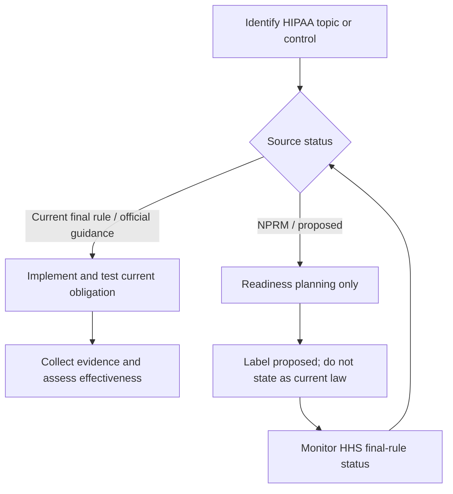
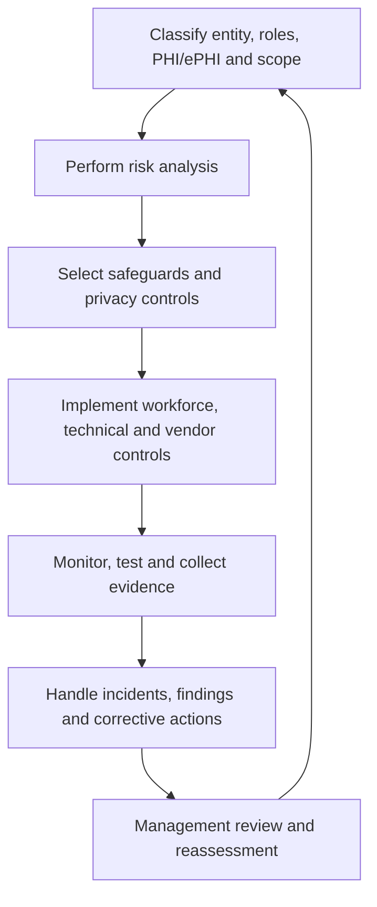
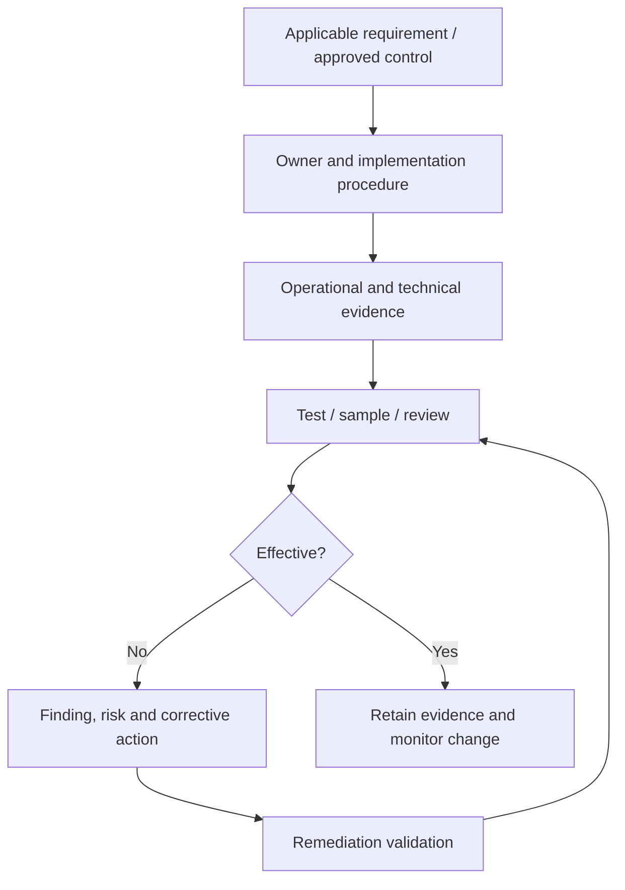

# Manual 06 — HIPAA Implementation and Audit Paths

## Essential

Use for smaller or less complex environments with bounded PHI/ePHI flows. Establish at minimum:

- entity/role classification and accountable owners;
- PHI/ePHI inventory and data-flow map;
- current-law applicability record;
- Security Rule risk analysis and risk-management plan;
- administrative, physical, and technical safeguard evidence;
- workforce authorization/training records;
- business-associate inventory and BAA tracking;
- incident/breach-response workflow;
- documentation and corrective-action records.

## Structured

Use for multi-site, multi-system, cloud-heavy, vendor-dependent, or moderately complex healthcare environments. Add:

- formal data-flow and system-boundary review;
- risk-register linkage to corrective actions;
- periodic access/log review;
- supplier due diligence and evidence refresh;
- documented contingency, backup, restoration, and emergency-mode testing;
- structured breach-assessment records;
- compliance evidence sampling and independent review.

## Enhanced

Use for large, highly regulated, high-volume, complex, or critical healthcare environments. Add:

- enterprise control ownership and second-line assurance;
- broader technical validation and continuous monitoring;
- cross-entity/supplier dependency mapping;
- scenario-based incident and breach exercises;
- enhanced data-governance and identity controls;
- formal exception/risk-acceptance governance;
- recurring internal audit and executive oversight;
- change-impact analysis for HHS rulemaking and material technology changes.

## Current law versus proposed rule

**Accessible explanation:** Current final rules and official guidance may drive present implementation. NPRM material is used only for readiness planning, is visibly labeled proposed, and is re-evaluated when HHS changes its status.

## Implementation cycle

**Accessible explanation:** HIPAA implementation is cyclical: define scope and data, analyze risk, implement safeguards and privacy controls, collect evidence, correct deficiencies, and reassess after changes.

## Evidence chain

**Accessible explanation:** Requirements are connected to accountable owners, operating evidence, testing, findings, remediation validation, and retained evidence. A policy by itself is not proof that a safeguard is operating effectively.

## Required implementation areas

The controlled chapter master will expand these areas:

1. Covered entity and business associate determination support.
2. PHI/ePHI inventory, data flows, systems, facilities, workforce, and suppliers.
3. Privacy Rule operational controls, including minimum necessary and permitted uses/disclosures.
4. Security Rule risk analysis and risk management.
5. Administrative safeguards.
6. Physical safeguards.
7. Technical safeguards.
8. Workforce access, authorization, training, sanctions, and termination/change controls.
9. Business Associate Agreements and supplier lifecycle governance.
10. Incident response and breach assessment/notification workflow.
11. Contingency planning, backup, recovery, emergency operations, and testing.
12. Documentation, retention, evidence management, audit testing, and corrective action.
13. Regulatory change monitoring, with proposed rules separated from current law.

## Assurance boundary

This manual will help structure implementation and audit evidence. It will not determine legal status, legal sufficiency, reportability of a breach, or formal compliance for a specific organization. Those determinations require organization-specific facts and qualified human judgment.
