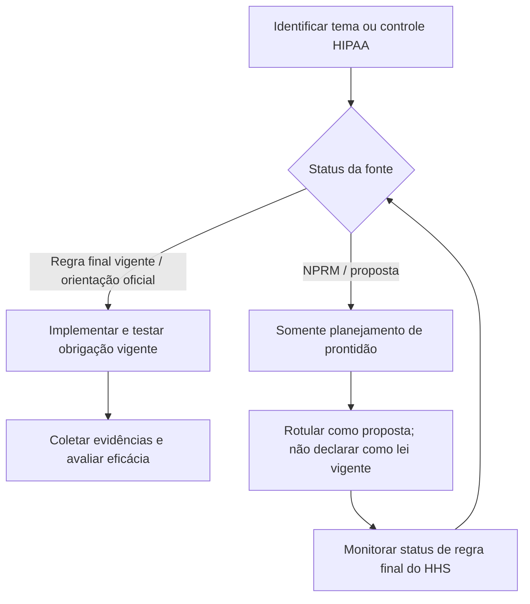
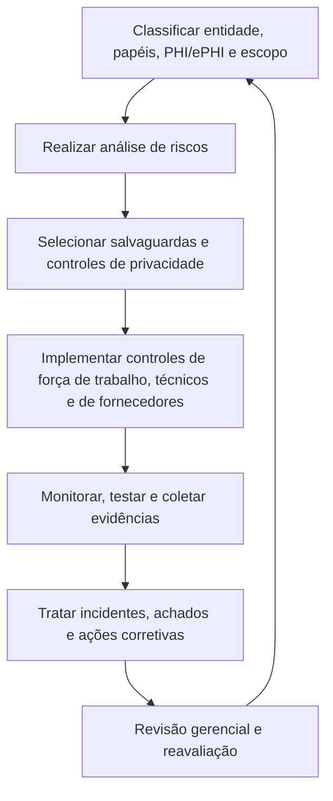
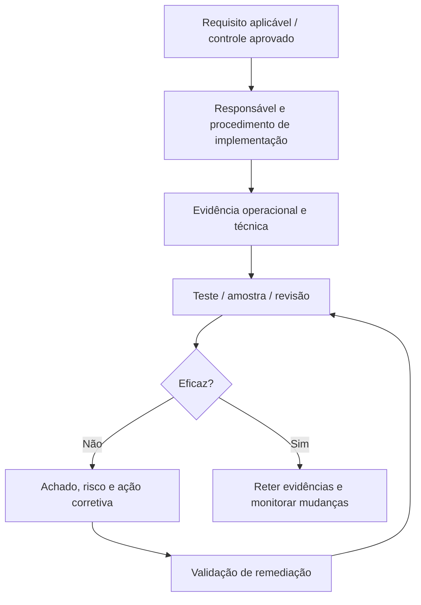

# Manual 06 — Caminhos de implementação e auditoria HIPAA

## Essencial

Use para ambientes menores ou menos complexos com fluxos limitados de PHI/ePHI. Estabeleça no mínimo:

- classificação de entidade/papel e responsáveis;
- inventário de PHI/ePHI e mapa de fluxo de dados;
- registro de aplicabilidade da legislação vigente;
- análise de riscos da Security Rule e plano de gestão de riscos;
- evidências de salvaguardas administrativas, físicas e técnicas;
- registros de autorização/treinamento da força de trabalho;
- inventário de business associates e acompanhamento de BAA;
- fluxo de resposta a incidentes/brechas;
- registros de documentação e ações corretivas.

## Estruturado

Use para ambientes de saúde com múltiplos locais, múltiplos sistemas, forte uso de nuvem, dependência de fornecedores ou complexidade moderada. Acrescente:

- revisão formal de fluxos de dados e limites de sistemas;
- vínculo entre registro de riscos e ações corretivas;
- revisão periódica de acessos e logs;
- due diligence de fornecedores e atualização de evidências;
- testes documentados de contingência, backup, restauração e modo de emergência;
- registros estruturados de avaliação de brechas;
- amostragem de evidências de conformidade e revisão independente.

## Aprimorado

Use para ambientes de saúde grandes, altamente regulados, de alto volume, complexos ou críticos. Acrescente:

- propriedade empresarial de controles e asseguração de segunda linha;
- validação técnica mais ampla e monitoramento contínuo;
- mapeamento de dependências entre entidades e fornecedores;
- exercícios de incidentes e brechas baseados em cenários;
- controles reforçados de governança de dados e identidade;
- governança formal de exceções/aceitação de riscos;
- auditoria interna recorrente e supervisão executiva;
- análise de impacto de mudanças decorrentes de regulamentação do HHS e mudanças tecnológicas materiais.

## Legislação vigente versus regra proposta

**Explicação acessível:** Regras finais vigentes e orientações oficiais podem direcionar a implementação atual. Material de NPRM é usado somente para planejamento de prontidão, é rotulado claramente como proposto e é reavaliado quando o HHS altera seu status.

## Ciclo de implementação

**Explicação acessível:** A implementação de HIPAA é cíclica: definir escopo e dados, analisar riscos, implementar salvaguardas e controles de privacidade, coletar evidências, corrigir deficiências e reavaliar após mudanças.

## Cadeia de evidências

**Explicação acessível:** Os requisitos são conectados a responsáveis, evidência operacional, testes, achados, validação de remediação e evidências retidas. Uma política isoladamente não comprova que uma salvaguarda opere de forma eficaz.

## Áreas obrigatórias de implementação

O mestre controlado de capítulos amplia estas áreas:

1. Suporte à determinação de covered entity e business associate.
2. Inventário de PHI/ePHI, fluxos de dados, sistemas, instalações, força de trabalho e fornecedores.
3. Controles operacionais da Privacy Rule, incluindo minimum necessary e usos/divulgações permitidos.
4. Análise e gestão de riscos da Security Rule.
5. Salvaguardas administrativas.
6. Salvaguardas físicas.
7. Salvaguardas técnicas.
8. Acesso, autorização, treinamento, sanções e controles de desligamento/mudança da força de trabalho.
9. Business Associate Agreements e governança do ciclo de vida de fornecedores.
10. Fluxo de resposta a incidentes e avaliação/notificação de brechas.
11. Planejamento de contingência, backup, recuperação, operações de emergência e testes.
12. Documentação, retenção, gestão de evidências, testes de auditoria e ações corretivas.
13. Monitoramento de mudanças regulatórias, mantendo regras propostas separadas da legislação vigente.

## Limite de asseguração

Este manual ajuda a estruturar implementação e evidências de auditoria. Ele não determina status jurídico, suficiência legal, obrigação de notificar uma brecha ou conformidade formal de uma organização específica. Essas determinações exigem fatos específicos da organização e julgamento humano qualificado.
