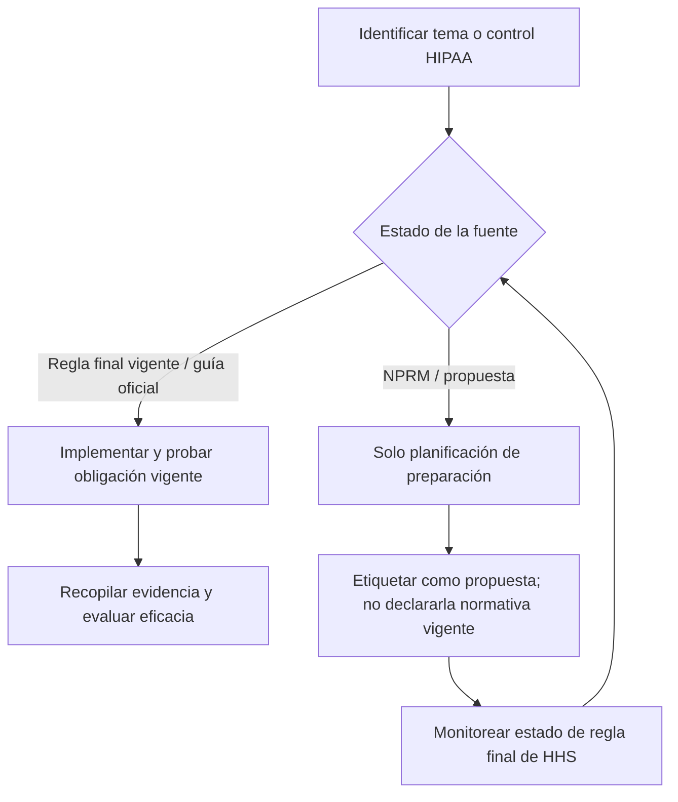
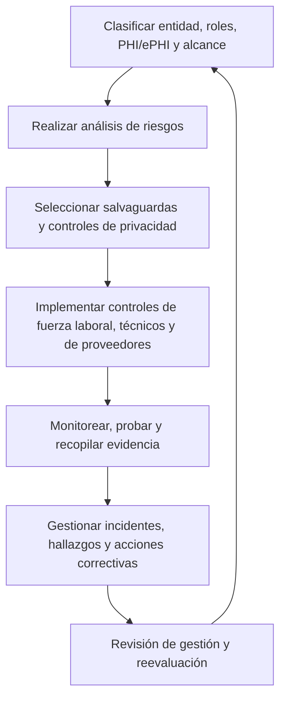
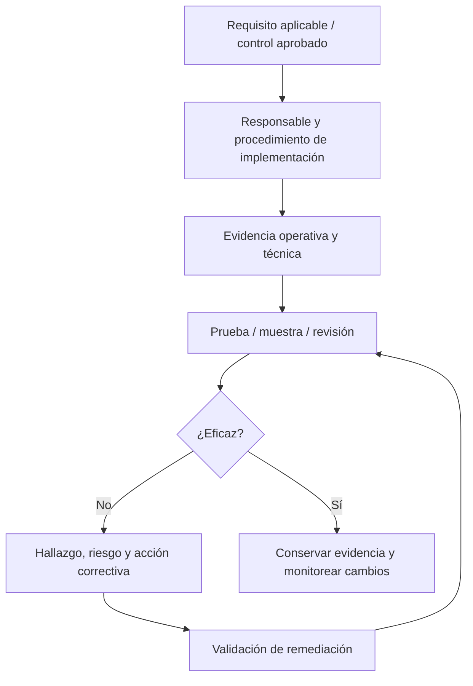

# Manual 06 — Rutas de implementación y auditoría de HIPAA

## Esencial

Úsela para entornos más pequeños o menos complejos con flujos acotados de PHI/ePHI. Establezca como mínimo:

- clasificación de entidad/rol y responsables;
- inventario de PHI/ePHI y mapa de flujo de datos;
- registro de aplicabilidad de la normativa vigente;
- análisis de riesgos de la Security Rule y plan de gestión de riesgos;
- evidencia de salvaguardas administrativas, físicas y técnicas;
- registros de autorización/capacitación de la fuerza laboral;
- inventario de business associates y seguimiento de BAA;
- flujo de respuesta a incidentes/brechas;
- registros de documentación y acciones correctivas.

## Estructurada

Úsela para entornos de salud con múltiples sedes, múltiples sistemas, uso intensivo de nube, dependencia de proveedores o complejidad moderada. Agregue:

- revisión formal de flujos de datos y límites de sistemas;
- vínculo entre registro de riesgos y acciones correctivas;
- revisión periódica de accesos y logs;
- debida diligencia de proveedores y actualización de evidencia;
- pruebas documentadas de contingencia, respaldo, restauración y modo de emergencia;
- registros estructurados de evaluación de brechas;
- muestreo de evidencia de cumplimiento y revisión independiente.

## Mejorada

Úsela para entornos de salud grandes, altamente regulados, de alto volumen, complejos o críticos. Agregue:

- propiedad empresarial de controles y aseguramiento de segunda línea;
- validación técnica más amplia y monitoreo continuo;
- mapeo de dependencias entre entidades y proveedores;
- ejercicios de incidentes y brechas basados en escenarios;
- controles reforzados de gobierno de datos e identidad;
- gobierno formal de excepciones/aceptación de riesgos;
- auditoría interna recurrente y supervisión ejecutiva;
- análisis de impacto de cambios por reglamentación de HHS y cambios tecnológicos materiales.

## Normativa vigente frente a regla propuesta

**Explicación accesible:** Las reglas finales vigentes y la guía oficial pueden impulsar la implementación actual. El material de un NPRM se usa únicamente para planificación de preparación, se etiqueta visiblemente como propuesto y se reevalúa cuando HHS cambia su estado.

## Ciclo de implementación

**Explicación accesible:** La implementación de HIPAA es cíclica: definir alcance y datos, analizar riesgos, implementar salvaguardas y controles de privacidad, recopilar evidencia, corregir deficiencias y reevaluar después de cambios.

## Cadena de evidencia

**Explicación accesible:** Los requisitos se conectan con responsables, evidencia operativa, pruebas, hallazgos, validación de remediación y evidencia conservada. Una política por sí sola no demuestra que una salvaguarda opere eficazmente.

## Áreas de implementación requeridas

El maestro controlado de capítulos amplía estas áreas:

1. Apoyo para determinar covered entity y business associate.
2. Inventario de PHI/ePHI, flujos de datos, sistemas, instalaciones, fuerza laboral y proveedores.
3. Controles operativos de la Privacy Rule, incluido minimum necessary y usos/divulgaciones permitidos.
4. Análisis y gestión de riesgos de la Security Rule.
5. Salvaguardas administrativas.
6. Salvaguardas físicas.
7. Salvaguardas técnicas.
8. Acceso, autorización, capacitación, sanciones y controles de terminación/cambio de la fuerza laboral.
9. Business Associate Agreements y gobierno del ciclo de vida de proveedores.
10. Flujo de respuesta a incidentes y evaluación/notificación de brechas.
11. Planificación de contingencia, respaldo, recuperación, operaciones de emergencia y pruebas.
12. Documentación, retención, gestión de evidencia, pruebas de auditoría y acciones correctivas.
13. Monitoreo de cambios regulatorios, manteniendo las reglas propuestas separadas de la normativa vigente.

## Límite de aseguramiento

Este manual ayuda a estructurar la implementación y la evidencia de auditoría. No determina condición jurídica, suficiencia legal, obligación de reportar una brecha ni cumplimiento formal para una organización específica. Esas determinaciones requieren hechos específicos de la organización y juicio humano calificado.
