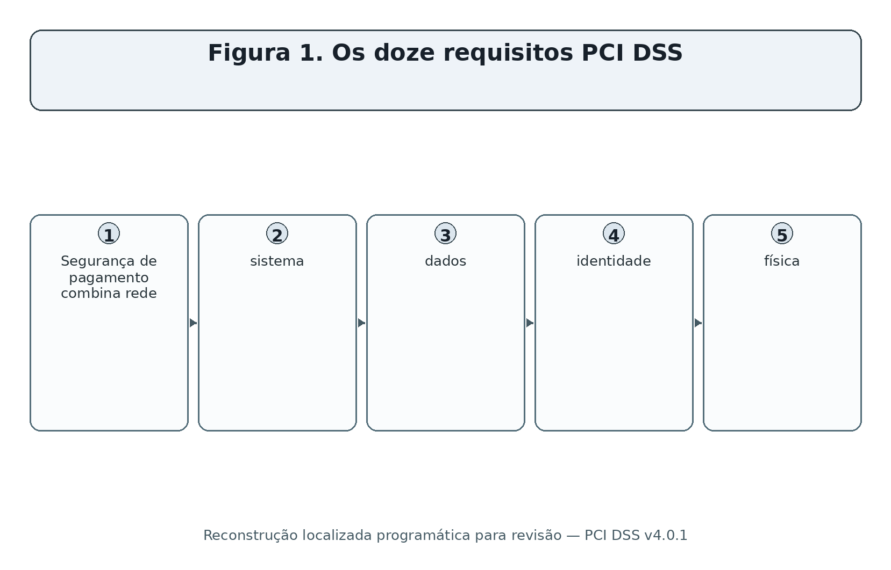
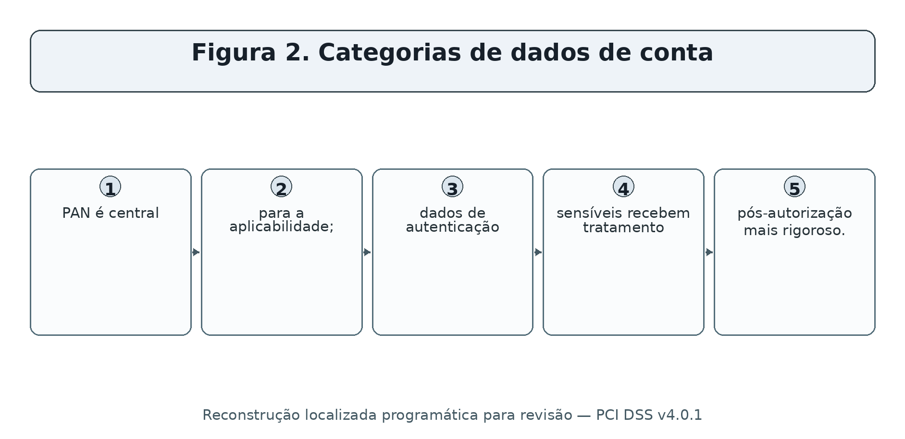
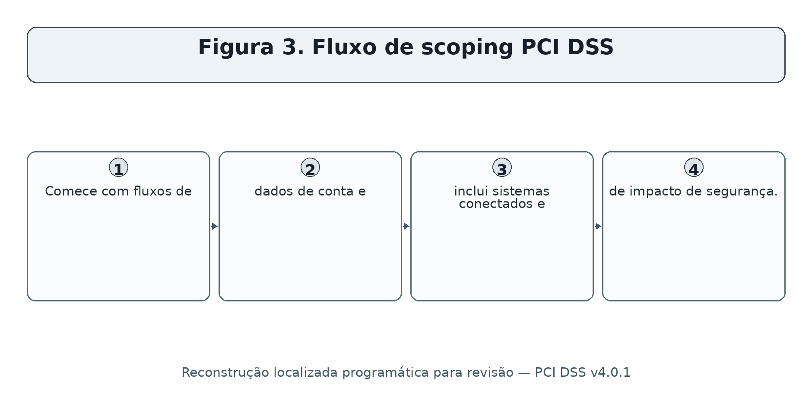
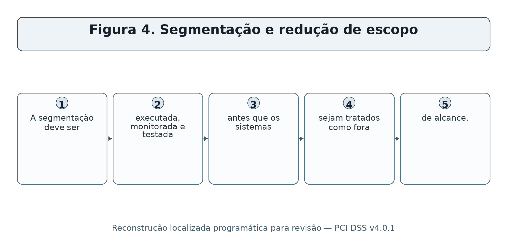
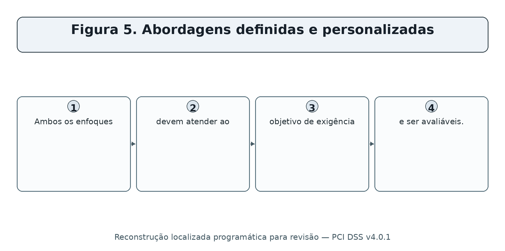
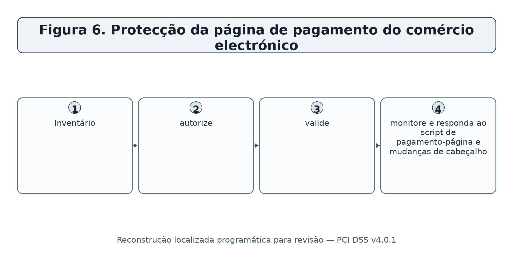
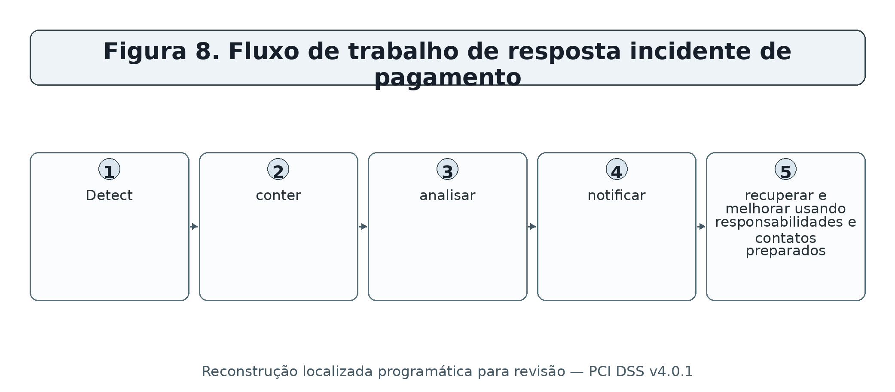
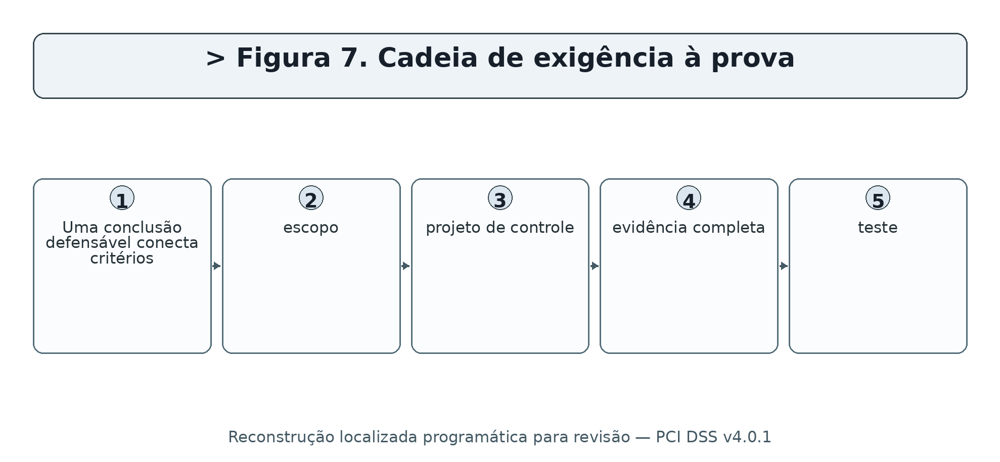
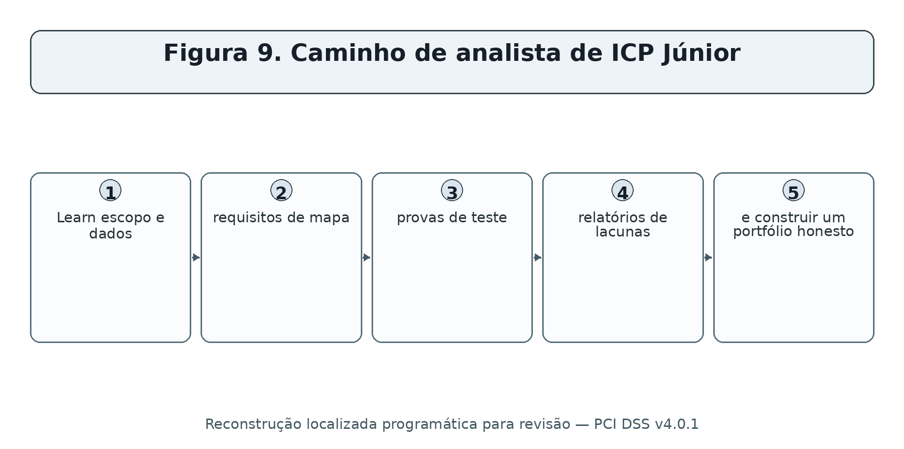

> **Status da revisão:** Rascunho de tradução assistida por máquina. Requer revisão humana de terminologia, significado, links, formatação e atualidade técnica antes de ser marcado como edição final.

** SÉRIES PRÁTICAS DE CIBERSegurança, PRIVACIDADE E COMPLIANÇA

**PCI DSS v4.0.1**

**Segurança de pagamento prática, verificação de conformidade e ferramentas de código aberto **

* Um manual de trabalho para gerentes, analistas júnior, estudantes, profissionais de mudança de carreira, comerciantes e prestadores de serviços*

** Alberto (Al) Leiva**

Primeira edição • Julho de 2026

• todos os 12 requisitos • monitorização • SAQs e ROC • comércio electrónico • provas • ferramentas • laboratórios • preparação para a carreira
----------------------------------------------------------------------------------------------------------------------------------------------------------------------------------------------------------------------------------------------------------------

# Publicação e Aviso de Uso

Autor: Alberto (Al) Leiva

Edição: Primeira Edição, Julho 2026

Objetivo: Educação gratuita e prática para gestores, estudantes, profissionais de mudança de carreira, analistas júnior, comerciantes, provedores de serviços e profissionais de segurança cibernética.

# # Aviso educacional e legal

Este manual fornece educação geral. Não é aconselhamento legal, uma publicação do PCI Security Standards Council, um relatório sobre conformidade, um atestado de conformidade, um questionário de auto-avaliação ou uma garantia de conformidade ou segurança. Apenas a norma oficial e os documentos de validação aplicáveis regem uma avaliação. Marcas de pagamento, adquirentes, clientes, reguladores, contratos e leis podem impor requisitos adicionais.

# # Uso ético e autorizado

Use ferramentas técnicas apenas em sistemas, redes, aplicativos, contas em nuvem, páginas de pagamento e dados que você possui ou estão especificamente autorizados por escrito para avaliar. Use dados sintéticos da conta em laboratórios. Nunca use PAN real, dados de autenticação sensíveis, informações do cliente, credenciais ou sistemas de pagamento de produção em uma demonstração pública ou portfólio.

Prefácio

* Uma introdução acolhedora à segurança de pagamento e conformidade baseada em evidências.*

PCI DSS protege os dados da conta de pagamento através de uma linha de base de requisitos técnicos e operacionais. A parte difícil não é memorizar doze títulos. Trata-se de entender onde os dados da conta fluem, definir o verdadeiro ambiente de dados do titular do cartão, controlar cada sistema que possa afetar sua segurança, aplicar salvaguardas de forma consistente e manter evidências para apoiar cada conclusão.

PCI DSS v4.0.1 é a versão atual suportada pelo PCI SSC. Foi publicado em junho de 2024 como uma revisão limitada para v4.0. Ele não adicionou requisitos e removeu nenhum. PCI DSS v4.0 retirou-se em 31 de dezembro de 2024. As futuras exigências v4.x tornaram-se efetivas em 31 de março de 2025, e agora fazem parte de avaliações.

Este manual é a metodologia-primeiro. Um scanner de vulnerabilidade não substitui uma varredura do Fornecedor de digitalização aprovada. Uma política não prova que opera um controlo. Um acordo de prestação de serviços não elimina a responsabilidade do comerciante de compreender deveres compartilhados. Os gerentes próprio escopo, recursos, risco e remediação; analistas tornam essas decisões mais confiáveis através de provas completas e testes claros.

Como usar este manual

Os gestores devem começar pelos Capítulos 1-5 e 18-20.

Os analistas júnior devem estudar os doze capítulos de exigência, métodos de teste, ferramentas, laboratório e capítulo de entrevista.

As equipes técnicas devem conectar cada achado ao fluxo de dados de conta, escopo CDE, exigência, proprietário, evidência, correção e reteste.

Os comerciantes e prestadores de serviços devem confirmar as instruções de validação com o adquirente, as marcas de pagamento, os clientes, o avaliador e outras entidades que aceitem a conformidade.

*Conteúdo verdadeiro da palavra:** O guia de capítulo abaixo conterá números de página verificados para esta edição. O documento também contém um campo TOC nativo do Word. Depois de editar, clique com o botão direito e selecione Atualizar Campo e, em seguida, Atualizar tabela inteira.
--------------------------------------------------------------------------------------------------------------------------------------------------------------------------------------------------------------------------------------------------------------------------------------------------------------------------------------------------------------------------------------

Sumário

[Comunicação de publicação e utilização [2](#publication-and-use-notice)](#publication-and-use-notice)

[Comunicação educativa e jurídica [2](#educational-and-legal-notice)](#educational-and-legal-notice)

[Utilização ética e autorizada [2](#ethical-and-authorized-use)](#ethical-and-authorized-use)

[Prefácio [3](#preface)](#preface)

[Como usar este manual [4](#how-to-use-this-manual)](#how-to-use-this-manual)

[Quadro de conteúdos [4](#table-of-contents)](#table-of-contents)

[1. Fundação PCI DSS v4.0.1 [8](#pci-dss-v4.0.1-foundations)](#pci-dss-v4.0.1-foundations)

[1.1 Situação actual [8](#current-status)](#current-status)

[1.2 Quem e o que se aplica a [8](#who-and-what-it-applies-to)](#who-and-what-it-applies-to)

[1.3 Os seis objectivos de controlo [8](#the-six-control-goals)](#the-six-control-goals)

[2. Regras de proteção e dados da conta [10](#account-data-and-protection-rules)](#account-data-and-protection-rules)

[2.1 Os métodos de protecção são diferentes [10](#protection-methods-are-different)](#protection-methods-are-different)

[3. Âmbito, CDE e Segmentação [12](#scope-cde-and-segmentation)](#scope-cde-and-segmentation)

[3.1 Descoberta de âmbito [12](#scope-discovery)](#scope-discovery)

[3.2 Validação do âmbito de aplicação [13](#scope-validation)](#scope-validation)

[4. Validação, QAG, ROC, COA e Funções [14](#validation-saqs-roc-aoc-and-roles)](#validation-saqs-roc-aoc-and-roles)

[5. Abordagens definidas, personalizadas, compensatórias e de risco [15](#defined-customized-compensating-and-risk-approaches)](#defined-customized-compensating-and-risk-approaches)

[6. Requisitos 1 — Controlos de segurança da rede [16](#requirement-1-network-security-controls)](#requirement-1-network-security-controls)

[7. Requisitos 2 — Configurações seguras [17](#requirement-2-secure-configurations)](#requirement-2-secure-configurations)

[8. Requisitos 3 — Dados da conta armazenada [18](#requirement-3-stored-account-data)](#requirement-3-stored-account-data)

[9. Requisitos 4 — Criptografia de transmissão [19](#requirement-4-transmission-cryptography)](#requirement-4-transmission-cryptography)

[10. Requisitos 5 — Software malicioso [20](#requirement-5-malicious-software)](#requirement-5-malicious-software)

[11. Requisitos 6 — Sistemas e software seguros [21](#requirement-6-secure-systems-and-software)](#requirement-6-secure-systems-and-software)

[12. Exigência 7 — Necessidade de conhecer as empresas [23](#requirement-7-business-need-to-know)](#requirement-7-business-need-to-know)

[13. Requisitos 8 — Identidade e autenticação [24](#requirement-8-identity-and-authentication)](#requirement-8-identity-and-authentication)

[14. Requisitos 9 — Acesso físico [25](#requirement-9-physical-access)](#requirement-9-physical-access)

[15. Requisitos 10 — Registo e monitorização [26](#requirement-10-logging-and-monitoring)](#requirement-10-logging-and-monitoring)

[16. Requisitos 11 — Ensaios de segurança [27](#requirement-11-security-testing)](#requirement-11-security-testing)

[17. Requisitos 12 — Políticas e Programas [28](#requirement-12-policies-and-programs)](#requirement-12-policies-and-programs)

[18. Ensaios de provas, avaliação e controlo [30](#evidence-assessment-and-control-testing)](#evidence-assessment-and-control-testing)

[18.1 Ensaios práticos [30](#practical-tests)](#practical-tests)

[19. Ferramentas de código aberto para PCI DSS Work [32](#open-source-tools-for-pci-dss-work)](#open-source-tools-for-pci-dss-work)

[19.1 Validação da ferramenta [32](#tool-validation)](#tool-validation)

[19,2 Assistente CISO [32](#ciso-assistant)](#ciso-assistant)

[Início rápido [32](#quick-start)](#quick-start)

[Evidência e limitação [33](#evidence-and-limitation)](#evidence-and-limitation)

[19,3 Wazuh [33](#wazuh)](#wazuh)

[Início rápido [33](#quick-start-1)](#quick-start-1)

[Evidência e limitação [33](#evidence-and-limitation-1)](#evidence-and-limitation-1)

[19.4 osquery [33](#osquery)](#osquery)

[Início rápido [33](#quick-start-2)](#quick-start-2)

[Evidência e limitação [33](#evidence-and-limitation-2)](#evidence-and-limitation-2)

[19.5 OpenSCAP [33](#openscap)](#openscap)

[Início rápido [33](#quick-start-3)](#quick-start-3)

[Evidência e limitação [34](#evidence-and-limitation-3)](#evidence-and-limitation-3)

[19,6 Greenbone Community Edition [34](#greenbone-community-edition)](#greenbone-community-edition)

[Início rápido [34](#quick-start-4)](#quick-start-4)

[Evidência e limitação [34](#evidence-and-limitation-4)](#evidence-and-limitation-4)

[19,7 Nmap [34](#nmap)](#nmap)

[Início rápido [34](#quick-start-5)](#quick-start-5)

[Evidência e limitação [34](#evidence-and-limitation-5)](#evidence-and-limitation-5)

[19.8 Trivy [34](#trivy)](#trivy)

[Início rápido [34](#quick-start-6)](#quick-start-6)

[Evidência e limitação [35](#evidence-and-limitation-6)](#evidence-and-limitation-6)

[19.9 OWASP ZAP [35](#owasp-zap)](#owasp-zap)

[Início rápido [35](#quick-start-7)](#quick-start-7)

[Evidência e limitação [35](#evidence-and-limitation-7)](#evidence-and-limitation-7)

[19.10 ModSecurity + OWASP CRS [35](#modsecurity-owasp-crs)](#modsecurity-owasp-crs)

[Início rápido [35](#quick-start-8)](#quick-start-8)

[Evidência e limitação [35](#evidence-and-limitation-8)](#evidence-and-limitation-8)

[19.11 Suricata [35](#suricata)](#suricata)

[Início rápido [35](#quick-start-9)](#quick-start-9)

[Evidência e limitação [36](#evidence-and-limitation-9)](#evidence-and-limitation-9)

[19.12 Keycloak [36](#keycloak)](#keycloak)

[Início rápido [36](#quick-start-10)](#quick-start-10)

[Evidência e limitação [36](#evidence-and-limitation-10)](#evidence-and-limitation-10)

[19.13 DefectDojo [36](#defectdojo)](#defectdojo)

[Início rápido [36](#quick-start-11)](#quick-start-11)

[Evidência e limitação [36](#evidence-and-limitation-11)](#evidence-and-limitation-11)

[19.14 AIDE [36](#aide)](#aide)

[Início rápido [36](#quick-start-12)](#quick-start-12)

[Evidência e limitação [36](#evidence-and-limitation-12)](#evidence-and-limitation-12)

[19.15 Agente de política aberta [37](#open-policy-agent)](#open-policy-agent)

[Início rápido [37](#quick-start-13)](#quick-start-13)

[Evidência e limitação [37](#evidence-and-limitation-13)](#evidence-and-limitation-13)

[20. Playbook PCI DSS do gestor [38](#managers-pci-dss-playbook)](#managers-pci-dss-playbook)

[20,1 Perguntas mensais [38](#monthly-questions)](#monthly-questions)

[20.2 Painel [38](#dashboard)](#dashboard)

[21. De Iniciante a Analista PCI Júnior [39](#from-beginner-to-junior-pci-analyst)](#from-beginner-to-junior-pci-analyst)

[21.1 Trabalho júnior típico [39](#typical-junior-work)](#typical-junior-work)

[22. Laboratório Fictício e Portfólio [40](#fictional-laboratory-and-portfolio)](#fictional-laboratory-and-portfolio)

[Projecto 1 — Âmbito de aplicação [40](#project-1-scope)](#project-1-scope)

[Projeto 2 — Requisitos [40](#project-2-requirements)](#project-2-requirements)

[Projeto 3 — Dados [40](#project-3-data)](#project-3-data)

[Projeto 4 — Acesso [40](#project-4-access)](#project-4-access)

[Projeto 5 — Vulnerabilidades [40](#project-5-vulnerabilities)](#project-5-vulnerabilities)

[Projeto 6 — Comércio electrónico [40](#project-6-e-commerce)](#project-6-e-commerce)

[Projeto 7 — Incidente [40](#project-7-incident)](#project-7-incident)

[Projecto 8 — Relatório de gestão [40](#project-8-management-report)](#project-8-management-report)

[23. Plano de aprendizagem de trinta dias [41](#thirty-day-learning-plan)](#thirty-day-learning-plan)

[24. Preparação da entrevista [42](#interview-preparation)](#interview-preparation)

[Qual é a versão atual do PCI DSS? [42](#what-is-the-current-pci-dss-version)](#what-is-the-current-pci-dss-version)

[O que é o CDE? [42](#what-is-the-cde)](#what-is-the-cde)

[O que é PAN? [42](#what-is-pan)](#what-is-pan)

[Podem ser armazenados dados de autenticação sensíveis se criptografados? [42](#can-sensitive-authentication-data-be-stored-if-encrypted)](#can-sensitive-authentication-data-be-stored-if-encrypted)

[O que é segmentação? [42](#what-is-segmentation)](#what-is-segmentation)

[Definida versus abordagem personalizada? [42] (#defined-versus-customized-approach)] (#defined-versus-customized-approach)

[Uma pesquisa de código aberto substitui a digitalização ASV? [42](#does-an-open-source-scan-replace-asv-scanning)](#does-an-open-source-scan-replace-asv-scanning)

[Como você verifica um requisito? [42](#how-do-you-verify-a-requirement)](#how-do-you-verify-a-requirement)

[Quem determina o nível de validação de um comerciante? [42](#who-determines-a-merchants-validation-level)](#who-determines-a-merchants-validation-level)

[O que mudou para o e-commerce? [43](#what-changed-for-e-commerce)](#what-changed-for-e-commerce)

[25. Modelos, Glossário e Índice [44](#templates-glossary-and-index)](#templates-glossary-and-index)

[25.1 Registo de âmbito [44](#scope-record)](#scope-record)

[25.2 Registo de elementos de prova do requisito [44](#requirement-evidence-record)](#requirement-evidence-record)

[25.3 Glossário [44](#glossary)](#glossary)

[25,4 Índice de assunto [45](#subject-index)](#subject-index)

[26. Referências oficiais e estudo complementar [46](#official-references-and-further-study)](#official-references-and-further-study)

# 1. PCI DSS v4.0.1 Fundações

* O padrão atual, aplicabilidade, objetivos e limitações importantes.*

Figura 1. Os doze requisitos PCI DSS

## 1.1 Situação actual

- PCI DSS v4.0.1 foi publicado em 11 de Junho de 2024, como uma revisão limitada.

- A revisão esclareceu e corrigiu v4.0; não adicionou nem suprimiu requisitos.

- PCI DSS v4.0 reformado 31 de Dezembro de 2024.

- Os 51 requisitos futuros tornaram-se efetivos 31 de março de 2025.

- A partir da publicação de julho de 2026 deste manual, o PCI SSC está reunindo comentários das partes interessadas sobre v4.0.1; um pedido de comentários não é um novo padrão final.

# 1.2 Quem e o que se aplica a

PCI DSS aplica-se a entidades que armazenam, processam ou transmitem dados do titular do cartão ou dados de autenticação sensíveis, e a entidades cujos sistemas possam afetar a segurança do ambiente de dados do titular do cartão. Os comerciantes, os transformadores, os adquirentes, os emitentes e os prestadores de serviços podem ter funções de validação e comunicação de informações diferentes.

## 1.3 Os seis objetivos de controle

. . . . . . . . .
□----------------------------------------------------------------------------------
Criar e manter uma rede e sistemas seguros
Proteger os dados da conta
Manter um programa de gestão de vulnerabilidades
□ Aplicar medidas fortes de controlo do acesso
• Monitorar e testar regularmente as redes
Manter uma política de segurança da informação

# 2. Regras de Proteção e Dados da Conta

*A diferença entre dados do titular do cartão, PAN e dados de autenticação sensíveis.*

Figura 2. Categorias de dados de conta

Dados** Tipo** Regra chave**
--------------------------------------------------------------------------
□ Número primário da conta (PAN) ● Dados do titular do cartão □ Determina a aplicabilidade do PCI DSS quando armazenado, processado ou transmitido
Nome do titular do cartão Dados do titular do cartão
□ Data de expiração; Dados do titular do cartão;
□ Código de serviço; dados do titular do cartão;
Dados completos da via .. Dados de autenticação sensíveis .. Não armazenar após a autorização exceto o uso expressamente permitido do emitente ..
O código/valor da verificação do cartão
Bloqueio de PIN/PIN

## 2.1 Métodos de proteção são diferentes

- Mascaramento limita o quanto PAN é exibido.

- Truncation remove permanentemente um segmento de PAN sob formatos definidos.

- Encriptação torna os dados ilegíveis sem chaves criptográficas protegidas.

- O Hashing pode tornar o PAN ilegível quando implementado com os controles e hashing criptográfico chaveados apropriados.

- Tokenization substitui PAN por um valor, mas sistemas tokenization e caminhos de destokenization podem permanecer no escopo.

- Redaction remove informações de uma cópia ou visualização; confirme que dados de origem e metadados ocultos também são controlados.

Nunca use dados reais no treinamento:** Use números de teste de pagamento-processador ou valores inventados que não podem ser confundidos com contas reais. Nunca retenha SAD real após autorização.
□------------------------------------------------------------------------------------------------------------------------------------------------------------------------------------------------------------------------------------------------------------------

# 3. Escopo, CDE e Segmentação

* Como encontrar cada pessoa, processo, tecnologia e dependência que pertence ao escopo.*

Figura 3. Fluxo de scoping PCI DSS

## 3.1 Descoberta de escopo

1. Identifique todos os canais de pagamento: e-commerce, ponto de venda, correio / telefone ordem, cobrança recorrente, call center, móvel, quiosques, e serviços terceirizados.

2. Trace dados da conta da coleta através de autorização, liquidação, armazenamento, relatórios, suporte, backups, registros, eliminação e terceiros.

3. Identificar sistemas CDE, pessoas, processos, instalações, serviços de nuvem, aplicações, bases de dados, dispositivos de rede, serviços de segurança e caminhos administrativos.

4. Identificar sistemas conectados e sistemas que podem afetar a segurança do CDE, incluindo identidade, DNS, tempo, registro, implantação, backup, virtualização, monitoramento e plataformas de gerenciamento.

5. Identificar os controles de segmentação e todos os caminhos que poderiam contorná-los.

6. Confirme responsabilidades de terceiros, provas e locais.

7. Exclusões de documentos, suposições, diagramas, inventários e resultados de validação.

Figura 4. Segmentação e redução de escopo

## 3.2 Validação do escopo

Validar o âmbito pelo menos anualmente e após alterações significativas. Os prestadores de serviços realizam a confirmação documentada do âmbito pelo menos uma vez a cada seis meses e após alterações significativas. Testes devem tentar encontrar lojas de dados desconhecidas, caminhos alternativos, ativos não gerenciados, serviços compartilhados, dependências de nuvem, conexões sem fio e acesso administrativo.

# 4. Validação, SAQs, ROC, AOC e Funções

*Choosing o caminho correto do relatório e compreensão de quem o aceita.*

** ** Artefacto ou papel** ** ** Uso** ** Limitação importante**
----------------------------------------------------------------------------------------------
□ SAQ A □ Elegível totalmente terceirizado card-not-presente ambientes mercantes □ Elegibilidade é estrita; o comerciante ainda gerencia o site aplicável, provedor de serviços e deveres de política
Mais requisitos aplicam-se porque a página mercante pode afetar a transação
- SAQ B / B-IP - Impressão elegível ou ambientes terminais autônomos específicos - Não para comércio eletrônico; a elegibilidade deve ser exata
□ SAQ C / C-VT □ Aplicação de pagamento elegível ou ambientes terminais virtuais isolados
Os comerciantes elegíveis usando uma solução P2PE PCI listada só podem utilizar e qualificar a solução validada
• SAQ D Merchant • Comerciantes não elegíveis para um SAQ mais curto ou orientados a utilizá-lo
□ SAQ D Prestador de serviços □ Prestadores de serviços autorizados a auto-avaliar onde aceites □ Requisitos de prestação de serviços e responsabilidades do cliente
Relatório de avaliação detalhado, geralmente completado por um QSA ou ISA, quando necessário.
. . . . . . . . . . . . .
Varredura aprovada pelo PCI SSC para escaneamento de vulnerabilidade externa necessária .
• QSA / ISA • Avaliador ou avaliador interno qualificado

*Quem decide a validação:** As marcas de pagamento e adquirentes estabelecem níveis de validação de mercadores e informam expectativas. Clientes e contratos podem estabelecer expectativas de prestador de serviços. Confirme o método necessário antes do início.
-----------------------------------------------------------------------------------------------------------------------------------------------------------------------------------------------------------------------------------------------------------------------------------------------------------------------------------------------------------------------

# 5. Abordagens definidas, personalizadas, compensadoras e de risco

* Compreender a flexibilidade sem enfraquecer o objetivo da exigência.*

Figura 5. Abordagens definidas e personalizadas

* ** ** ** ** ** ** ** ** ** ** ** **
-----------------------------------------------------------------------------------------------------------------------------------------------------------------------------------
Abordagem definida A entidade aplica o requisito declarado .
Abordagem personalizada A entidade projeta um controle diferente que atenda ao objetivo personalizado ..Matriz de controle, análise de risco, projeto, dependências, teste, evidência operacional, validação do avaliador ..
□ Compensar o controle Uma restrição técnica ou empresarial legítima impede o requisito declarado □ Restrição, objetivo, risco adicional, controle compensador, manutenção, validação, revisão anual
• Análise de risco orientada — frequência • Um requisito permite que a entidade defina com que frequência ocorre uma actividade • Activos, ameaças, verossimilhança, impacto, lógica, frequência, proprietário, aprovação, revisão anual
Análise de risco orientada — customized – Suporta projeto e validação de controle personalizado – Ameaças, pressupostos, objetivo de controle, projeto, risco residual, evidência, teste

A abordagem personalizada não é suportada em cada SAQ ou contexto de exigência.

Um controle compensador não é um atalho para o custo ou conveniência.

A análise de risco orientada não elimina um requisito; apoia uma decisão autorizada.

Confirmar a aceitação e as expectativas do avaliador antes de se comprometer com uma abordagem.

# 6. Requerimento 1 — Controles de Segurança de Rede

* Instalar e manter os controles de segurança da rede *

Finalidade do requisito:** Instalar e manter os controles de segurança da rede
--------------------------------------------------------------------------------------------------------------------------------

Grupo** Grupo** Significado plano** Foco de verificação** Exemplo de evidência**
-------------------------------------------------------------------------------------------------------------------------------------------------------------------------------------------------------------------------------------------------------------------------------------------------------------------------------------------------------------------------------------
□ 1.1 □ Defina, atribua e documente os processos e funções usados para atender o requisito 1. □ Confirme o escopo, propriedade, projeto, implementação, evidência operacional, exceções, correção e reteste. Diagramas de rede, fluxos de dados, conjuntos de regras, aprovações, revisões de seis meses, exportações de configuração
Configura controles de segurança de rede com regras, padrões, diagramas, revisões e controle de mudança aprovados. Confirmar escopo, propriedade, design, implementação, evidência operacional, exceções, correção e reteste. Diagramas de rede, fluxos de dados, conjuntos de regras, aprovações, revisões de seis meses, exportações de configuração
□ 1.3 □ Restrinja o tráfego de entrada e saída para o ambiente de dados do titular do cartão para o que é necessário. Confirmar escopo, propriedade, design, implementação, evidência operacional, exceções, correção e reteste. Diagramas de rede, fluxos de dados, conjuntos de regras, aprovações, revisões de seis meses, exportações de configuração
□ 1.4 □ Controle as conexões entre redes confiáveis e não confiáveis, incluindo proteções anti-espoofing e divulgação. Confirmar escopo, propriedade, design, implementação, evidência operacional, exceções, correção e reteste. Diagramas de rede, fluxos de dados, conjuntos de regras, aprovações, revisões de seis meses, exportações de configuração
Proteger dispositivos de computação que se conectam a redes não confiáveis e ao CDE. Confirmar escopo, propriedade, design, implementação, evidência operacional, exceções, correção e reteste. Diagramas de rede, fluxos de dados, conjuntos de regras, aprovações, revisões de seis meses, exportações de configuração

** Nota de avaliação: ** Use o texto oficial PCI DSS v4.0.1 e o modelo de relatório aplicável para requisitos exatos, notas de aplicabilidade, procedimentos de teste, opções de resposta e documentação. Este manual explica; não substitui o padrão.

# 7. Requerimento 2 — Configurações seguras

*Aplicar configurações seguras para todos os componentes do sistema *

** finalidade do requisito:** Aplicar configurações seguras em todos os componentes do sistema
---------------------------------------------------------------------------------------------

Grupo** Grupo** Significado plano** Foco de verificação** Exemplo de evidência**
--------------------------------------------------------------------------------------------------------------------------------------------------------------------------------------------------------------------------------------------------------------------------------------------------------------------------------------------------------------------
2.1 Defina, atribua e documente processos e funções de configuração segura. Confirmar escopo, propriedade, design, implementação, evidência operacional, exceções, correção e reteste. Normas de configuração, inventários, escaneamentos de endurecimento, conta padrão e revisões de serviços
2.2 Desenvolver e aplicar padrões de configuração; remover padrões, serviços desnecessários e configurações inseguras. Confirmar escopo, propriedade, design, implementação, evidência operacional, exceções, correção e reteste. Normas de configuração, inventários, escaneamentos de endurecimento, conta padrão e revisões de serviços
□ 2.3 □ Ambientes sem fio seguros com padrões alterados, criptografia forte e configurações gerenciadas. Confirmar escopo, propriedade, design, implementação, evidência operacional, exceções, correção e reteste. Normas de configuração, inventários, escaneamentos de endurecimento, conta padrão e revisões de serviços

** Nota de avaliação: ** Use o texto oficial PCI DSS v4.0.1 e o modelo de relatório aplicável para requisitos exatos, notas de aplicabilidade, procedimentos de teste, opções de resposta e documentação. Este manual explica; não substitui o padrão.

# 8. Requisitos 3 — Dados da Conta Armazenada

*Protect Dados de Conta Armazenados *

**Obrigatório:**Proteger Dados de Conta Armazenados
----------------------

Grupo** Grupo** Significado plano** Foco de verificação** Exemplo de evidência**
-------------------------------------------------------------------------------------------------------------------------------------------------------------------------------------------------------------------------------------------------------------------------------------------------------------------------------------------------------------------------------------------------
□ 3.1 □ Definir, atribuir e documentar processos e funções de proteção de dados armazenados-conta. Confirmar escopo, propriedade, design, implementação, evidência operacional, exceções, correção e reteste. Inventário de dados, calendário de retenção, resultados de descoberta, criptografia e registros de gerenciamento de chaves
□ 3.2 □ Minimize o armazenamento de dados de conta através da retenção, exclusão segura e descoberta de localização de dados. Confirmar escopo, propriedade, design, implementação, evidência operacional, exceções, correção e reteste. Inventário de dados, calendário de retenção, resultados de descoberta, criptografia e registros de gerenciamento de chaves
Nunca reter dados de autenticação sensíveis após a autorização, mesmo quando criptografados, exceto casos de emitente permitidos. Confirmar escopo, propriedade, design, implementação, evidência operacional, exceções, correção e reteste. Inventário de dados, calendário de retenção, resultados de descoberta, criptografia e registros de gerenciamento de chaves
.4 .4 .4 Limitar displays e copiar remotamente ou recolocar o PAN completo para pessoas com uma necessidade documentada. Confirmar escopo, propriedade, design, implementação, evidência operacional, exceções, correção e reteste. Inventário de dados, calendário de retenção, resultados de descoberta, criptografia e registros de gerenciamento de chaves
□ 3.5 □ Render armazenado PAN ilegível usando métodos aprovados e proteger quaisquer mecanismos relacionados. Confirmar escopo, propriedade, design, implementação, evidência operacional, exceções, correção e reteste. Inventário de dados, calendário de retenção, resultados de descoberta, criptografia e registros de gerenciamento de chaves
Proteger chaves criptográficas usadas para proteger dados de conta armazenados. Confirmar escopo, propriedade, design, implementação, evidência operacional, exceções, correção e reteste. Inventário de dados, calendário de retenção, resultados de descoberta, criptografia e registros de gerenciamento de chaves
Opere processos completos de ciclo de vida de gestão de chaves. Confirmar escopo, propriedade, design, implementação, evidência operacional, exceções, correção e reteste. Inventário de dados, calendário de retenção, resultados de descoberta, criptografia e registros de gerenciamento de chaves

** Nota de avaliação: ** Use o texto oficial PCI DSS v4.0.1 e o modelo de relatório aplicável para requisitos exatos, notas de aplicabilidade, procedimentos de teste, opções de resposta e documentação. Este manual explica; não substitui o padrão.

Proibição crítica:** Dados de autenticação sensíveis não devem ser armazenados após a autorização, mesmo quando criptografados, exceto quando PCI DSS expressamente permite o emissor ou o uso de suporte de emissão.
-----------------------------------------------------------------------------------------------------------------------------------------------------------------------------------------------------------------------------------------------------------------------------------------------------------------------------------------------------------------------------------------------------------------------------------------------------------

# 9. Requerimento 4 — Criptografia de Transmissão

*Proteger dados do titular do cartão com forte criptografia durante a transmissão sobre redes públicas abertas *

**Propósito do requisito:**Proteger dados do titular do cartão com criptografia forte durante a transmissão sobre redes públicas abertas
-------------------------------------------------------------------------------------------------------------------------------------------------------------------------------------------------------------------------------------------------------------------------------------------------------------------------------------------------------------------------------------------------------------------------------------------

Grupo** Grupo** Significado plano** Foco de verificação** Exemplo de evidência**
-------------------------------------------------------------------------------------------------------------------------------------------------------------------------------------------------------------------------------------------------------------------------------------------------------------
□ 4.1 □ Definir, atribuir e documentar processos e funções de proteção à transmissão. Confirmar escopo, propriedade, design, implementação, evidência operacional, exceções, correção e reteste. Fluxos de dados, configuração de protocolo e certificado, testes de transmissão, inventário de certificados
□ 4.2 □ Use criptografia forte e chaves ou certificados confiáveis sempre que o PAN cruzar redes públicas abertas. Confirmar escopo, propriedade, design, implementação, evidência operacional, exceções, correção e reteste. Fluxos de dados, configuração de protocolo e certificado, testes de transmissão, inventário de certificados

** Nota de avaliação: ** Use o texto oficial PCI DSS v4.0.1 e o modelo de relatório aplicável para requisitos exatos, notas de aplicabilidade, procedimentos de teste, opções de resposta e documentação. Este manual explica; não substitui o padrão.

# 10. Requerimento 5 — Software Maléfico

*Proteger todos os sistemas e redes de software malicioso *

O objetivo do requisito:** Proteja todos os sistemas e redes do software malicioso
□-----------------------------------------------------------------------------------------------------------------

Grupo** Grupo** Significado plano** Foco de verificação** Exemplo de evidência**
--------------------------------------------------------------------------------------------------------------------------------------------------------------------------------------------------------------------------------------------------------------------------------------------------------------------------------------------------------------------------------------------------------------------
Defina, atribua e documente processos e funções anti-malware. Confirmar escopo, propriedade, design, implementação, evidência operacional, exceções, correção e reteste. Avaliações de risco de malware, cobertura de agentes, políticas, alertas, atualizações, controles de phishing .
□ 5.2 □ Prevenir, detectar e remover malware em sistemas comumente afetados ou periodicamente avaliados como não em risco. Confirmar escopo, propriedade, design, implementação, evidência operacional, exceções, correção e reteste. Avaliações de risco de malware, cobertura de agentes, políticas, alertas, atualizações, controles de phishing .
□ 5.3 □ Mantenha os mecanismos anti-malware ativos, atuais, protegidos, registrados, monitorados e limitados à deficiência autorizada. Confirmar escopo, propriedade, design, implementação, evidência operacional, exceções, correção e reteste. Avaliações de risco de malware, cobertura de agentes, políticas, alertas, atualizações, controles de phishing .
Use mecanismos automatizados e processos de treinamento para proteger o pessoal de ataques de phishing. Confirmar escopo, propriedade, design, implementação, evidência operacional, exceções, correção e reteste. Avaliações de risco de malware, cobertura de agentes, políticas, alertas, atualizações, controles de phishing .

** Nota de avaliação: ** Use o texto oficial PCI DSS v4.0.1 e o modelo de relatório aplicável para requisitos exatos, notas de aplicabilidade, procedimentos de teste, opções de resposta e documentação. Este manual explica; não substitui o padrão.

# 11. Exigência 6 — Sistemas seguros e software

* Desenvolver e manter sistemas seguros e software *

**Propósito de exigência:**Desenvolva e mantenha sistemas seguros e software
-------------------------------------------------------------------------------------------------------------------------------------------------------------------------------------------------------------------------------------------------------------------------------------------------------------

Grupo** Grupo** Significado plano** Foco de verificação** Exemplo de evidência**
-----------------------------------------------------------------------------------------------------------------------------------------------------------------------------------------------------------------------------------------------------------------------------------------------------------------------------------------------------------------------------------------------------------------------------------------
□ 6.1 □ Defina, atribua e documente processos e funções de sistema seguro e software. Confirmar escopo, propriedade, design, implementação, evidência operacional, exceções, correção e reteste. Inventário de software, registros SDLC, revisão de código, resultados de varredura, patches, scripts, tickets de mudança .
6.2 Desenvolver software sob medida e personalizado com segurança, com equipe treinada, avaliações, testes e prevenção de falhas. Confirmar escopo, propriedade, design, implementação, evidência operacional, exceções, correção e reteste. Inventário de software, registros SDLC, revisão de código, resultados de varredura, patches, scripts, tickets de mudança .
6.3 □ Identificar, priorizar e abordar vulnerabilidades; manter inventários de software e aplicar patches de segurança. Confirmar escopo, propriedade, design, implementação, evidência operacional, exceções, correção e reteste. Inventário de software, registros SDLC, revisão de código, resultados de varredura, patches, scripts, tickets de mudança .
Proteger aplicações web voltadas para o público e gerenciar todos os scripts de página de pagamento. Confirmar escopo, propriedade, design, implementação, evidência operacional, exceções, correção e reteste. Inventário de software, registros SDLC, revisão de código, resultados de varredura, patches, scripts, tickets de mudança .
6.5 Gerencie as alterações nos sistemas, software e o ambiente de produção com segurança. Confirmar escopo, propriedade, design, implementação, evidência operacional, exceções, correção e reteste. Inventário de software, registros SDLC, revisão de código, resultados de varredura, patches, scripts, tickets de mudança .

** Nota de avaliação: ** Use o texto oficial PCI DSS v4.0.1 e o modelo de relatório aplicável para requisitos exatos, notas de aplicabilidade, procedimentos de teste, opções de resposta e documentação. Este manual explica; não substitui o padrão.

Figura 6. Protecção da página de pagamento do comércio electrónico

Os requisitos 6.4.3 e 11.6.1 são agora eficazes. Manter um inventário e negócio ou justificação técnica para scripts de pagamento-página, autorizá-los, garantir a sua integridade, e implantar a detecção de mudança/tamper para páginas relevantes e cabeçalhos HTTP pelo menos com a frequência necessária ou suportado pela análise de risco alvo permitida.

# 12. Exigência 7 — Necessidade de Negócios

*Restringir o acesso aos componentes do sistema e dados do titular do cartão por necessidade de conhecimento do negócio*

Finalidade do requisito:** Restrinja o acesso aos componentes do sistema e aos dados do titular do cartão pela necessidade do negócio de saber
-------------------------------------------------------------------------------------------------------------------------

Grupo** Grupo** Significado plano** Foco de verificação** Exemplo de evidência**
------------------------------------------------------------------------------------------------------------------------------------------------------------------------------------------------------------------------------------------------------------------------------------------------------------------------------------------
□ 7.1 □ Definir, atribuir e documentar processos e funções de controle de acesso. Confirmar escopo, propriedade, design, implementação, evidência operacional, exceções, correção e reteste. O papel matriz, aprovações, exportações de acesso, revisões, nega testes, evidência de remoção
□ 7.2 □ Defina, aprove, atribua, execute e reveja o acesso de acordo com a necessidade de emprego, menos privilégio e negue por padrão. Confirmar escopo, propriedade, design, implementação, evidência operacional, exceções, correção e reteste. O papel matriz, aprovações, exportações de acesso, revisões, nega testes, evidência de remoção
Gerenciar contas de aplicativos e sistemas e seu acesso de acordo com a necessidade e risco de negócios. Confirmar escopo, propriedade, design, implementação, evidência operacional, exceções, correção e reteste. O papel matriz, aprovações, exportações de acesso, revisões, nega testes, evidência de remoção

** Nota de avaliação: ** Use o texto oficial PCI DSS v4.0.1 e o modelo de relatório aplicável para requisitos exatos, notas de aplicabilidade, procedimentos de teste, opções de resposta e documentação. Este manual explica; não substitui o padrão.

# 13. Requerimento 8 — Identidade e Autenticação

*Identifique usuários e autentique o acesso aos componentes do sistema*

** finalidade do requisito:** Identificar usuários e Autenticar o acesso aos componentes do sistema
---------------------------------------

Grupo** Grupo** Significado plano** Foco de verificação** Exemplo de evidência**
------------------------------------------------------------------------------------------------------------------------------------------------------------------------------------------------------------------------------------------------------------------
□ 8.1 □ Definir, atribuir e documentar os processos e funções de identidade e autenticação. Confirmar escopo, propriedade, design, implementação, evidência operacional, exceções, correção e reteste. População de identidade, registros de conta, configurações de senha e MFA, logs de autenticação e testes
Use identidades únicas e gerencie o ciclo de vida completo da conta do usuário. Confirmar escopo, propriedade, design, implementação, evidência operacional, exceções, correção e reteste. População de identidade, registros de conta, configurações de senha e MFA, logs de autenticação e testes
Use fatores fortes de autenticação, redefinições seguras, lockouts, regras de senha/passfrase e credenciais protegidas. Confirmar escopo, propriedade, design, implementação, evidência operacional, exceções, correção e reteste. População de identidade, registros de conta, configurações de senha e MFA, logs de autenticação e testes
□ 8.4 □ Implementar autenticação multifatorial para acesso CDE e acesso remoto aplicável. Confirmar escopo, propriedade, design, implementação, evidência operacional, exceções, correção e reteste. População de identidade, registros de conta, configurações de senha e MFA, logs de autenticação e testes
Configura sistemas MFA para resistir ao bypass e ao mau uso. Confirmar escopo, propriedade, design, implementação, evidência operacional, exceções, correção e reteste. População de identidade, registros de conta, configurações de senha e MFA, logs de autenticação e testes
□ 8.6 □ Gerencie rigorosamente os fatores de uso, sistema e conta compartilhada. Confirmar escopo, propriedade, design, implementação, evidência operacional, exceções, correção e reteste. População de identidade, registros de conta, configurações de senha e MFA, logs de autenticação e testes

** Nota de avaliação: ** Use o texto oficial PCI DSS v4.0.1 e o modelo de relatório aplicável para requisitos exatos, notas de aplicabilidade, procedimentos de teste, opções de resposta e documentação. Este manual explica; não substitui o padrão.

• ** Aviso de autenticação: ** O requisito 8 contém regras detalhadas para IDs exclusivos, contas inativas e encerradas, senhas/passfrases fortes, MFA, contas de serviço, fatores de autenticação e reset seguro. Verificar a aplicabilidade exata no padrão oficial.
----------------------------------------------------------------------------------------------------------------------------------------------------------------------------------------------------

# 14. Requerimento 9 — Acesso físico

* Restrinja o acesso físico aos dados do titular do cartão

**Obrigatório:** Restrinja o acesso físico aos dados do titular do cartão
-------------------------------------------------------------------------

Grupo** Grupo** Significado plano** Foco de verificação** Exemplo de evidência**
----------------------------------------------------------------------------------------------------------------------------------------------------------------------------------------------------------------------------------------------------------------------------------------------------------------------------------------------------------------------
□ 9.1 □ Definir, atribuir e documentar processos e funções de segurança física. Confirmar escopo, propriedade, design, implementação, evidência operacional, exceções, correção e reteste. Emblemas e registros de visitantes, registros de câmera, inventário de mídia, prova de destruição, inspeções POI
• 9.2 Use controles de entrada e monitoramento adequados para instalações e áreas sensíveis. Confirmar escopo, propriedade, design, implementação, evidência operacional, exceções, correção e reteste. Emblemas e registros de visitantes, registros de câmera, inventário de mídia, prova de destruição, inspeções POI
Autorizar, identificar, monitorar e revogar prontamente o pessoal e o acesso do visitante. Confirmar escopo, propriedade, design, implementação, evidência operacional, exceções, correção e reteste. Emblemas e registros de visitantes, registros de câmera, inventário de mídia, prova de destruição, inspeções POI
□ 9.4 □ Classifique, armazenar, mover, copiar, destruir e rastrear mídia contendo dados do titular do cartão de forma segura. Confirmar escopo, propriedade, design, implementação, evidência operacional, exceções, correção e reteste. Emblemas e registros de visitantes, registros de câmera, inventário de mídia, prova de destruição, inspeções POI
□ 9.5 □ Proteger os dispositivos de ponto de interação contra adulteração e substituição. Confirmar escopo, propriedade, design, implementação, evidência operacional, exceções, correção e reteste. Emblemas e registros de visitantes, registros de câmera, inventário de mídia, prova de destruição, inspeções POI

** Nota de avaliação: ** Use o texto oficial PCI DSS v4.0.1 e o modelo de relatório aplicável para requisitos exatos, notas de aplicabilidade, procedimentos de teste, opções de resposta e documentação. Este manual explica; não substitui o padrão.

# 15. Requerimento 10 — Registro e Monitoramento

*Logar e monitorar todo o acesso aos componentes do sistema e dados do titular do cartão *

**Requisito:** Log and Monitor All Access to System Components and Cardholder Data
-------------------------------------------------------------------------------------------------------------------------------------------------------------------------------------------------------------------------------------------------------------------------------

Grupo** Grupo** Significado plano** Foco de verificação** Exemplo de evidência**
----------------------------------------------------------------------------------------------------------------------------------------------------------------------------------------------------------------------------------------------------------------------------------------------------------------------------------------------------------------------------------------------------------------------------------------------------------------------
□ 10.1 □ Definir, atribuir e registrar documentos e monitorar processos e funções. Confirmar escopo, propriedade, design, implementação, evidência operacional, exceções, correção e reteste. □ Inventário de log-source, registros de auditoria, tickets de revisão, configurações de retenção, configuração de tempo, alertas de falha
Gerar registros de auditoria que suportam detecção de anomalia, responsabilização, investigação e forense. Confirmar escopo, propriedade, design, implementação, evidência operacional, exceções, correção e reteste. □ Inventário de log-source, registros de auditoria, tickets de revisão, configurações de retenção, configuração de tempo, alertas de falha
Proteja os registros de auditoria de acesso, mudança e exclusão não autorizados. Confirmar escopo, propriedade, design, implementação, evidência operacional, exceções, correção e reteste. □ Inventário de log-source, registros de auditoria, tickets de revisão, configurações de retenção, configuração de tempo, alertas de falha
• 10.4 • Revise registros e eventos de segurança em frequências exigidas ou determinadas por risco, usando automação quando necessário. Confirmar escopo, propriedade, design, implementação, evidência operacional, exceções, correção e reteste. □ Inventário de log-source, registros de auditoria, tickets de revisão, configurações de retenção, configuração de tempo, alertas de falha
Reter histórico de auditoria-log, com pelo menos o período recente necessário imediatamente disponível. Confirmar escopo, propriedade, design, implementação, evidência operacional, exceções, correção e reteste. □ Inventário de log-source, registros de auditoria, tickets de revisão, configurações de retenção, configuração de tempo, alertas de falha
O tempo de sincronização do sistema usando fontes de tempo e configurações aprovadas e protegidas. Confirmar escopo, propriedade, design, implementação, evidência operacional, exceções, correção e reteste. □ Inventário de log-source, registros de auditoria, tickets de revisão, configurações de retenção, configuração de tempo, alertas de falha
Detectar, relatar, responder e documentar falhas de sistemas críticos de controle de segurança. Confirmar escopo, propriedade, design, implementação, evidência operacional, exceções, correção e reteste. □ Inventário de log-source, registros de auditoria, tickets de revisão, configurações de retenção, configuração de tempo, alertas de falha

** Nota de avaliação: ** Use o texto oficial PCI DSS v4.0.1 e o modelo de relatório aplicável para requisitos exatos, notas de aplicabilidade, procedimentos de teste, opções de resposta e documentação. Este manual explica; não substitui o padrão.

# 16. Exigência 11 — Testes de segurança

* Sistemas de segurança de teste e processos regularmente *

**Objectivo do requisito:** Sistemas e processos de segurança de teste regularmente
-----------------------------------------------

Grupo** Grupo** Significado plano** Foco de verificação** Exemplo de evidência**
----------------------------------------------------------------------------------------------------------------------------------------------------------------------------------------------------------------------------------------------------------------------------------------------------------------------------------------------
Define, atribua e documente processos e funções de teste de segurança. Confirmar escopo, propriedade, design, implementação, evidência operacional, exceções, correção e reteste. Resultados sem fio, relatórios de varredura, evidência ASV, testes de penetração, alertas IDS/FIM, monitoramento de mudança de página
Detectar e gerenciar pontos de acesso sem fio autorizados e não autorizados. Confirmar escopo, propriedade, design, implementação, evidência operacional, exceções, correção e reteste. Resultados sem fio, relatórios de varredura, evidência ASV, testes de penetração, alertas IDS/FIM, monitoramento de mudança de página
□ 11.3 □ Execute, corrija e repita os exames de vulnerabilidade internos e externos necessários, incluindo os exames ASV, quando aplicável. Confirmar escopo, propriedade, design, implementação, evidência operacional, exceções, correção e reteste. Resultados sem fio, relatórios de varredura, evidência ASV, testes de penetração, alertas IDS/FIM, monitoramento de mudança de página
Realizar testes de penetração interna e externa, teste de segmentação, correção e reteste. Confirmar escopo, propriedade, design, implementação, evidência operacional, exceções, correção e reteste. Resultados sem fio, relatórios de varredura, evidência ASV, testes de penetração, alertas IDS/FIM, monitoramento de mudança de página
Detectar e responder a intrusões de rede e alterações não autorizadas em arquivos críticos. Confirmar escopo, propriedade, design, implementação, evidência operacional, exceções, correção e reteste. Resultados sem fio, relatórios de varredura, evidência ASV, testes de penetração, alertas IDS/FIM, monitoramento de mudança de página
Detectar e responder a alterações não autorizadas nas páginas de pagamento e cabeçalhos HTTP de impacto de segurança. Confirmar escopo, propriedade, design, implementação, evidência operacional, exceções, correção e reteste. Resultados sem fio, relatórios de varredura, evidência ASV, testes de penetração, alertas IDS/FIM, monitoramento de mudança de página

** Nota de avaliação: ** Use o texto oficial PCI DSS v4.0.1 e o modelo de relatório aplicável para requisitos exatos, notas de aplicabilidade, procedimentos de teste, opções de resposta e documentação. Este manual explica; não substitui o padrão.

Não substituir as ferramentas:** Os scanners comunitários de vulnerabilidade podem suportar o trabalho interno, mas não substituem a exigência de passar por exames externos ASV. Os scanners automatizados não substituem os testes de penetração necessários nem a avaliação manual qualificada. □
□------------------------------------------------------------------------------------------------------------------------------------------------------------------------------------------------------------------------------------------------------------------------------------------------------------------------------------------------------------------------------------------------------------------------------------

# 17. Exigência 12 — Políticas e Programas

*Suporte à segurança da informação com políticas e programas organizacionais

Finalidade do requisito:** Suporte Segurança da Informação com Políticas e Programas Organizacionais
.---------------------------------------------------------------------------------------------------------------------------------

Grupo** Grupo** Significado plano** Foco de verificação** Exemplo de evidência**
------------------------------------------------------------------------------------------------------------------------------------------------------------------------------------------------------------------------------------------------------------------------------------------------------------------------------------------------------------------------------------------
□ 12.1 □ Estabelecer, publicar, manter, reconhecer e rever a política e responsabilidades de segurança da informação. Confirmar escopo, propriedade, design, implementação, evidência operacional, exceções, correção e reteste. Políticas, análises de risco, validação de escopo, treinamento, verificações de pessoal, arquivos de TPSP, exercícios incidentes
.12.2 Manter políticas de uso aceitável para as tecnologias do usuário final. Confirmar escopo, propriedade, design, implementação, evidência operacional, exceções, correção e reteste. Políticas, análises de risco, validação de escopo, treinamento, verificações de pessoal, arquivos de TPSP, exercícios incidentes
12.3 .Identifique e gerencie riscos PCI DSS através de análises direcionadas e revisões anuais de criptografia e tecnologia. Confirmar escopo, propriedade, design, implementação, evidência operacional, exceções, correção e reteste. Políticas, análises de risco, validação de escopo, treinamento, verificações de pessoal, arquivos de TPSP, exercícios incidentes
Gerencie, monitore e relate responsabilidades de conformidade PCI DSS, com supervisão adicional de provedores de serviço. Confirmar escopo, propriedade, design, implementação, evidência operacional, exceções, correção e reteste. Políticas, análises de risco, validação de escopo, treinamento, verificações de pessoal, arquivos de TPSP, exercícios incidentes
Leia Documento, confirme e valide o escopo PCI DSS pelo menos anualmente e após mudanças significativas; provedores de serviços fazem isso a cada 6 meses. Confirmar escopo, propriedade, design, implementação, evidência operacional, exceções, correção e reteste. Políticas, análises de risco, validação de escopo, treinamento, verificações de pessoal, arquivos de TPSP, exercícios incidentes
Opere um programa contínuo e consciente de segurança com phishing e conteúdo de uso aceitável. Confirmar escopo, propriedade, design, implementação, evidência operacional, exceções, correção e reteste. Políticas, análises de risco, validação de escopo, treinamento, verificações de pessoal, arquivos de TPSP, exercícios incidentes
□ 12.7 □ Ecrã pessoal potencial que terá acesso ao CDE, sujeito a lei e risco de papel. Confirmar escopo, propriedade, design, implementação, evidência operacional, exceções, correção e reteste. Políticas, análises de risco, validação de escopo, treinamento, verificações de pessoal, arquivos de TPSP, exercícios incidentes
Manter e governar relações de terceiros prestador de serviços, matrizes de responsabilidade, acordos e monitoramento. Confirmar escopo, propriedade, design, implementação, evidência operacional, exceções, correção e reteste. Políticas, análises de risco, validação de escopo, treinamento, verificações de pessoal, arquivos de TPSP, exercícios incidentes
□ 12.9 □ Requer que os prestadores de serviços reconheçam por escrito a sua responsabilidade pela segurança dos dados da conta e suportem os clientes. Confirmar escopo, propriedade, design, implementação, evidência operacional, exceções, correção e reteste. Políticas, análises de risco, validação de escopo, treinamento, verificações de pessoal, arquivos de TPSP, exercícios incidentes
□ 12.10 □ Manter, testar, rever e melhorar um plano de resposta a incidentes que aborda os dados da conta de pagamento. Confirmar escopo, propriedade, design, implementação, evidência operacional, exceções, correção e reteste. Políticas, análises de risco, validação de escopo, treinamento, verificações de pessoal, arquivos de TPSP, exercícios incidentes

** Nota de avaliação: ** Use o texto oficial PCI DSS v4.0.1 e o modelo de relatório aplicável para requisitos exatos, notas de aplicabilidade, procedimentos de teste, opções de resposta e documentação. Este manual explica; não substitui o padrão.

Figura 8. Fluxo de trabalho de resposta incidente de pagamento

# 18. Testes de Evidência, Avaliação e Controle

* Como verificar que os requisitos PCI DSS são implementados e operacionais.*

> Figura 7. Cadeia de exigência à prova

- Definir o requisito exato, aplicabilidade, escopo, controle, proprietário, sistemas, locais, período, frequência e evidência esperada.

- Avaliar design: o controle atenderia razoavelmente ao objetivo definido ou personalizado?

- Obter a população completa e validar a integralidade e precisão contra fontes independentes.

- Selecione uma amostra baseada em risco cobrindo datas relevantes, ativos, proprietários, falhas, exceções, alterações e prestadores de serviços.

- Inspecione configurações, registros, observações, entrevistas e dados do sistema; reflita onde for prático.

- Excepções de documentos com critérios, fatos, duração, dados e sistemas de contas afetados, causa, impacto e proteção existente.

- Atribuir reparação, proteção provisória, proprietário, recursos, data de vencimento e escalada.

- Reteste a correção em toda a população afetada e indicar a conclusão e limitações.

# # 18.1 Testes práticos

* ** ** ** ** ** ** ** ** ** ** ** ** ** ** ** ** **
----------------------------------------------------------------------------------------------------------------------------------------------------------------------------------------------------------------------------------------------------------------------------------------------------------------------------------------------------------------------------------------------------------------------------------------------------------------
Âmbito de aplicação Todos os canais de pagamento, sistemas, lojas de dados, fornecedores e caminhos de segmentação .. Diagramas e inventários para redes, identidade, nuvem, descoberta, aquisição e fontes de suporte .. Fluxos de dados, inventário, resultados de descoberta, testes de segmentação, escopo assinado ..
Todas as regras conectadas ao CDE; mudanças de amostra, regras temporárias e revisões □ Rastrear a necessidade de negócios, aprovação, implementação, revisão, expiração e comportamento de tráfego
Todos os repositórios conhecidos e descobertos Todos os repositórios de teste, retenção, exclusão, renderização PAN, proteção chave, proibição SAD, e controles de cópia remota
Acesse Todas as contas de força de trabalho, serviços, serviços e terceiros Necessidade de teste, aprovação, MFA, autenticação, revisão, mudança, inatividade, e terminação
Todos os ativos e achados no escopo .. Validar cobertura, digitalização autenticada, classificação de risco, patching, status ASV, exceção, e rescan Inventário, configurações de varredura, relatórios, tickets, passando evidências ASV ..
Todas as fontes, revisões, alertas, retenção e falhas de controle necessárias Campos de teste, proteção, tempo, frequência de revisão, automação, investigação e resposta a falhas □ Lista de código fonte, configurações, alertas, tickets, retenção e prova de tempo
Todos os scripts, páginas, cabeçalhos, alterações e alertas Autorização de teste, justificação, integridade, inventário, monitoramento, frequência, alerta e resposta .
□ Terceiros □ População completa do TPSP; amostra crítica, nova, alterada, e provedores terminados Acordo de teste, matriz de responsabilidade, status, monitoramento, funções de incidente, efeito de escopo, e saída, Inventário, contratos, COA, matriz, revisões, descobertas e prova de remoção

# 19. Ferramentas de código aberto para PCI DSS Work

* Links oficiais, inícios rápidos seguros, evidências e limitações.*

• **Ferramenta** **Purpose** **Possible PCI DSS support**
--------------------------------------------
GRC, requisitos, evidência, riscos .
Wazuh, segurança de endpoint, malware, logs, integridade
Osquery □ Asset, software, conta e consultas de configuração
• Avaliação de configuração segura do OpenSCAP
Edição da Comunidade Greenbone
O Nmap O serviço autorizado e a descoberta da segmentação
Varredura de código, imagem, dependência, segredo e configuração
OWASP ZAP
□ ModSecurity + OWASP CRS □ Controles de firewall de aplicativos Web
□ Suricata – Detecção de intrusão de rede
Keycloak, identidade, acesso, MFA e autenticação
* DefectDojo * Encontrando ingestão, remediação e reteste
• Monitorização da integridade do arquivo
□ Open Policy Agent (Agente de Política Aberto)

Limitação crítica: ** Essas ferramentas podem apoiar as operações de evidência e segurança. Eles não podem tornar uma entidade compatível com PCI DSS, substituir um julgamento QSA/ISA, substituir exames ASV necessários ou substituir testes de penetração qualificados. □
□----------------------------------------------------------------------------------------------------------------------------------------------------------------------------------------------------------------------------------------------------------------------------------

## 19.1 Validação da ferramenta

- Aprovar finalidade, escopo, sistemas, dados, propriedade, hospedagem, acesso e retenção.

- Verificar fonte oficial, versão, dependências, integridade, atualizações e configuração segura.

- Criar uma condição conhecida a ferramenta deve detectar ou bloquear e uma condição conhecida permitida.

- Compare agente, ativo, repositório, alvo, identidade ou cobertura de log com uma população independente.

- Proteja credenciais administrativas, relatórios, regras, registros e backups.

- Definir revisão humana, escalada, correção, exceção e reteste.

- Revalidar após alterações, atualizações, alterações de integração ou falhas.

# # 19.2 Assistente do CISO

GRC, requisitos, evidências, riscos. Possível suporte PCI DSS: 12, tudo.

** Documentação oficial:** [<u> Abra o guia oficial do Assistente CISO</u>(https://intuitem.gitbook.io/ciso-assistant)

Um começo rápido

Criar um comerciante fictício, mapear cinco grupos de exigência, atribuir proprietários, anexar evidências higienizadas, e rastrear uma lacuna através de reteste.

# # Evidência e limitação

Manter autorização, finalidade, população alvo completa, versões, configuração, resultado bruto, revisor, decisão, ação corretiva, exceção e reteste. Proteja resultados contendo PAN, credenciais, arquitetura, identidades ou vulnerabilidades. Nunca coloque dados reais de conta em uma ferramenta não aprovada.

# # 19.3 Wazuh

Segurança, malware, registos, integridade. Possível suporte PCI DSS: 5, 10, 11.

** Documentação oficial:** [<u> Abra o guia oficial Wazuh</u>](https://documentation.wazuh.com/current/quickstart.html)

Um começo rápido

Conecte um endpoint de laboratório autorizado, gere um evento inofensivo, reveja o alerta e mantenha o evento, regra, revisão e ticket.

# # Evidência e limitação

Manter autorização, finalidade, população alvo completa, versões, configuração, resultado bruto, revisor, decisão, ação corretiva, exceção e reteste. Proteja resultados contendo PAN, credenciais, arquitetura, identidades ou vulnerabilidades. Nunca coloque dados reais de conta em uma ferramenta não aprovada.

## 19.4 Osquery

Consultas de ativos, software, conta e configuração. Possível suporte PCI DSS: 2, 5, 8, 10.

** Documentação oficial:** [<u>Abre o guia oficial de osquery</u>](https://osquery.readthedocs.io/en/stable/)

Um começo rápido

Consultar usuários de laboratório, software, serviços, criptografia ou processos; reter consulta, população host, tempo, saída e revisão.

# # Evidência e limitação

Manter autorização, finalidade, população alvo completa, versões, configuração, resultado bruto, revisor, decisão, ação corretiva, exceção e reteste. Proteja resultados contendo PAN, credenciais, arquitetura, identidades ou vulnerabilidades. Nunca coloque dados reais de conta em uma ferramenta não aprovada.

## 19.5 OpenSCAP

Avaliação de configuração segura do Linux. Possível suporte PCI DSS: 2, 6.

** Documentação oficial:** [<u>Abre o guia oficial OpenSCAP</u>](https://www.open-scap.org/getting-started/)

Um começo rápido

Avaliar um laboratório Linux aprovado contra um perfil adequado, corrigir uma configuração aprovada e comparar relatórios.

# # Evidência e limitação

Manter autorização, finalidade, população alvo completa, versões, configuração, resultado bruto, revisor, decisão, ação corretiva, exceção e reteste. Proteja resultados contendo PAN, credenciais, arquitetura, identidades ou vulnerabilidades. Nunca coloque dados reais de conta em uma ferramenta não aprovada.

# 19.6 Greenbone Community Edition

Avaliação da vulnerabilidade interna. Possível suporte PCI DSS: 6, 11.

**Documentação oficial:** [<u>Abre o guia oficial da Greenbone Community Edition</u>](https://greenbone.github.io/docs/latest/)

Um começo rápido

Analisar apenas um alvo de laboratório aprovado, validar um achado, corrigi-lo, rescan, e cobertura de documentos e limites.

# # Evidência e limitação

Manter autorização, finalidade, população alvo completa, versões, configuração, resultado bruto, revisor, decisão, ação corretiva, exceção e reteste. Proteja resultados contendo PAN, credenciais, arquitetura, identidades ou vulnerabilidades. Nunca coloque dados reais de conta em uma ferramenta não aprovada.

## 19.7 Nmap

Serviço autorizado e descoberta de segmentação. Possível suporte PCI DSS: 1, 2, 11.

** Documentação oficial:** [<u>Abre o guia oficial Nmap</u>](https://nmap.org/book/man.html)

Um começo rápido

Analise um pequeno intervalo de laboratório autorizado, compare serviços observados com o inventário, e escopo de registro e aprovação.

# # Evidência e limitação

Manter autorização, finalidade, população alvo completa, versões, configuração, resultado bruto, revisor, decisão, ação corretiva, exceção e reteste. Proteja resultados contendo PAN, credenciais, arquitetura, identidades ou vulnerabilidades. Nunca coloque dados reais de conta em uma ferramenta não aprovada.

# 19.8 Trivy

Digitalização de código, imagem, dependência, segredo e configuração. Possível suporte PCI DSS: 6.

** Documentação oficial:** [<u> Abra o guia oficial Trivy</u>](https://trivy.dev/latest/)

Um começo rápido

Examine uma imagem de laboratório ou repositório de testes, proteja a saída, valide um achado, corrija-o e verifique novamente.

# # Evidência e limitação

Manter autorização, finalidade, população alvo completa, versões, configuração, resultado bruto, revisor, decisão, ação corretiva, exceção e reteste. Proteja resultados contendo PAN, credenciais, arquitetura, identidades ou vulnerabilidades. Nunca coloque dados reais de conta em uma ferramenta não aprovada.

# # 19,9 OWASP ZAP

Avaliação autorizada da aplicação web. Possível suporte PCI DSS: 6, 11.

** Documentação oficial:** [<u> Abra o guia oficial OWASP ZAP</u>](https://www.zaproxy.org/getting-started/)

Um começo rápido

Proxy uma aplicação de treinamento local, começar com análise passiva, validar um resultado, e manter escopo e evidência.

# # Evidência e limitação

Manter autorização, finalidade, população alvo completa, versões, configuração, resultado bruto, revisor, decisão, ação corretiva, exceção e reteste. Proteja resultados contendo PAN, credenciais, arquitetura, identidades ou vulnerabilidades. Nunca coloque dados reais de conta em uma ferramenta não aprovada.

# # 19.10 ModSecurity + OWASP CRS

Controlos de firewall de aplicações Web. Possível suporte PCI DSS: 6.4.2.

** Documentação oficial:** [<u> Abra o guia oficial ModSecurity + OWASP CRS</u>](https://coreruleset.org/docs/)

Um começo rápido

Implantar apenas em um laboratório, regra de registro versão e modo, testar uma solicitação inofensiva, sintonizar um falso positivo, e preservar a aprovação de mudança.

# # Evidência e limitação

Manter autorização, finalidade, população alvo completa, versões, configuração, resultado bruto, revisor, decisão, ação corretiva, exceção e reteste. Proteja resultados contendo PAN, credenciais, arquitetura, identidades ou vulnerabilidades. Nunca coloque dados reais de conta em uma ferramenta não aprovada.

# # 19.11 Suricata

Detecção de intrusão de rede. Possível suporte PCI DSS: 11.5.

**Documentação oficial:** [<u>Abra o guia oficial Suricata</u>](https://docs.suricata.io/)

Um começo rápido

Monitore um segmento de laboratório isolado, desencadeie um alerta de teste inofensivo e regra de documento, fonte de tráfego, alerta, revisão e resposta.

# # Evidência e limitação

Manter autorização, finalidade, população alvo completa, versões, configuração, resultado bruto, revisor, decisão, ação corretiva, exceção e reteste. Proteja resultados contendo PAN, credenciais, arquitetura, identidades ou vulnerabilidades. Nunca coloque dados reais de conta em uma ferramenta não aprovada.

# # 19.12 Keycloak

Identidade, acesso, MFA e autenticação. Possível suporte PCI DSS: 7, 8.

** Documentação oficial:** [<u>Abre o guia oficial do Keycloak</u>](https://www.keycloak.org/guides)

Um começo rápido

Crie um reino de laboratório, papéis, usuários e MFA; teste menos privilégio, acesso falhado, revisão e terminação.

# # Evidência e limitação

Manter autorização, finalidade, população alvo completa, versões, configuração, resultado bruto, revisor, decisão, ação corretiva, exceção e reteste. Proteja resultados contendo PAN, credenciais, arquitetura, identidades ou vulnerabilidades. Nunca coloque dados reais de conta em uma ferramenta não aprovada.

# # 19.13 DefectDojo

Encontrar ingestão, remediação e reteste. Possível suporte PCI DSS: 6, 11, 12.

**Documentação oficial:** [<u>Abra o guia oficial DefectDojo</u>](https://docs.defectdojo.com/)

Um começo rápido

Importar um exame de laboratório, validar e atribuir um achado, remediação de registro, reteste, e fechar com evidências.

# # Evidência e limitação

Manter autorização, finalidade, população alvo completa, versões, configuração, resultado bruto, revisor, decisão, ação corretiva, exceção e reteste. Proteja resultados contendo PAN, credenciais, arquitetura, identidades ou vulnerabilidades. Nunca coloque dados reais de conta em uma ferramenta não aprovada.

19.14 ADEUS

Monitorização de integridade de arquivos. Possível suporte PCI DSS: 11.5.2.

** Documentação oficial:** [<u> Abra o guia oficial AIDE</u>](https://aide.github.io/)

Um começo rápido

Crie uma linha de base em um host de laboratório descartável, faça uma alteração de arquivo autorizada, reveja o alerta, restaure e documente o processo.

# # Evidência e limitação

Manter autorização, finalidade, população alvo completa, versões, configuração, resultado bruto, revisor, decisão, ação corretiva, exceção e reteste. Proteja resultados contendo PAN, credenciais, arquitetura, identidades ou vulnerabilidades. Nunca coloque dados reais de conta em uma ferramenta não aprovada.

# # 19.15 Open Policy Agent

Política como código. Possível suporte PCI DSS: 2, 6, 7.

**Documentação oficial:** [<u>Abre o guia oficial do Agente de Política Aberta</u>](https://www.openpolicyagent.org/docs)

Um começo rápido

Crie uma política de laboratório que negue a implantação sem proprietário, classificação, rede aprovada e status de verificação de segurança.

# # Evidência e limitação

Manter autorização, finalidade, população alvo completa, versões, configuração, resultado bruto, revisor, decisão, ação corretiva, exceção e reteste. Proteja resultados contendo PAN, credenciais, arquitetura, identidades ou vulnerabilidades. Nunca coloque dados reais de conta em uma ferramenta não aprovada.

# 20. PCI DSS Playbook do gerente

*Perguntas, painéis, propriedade e decisões os gerentes devem controlar.*

# # 20,1 Perguntas mensais

Os canais de pagamento, fluxos de dados, sistemas, fornecedores, scripts, serviços em nuvem ou caminhos administrativos mudaram?

O escopo é completo e validado, incluindo sistemas conectados e de impacto de segurança?

Apareceu algum dado da conta onde não era esperado?

Achados de alto risco, falhas nos controles, resultados de VSA, testes de penetração e remediação no horário?

São entendidas as responsabilidades do prestador de serviços e as provas atuais de conformidade?

Os scripts de página de pagamento e alertas de detecção de mudanças são revisados?

Acesso, MFA, registro, malware, patching, backups e controles incidentes estão funcionando de forma consistente?

Que limitações ou exceções não resolvidas devem a liderança e a entidade aceitante saber?

# # 20.2 Painel

* * * * * * * * * * * * * * * * * * * * * * * * * * * * *
-------------------------------------------------------------------------------------------------------------------------------------
• Escopo – Todos os canais, dados, sistemas, caminhos, fornecedores e scripts são atuais? Verde / Amarelo / Vermelho
Dados O armazenamento é minimizado e o tratamento PAN/SAD está correto? Verde / Amarelo / Vermelho
□ Rede/configuração Estão operando regras, endurecimento, revisões e segmentação? Verde / Amarelo / Vermelho
O acesso é controlado pela necessidade, MFA, contas, avaliações e terminação? Verde / Amarelo / Vermelho
□ Vulnerabilidades □ São patches, scans, resultados de ASV, testes de penetração e retestes atualizados? Verde / Amarelo / Vermelho
• Monitoramento de registros, alertas, integridade, IDS, falhas de controle e páginas de pagamento são revisadas? Verde / Amarelo / Vermelho
□ Terceiros □ Responsabilidades, status, monitoramento, incidentes e saídas são controladas? Verde / Amarelo / Vermelho
• Resposta • Os incidentes de pagamento são testados, intensificados, preservados, comunicados e melhorados? Verde / Amarelo / Vermelho

# 21. Do Iniciante ao Analista Júnior PCI

* Um caminho seguro e honesto para o trabalho de conformidade pagamento-segurança.*

Figura 9. Caminho de analista de ICP Júnior

**Analista de conformidade do PCI Júnior**

**GRC Analista — Pagamentos

** Analisador de Controles de Segurança**

** Coordenador de Evidências PCI**

**Analista de risco de terceira parte

** Analista de Gestão de Vulnerabilidade**

** Analista de Garantia de Segurança

**Analista de segurança de pagamento**

# # 21,1 Típico trabalho júnior

- Manter o canal de pagamento, fluxo de dados, sistema, fornecedor, conta, script e inventários de evidências.

- Reúna e organize provas sem alterar os registos.

- Reveja amostras para regras de rede, configurações, acesso, MFA, patches, logs, treinamento e supervisão do provedor.

- Rastreie exames ASV, exames internos, testes de penetração, achados, exceções, remediação e retestes.

- Validação de escopo de suporte, descoberta de dados, matrizes de responsabilidade e exercícios incidentes.

- Escreva conclusões claras sem reivindicar autoridade do avaliador.

- Proteja os dados da conta e siga os limites da autorização.

# 22. Laboratório Fictício e Portfólio

* Um ambiente de prática completo usando dados sintéticos e sistemas de laboratório autorizados.*

Harbor Light Market é um comerciante fictício com uma página de pagamento hospedada, dois terminais de ponto de venda, um call center, colaboração em nuvem, um provedor de serviços gerenciado e um processador fictício. Todos os números de conta, pessoas, sistemas, alertas e fornecedores são dados de teste inventados ou aprovados.

# # Projeto 1 - Âmbito de aplicação

Mapa canais, dados de conta, CDE, sistemas conectados, sistemas de impacto de segurança, fornecedores e segmentação.

# # Projeto 2 — Requisitos

Criar uma responsabilidade de 12 requisitos e matriz de provas.

# # Projeto 3 — Dados

Execute um exercício sintético de descoberta de dados e retenção de documentos, exclusão e proteção PAN.

# # Projeto 4 — Acesso

Teste o joiner fictício, movedor, leaver, privilegiado, serviço-conta, e provas MFA.

# # Projeto 5 — Vulnerabilidades

Execute um exame de laboratório autorizado, valide, corrija, rescan, e explique por que ASV evidência é separada.

# # Projeto 6 — Comércio eletrônico

Inventário scripts de pagamento sintéticos, justificar e autorizá-los, validar a integridade e testar um alerta de mudança inofensivo.

# # Projeto 7 — Incidente

Execute uma tabela envolvendo PAN inesperado e um script de pagamento alterado; preserve fatos, aumente, contenha, recupere e melhore.

# # Projeto 8 — Relatório de gestão

Preparar escopo, status, lacunas superiores, plano de ação, decisões e limitações.

Ética em Portfólio:** Rotular cada item como formação fictícia. Nunca publique PAN real, SAD, dados do cliente, credenciais, arquitetura de pagamento, resultados de varredura, incidentes, contratos ou relatórios de avaliadores. □
□-----------------------------------------------------------------------------------------------------------------------------------------------------------------------------------------------------------------------------------------------------------------------------------------------------------------

23. Plano de Aprendizagem de Trinta Dias

* Um mês realista de leitura oficial, provas práticas e preparação de entrevista.*

*Semana** ** Foco** ** Saída exigida**
---------------------------------------------------------------------------------------------------------------------------------------------------
□ Semana 1 • Fundações, dados de conta, escopo, segmentação, validação
. Semana 2 . 1–6 □ Evidência de rede/configuração, regras de dados, patch e teste de segurança de software
□ Semana 3 □ Requisitos 7–12 □ Teste de acesso, revisão de registro, verificação de arquivo, matriz do provedor, mesa incidente
• Semana 4 • Ferramentas, portfólio, relatórios, entrevista

# 24. Preparação da entrevista

* Respostas curtas e precisas para analistas e gerentes júnior.*

# # Qual é a versão atual do PCI DSS?

PCI DSS v4.01. Foi publicado em junho de 2024 como uma revisão limitada. PCI DSS v4.0 se aposentou no final de 2024, e futuras exigências v4.x tornou-se eficaz 31 de março de 2025.

# # O que é o CDE?

As pessoas, processos e tecnologias que armazenam, processam ou transmitem dados do titular do cartão ou dados de autenticação sensíveis, além de sistemas relevantes que se conectam ou podem afetar sua segurança.

# # O que é PAN?

O número da conta primária. Sua presença é central para a aplicabilidade do PCI DSS.

# # # Os dados de autenticação sensíveis podem ser armazenados se criptografados?

Não após autorização, exceto quando PCI DSS expressamente permite o uso de determinado emissor ou suporte de emissão.

# # O que é segmentação?

Controles que isolam o CDE. Reduz o escopo apenas quando o design e a eficácia são documentados e testados.

# # Abordagem definida versus personalizada?

A abordagem definida segue o requisito estabelecido. Uma abordagem personalizada usa outro projeto de controle que atenda ao objetivo personalizado e requer amplo risco, design, evidência e validação do avaliador.

# # Uma varredura de código aberto substitui a varredura ASV?

Não. Exames de vulnerabilidade externa necessários devem ser realizados através de um Fornecedor de digitalização aprovado e atender aos requisitos do programa.

# # Como você verifica uma exigência?

Defina critérios e escopo, avalie o desenho, obtenha uma população completa, teste itens representativos, exceções de registro, remediar, reteste e limitações de estado.

# # Quem determina o nível de validação de um comerciante?

Marcas de pagamento e adquirentes estabelecem programas de conformidade e expectativas de validação; contratos e clientes podem adicionar requisitos.

# # O que mudou para o comércio eletrônico?

Os requisitos 6.4.3 e 11.6.1 exigem uma governança mais forte dos scripts de página de pagamento e detecção de alterações não autorizadas em páginas e cabeçalhos relevantes.

Resposta de 60 segundos do gerente:** Começo com canais de pagamento e fluxos de dados de conta, defino o verdadeiro CDE e sistemas que podem afetá-lo, confirmo o caminho correto de validação, atribuo propriedade do requisito e necessito de provas operacionais completas. Minimizamos os dados, controlamos o acesso e os fornecedores, protegemos as páginas de pagamento, escaneamos e testamos de acordo com as regras do PCI, corrigimos e retestemos os achados e aumentamos os incidentes rapidamente. As ferramentas suportam o trabalho, mas o escopo, a evidência, o julgamento do avaliador e a responsabilização da gestão determinam se as conclusões são confiáveis. □
□--------------------------------------------------------------------------------------------------------------------------------------------------------------------------------------------------------------------------------------------------------------------------------------------------------------------------------------------------------------------------------------------------------------------------------------------------------------------------------------------------------------------------------------------------------------------------------------------------------------------------------------------------------------------------------------------------------------------------------------------------------------------------------------------------------------------------------

# 25. Modelos, Glossário e Índice

* Estruturas reutilizáveis e definições simples.*

# # 25.1 Registro de alcance

- Canal de pagamento, finalidade, proprietário, locais e fluxo de transações

- PAN, CHD, SAD, armazenamento, processamento, transmissão, retenção e eliminação

- Sistemas CDE, sistemas conectados, sistemas de impacto de segurança, pessoas, processos e instalações

- Redes, nuvem, identidade, registro, tempo, backup, suporte, implantação, ferramentas de segurança e caminhos administrativos

- TPSPs, serviços, dados, acesso, locais, subcontratantes, responsabilidades e provas de conformidade

- Segmentação design, pontos de execução, monitoramento, testes, caminhos de desvio, e conclusão

- Alterações, pressupostos, exclusões, limitações, data de validação, aprovante e próxima revisão

# # 25.2 Registro de evidência de exigência

- Necessidade e abordagem

- Aplicabilidade e lógica

- Controle, proprietário, frequência, sistemas e período

- Evidências esperadas e população completa

- Amostra e procedimento

- Resultados, exceções, causa, risco, remediação, proteção provisória e data

- Reteste, conclusão, revisor, aprovação e limitação

# # 25.3 Glossário

**AOC.** Atestado de Compliance.

** ASV.** Um fornecedor de digitalização aprovado pelo PCI SSC.

** Dados do cartão.** PAN plus related cardholder nome, data de validade ou código de serviço.

** CDE.** O ambiente de dados do titular do cartão.

**Compensação do controlo. ** Uma alternativa documentada utilizada quando uma restrição legítima impede o cumprimento de um requisito definido, protegendo simultaneamente o objetivo do requisito.

**Abordagem personalizada. ** Uma abordagem de controle projetada por entidade que atenda a um objetivo personalizado PCI DSS e requer documentação e validação adicionais.

**PAN.** Número primário da conta.

**QSA.** Assessor de Segurança Qualificado.

**ROC.** Relatório sobre a conformidade.

** SAD.** Dados de autenticação sensíveis: dados completos da faixa, códigos/valores de verificação e blocos PIN/PIN.

** SAQ.** Questionário de Auto-Avaliação.

** Segmentação.** Controles usados para isolar o CDE e potencialmente reduzir o escopo.

** Análise de risco alterada. ** Uma análise PCI DSS v4.x suportando decisões de frequência especificadas ou controles personalizados.

**TPSP.** Prestador de serviços de terceiros.

# # 25.4 Índice de assunto

Capítulos
------------------------------------------------
• Dados da conta ; 2, 8–9 ; Ferramentas de código aberto ;
* ASV 4, 16, 18-19 * PAN 2, 8 *
• Autenticação 13, 18–19 teste de penetração 16, 18
. . . . . . . . . .
□ Compensação dos controlos □ 5 □ Âmbito de aplicação
Abordagem personalizada
□ E-commerce 11, 16, 18
Os prestadores de serviços devem ser informados de que os prestadores de serviços são responsáveis pelo tratamento de dados .
• Resposta a incidentes
• Analista júnior – 21–24 – Varredura de vulnerabilidade – 11, 16, 18–19
A registar-se 15, 18-19

# 26. Referências Oficiais e Estudo Adicional

* Fontes atuais do PCI SSC e documentação oficial da ferramenta usada para verificação.*

[<u>PCI SSC Document Library</u>](https://www.pcisecuritystandards.org/document_library/)

[<u>PCI DSS v4.x Resource Hub</u>](https://blog.pcisecuritystandards.org/pci-dss-v4-0-resource-hub)

[<u>Acabado de Publicar: PCI DSS v4.0.1</u>](https://blog.pcisecuritystandards.org/just-published-pci-dss-v4-0-1)

[<u>PCI DSS standards overview</u>](https://www.pcisecuritystandards.org/standards/)

[<u>Análise dos Riscos Compactados (https://blog.pcisecuritystandards.org/just-published-pci-dss-v4-x-targeted-risk-analysis-guidance)

[<u>Página de pagamento Segurança e Prevenção de E-Skimming</u>](https://blog.pcisecuritystandards.org/new-information-supplement-payment-page-security-and-preventing-e-skimming)

[<u>Avaliadores qualificados do CSS do PCI</u>](https://www.pcisecuritystandards.org/assessors_and_solutions/qualified_security_assessors)

[<u>PCI SSC Aprovado Scanning Vendors</u>](https://www.pcisecuritystandards.org/assessors_and_solutions/approved_scanning_vendors)

Lembrete final:** Publicações PCI SSC, FAQs, formulários, orientações, listagens de avaliadores, programas de marca de pagamento, instruções do adquirente, contratos, tecnologias e ameaças mudam. Confirmar o padrão oficial atual e caminho de comunicação antes de uma avaliação real. □
□------------------------------------------------------------------------------------------------------------------------------------------------------------------------------------------------------------------------------------------------------------------------------------------------------------------
