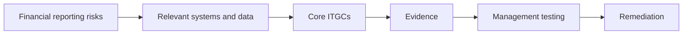
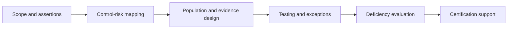
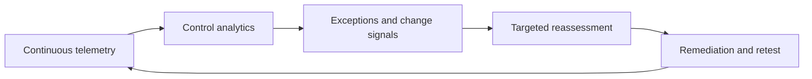

# Manual 13 — SOX ITGC / ICFR Implementation Paths

These paths support practical adoption. They do not change SOX, SEC, or PCAOB requirements and do not determine materiality, filer status, audit scope, or legal conclusions.

## Essential path
Establish the ICFR technology scope, map significant processes and systems, assign control ownership, implement core access/change/operations controls, define evidence, perform periodic management testing, track deficiencies, and retain source/evidence traceability.

**Accessible explanation:** Start with financial-reporting risks, identify the supporting technology, operate the core ITGCs, retain evidence, test the controls, and remediate failures.

## Structured path
Add assertion-level linkage, population completeness controls, standardized test procedures, IPE/report validation, service-organization governance, formal change-triggered reassessment, and integrated management certification support.

**Accessible explanation:** Structured implementation connects scope and assertions to explicit control-risk mappings, validates populations and evidence, manages testing exceptions, escalates deficiencies, and feeds certification support.

## Enhanced path
Add continuous monitoring, evidence automation with provenance, configuration and identity analytics, control dependency graphs, automated change detection, cloud/SaaS posture integration, AI/automation governance for financially relevant processes, and risk-triggered reassessment.

**Accessible explanation:** Enhanced implementation continuously monitors control signals, analyzes exceptions and changes, triggers targeted reassessment, and cycles remediation and retesting back into monitoring.

## Release boundary
The controlled English source governs meaning. es-419 and pt-BR editions are machine-assisted drafts until competent semantic review is recorded. All publication artifacts require accessibility/visual review, exact hashes, source verification, workflow-security checks, provenance, and changed-scope reconciliation before release.
