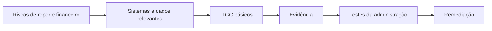
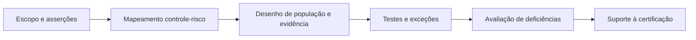
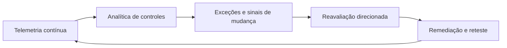

# Manual 13 — Caminhos de implementação SOX ITGC / ICFR

Rascunho localizado assistido por máquina. A fonte inglesa controlada prevalece até revisão semântica humana competente.

## Caminho Essencial
Defina escopo tecnológico de ICFR, sistemas e processos significativos, responsáveis, ITGC básicos de acesso/mudanças/operações, evidência, testes da administração e remediação.

**Explicação acessível:** Comece pelos riscos financeiros, identifique a tecnologia de suporte, opere ITGC, retenha evidência, teste controles e remedie falhas.

## Caminho Estruturado
Adicione ligação a asserções, controles de completude de população, procedimentos padronizados, validação de IPE, governança de organizações de serviço e suporte formal às certificações.

**Explicação acessível:** O caminho estruturado conecta escopo e asserções a controles, valida populações/evidência, administra exceções e alimenta a certificação.

## Caminho Aprimorado
Incorpore monitoramento contínuo, proveniência automatizada de evidência, analítica de configuração/identidade, detecção de mudanças, integração cloud/SaaS e governança de IA/automação financeiramente relevante.

**Explicação acessível:** O modelo aprimorado usa sinais contínuos para detectar exceções, acionar reavaliação, remediar e retestar.
