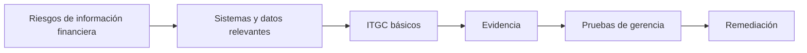
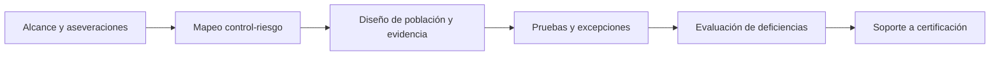
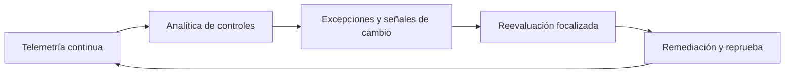

# Manual 13 — Rutas de implementación SOX ITGC / ICFR

Borrador localizado asistido por máquina. La fuente inglesa controlada rige el significado hasta completar revisión semántica humana competente.

## Ruta Esencial
Defina alcance ICFR tecnológico, sistemas y procesos significativos, responsables, ITGC básicos de acceso/cambios/operaciones, evidencia, pruebas de gerencia y remediación.

**Explicación accesible:** Comience con riesgos financieros, identifique tecnología de soporte, opere ITGC, retenga evidencia, pruebe controles y remedie fallas.

## Ruta Estructurada
Agregue vínculo con aseveraciones, controles de completitud de población, procedimientos estandarizados, validación IPE, gobierno de organizaciones de servicio y soporte formal a certificaciones.

**Explicación accesible:** La ruta estructurada conecta alcance y aseveraciones con controles, valida poblaciones/evidencia, administra excepciones y alimenta la certificación.

## Ruta Mejorada
Incorpore monitoreo continuo, procedencia automatizada de evidencia, analítica de configuración/identidad, detección de cambios, integración cloud/SaaS y gobierno de IA/automatización financieramente relevante.

**Explicación accesible:** El modelo mejorado usa señales continuas para detectar excepciones, disparar reevaluación, remediar y volver a probar.
