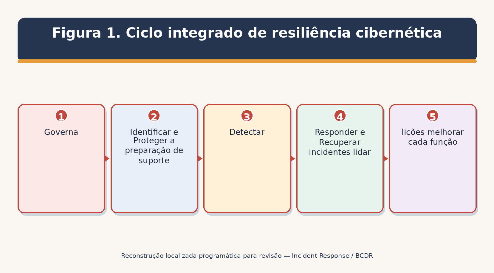
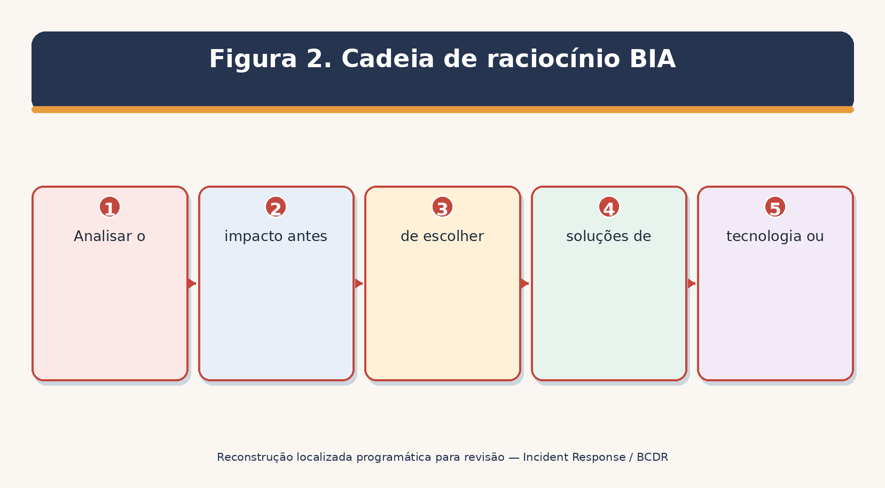
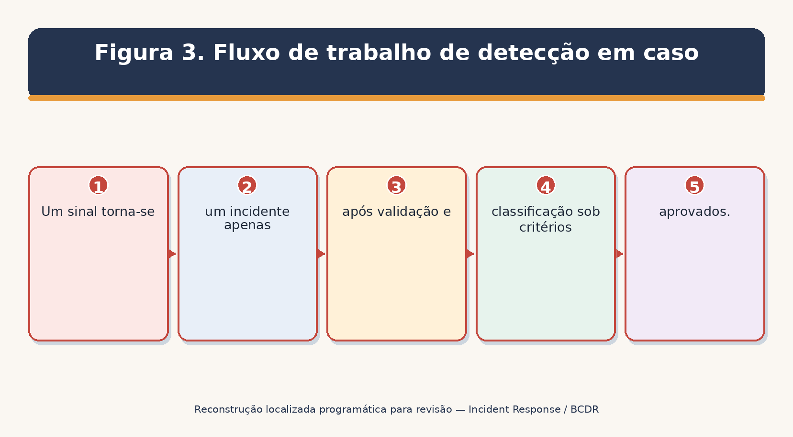
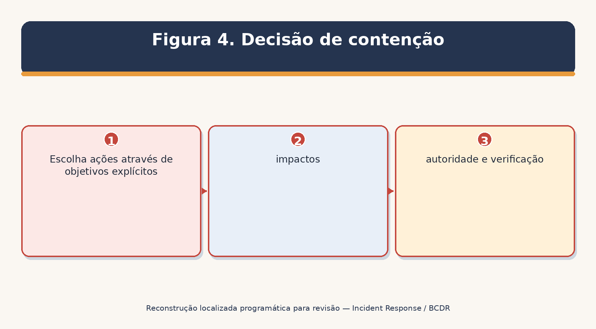
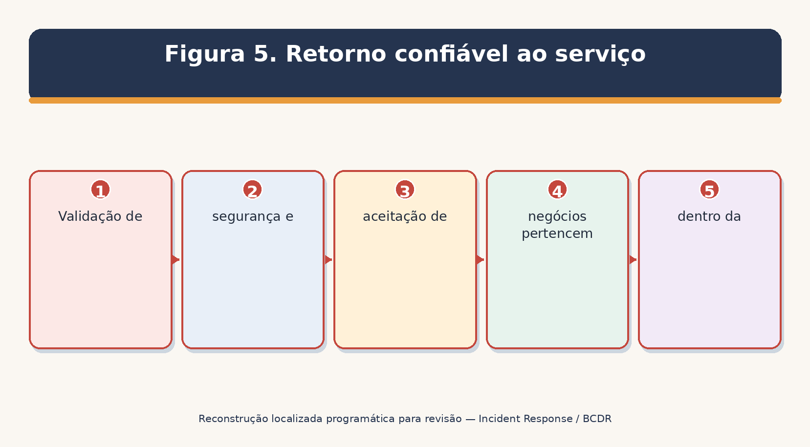
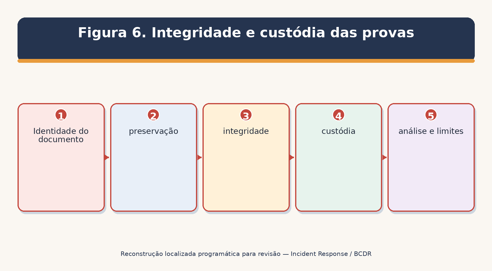
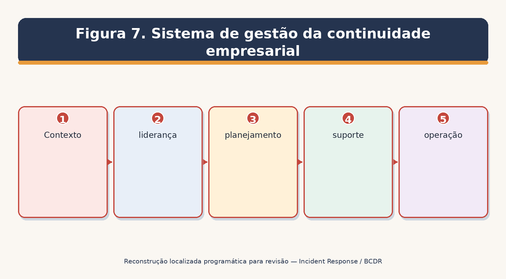
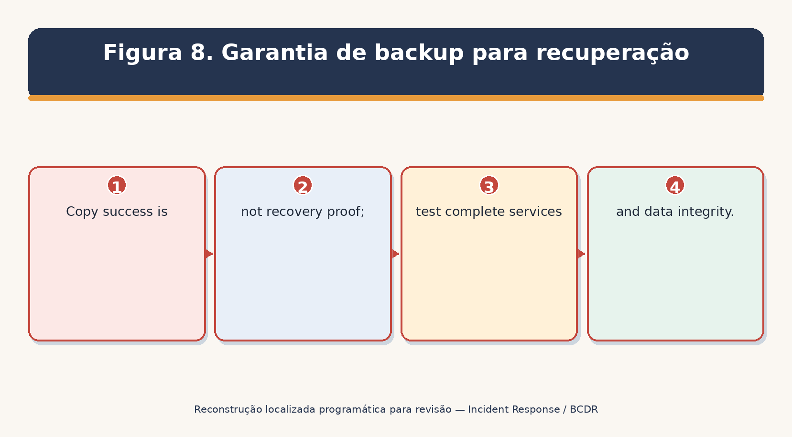
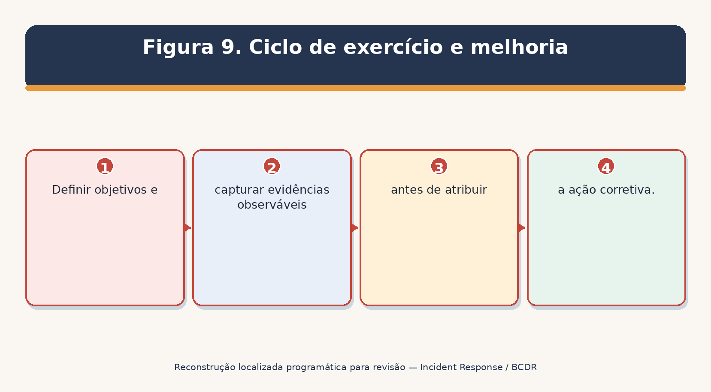
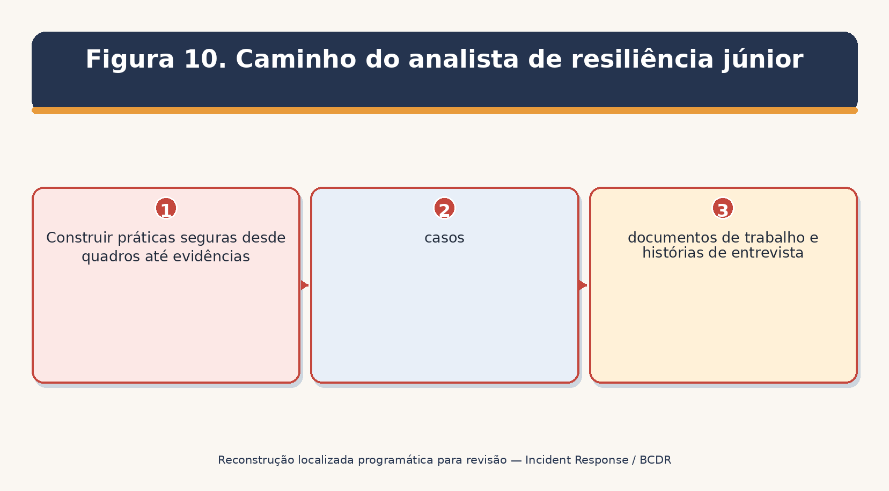

> **Status da revisão:** Rascunho de tradução assistida por máquina. Requer revisão humana de terminologia, significado, links, formatação e atualidade técnica antes de ser marcado como edição final.

** RESPOSTA INCIDENTE

** CONTINUIDADE DAS EMPRESAS & RECUPERAÇÃO DE DESEMPENHO

Prático Gerente e Manual de Analista Júnior

O que este manual faz: Mostra como se preparar para a interrupção, detectar e gerenciar incidentes cibernéticos, continuar serviços críticos, restaurar a tecnologia com segurança, testar evidências, usar ferramentas de código aberto e construir habilidades de analista prontas para o trabalho. □
□-----------------------------------------------------------------------------------------------------------------------------------------------------------------------------------------------------------------------------------------------------------------------------------------------------------------

** Alberto (Al) Leiva**

Primeira edição • Julho de 2026

Prefácio

Incidentes e interrupções não seguem um script conveniente. Um ataque cibernético pode se tornar uma crise legal, de segurança, cliente, financeira, operacional e de reputação. Boa resiliência conecta resposta incidente, continuidade de negócios, recuperação de desastres, liderança em crises, comunicações, fornecedores e melhoria contínua.

Este manual usa linguagem simples e produtos de trabalho realistas. Não é um conselho jurídico ou uma garantia. Os requisitos variam de acordo com a organização, setor, contrato, país, regulador, tecnologia e evento. Durante uma emergência real, siga a autoridade aprovada, preserve a segurança e as evidências, e envolva profissionais qualificados legais, de privacidade, recursos humanos, comunicações, seguros, aplicação da lei e técnicos, conforme apropriado.

Nota de informação actual:** As orientações oficiais foram verificadas em 14 de julho de 2026. A fundação de resposta a incidentes é NIST SP 800-61 Rev. 3, finalizada em 3 de abril de 2025. O conteúdo de continuidade também usa NIST SP 800-34 Rev. 1 Atualização 1 e ISO 22301:2019 com Emenda 1:2024.
□--------------------------------------------------------------------------------------------------------------------------------------------------------------------------------------------------------------------------------------------------------------

# # Como usar este manual

- Gerentes: comece com Capítulos 1–5, 7, 9–13, 19–25 e 27.

- Analistas júnior: estudem em ordem e completem os Capítulos 26–29 com dados sintéticos e laboratórios autorizados.

- Respondedores técnicos: foco nos capítulos 5–18, 21–24 e 26.

- Equipes de continuidade e recuperação: foco nos capítulos 3, 11 e 19–24.

- Alfaiate cada plano, limiar, contato, exigência e exercício para a organização.

Sumário

Este documento contém um índice nativo do Word. O guia do capítulo na página seguinte é uma referência rápida permanente.

[Prefácio [2](#preface)](#preface)

[Como usar este manual [2](#how-to-use-this-manual)](#how-to-use-this-manual)

[Quadro de conteúdos [3](#table-of-contents)](#table-of-contents)

[Guia do Capítulo [7](#chapter-guide)](#chapter-guide)

[1 [1] [#ir-business-continuity-and-disaster-recovery-foundations](#ir-business-continuity-and-disaster-recovery-foundations]

[2. Governação, Política e Funções [9](#governance-policy-and-roles)](#governance-policy-and-roles)

[2.1 Princípios essenciais da governação [9](#governance-essentials)](#governance-essentials)

[3. Avaliação dos riscos e análise do impacto das empresas [10](#risk-assessment-and-business-impact-analysis)](#risk-assessment-and-business-impact-analysis)

[3,1 método BIA [10](#bia-method)](#bia-method)

[4. Modelo atual de resposta ao incidente de NIST [12](#current-nist-incident-response-model)](#current-nist-incident-response-model)

[4.1 Sequência de funcionamento prática [12](#practical-operating-sequence)](#practical-operating-sequence)

[5. Preparação e preparação [13](#preparation-and-readiness)](#preparation-and-readiness)

[5.1 Lista de verificação da disponibilidade [13](#readiness-checklist)](#readiness-checklist)

[5.2 Desenho de livro de reprodução [13](#playbook-design)](#playbook-design)

[6. Validação da detecção e do evento [14](#detection-and-event-validation)](#detection-and-event-validation)

[6.1 Fontes de sinal [14](#signal-sources)](#signal-sources)

[6.2 Questões de validação [14](#validation-questions)](#validation-questions)

[7. Triagem, Severidade e Escalação [15](#triage-severity-and-escalation)](#triage-severity-and-escalation)

[7,1 Saída de triagem [15](#triage-output)](#triage-output)

[8. Investigação e Escova [16](#investigation-and-scoping)](#investigation-and-scoping)

[8,1 Método de investigação [16](#investigation-method)](#investigation-method)

[9. Estratégia de contenção [17](#containment-strategy)](#containment-strategy)

[9,1 Opções [17](#options)](#options)

[9.2 Registo da decisão [17](#decision-record)](#decision-record)

[10. Erradicação e reparação [18](#eradication-and-remediation)](#eradication-and-remediation)

[10.1 Trabalho de erradicação [18](#eradication-work)](#eradication-work)

[11. Recuperação e regresso ao serviço [19](#recovery-and-return-to-service)](#recovery-and-return-to-service)

[11.1 Portas de recuperação [19](#recovery-gates)](#recovery-gates)

[11.2 Provas de recuperação [19](#recovery-evidence)](#recovery-evidence)

[12. Lições aprendidas e melhoria [20](#lessons-learned-and-improvement)](#lessons-learned-and-improvement)

[12.1 Processo pós-ação [20](#after-action-process)](#after-action-process)

[13. Coordenação da Comunicação, Jurídica e Regulatória [21](#communication-legal-and-regulatory-coordination)](#communication-legal-and-regulatory-coordination)

[13.1 Regras de funcionamento [21](#operating-rules)](#operating-rules)

[14. Provas digitais e preparação forense [22](#digital-evidence-and-forensic-readiness)](#digital-evidence-and-forensic-readiness)

[14.1 Registo de provas [22](#evidence-record)](#evidence-record)

[15. Resgates e ataques destrutivos [23](#ransomware-and-destructive-attacks)](#ransomware-and-destructive-attacks)

[15.1 Prioridades imediatas [23](#immediate-priorities)](#immediate-priorities)

[15.2 Decisão de pagamento [23](#payment-decision)](#payment-decision)

[16. Resposta ao incidente de nuvem e SaaS [24](#cloud-and-saas-incident-response)](#cloud-and-saas-incident-response)

[16.1 Investigação em nuvem [24](#cloud-investigation)](#cloud-investigation)

[16.2 Contenção em nuvem [24](#cloud-containment)](#cloud-containment)

[17. Incidentes de identidade e de acesso privilegiado [25](#identity-and-privileged-access-incidents)](#identity-and-privileged-access-incidents)

[17.1 Âmbito [25](#scope)](#scope)

[17.2 Ordem de recuperação segura [25](#safe-recovery-order)](#safe-recovery-order)

[18. Incidentes de terceiros e de cadeia de abastecimento [26](#third-party-and-supply-chain-incidents)](#third-party-and-supply-chain-incidents)

[18.1 Preparar [26](#prepare)](#prepare)

[18.2 Responder [26](#respond)](#respond)

[19. Sistema de Gestão da Continuidade das Empresas [27](#business-continuity-management-system)](#business-continuity-management-system)

[20. Estratégias e procedimentos de continuidade [28](#continuity-strategies-and-procedures)](#continuity-strategies-and-procedures)

[20.1 Procedimento de continuidade [28](#continuity-procedure)](#continuity-procedure)

[21. Planejamento de recuperação de desastres [29](#disaster-recovery-planning)](#disaster-recovery-planning)

[21.1 NIST SP 800-34 processo de contingência [29](#nist-sp-800-34-contingency-process)](#nist-sp-800-34-contingency-process)

[21.2 Conteúdo do plano DR [29](#dr-plan-content)](#dr-plan-content)

[22. Garantias de apoio e recuperação [30](#backups-and-recovery-assurance)](#backups-and-recovery-assurance)

[22.1 Desenho [30](#design)](#design)

[22.2 Ensaio de restauração [30](#restore-test)](#restore-test)

[23. Gestão de crises e factores humanos [31](#crisis-management-and-human-factors)](#crisis-management-and-human-factors)

[23.1 Ritmo de liderança [31](#leadership-rhythm)](#leadership-rhythm)

[24. Exercícios, formação e manutenção de planos [32](#exercises-training-and-plan-maintenance)](#exercises-training-and-plan-maintenance)

[24.1 Provas pós-acção [32](#after-action-evidence)](#after-action-evidence)

[25. Mapeamento da conformidade, testes de provas e métricas [33](#compliance-mapping-evidence-testing-and-metrics)](#compliance-mapping-evidence-testing-and-metrics)

[25.1 Teste de provas [33](#evidence-test)](#evidence-test)

[26. Ferramentas de Código Aberto [34](#open-source-tools)](#open-source-tools)

[26.1 A colmeia [34](#thehive)](#thehive)

[26,2 Cortex [34](#cortex)](#cortex)

[26.3 MISP [35](#misp)](#misp)

[26.4 Wazuh [35](#wazuh)](#wazuh)

[26.5 Velociraptor [35](#velociraptor)](#velociraptor)

[26.6 Volatilidade 3 [35](#volatility-3)](#volatility-3)

[26.7 Autópsia [35](#autopsy)](#autopsy)

[26.8 Timesketch [36](#timesketch)](#timesketch)

[26. 9 Plaso / log2timeline [36](#plaso-log2timeline)](#plaso-log2timeline)

[26,10 osquery [36](#osquery)](#osquery)

[26.11 Zeek [36](#zeek)](#zeek)

[26.12 Suricata [36](#suricata)](#suricata)

[26.13 YARA [37](#yara)](#yara)

[26,14 Sigma [37](#sigma)](#sigma)

[26,15 DFIR-IRIS [37](#dfir-iris)](#dfir-iris)

[26,16 GRR Resposta Rápida [37](#grr-rapid-response)](#grr-rapid-response)

[26.17 Embaralhar [38](#shuffle)](#shuffle)

[26.18 OpenSearch [38](#opensearch)](#opensearch)

[27. Playbook de resiliência do gestor [39](#managers-resilience-playbook)](#managers-resilience-playbook)

[27.1 Questões executivas [39](#executive-questions)](#executive-questions)

[28. Guia de carreira do analista júnior e Laboratório de Portfólio [40](#junior-analyst-career-guide-and-portfolio-lab)](#junior-analyst-career-guide-and-portfolio-lab)

[28.1 Funções comuns [40](#common-roles)](#common-roles)

[28.2 Trabalho típico [40](#typical-work)](#typical-work)

[28.3 Laboratório de carteira fictícia [41](#fictional-portfolio-lab)](#fictional-portfolio-lab)

[29. Preparação do plano e da entrevista de trinta dias [42](#thirty-day-plan-and-interview-preparation)](#thirty-day-plan-and-interview-preparation)

[29.2 Qual é a diferença entre IR, BC e DR? [42](#what-is-the-difference-between-ir-bc-and-dr)](#what-is-the-difference-between-ir-bc-and-dr)

[29.3 O que é NIST SP 800-61 Rev. 3? [42](#what-is-nist-sp-800-61-rev.-3)](#what-is-nist-sp-800-61-rev.-3)

[29.4 RTO versus RPO? [42] (#rto-versus-rpo)] (#rto-versus-rpo)

[29.5 Como é que se analisa um incidente?] [42](#how-do-you-triage-an-incident)](#how-do-you-triage-an-incident)

[29.6 O que torna as provas fiáveis? [42](#what-makes-evidence-reliable)](#what-makes-evidence-reliable)

[29.7 Quando a recuperação está concluída? [42](#when-is-recovery-complete)](#when-is-recovery-complete)

[29.8 Como você fecha uma melhoria? [42](#how-do-you-close-an-improvement)](#how-do-you-close-an-improvement)

[29,9 O que um analista júnior deve evitar? [43](#what-should-a-junior-analyst-avoid)](#what-should-a-junior-analyst-avoid)

[29.10 Perguntas ao empregador [43](#questions-to-ask-the-employer)](#questions-to-ask-the-employer)

[30. Modelos, Glossário, Índice e Referências [44](#templates-glossary-index-and-references)](#templates-glossary-index-and-references)

[30.1 Registo de casos de incidentes [44](#incident-case-record)](#incident-case-record)

[30.2 Registo BIA e de continuidade [44](#bia-and-continuity-record)](#bia-and-continuity-record)

[30.3 Registo de provas e de cadeia de custódia [44](#evidence-and-chain-of-custody-record)](#evidence-and-chain-of-custody-record)

[30.4 Registo de exercício e de acção correctiva [44](#exercise-and-corrective-action-record)](#exercise-and-corrective-action-record)

[30,5 Glossário [45](#glossary)](#glossary)

[30,6 Índice de assunto [45](#subject-index)](#subject-index)

[30.7 Referências oficiais [46](#official-references)](#official-references)

Guia do Capítulo

Capítulo** Título** Início na página**
-----------------------------------------------------------------------------------------------
1 IR, Continuidade de Negócios e Fundações de Recuperação de Desastres
2 Governança, Política e Funções
Avaliação de Risco e Análise de Impacto das Empresas
Modelo de resposta de incidentes NIST atual
Preparação e preparação
Detecção e Validação de Eventos
7 . . . Triagem, Severidade e Escalação . . .
8 Investigação e Escopo 13
Estratégia de contenção
10 , Erradicação e Remediação , 15 ,
Recuperação e retorno ao serviço 16
12 Lições aprendidas e Melhorias 17
• 13 • Coordenação da Comunicação, Jurídica e Regulatória □ 18
• 14 • Evidências Digitais e Prontidão Forense
15 Resgates e Ataques Destrutivos
Resposta ao Incidente da Nuvem e da SaaS
17 □ Incidentes de Identidade e Acesso Privilegiado
Incidentes da Terceira Parte e da Terceira Cadeia de Fornecimentos
Sistema de Gestão da Continuidade de Negócios ..
Estratégias e Procedimentos de Continuidade
Planejamento de Recuperação de Desastres
22 backups e garantia de recuperação 27
Gestão de Crises e Fatores Humanos
24 Exercícios, Treinamento e Manutenção do Plano
O mapeamento de conformidade, teste de evidência, e métrica
26 Ferramentas Open-Source 32
Jogo de Resiliência do Gerente ..27 .
Guia de Carreira e Laboratório de Portfólio do Junior
O Plano e a Preparação da Entrevista de Trinta Dias
Modelos, Glossário, Índice e Referências

# 1. IR, Continuidade de Negócios e Fundações de Recuperação de Desastres

* Resiliência conecta resposta cibernética, operações críticas, restauração de tecnologia e liderança.*

Figura 1. Ciclo integrado de resiliência cibernética

Capacidade ** ** Questão primária ** ** Dono típico **
-------------------------------------------------------------------------------------------------------------------------------------------------------------------------------------------------------------
Como detectamos, concentramos, removemos, recuperamos e aprendemos com incidentes cibernéticos? Comandante de segurança / incidente
Como continuarão os produtos e serviços críticos durante a interrupção? Continuidade de negócios / proprietários de processos
Como a tecnologia e os dados serão restaurados aos alvos aprovados? Os proprietários de TI / sistema e recuperação
Como os líderes tomarão decisões de alto impacto e coordenarão as partes interessadas? Equipa de crise executiva
Como as pessoas serão protegidas durante o perigo físico? Instalações / segurança / autoridades públicas

Não confunda os planos: Eles devem coordenar, mas têm objetivos diferentes, autoridades, gatilhos, equipes e evidências. Um documento raramente serve bem a todas as necessidades. □
O que é que se passa?

# 2. Governança, Política e Funções

* Autoridade, direitos de decisão, contatos e recursos devem existir antes que a pressão comece.*

## 2.1 O essencial da governança

- Política, âmbito de aplicação, objectivos, autoridades, critérios de risco e recursos aprovados pelo Executivo.

- Nomeado comandante incidente, líder técnico, líder de continuidade, líder de recuperação, líder de comunicações, contatos legais/privacy e suplentes.

- Limiares de gravidade e ativação, vias de escalada, autoridade de mudança de emergência, autoridade de despesa e aceitação de riscos comerciais.

- Métodos de contato seguros, comunicações fora da faixa, árvores de chamada, fornecedores, seguradoras, reguladores e autoridades públicas.

- Planejar a propriedade, controle de versão, distribuição, treinamento, exercício, revisão e programação de melhoria.

* ** ** ** ** ** ** Decisões-chave**
-------------------------------------------------------------------------------------------------------------------------------------------------------------------------------------------------------------
Comandante do incidente . Objetivos, prioridades, coordenação de tarefas, ritmo de status, escalada .
• Chumbo técnico • Investigação, âmbito, contenção, erradicação, critérios de recuperação
O proprietário da empresa O impacto operacional, solução alternativa, prioridade, aceitação do retorno ao serviço
□ Continuidade / DR lead □ Processo/site alternativo, sequência de recuperação, conflitos de recursos
□ Legal / privacidade □ Privilégio, preservação, análise de notificação, autoridades, contratos
□ Comunicações □ Funcionários, clientes, parceiros, público, mídia, aprovação de mensagens
□ Escriba / evidência de custódia
Segurança, risco material, estratégia, recursos, postura externa

# 3. Avaliação de risco e análise de impacto empresarial

*Uma análise de impacto empresarial torna vaga importância em requisitos de recuperação baseados no tempo.*

Figura 2. Cadeia de raciocínio BIA

## 3.1 Método BIA

- Defina produtos, serviços, processos, proprietários, clientes e saída mínima aceitável.

- Estimar a segurança, legal, cliente, financeira, operacional, privacidade, segurança e impacto reputacional à medida que o comprimento da ruptura aumenta.

- Definir o período máximo tolerável de ruptura (MTPD/MAO) e um objetivo de tempo de recuperação (RTO) que se encaixa dentro dele.

- Definir o objetivo ponto de recuperação (RPO): a perda máxima de dados toleráveis medidos no tempo.

- Identificar pessoas, instalações, tecnologia, dados, fornecedores, utilitários, comunicações, registros e dependências upstream/downstream.

- Validar suposições com proprietários de processos e liderança; resolver prioridades conflitantes.

- Use resultados para selecionar estratégias, níveis de recuperação, testes, investimentos e planejar conteúdo.

* ** ** ** ** ** ** ** ** Exemplo **
---------------------------------------------------------------------------------------------------------------------
Mais longo rompimento tolerável antes de danos inaceitáveis
Tempo de destino para restaurar um processo ou recurso
Perda máxima de dados toleráveis medida para trás a partir de rupturas
□ Nível mínimo de serviço □ Capacidade mais reduzida aceitável durante o modo de continuidade
Dependência Resource outro processo precisa entregar a sua saída Identidade, DNS, região de nuvem, pessoas, fornecedor

Erro comum:** RTO e RPO são requisitos de negócios, não configurações de produtos de backup. Teste se o serviço completo de ponta a ponta pode realmente conhecê-los. □
-----------------------------------------------

# 4. NIST atual Modelo de resposta a incidentes

*NIST SP 800-61 Rev. 3 integra resposta incidente nas seis funções CSF 2.0.*

** ** CSF Função** ** ** Contribuição para a resposta a incidentes**
--------------------------------------------------------------------------------------------------------------------------------------------------------------
□ Governar □ Política, funções, autoridades, necessidades legais e contratuais, responsabilidades do fornecedor, supervisão, melhoria
□ Identificar ativos, serviços, dados, dependências, riscos, vulnerabilidades, necessidades de melhoria
Proteger a identidade, configuração, consciência, segurança de dados, manutenção, resiliência, tecnologia de proteção
Detectar □ Monitoramento contínuo e análise de eventos adversos
Responda □ Gestão, análise, comunicação, mitigação
Recuperar Recuperação-plano de execução, restauração, verificação e recuperação de comunicação

O que mudou do Apocalipse 2:** A preparação mais antiga – detecção/análise – contenção/eradicação/recuperação – diagrama pós-incidente permanece útil operacionalmente, mas o Rev. 3 substitui o Rev. 2 e enquadra a resposta como gerenciamento de risco de segurança cibernética em toda a organização. □
□---------------------------------------------------------------------------------------------------------------------------------------------------------------------------------------------------------------------------------------------------------------------------------------------------------------------------------------------------

## 4.1 Sequência operacional prática

- Preparar continuamente através de governança, identificação e proteção.

- Detectar um possível evento adverso e validá-lo.

- Gerenciar, analisar, comunicar, conter e mitigar o incidente.

- Restaurar com segurança e comunicar recuperação.

- Capture lições e melhore todas as seis funções.

5. Preparação e preparação

* A preparação reduz a confusão, falhas de acesso, perda de provas e improvisação perigosa.*

## 5.1 Lista de verificação de prontidão

- Activo actual, identidade, dados, aplicação, fornecedor, log-source e inventários de dependência.

- Planos protegidos, contatos offline, diagramas, credenciais, kits de salto, ferramentas forenses, dispositivos limpos, licenças e comunicações seguras.

- Sincronização de tempo central, registro suficiente, endpoint/rede/telemetria de nuvens, cobertura de detecção, retenção e acesso testado.

- Ações de contenção pré-aprovadas, mudanças de emergência, métodos de isolamento, suspensão de conta, rotação token/key, bloqueio de domínio e critérios de desligamento do sistema.

- Preservação de provas, privacidade, detenção legal, cadeia de custódia, seguro, aplicação da lei e procedimentos de notificação.

- Imagens conhecidas, processo de construção seguro, backups protegidos, ordem de restauração, critérios de validação e aceitação de negócios.

- Treinamento de papéis, exercícios técnicos e de mesa, testes de call-tree e melhorias rastreadas.

# # 5.2 Design de livro de jogos

* Campo** * Conteúdo**
--------------------------------------------------------------------------------------------
□ Trigger □ Condição observável que começa o playbook
Objectivos O que deve ser protegido ou aprendido
- Autoridade - Quem pode aprovar acções disruptivas
Passos □ Pontos de decisão, ações, dependências e alternativas seguras
O que capturar antes e depois da ação
• Comunicação – Audiência, canal, cadência, fatos aprovados
Recuperação . . Critérios de entrada, validação, monitoramento, aceitação .
Melhoramento □ Métrica, revisão, proprietário, reteste

# 6. Detecção e validação de eventos

*Deteção combina tecnologia, relatórios humanos, aviso externo e contexto.*

Figura 3. Fluxo de trabalho de detecção em caso

6.1 Fontes de sinal

- Endpoint, identidade, rede, e-mail, nuvem, aplicativo, banco de dados, perda de dados, sistemas físicos, de vulnerabilidade e de inteligência de ameaça.

- Funcionários, clientes, parceiros, pesquisadores, fornecedores, reguladores, aplicação da lei, seguradoras e prestadores de serviços gerenciados.

- Saúde do serviço, fraude financeira, atividade de apoio incomum, mudança de configuração, ação privilegiada e anomalias de qualidade de dados.

6.2 Questões de validação

- O que gerou o sinal? A fonte é confiável e tempo sincronizado?

- Pode a manutenção aprovada, testes, comportamento do usuário, ou a qualidade dos dados explicar isso?

- Que usuário, dispositivo, serviço, inquilino, dados, região ou fornecedor é afetado?

- Que provas existem em fontes independentes?

- A atividade continua, se espalha, privilegiada, externamente exposta, destrutiva ou de segurança relacionada?

O que deve ser preservado antes que uma acção de contenção mude as provas?

7. Triagem, Severidade e Escalação

*Triage define prioridade e inicia os caminhos de autoridade, evidência e comunicação certos.*

Fator de gravidade
----------------------------------------------------------------------------------------------------------------------------------------------------------
• Impacto funcional – Quais produtos, serviços, processos, pessoas ou resultados de segurança são afetados? □
• Impacto da informação • Os dados foram acessados, alterados, destruídos, expostos, criptografados ou indisponíveis?
Recuperabilidade Pode o problema ser contido e restaurado com pessoas, tempo e recursos disponíveis?
• Ameaça / persistência O ator é ativo, privilegiado, destrutivo, sofisticado ou se move lateralmente? □
• Escopo/concentração – Quantos sistemas, identidades, locais, clientes ou fornecedores podem compartilhar exposição?
- Obrigação / visibilidade - Pode ser legal, contratual, regulador, seguradora, cliente ou aviso público?
• Incerteza – Que fatos estão faltando, e poderiam aumentar materialmente a gravidade?

## 7.1 Saída da triagem

- Identificador de caso, tempo detectado, tempo de início conhecido, repórter, comandante, gravidade, status e espaço de trabalho seguro.

- Fatos atuais separados de suposições e hipóteses.

- Populações afetadas e potencialmente afetadas, impacto empresarial, evidências preservadas e proteção imediata.

- Tarefas, proprietários, prazos, próxima atualização, escalada, e relógios de notificação.

- Razão para mudanças de gravidade e grandes decisões.

# 8. Investigação e Scoping

*Investigação constrói e testa explicações enquanto o ambiente e o atacante podem estar mudando.*

## 8.1 Método de investigação

- Escreva as perguntas iniciais: ponto de entrada, identidade, ação, persistência, privilégio, movimento, dados, comando e controle, impacto e acesso remanescente.

- Criar uma linha do tempo normalizada de eventos e fonte de registro, fuso horário, confiança e lacunas.

- Escopo de indicadores conhecidos para identidades relacionadas, hosts, recursos de nuvem, aplicações, dados e fornecedores; não confie em um indicador.

- Preservar provas voláteis antes de desligar quando seguro, autorizado e útil.

- Teste hipóteses concorrentes e procure provas de confirmação.

- Método de coleta de documentos, consultas, hashes, versões, limitações e conclusões do analista.

- Breves tomadores de decisão com fatos, incerteza, efeito comercial, opções e recomendado próximo passo.

Pergunta** Possível evidência**
--------------------------------------------------------------------------------------------------------------------------------------------------------------------------------------------------------------------------------------------------------------------------------------------------------------------------------------------------------------------------------
Como começou o acesso? E-mail, identidade, endpoint, web, VPN, nuvem, vulnerabilidade e registros de suporte
O que fez o ator? Processo, comando, auditoria, arquivo, registro, memória, rede e atividade na nuvem
O que foi acessado? • Aplicação, banco de dados, objeto, DLP, consulta, API e registros de acesso a arquivos
□ Permanece a persistência? Contas, tokens, chaves, tarefas agendadas, serviços, aplicativos OAuth, funções na nuvem
□ Quão longe se espalhou? □ Gráfico de identidade, consultas de endpoint, fluxos de rede, DNS, acesso remoto, ferramentas compartilhadas
O que se pode confiar? • Controlos de integridade, linhas de base conhecidas, telemetria independente, origem de reconstrução

9. Estratégia de contenção

*Contenção limita danos ao preservar a segurança, operações, provas e opções de recuperação.*

Figura 4. Decisão de contenção

## 9.1 Opções

- Isole endpoint, segment network, block indicator, desative a conta, revogue sessões, gire tokens/keys, remova a exposição pública, pare a integração, restrinja dados, pause implantação, falhe ou desligue.

- O confinamento a curto prazo pode ser rápido e temporário; o confinamento a longo prazo suporta uma operação mais segura até à erradicação.

- Usar ações encenadas ou coordenadas quando etapas isoladas alertam um atacante ou quebram o serviço crítico.

## 9.2 Registro de decisão

- Objectivo e ameaça serem limitados.

- Serviço de negócios afetado, segurança, cliente, evidência, privacidade e impacto de recuperação.

- Alternativas consideradas e razões selecionadas.

- Approver, executor, tempo, comandos / mudar ticket, antes e depois de provas, retrocesso e verificação.

- Exposição residual e ponto de decisão seguinte.

# 10. Erradicação e Remediação

* A erradicação remove a causa, o acesso do atacante, a persistência, as mudanças inseguras e as fraquezas relacionadas.*

## 10.1 Trabalho de erradicação

- Remova arquivos, processos, tarefas, serviços, contas, aplicativos, regras, caminhos de acesso e infraestrutura maliciosos.

- Revogar sessões e tokens; girar senhas expostas, chaves, certificados, segredos, códigos de recuperação, e relacionamentos de confiança em uma ordem segura.

- Patch ou mitigar vulnerabilidades exploradas; endurecer configuração; fechar serviços expostos; corrigir identidade e caminhos de rede.

- Reconstruir a partir de fontes confiáveis quando a integridade não pode ser demonstrada.

- Pesquise toda a população potencial para a mesma condição e valide nenhuma persistência alternativa permanece.

- Preservar provas e separar a reparação da prova; registrar cada mudança.

□ ** Causa da raiz versus ponto de entrada:** O ponto de entrada explica como este incidente começou. As causas profundas podem incluir processos, design, propriedade, visibilidade, habilidades, incentivos ou fraquezas de controle que lhe permitiram ter sucesso ou persistir. □
□-------------------------------------------------------------------------------------------------------------------------------------------------------------------------------------------------------------------------------------------------------------------------------------------------------------------------------------------------

# 11. Recuperação e retorno ao serviço

* Recuperar restaura o serviço crítico através de etapas controladas, verificadas e monitoradas.*

Figura 5. Retorno confiável ao serviço

# # 11.1 Portões de recuperação

- A contenção é estável e a recuperação não se ligará ao compromisso activo.

- Fonte de restauração, build pipeline, backups, credenciais, dependências e caminho de administração são confiáveis.

- Atualizações de segurança, endurecimento, rotação de identidade e monitoramento necessários estão ativos.

- Integridade dos dados, completude, função de aplicação, interfaces, capacidade e resultados de RTO/RPO são testados.

- A reconexão é faseada; maior monitoramento tem proprietários claros e duração.

- Os proprietários de empresas e técnicos aprovam o retorno ao serviço, com exceções e risco residual registrado.

# # 11.2 Provas de recuperação

- Sequência de recuperação e datas reais.

- Versão restaurada, fontes, hashes/configuração, ponto de dados e estado de dependência.

- Segurança, funcional, reconciliação de dados, desempenho e resultados de aceitação do usuário.

- RTO/RPO alcançado ou perdido, causa, impacto, solução alternativa e ação corretiva.

- Resultados de monitorização melhorados e decisão de recorrência.

12. Lições aprendidas e Melhorias

A melhoria converte a experiência em sistemas mais seguros e melhores decisões.

## 12.1 Processo pós-ação

- Faça uma revisão irrepreensível, mas responsável, logo que os fatos e decisões possam ser reconstruídos.

- Construir a linha do tempo factual: sinal, reconhecimento, escalada, decisões, contenção, erradicação, restauração, comunicação e encerramento.

- Compare o desempenho esperado versus real de pessoas, planos, dados, ferramentas, fornecedores, comunicações e recuperação.

- Identificar condições contribuintes e causas sistêmicas, não apenas erros individuais.

- Atribuir ações específicas, proprietários, recursos, datas baseadas em risco, proteção provisória e medidas de sucesso.

- Teste novamente a capacidade falhada e atualizar políticas, arquitetura, detecçãos, playbooks, contratos, treinamento, BIA, continuidade e planos de recuperação.

Ação fraca ** ** Ação de Stronger **
-----------------------------------------------------------------------------------------------------------------------------------------------------------------------
Melhore o monitoramento □ Adicione eventos de administração de provedor de identidade ao SIEM, alerta sobre o novo papel privilegiado dentro de cinco minutos, e teste mensal
O pessoal do comboio executa um exercício direcionado para verificação de identidade do serviço-desk e manipulação da medição de falhas
Corrigir backups Adicionar cópia diária isolada para a base de dados Tier 1 e provar a restauração dentro de quatro horas RTO trimestral
O plano de atualização .. Adicionar nome de tomada de decisão alternativa, contato fora da banda e passo de ativação testado ..

# 13. Coordenação de Comunicação, Legal e Reguladora

* A comunicação deve ser precisa, oportuna, autorizada, específica do público e protegida.*

# # 13.1 Regras de funcionamento

- Mantenha uma base de fatos aprovada com tempo, fonte, confiança, proprietário e última atualização.

- Situação operacional separada, análise jurídica, hipóteses técnicas e mensagens públicas.

- Usar canais seguros adequados para possível compromisso e preservar registros necessários.

- Diga o que é conhecido, desconhecido, sendo feito, necessário do público, e próxima atualização.

- Acompanhar gatilhos de notificação e relógios por lei, regulador, contrato, seguradora, cliente, empregado e jurisdição.

- Coordenar legal, privacidade, comunicações, recursos humanos, segurança, executivos, fornecedores, seguradoras e autoridades públicas.

- Não especule, esconda fatos materiais, destrua registros, ou prometa tempo que os respondedores não podem apoiar.

* Audiência** * Necessidades**
----------------------------------------------------------------------------------------------------------------------------
Responsáveis Objetivos, escopo, tarefas, evidências, perigos, decisões
• Executivos • Impacto empresarial, incerteza, opções, recomendação, recursos, próxima decisão
Os funcionários O que aconteceu, ações seguras, suporte, canal de relatórios, atualização de timing
• Clientes / parceiros • Atendimento/dados afetados, ação protetora, suporte, atualizações verificadas
□ Regulador / autoridade
□ Público / mídia □ Aprovada mensagem precisa, porta-voz, atualizações consistentes

Nota legal:** Os deveres de notificação e preservação são específicos de fato e jurisdição. Envolver conselho qualificado cedo; não usar este manual como uma determinação legal. □
------------------------------------------------------------------------------------------------------------------------------------------------------------------------------------------------------------------------------------------------------------------------------------------------------------------------------------------------------------------------------------------------------------------------------------------------------------------------

# 14. Evidência Digital e Pronto Forense

* A prontidão Forense torna a evidência confiável, útil, proporcionada e disponível quando necessário.*

Figura 6. Integridade e custódia das provas

# # 14.1 Registro de provas

- ID do item único, descrição, sistema de origem/dispositivo/conta, coletor, autoridade, data/hora/zona temporal, localização e razão.

- Método de coleta, ferramenta/versão, configurações, cópia original e de trabalho, hash criptográfico, quando apropriado, e proteção de armazenamento.

- Cada transferência: de, até, data/hora, finalidade, assinaturas ou registro autenticado, e verificação de integridade.

- Passos de análise, consultas, transformações, normalização do tempo, screenshots/exportações, achados, explicação alternativa e limitação.

- Retenção, detenção legal, privacidade/minimização, log de acesso, divulgação e disposição aprovada.

Segurança e autoridade: Não acessar contas pessoais, interceptar comunicações, coletar amplamente, ou executar ações invasivas sem autoridade adequada. Siga as regras de lei, política, privacidade, emprego e evidência. □
-------------------------------------------------------------------------------------------------------------------------------------------------------------------------------------------------------------

# 15. Ransomware e Ataques Destrutivos

* Ransomware pode combinar acesso, roubo, extorsão, criptografia, destruição e pressão pública.*

## 15.1 Prioridades imediatas

- Proteger a vida e a segurança; ativar a liderança incidente e crise.

- Isolar sistemas e redes afetados de forma coordenada; preservar evidências antes de desligar a energia quando seguro e útil.

- Infraestrutura de identidade segura, caminhos administrativos, backups, hipervisores, consoles de nuvem, ferramentas remotas e sistemas de gerenciamento.

- Determinar escopo, atividade do ator, persistência, acesso/exfiltração de dados, criptografia, impacto comercial e exposição do fornecedor.

- Utilizar comunicações fora da banda e dispositivos/credenciais limpos conhecidos.

- Engajar aconselhamento jurídico, seguradora, respondedores qualificados e autoridades apropriadas sob procedimentos aprovados.

- Priorizar restauração confiável de serviços críticos; validar backups e não reconectar em compromisso ativo.

# # 15.2 Decisão de pagamento

- O pagamento é legal, seguro, ético, sanções, negócios e decisão de risco para a liderança autorizada – não um analista júnior.

- O pagamento não garante descriptografia, exclusão, silêncio ou ausência de ataques futuros.

- Preservar os factos, as autoridades, as alternativas, as condições da seguradora e a fundamentação da decisão; utilizar o aconselhamento qualificado e as autoridades públicas, conforme adequado.

# 16. Resposta de Incidente Cloud e SaaS

* A resposta em nuvem depende da telemetria do provedor, responsabilidade compartilhada, controle do inquilino e acesso ao suporte.*

# # 16.1 Investigação em nuvem

- Preservar auditoria de provedor, identidade, API, objeto, rede, carga de trabalho, banco de dados, gerenciamento de chaves, segurança, faturamento e registros de suporte antes da retenção expirar.

- Identificar locatário, assinatura/projeto/conta, região, recurso, identidade, papel, token, chave, automação, aplicação e ação do provedor.

- Reveja a actividade do plano de controlo e do plano de dados separadamente.

- Instantâneo ou exportação de evidências usando métodos suportados; tempo do provedor de registro, identificadores, hashes e limitações.

- Coordenar a escalada do provedor, solicitação legal, aviso de incidente, subprocessador, e deveres de responsabilidade compartilhada.

# # 16.2 Contenção de nuvens

- Revogar sessões e tokens, desativar identidades comprometidas, girar segredos/chaves, restringir políticas e redes, cargas de trabalho de quarentena, parar a automação insegura e preservar caminhos de recuperação.

- Evite excluir recursos antes que as necessidades de evidência, dependência e retorno sejam entendidas.

- Validar infraestrutura-como-código, imagens, pipelines, federação de identidade, registro, e linha de base de inquilino antes de reconstruir.

17. Incidentes de Identidade e Acesso Privilegiado

*Compromisso de identidade pode cruzar endpoints, serviços de nuvem, fornecedores e canais de recuperação.*

## 17.1 Âmbito de aplicação

- Senha, método MFA, sessões, tokens de atualização/acesso, chaves API, bolsas OAuth, diretores de serviço, certificados, métodos de recuperação, acesso delegado e papéis privilegiados.

- Autenticação sucesso / falha, dispositivo, IP, localização, viagem impossível, registro, consentimento, mudança de papel, regra de caixa de correio, acesso ao aplicativo, reset de suporte, e mudança de registro de auditoria.

- Identidades relacionadas, dispositivos compartilhados, ferramentas de administração, sistemas federados, help desk, fornecedores e contas de vidro quebrado.

17.2 Ordem de recuperação segura

- Primeiro, o acesso administrativo seguro e o controlo de identidade.

- Desactivar ou restringir caminhos comprometidos, preservando as provas necessárias.

- Revogar sessões/tokens e remover fatores não autorizados, papéis, aplicações, regras e métodos de recuperação.

- Rodar segredos em ordem consciente de dependência; verificar contas de serviço e automação.

- Restaurar o acesso do usuário através de prova de identidade forte; monitor para recorrência.

- Investigar como os controles foram contornados e testar o processo corrigido.

# 18. Incidentes de Terceiro-Parte e Supply-Chain

*Um incidente de fornecedor requer fatos compartilhados, responsabilidades, relógios de notificação e decisões de recuperação.*

# # 18.1 Preparar

- Mantenha os atuais serviços de fornecedores, proprietários, dados, acesso, integrações, quartas partes, contatos incidentes, termos de contrato e alternativas.

- Definir eventos relatáveis, tempo de notificação e canal, fatos mínimos, evidência/cooperação, atualizações, contenção, recuperação, comunicação pública e deveres pós-incidentes.

- Incluir fornecedores críticos em exercícios e testes de continuidade/saída.

# 18.2 Responder

- Confirmar produto afetado, versão, inquilino, região, dados, contas, integrações, subprocessadores, e período de tempo.

- Separar as alegações do fornecedor de factos apoiados independentemente e registar incerteza.

- Proteja o acesso da organização, chaves, sessões, integrações, fluxos de dados e clientes.

- Coordenar fornecedor, equipes internas, clientes, autoridades, seguradoras e outros fornecedores afetados.

- Reavaliar risco, resultados, desempenho do contrato, concentração e opções de saída/continuidade após a recuperação.

# 19. Sistema de Gestão de Continuidade de Negócios

*A BCMS faz da continuidade uma capacidade de gestão governada, medida e melhorada.*

Figura 7. Sistema de gestão da continuidade empresarial

Área ISO 22301
-----------------------------------------------------------------------------------------------------------------------------------------------------------------
□ Contexto • Compreender questões internas/externas, partes interessadas, escopo e necessidades de continuidade
Liderança Política, funções, responsabilização, integração e recursos
• Planeamento • Riscos/oportunidades, objectivos, alterações planeadas
Apoiar pessoas, competência, consciência, comunicação, informação documentada
□ Operação □ BIA, avaliação de risco, estratégia, procedimentos, exercícios, avaliação
• Avaliação do desempenho • Acompanhamento, medição, análise, auditoria interna, análise da gestão
Melhoramento □ Não conformidade, ação corretiva e melhoria contínua

Emenda climática:** ISO 22301:2019/Amd 1:2024 adiciona texto de ação climática aos requisitos de contexto de gestão-sistema. As organizações devem considerar se as alterações climáticas são relevantes e reconhecer que as partes interessadas podem ter requisitos relacionados com o clima. □
----------------------------------------------------------------------------------------------------------------------------------------------------------------------------------------------------------------------------------------------------------------------------------------------------------------------------------------------------------------------------------------------------------------------------------------------------------------------------------------------------------------

# 20. Estratégias e procedimentos de continuidade

* As estratégias de continuidade mantêm as atividades prioritárias dentro do impacto tolerável e dos níveis mínimos de serviço.*

*Recurso** **Exemplos de estratégia** **Questão de teste**
----------------------------------------------------------------------------
As pessoas podem treinar, alternar, trabalho remoto, equipes divididas, suporte contratado.
□ Instalações □ Local alternativo, espaço recíproco, operação remota, capacidade móvel □ As pessoas podem acessar um local seguro utilizável? □
• Tecnologia • Alta disponibilidade, failover, plataforma alternativa, modo manual • O serviço de ponta a ponta atende a RTO/RPO?
Dados/registros – Cópias protegidas, registros offline, exportação, acesso alternativo A informação é completa, atual, segura e utilizável?
Os fornecedores podem fornecer alternativa dentro da tolerância? □
□ Utilitários/comunicações □ Potência, rede, voz diferentes, canal fora da banda □ A infraestrutura comum cria uma falha? □
• Processo • Priorização, serviço reduzido, plano de backlog, solução manual • Pode a saída mínima ser mantida com segurança?

## 20.1 Procedimento de continuidade

- Activação e autoridade.

- Saída prioritária, nível mínimo de serviço, duração máxima e meta de recuperação.

- Pessoas, contato, localização, tecnologia, informação, fornecedor e necessidades de segurança.

- Passo a passo com controles, aprovações, registros, privacidade, reconciliação e recuperação de backlog.

- Comunicação cliente/empregado e ritmo de status.

- Retorno aos critérios normais, validação, aceitação do proprietário e revisão pós-ação.

# 21. Planejamento de recuperação de desastres

* Um plano de recuperação de desastres restaura a tecnologia em ordem empresarial-prioridade.*

# # 21,1 NIST SP 800-34 processo de contingência

- Desenvolva a política de planeamento de contingência.

- Realizar a análise de impacto empresarial.

- Identificar os controlos preventivos.

- Criar estratégias de contingência.

- Desenvolver o plano de contingência do sistema de informação.

- Assegurar testes de plano, treinamento e exercícios.

- Assegurar a manutenção do plano.

# # 21,2 DR planejar conteúdo

- Escopo, pressupostos, ativação, autoridades, contatos, fornecedores, sites, arquiteturas, dependências e níveis de recuperação.

- Avaliação de danos, declaração, failover, restaurar, reconstruir, validação, reconexão, retorno ao primário, e encerramento.

- Runbooks sistema a sistema com pré-requisitos, credenciais, administração limpa, pontos de dados, interfaces, segurança, testes e rollback.

- Conflitos de recursos, capacidade, licenciamento, logística, comunicações e soluções manuais.

- Real RTO/RPO, exceções, aceitação e evidência de melhoria.

# 22. Backups e garantia de recuperação

* Os backups requerem escopo protegido, separação, monitoramento, testes de restauração e administração confiável.*

Figura 8. Garantia de backup para recuperação

# # 22.1 Design

- Mapa de sistemas críticos, configurações, identidade, chaves, código, dados SaaS, logs e dependências para alvos BIA.

- Use várias cópias protegidas com separação adequada, imutabilidade/controle offline, criptografia, segregação de acesso, monitoramento e retenção.

- Proteja consoles de backup, contas de serviço, exclusão, replicação, catálogos, credenciais de recuperação e redes de gerenciamento.

- Evite reproduzir corrupção ou mudanças atacantes sem pontos de recuperação históricos utilizáveis.

# # 22.2 Teste de restauração

- Selecione um sistema representativo e ponto de recuperação em um cenário aprovado.

- Use pessoas autorizadas, administração limpa, runbook documentado e restauração isolada, quando apropriado.

- Meça tempo real e perda de dados; valide completude, integridade, segurança, interfaces, desempenho e uso de negócios.

- Gravar falhas e soluções; corrigir e reteste.

- Relate se o serviço completo – não apenas um arquivo – atende aos requisitos de RTO, RPO e serviço mínimo.

# 23. Gestão de Crises e Fatores Humanos

*O gerenciamento de crises coordena decisões de alto impacto quando a informação está incompleta e o tempo importa.*

## 23.1 Ritmo de liderança

- Definir objetivos de segurança, serviço, jurídico, cliente, evidência e recuperação em ordem prioritária.

- Manter uma imagem operacional comum: fatos, incerteza, efeitos comerciais, decisões, ações, recursos e próxima atualização.

- Atribuir um proprietário de decisão e um proprietário de ação; registrar a lógica e o tempo.

- Use briefings curtos e canais protegidos; controle rumores e instruções conflitantes.

- Assista a fadiga do respondedor, turnover, viés cognitivo, estresse, segurança pessoal e necessidades familiares.

- Plano de alívio, alimentos, descanso, transporte, acessibilidade, apoio à saúde mental, e transferências respeitosas.

□ **Elemento de cruzamento ** ** Pergunta **
-------------------------------------------------------------------------------------------------------------------
Situação O que mudou desde a última atualização?
Impacto Quem ou o que é afetado agora e ao longo do tempo?
□ Incerteza
Objectivos □ Que resultados importam no próximo período de funcionamento?
Opções Quais são os benefícios, danos, dependências e reversibilidade?
- Decisão - Quem decide quando?
Ações Quem faz o quê, quando, com que evidência?
Comunicação Quem precisa que a mensagem verificada e quando?

# 24. Exercícios, Treinamento e Manutenção do Plano

* Os exercícios devem avaliar a capacidade, não recompensar um desempenho ensaiado.*

Figura 9. Ciclo de exercício e melhoria

Tipo de exercício
-------------------------------------------------------------------------------------------------------------------------------------
* Checklist / call-tree test * Validar registros, contatos, acesso e passos simples *
□ Tabletop □ Discuta decisões, papéis, informações e coordenação utilizando um cenário □
Simulação Operar equipes e comunicações em um ambiente realístico controlado
• Teste técnico de recuperação • Restaurar, reconstruir, falhar, validar e medir a tecnologia
O teste paralelo é executado capacidade de recuperação sem substituir a produção
• Interrupção total • Deslocar o serviço real sob autoridade fortemente controlada; maior risco
Exercício Purple-equipe □ Teste colaborativamente ataque, detecção, resposta e melhoria

# # 24.1 Provas pós-acção

- Objetivo e capacidade testada, cenário, pressupostos, participantes, observadores, regras e controles de segurança.

- Ações esperadas e critérios de sucesso mensuráveis.

- Real timeline, decisões, comunicações, uso de ferramenta/plano, resultados de recuperação e limitações.

- Pontos fortes, lacunas, causas radiculares/contributivas, risco, proprietários, datas, controles provisórios e reteste.

# 25. Mapeamento de Compliance, Teste de Evidência e Métricas

*Frameworks sobrepõem-se, mas as provas devem ser testadas contra o requisito exato aplicável.*

Fonte** Fonte** Foco relevante** Atenção**
--------------------------------------------------------------------------------------------------------------------------------------------------------------
NIST SP 800-61 Rev. 3 □ CSF 2.0 Comunidade Perfil para a resposta de incidente em toda a organização; Sobresedes Rev. 2; alfaiate o perfil .
NIST SP 800-34 Rev. 1 Atualização 1 □ Processo de planejamento de contingência do sistema de informação federal □ Mais antigo, mas atual NIST final; adaptar-se fora do uso federal
• ISO 22301:2019 + Amd 1:2024 • Requisitos para um sistema de gestão de continuidade de negócios
ISO 22313:2020 □ Orientação para a utilização de ISO 22301 □ Orientação não é certificação
SOC 2 Disponibilidade, segurança, confidencialidade, privacidade, comprometimentos de processamento e controles
ISO/IEC 27001:2022 □ Gestão de incidentes, prontidão para a continuidade, backup, registro, fornecedores
□ PCI DSS v4.0.1 □ Resposta ao incidente, testes, provedores de serviços, backups e controles relacionados à recuperação
□ HIPAA □ Plano de contingência, procedimentos incidentes, backup, DR, operação de emergência
□ GDPR □ Segurança, avaliação/notificação de violação, cooperação de processadores, resiliência/restauração □ Funções legais, risco, timing, jurisdição requerem aconselhamento

# # 25.1 Teste de evidência

- Definir critérios, escopo, período, sistemas, processos, fornecedores e exclusões.

- Validar a população completa: incidentes, alertas, planos, testes, recuperações, fornecedores, backups, sistemas, ou ações.

- Inspecionar o design e as provas operacionais; inquérito por si só é fraco.

- Amostra defensivamente ou testar a população completa; método de registro e limitações.

- Avaliar exceções, padrões, impacto, causa, controles compensadores e risco residual.

- Seguir medidas correctivas e testar novamente de forma independente antes do encerramento.

* ** ** ** ** ** ** ** ** ** ** ** ** **
--------------------------------------------------------------------------------------------------------------------------------------------------------------------
O tempo médio para detectar o tempo desde o início do evento/primeira evidência até à detecção
O tempo médio para conter a detecção/activação para a contenção verificada.
• Alcance do objetivo de recuperação; • Testes/incidentes que atendem STO e RPO; • Testes/incidentes em ambiente;
□ Cobertura do exercício do Playbook □ Cenários críticos exercitados □ Cenários críticos aprovados
□ Idade da ação corretiva □ Dias abertos por gravidade e proprietário
Restaurar o sucesso do backup; Restaurações representativas bem sucedidas; testes programados; Restaurar o arquivo pode não provar a recuperação do serviço;
Recorrência de incidentes □ Repetir incidentes relacionados com a mesma causa não corrigida

# 26. Ferramentas de Código Aberto

* Ferramentas de código aberto suportam gerenciamento de casos, evidências, detecção, investigação, automação e relatórios.*

*Ferramenta** *Purpose**
---------------------------------------------------------------------------------------------------
□ TheHive □ Gestão de casos e colaboração incidente
□ Cortex □ Análise e acções de resposta observáveis
O MISP O compartilhamento e correlação de informações de ameaças
Wazuh, monitoramento de endpoint, análise de log, integridade do arquivo e alertas
O Velociraptor O Endpoint Visibilidade e recolha de respostas a incidentes
Volatilidade 3 Memória forense
□ Autópsia; análise forense de disco e sistema de arquivos;
O Timesketch O timelines forenses colaborativos
□ Plaso / log2timeline □ Extração da linha do tempo de artefatos forenses
* Osquery * Endpoint state and threat-unting queries *
- Zeek - Telemetria de segurança de rede e metadados de protocolo
□ Suricata □ Detecção e prevenção de intrusões em rede
O padrão de YARA que combina para arquivos e memória
Regras portáteis de detecção de logs
• DFIR-IRIS • Resposta a incidentes e gestão de casos de investigação
Resposta rápida do GRR; Perícias remotas ao vivo na escala de endpoint
embaralhar em segurança orquestração e automação
Pesquisa, análise, painéis e registros de segurança

Autorização e segurança das provas: Use ferramentas apenas em sistemas, redes, contas, repositórios e dados que você possui ou tem autoridade escrita para examinar. Isole laboratórios, proteja evidências, minimize dados pessoais, ações de registro e nunca deixe a automação realizar etapas destrutivas sem salvaguardas aprovadas. □
O que é que se passa?

# # 26.1 A Colmeia

Objetivo: Gestão de casos e colaboração incidente. Projeto oficial: [<u>TheHive</u>](https://thehive-project.org/)

Início rápido seguro: Crie um caso de laboratório, defina tarefas e severidade, adicione observáveis sintéticos, registre decisões, proteja permissões e feche apenas após revisão.

Provas: autoridade escrita e âmbito, identidade da fonte, data/hora/zona de tempo, ferramenta e versão, configuração/consulta, hashes quando apropriado, resultado bruto, validação do analista, limitação, ação e revisão. Restrinja o acesso e preserve uma cópia de origem inalterada quando necessário.

# # 26,2 Cortex

Objetivo: Análise observável e ações de resposta. Projeto oficial: [<u>Cortex</u>](https://github.com/TheHive-Project/Cortex)

Início rápido seguro: Conecte somente analisadores aprovados em um laboratório, envie observáveis sintéticos, valide resultados, restrinja os respondedores e retenha registros de ação.

Provas: autoridade escrita e âmbito, identidade da fonte, data/hora/zona de tempo, ferramenta e versão, configuração/consulta, hashes quando apropriado, resultado bruto, validação do analista, limitação, ação e revisão. Restrinja o acesso e preserve uma cópia de origem inalterada quando necessário.

# # 26.3 MISP

Objectivo: Partilha e correlação de informações sobre ameaças. Projecto oficial: [<u>MISP</u>](https://www.misp-project.org/)

Início rápido seguro: Crie um evento de laboratório privado, adicione indicadores sintéticos com marcação de contexto e manipulação, correlacione, exporte apenas dados aprovados e expire indicadores obsoletos.

Provas: autoridade escrita e âmbito, identidade da fonte, data/hora/zona de tempo, ferramenta e versão, configuração/consulta, hashes quando apropriado, resultado bruto, validação do analista, limitação, ação e revisão. Restrinja o acesso e preserve uma cópia de origem inalterada quando necessário.

# # 26.4 Wazuh

Objetivo: Monitoramento de endpoint, análise de log, integridade do arquivo e alertas. Projecto oficial: [<u>Wazuh</u>](https://wazuh.com/)

Início rápido e seguro: Inscreva-se em um endpoint de laboratório, gere um evento inofensivo, confirme a coleta e o alerta, investigue, a cobertura do documento e ajuste cuidadosamente.

Provas: autoridade escrita e âmbito, identidade da fonte, data/hora/zona de tempo, ferramenta e versão, configuração/consulta, hashes quando apropriado, resultado bruto, validação do analista, limitação, ação e revisão. Restrinja o acesso e preserve uma cópia de origem inalterada quando necessário.

# # 26.5 Velociraptor

Objetivo: Visibilidade do ponto final e coleta de resposta a incidentes. Projecto oficial: [<u>Velociraptor</u>](https://docs.velociraptor.app/)

Início rápido seguro: Use um laboratório autorizado isolado, colete um artefato estreito, alcance de registro e acesso, verifique os resultados e remova os dados de laboratório mantidos de acordo com a política.

Provas: autoridade escrita e âmbito, identidade da fonte, data/hora/zona de tempo, ferramenta e versão, configuração/consulta, hashes quando apropriado, resultado bruto, validação do analista, limitação, ação e revisão. Restrinja o acesso e preserve uma cópia de origem inalterada quando necessário.

# # 26.6 Volatilidade 3

Objetivo: Perícia de memória. Projecto oficial: [<u>Volatilidade 3</u>](https://volatility3.readthedocs.io/)

Início rápido seguro: Analise uma imagem de memória de treinamento legalmente obtida, registre hashes e versão da ferramenta, execute plugins focados, valide descobertas e preserve notas.

Provas: autoridade escrita e âmbito, identidade da fonte, data/hora/zona de tempo, ferramenta e versão, configuração/consulta, hashes quando apropriado, resultado bruto, validação do analista, limitação, ação e revisão. Restrinja o acesso e preserve uma cópia de origem inalterada quando necessário.

# # 26,7 Autópsia

Objetivo: Análise forense de disco e sistema de arquivos. Projecto oficial: [<u>Autopsia</u>](https://www.autopsy.com/)

Início rápido seguro: Crie um caso a partir de uma imagem de treinamento, verifique o hash fonte, use análise somente leitura, tag evidence, exporte um relatório e proteja o caso.

Provas: autoridade escrita e âmbito, identidade da fonte, data/hora/zona de tempo, ferramenta e versão, configuração/consulta, hashes quando apropriado, resultado bruto, validação do analista, limitação, ação e revisão. Restrinja o acesso e preserve uma cópia de origem inalterada quando necessário.

# # 26.8 Timesketch

Objetivo: Tempos forenses colaborativos. Projeto oficial: [<u>Timesketch</u>](https://timesketch.org/)

Início rápido e seguro: Importar uma linha do tempo sintética, rotular eventos-chave, hipóteses de pesquisa, conclusões de analista de registros e incerteza e controlar o acesso.

Provas: autoridade escrita e âmbito, identidade da fonte, data/hora/zona de tempo, ferramenta e versão, configuração/consulta, hashes quando apropriado, resultado bruto, validação do analista, limitação, ação e revisão. Restrinja o acesso e preserve uma cópia de origem inalterada quando necessário.

# # 26.9 Plaso / log2timeline

Objetivo: Extração temporal de artefatos forenses. Projeto oficial: [<u>Plaso / log2timeline</u>](https://plaso.readthedocs.io/)

Início rápido e seguro: Processe uma imagem de treinamento ou o conjunto de artefato aprovado, o analisador de documentos e as escolhas de fuso horário, exporte uma linha do tempo e valide eventos chave.

Provas: autoridade escrita e âmbito, identidade da fonte, data/hora/zona de tempo, ferramenta e versão, configuração/consulta, hashes quando apropriado, resultado bruto, validação do analista, limitação, ação e revisão. Restrinja o acesso e preserve uma cópia de origem inalterada quando necessário.

# # 26.10 Osquery

Finalidade: Endpoint state e consultas de caça à ameaça. Projeto oficial: [<u>osquery</u>](https://www.osquery.io/)

Início rápido seguro: Execute consultas somente de leitura em um laboratório, documente a consulta e população, compare endpoints, valide anomalias e evite coleta descontrolada.

Provas: autoridade escrita e âmbito, identidade da fonte, data/hora/zona de tempo, ferramenta e versão, configuração/consulta, hashes quando apropriado, resultado bruto, validação do analista, limitação, ação e revisão. Restrinja o acesso e preserve uma cópia de origem inalterada quando necessário.

# # 26.11 Zeek

Objetivo: Telemetria de segurança de rede e metadados de protocolo. Projeto oficial: [<u>Zeek</u>](https://zeek.org/)

Início rápido e seguro: Use um sensor de laboratório ou uma captura aprovada de pacotes, gere tráfego seguro, inspecione registros, crie uma linha do tempo e registre limites de tráfego criptografados.

Provas: autoridade escrita e âmbito, identidade da fonte, data/hora/zona de tempo, ferramenta e versão, configuração/consulta, hashes quando apropriado, resultado bruto, validação do analista, limitação, ação e revisão. Restrinja o acesso e preserve uma cópia de origem inalterada quando necessário.

# # 26.12 Suricata

Objecto: Detecção e prevenção de intrusões em rede. Projeto oficial: [<u>Suricata</u>](https://suricata.io/)

Início rápido e seguro: Use uma interface de laboratório, atualize regras aprovadas, gere tráfego de teste, valide alertas, ajuste com controle de mudança e preserve versões.

Provas: autoridade escrita e âmbito, identidade da fonte, data/hora/zona de tempo, ferramenta e versão, configuração/consulta, hashes quando apropriado, resultado bruto, validação do analista, limitação, ação e revisão. Restrinja o acesso e preserve uma cópia de origem inalterada quando necessário.

# # 26.13 YARA

Finalidade: Padrão de correspondência para arquivos e memória. Projeto oficial: [<u>YARA</u>](https://virustotal.github.io/yara/)

Início rápido seguro: Teste uma regra estreita contra amostras inofensivas, fonte de regras do documento e falsos positivos, reveja-o por pares e escaneie apenas dados autorizados.

Provas: autoridade escrita e âmbito, identidade da fonte, data/hora/zona de tempo, ferramenta e versão, configuração/consulta, hashes quando apropriado, resultado bruto, validação do analista, limitação, ação e revisão. Restrinja o acesso e preserve uma cópia de origem inalterada quando necessário.

# # 26.14 Sigma

Objetivo: Regras portáteis de detecção de log. Projeto oficial: [<u>Sigma</u>](https://sigmahq.io/)

Início rápido e seguro: Selecione uma regra, mapeie-a para campos disponíveis, converta-a para uma plataforma de laboratório, teste com registros sintéticos, afinação, revisão por pares e versões de faixas.

Provas: autoridade escrita e âmbito, identidade da fonte, data/hora/zona de tempo, ferramenta e versão, configuração/consulta, hashes quando apropriado, resultado bruto, validação do analista, limitação, ação e revisão. Restrinja o acesso e preserve uma cópia de origem inalterada quando necessário.

# # 26.15 DFIR-IRIS

Objetivo: Resposta a incidentes e gestão de casos de investigação. Projecto oficial: [<u>DFIR-IRIS</u>](https://dfir-iris.org/)

Início rápido seguro: Crie um caso fictício, atribua tarefas, registre timeline e evidências, restrinja papéis, gere um relatório e teste backup/exportação.

Provas: autoridade escrita e âmbito, identidade da fonte, data/hora/zona de tempo, ferramenta e versão, configuração/consulta, hashes quando apropriado, resultado bruto, validação do analista, limitação, ação e revisão. Restrinja o acesso e preserve uma cópia de origem inalterada quando necessário.

# # 26.16 GRR Resposta Rápida

Finalidade: Perícias remotas em escala de endpoint. Projecto oficial: [<u>GRR Resposta rápida</u>](https://grr-doc.readthedocs.io/)

Início rápido seguro: Implantar apenas em um ambiente autorizado isolado, aprovar um fluxo de coleta estreito, verificar registros de auditoria e controlar os resultados retidos.

Provas: autoridade escrita e âmbito, identidade da fonte, data/hora/zona de tempo, ferramenta e versão, configuração/consulta, hashes quando apropriado, resultado bruto, validação do analista, limitação, ação e revisão. Restrinja o acesso e preserve uma cópia de origem inalterada quando necessário.

# # 26.17 Shuffle

Objetivo: Orquestração de segurança e automação. Projeto oficial: [<u>Shuffle</u>](https://shuffler.io/)

Início rápido e seguro: Crie um fluxo de trabalho de laboratório com entradas e portões de aprovação inofensivos, caminhos de falha de teste, registre cada ação e mantenha ações destrutivas desabilitadas.

Provas: autoridade escrita e âmbito, identidade da fonte, data/hora/zona de tempo, ferramenta e versão, configuração/consulta, hashes quando apropriado, resultado bruto, validação do analista, limitação, ação e revisão. Restrinja o acesso e preserve uma cópia de origem inalterada quando necessário.

# # 26.18 OpenSearch

Objetivo: Pesquisa, análise, painéis e registros de segurança. Projeto oficial: [<u>OpenSearch</u>](https://opensearch.org/)

Início rápido e seguro: Ingera registros sintéticos, normalize o tempo e os campos, crie uma consulta focada e painel, restrinja o acesso e a retenção de documentos.

Provas: autoridade escrita e âmbito, identidade da fonte, data/hora/zona de tempo, ferramenta e versão, configuração/consulta, hashes quando apropriado, resultado bruto, validação do analista, limitação, ação e revisão. Restrinja o acesso e preserve uma cópia de origem inalterada quando necessário.

# 27. Jogo de Resiliência do Gerente

* Os gestores criam resiliência, definindo autoridade, preparando financiamento, desafiando evidências e removendo bloqueadores.*

* * * * * * * * * * * * * * * * * * * * * * * * * * * * * * * * * * * * * * * * * *
-----------------------------------------------------------------------------------------------------------------------------------------------------------------------------
□ Governança □ São claras as mudanças de autoridade, alternativas, severidade, escalada, gastos e emergência? □ Nenhum tomador de decisão após o horário
• Prontos: inventários, logs, contatos, acesso, ferramentas, comunicações e recursos de recuperação limpos são testados? Plano existe mas o acesso falha
• Resposta: Os fatos, incerteza, objetivos, ações, evidências e próxima atualização são controlados? □ Equipas conflitantes ou decisões não documentadas
Continuidade Pode a saída crítica continuar dentro do impacto tolerável? A solução ignora a segurança, privacidade ou reconciliação
Recuperação , pode completar serviços atender RTO / RPO testado de fontes confiáveis? Sucesso de backup relatado sem prova de restauração
Os fornecedores são contatos críticos, deveres, dependências e alternativas exercidas? □ Um provedor é uma dependência comum oculta
As pessoas são turnos, transferências, descanso, segurança e tensão psicológica gerenciados? Os respondedores exaustos tomam decisões críticas
□ Melhoria □ São ações severas financiadas, possuídas, medidas e retestadas? □ O mesmo gap aparece em exercícios/incidentes posteriores

# # 27.1 Perguntas executivas

- Qual é o actual impacto nos negócios e na segurança?

- Que factos apoiam a conclusão, e o que permanece incerto?

Quais são as próximas duas decisões, quem as possui, e quando são necessárias?

- Que acção pode criar danos irreversíveis ou destruir provas?

- Os serviços críticos podem continuar?

- As obrigações legais, de privacidade, contratuais, seguradoras, clientes e autoridades estão sendo monitoradas?

- Que recursos ou escolha de negócio está bloqueando contenção ou recuperação?

- Como vamos verificar a recuperação e evitar a recorrência?

# 28. Guia de Carreira de Analista Júnior e Laboratório de Portfólio

*Analistas juniores ganham confiança através de registros de casos disciplinados, manipulação de evidências, curiosidade técnica e escrita clara.*

Figura 10. Caminho do analista de resiliência júnior

# # 28.1 Funções comuns

- Analisador de Resposta a Incidentes Júnior

- SOC Analisador

- Analista de Operações de Cibersegurança

- Analisador DFIR (junior)

- Analista de continuidade de negócios

- Analista de Recuperação de Desastres

- Analista de resistência cibernética

- Analisador de risco GRC / TI

# # 28.2 Trabalho típico

- Validar e enriquecer alertas; abrir casos precisos; separar fatos das suposições.

- Construir timelines, populações afetadas por escopo, preservar evidências aprovadas e registrar consultas/ações.

- Siga os playbooks, aumente a gravidade, coordene tarefas e prepare resumos de status.

- Retenção, remediação, provas de recuperação, acções correctivas e retestes.

- Mantenha contatos, planos, dados BIA/dependência, runbooks de recuperação, registros de exercícios e métricas.

- Use ferramentas de código aberto autorizadas em um laboratório e explique limitações.

# # 28.3 Laboratório de portfólio fictício

- Criar uma organização fictícia de 80 pessoas com e-mail na nuvem, endpoints, CRM SaaS, aplicação web, dados do cliente, fornecedores e um processo de faturamento crítico.

- Escreva uma BIA com impacto ao longo do tempo, dependências, MTPD, RTO, RPO e nível mínimo de serviço.

- Construir política de incidentes, RACI, matriz de gravidade, contatos, comunicações, ransomware, identidade, nuvem e playbooks de fornecedores.

- Use registros sintéticos para investigar uma conta ficcional comprometida; crie uma linha do tempo, memorando de escopo, registro de contenção e atualização do gerente.

- Analise um disco de treinamento legal ou imagem de memória com Autópsia ou Volatilidade; fonte de documento, hash, método, achados e limites.

- Crie um DR runbook e realize um teste de restauração seguro com timings reais e validação de dados.

- Execute uma tabela e produza um relatório pós-ação com melhorias rastreadas e retestadas.

- Publicar apenas artefatos ficcionais higienizados e afirmar que o trabalho é educacional, não uma investigação real ou certificação.

# 29. Preparação do Plano e Entrevista de Trinta Dias

* Um mês focado pode construir incidente de nível de entrada e capacidade de resiliência.*

* Dias** * Foco** * Entrega**
------------------------------------------------------------------------------------------------------------------------------------------------------------------------------------
1–3 conceitos IR/BC/DR/crise e modelo NIST atual □ Mapa de conceito e RACI
. . . . . . . .
Preparação, registro, contatos, playbooks, lista de verificação de prontidão e dois playbooks
Detecção, triagem, gravidade, casos
Investigação, linha do tempo, evidência
• 16–18 • Contenção, erradicação, recuperação
* 19–21 * Continuidade, DR, restauração de backup * Procedimento de continuidade e teste de restauração *
Nuvem, identidade, ransomware, fornecedores
• 25–27 • Exercício e revisão pós-acção • Pacote de tabela e plano de melhoria
28–30 □ Metrics, portfolio, entrevistas □ Dashboard e cinco histórias de STAR

# # 29,2 Qual é a diferença entre IR, BC e DR?

IR gerencia incidentes cibernéticos, BC mantém saídas de negócios críticas durante a interrupção, e DR restaura tecnologia e dados. Eles coordenam, mas têm objetivos diferentes.

# # 29.3 O que é NIST SP 800-61 Rev. 3?

A atual orientação de resposta a incidentes NIST, finalizada em 2025, expressa como um perfil comunitário CSF 2.0 através do governo, identificar, proteger, detectar, responder e recuperar.

## 29.4 RTO versus RPO?

RTO é o tempo-alvo para restaurar; RPO é a perda de dados máxima tolerável medida no tempo.

## 29.5 Como se analisa um incidente?

Validar o sinal, avaliar o impacto funcional e de informação, recuperabilidade, ameaça, escopo, obrigações e incerteza, então atribuir gravidade e escalada sob critérios aprovados.

## 29.6 O que torna as provas confiáveis?

Fonte conhecida, coleta autorizada repetível, integridade preservada, horários, hashes quando apropriado, custódia, armazenamento protegido e limitações documentadas.

## 29.7 Quando é a recuperação completa?

Quando a remoção da ameaça é estável, a restauração confiável e os testes de segurança/funcional/dados têm sucesso, o monitoramento é ativo, e proprietários de negócios e técnicos autorizados aceitam o retorno ao serviço.

## 29.8 Como se fecha uma melhoria?

Implementar a ação específica e testar novamente a capacidade falhada contra critérios definidos de sucesso.

## 29.9 O que deve um analista júnior evitar?

Acesso não autorizado, ação destrutiva, conclusões não apoiadas, mudança de evidência original, escondendo incerteza, ou resultados jurídicos promissores.

# # 29.10 Perguntas para fazer ao empregador

- Que cenários de incidente e resiliência importam mais?

- Como a gravidade, o comando, o escalonamento pós-hora e a aceitação de negócios são tratados?

Que ferramentas de telemetria, caso, forense, continuidade e recuperação são aprovadas?

- Com que frequência são exercidas restaurações críticas e incidentes de fornecedores?

- Como as ações júnior são revisadas e as provas protegidas?

- Como seria o sucesso nos primeiros 90 dias?

# 30. Modelos, Glossário, Índice e Referências

* Estruturas de trabalho reutilizáveis, termos-chave, índice de assunto e fontes oficiais.*

# # 30.1 Registro de caso de incidente

* Campo** * Entrada**
□----------------------------------------------------------------------------------------------------------------
Caso/comandante/severidade
• Ativar/detectado/começo conhecido
Factos/suposições/hipóteses
• Âmbito de aplicação afectado e potencial
• Impacto empresarial/dados/segurança
• Provas/linha do tempo/custódia
Objectivos/decisões/acções
* Contenção/erradicação
Recuperação/validação/aceitação
Comunicação/obrigações
Lições/acção/reteste

# # 30.2 BIA e registro de continuidade

* Campo** * Entrada**
□--------------------------------------------------------------------------------------------------------------------------------------------------
• Produto/serviço/processo/proprietário
O resultado mínimo aceitável é:
* Impacto pelo tempo / MTPD
RTO / RPO
* Pessoas/facilidade/tecnologia * \ \ \ \ \ \ \ \ \  \ \ \ \ \ \ \ \ \ \ \ \ \ \ \ \ \ \ \ \ \ \ \  \ \ \ \ \ \ \ \  \ \  \ \  
• Dependências de dados/fornecimento/utilização
* Estratégia de continuidade/trabalho em torno de : \ \ \ \ \ \ \ \ \ \ \ \ \ \ \ \ \ \ \ \ \ \ \ \ \ \ \ \ \ \ \ \ \  \ \ \ \ \ \  \ \  \ \ \ \ 
Ativação/comunicação
* Regresso/reconciliação
* Teste/resultado/melhoramento

## 30.3 Provas e registo da cadeia de custódia

* Campo** * Entrada**
--------------------------------------------------------------------------------------------------------------------------------------------
ID/descrição do item / fonte
□ Autoridade/função : \ \ \ \ \ \ \ \ \ \ \  \ \ \  \ \ \ \ \ \ \ \ \ \ \ \ \ \ \ \ \ \ \  \ \  \ \ \ \ \  \ \  \  
* Colector/data / fuso horário
* Método/ferramenta / versão
* Copia original de haxixe/trabalhador
* Armazenamento/acesso/privacidade
Transferência de/para/propósito
• Análise/resultado/limitações
* Retenção / detenção legal
Revisão/disposição

## 30.4 Exercício e registro de ação corretiva

* Campo** * Entrada**
--------------------------------------------------------------------------------------------------------------------------------------------
Objectivo/Capacidade
Cenário/assunções/segurança
Participantes/observadores
* Critérios de sucesso esperados
O tempo real/decisões □ \ \ \ \ \ \ \ \ \ \ \ \ \ \ \ \ \ \ \ \ \ \ \ \ \ \ \ \ \ \ \ \ \ \ \ \ \ \ \ \ \ \ \ \  \ \ 
Os pontos fortes/gaps/evidências
* Causa/risco/controlo interino
• Acção/proprietário / data limite
Reteste/evidência / resultado
Revisão da gestão

# # 30.5 Glossário

* ** ** ** ** ** ** **
-----------------------------------------------------------------------------------------------------------------------------------------------------------------------------------------------------------------------------------------
• Evento adverso Uma ocorrência que pode ter uma consequência negativa.
Sistema de gestão de continuidade de negócios.
Análise de impacto de negócios.
□ Continuidade do negócio • Capacidade para continuar a entrega de produtos e serviços com capacidade aceitável durante a interrupção.
• Cadeia de custódia – Documentado controle e histórico de transferência de evidências.
□ Contencioso • Acção para limitar a propagação ou o impacto do incidente.
• Gestão de crises • Liderança e coordenação de situações de alto impacto e incerteza. □
Recuperação de desastres . Restauração de tecnologia, dados e infraestrutura de suporte após interrupção. □
• Erradicação □ Remoção de causa, persistência, mudanças inseguras e fraquezas relacionadas. □
Ocorrência que compromete a confidencialidade, integridade, disponibilidade ou viola a política de segurança; use a definição aprovada da organização. □
* MTPD / MAO * Período máximo tolerável de interrupção / parada máxima aceitável.
□ Playbook □ Passos de resposta focados em cenários, decisões, autoridade e evidência.
Recuperação Recuperação e verificação de serviços e controles.
Perda máxima de dados toleráveis medida no tempo.
Tempo de destino para restaurar uma atividade ou recurso.
• Exercício de tabela □ Avaliação baseada em discussão utilizando um cenário e questões de decisão. □

# # 30.6 Índice de assunto

**Sujeito** **Capítulo**
-------------------------
□ Cópias de segurança
3 , 20 ,
□ Continuidade das actividades □ 19–20
• Incidentes de nuvem
Comunicação , 13 , 23 ,
Contenção
Gestão de crises
• Detecção/triagem
• Evidência digital
Recuperação de desastres 21–22
Exercícios
• Incidentes de identidade
Investigação
Analistas júnior
Lições aprendidas
Gestor
. . . . . . . . .
NIST SP 800-61 Rev. 3 .
• Ferramentas de código aberto
Resgate 15
Recuperação 11, 21–22
. . . .
• Incidentes de fornecedor

## 30.7 Referências oficiais

- [<u>NIST SP 800-61 Rev. 3 — Recomendações de resposta a incidentes</u>](https://csrc.nist.gov/pubs/sp/800/61/r3/final)

- [<u>NIST Projecto de Resposta a Incidentes</u>](https://csrc.nist.gov/projects/incident-response)

- [<u>NIST Cybersecurity Framework 2.0</u>](https://www.nist.gov/cyberframework)

- [<u>NIST SP 800-34 Rev. 1 Actualização 1 — Planeamento de Contingências</u>](https://csrc.nist.gov/pubs/sp/800/34/r1/upd1/final)

- [<u>CISA Cybersecurity Incident and Vulnerability Response Playbooks</u>](https://www.cisa.gov/news-events/news/federal-government-cybersecurity-incident-and-vulnerability-response-playbooks)

- [<u> Guia CISA StopRansomware</u>](https://www.cisa.gov/stopransomware/ransomware-guide)

- [<u>CSA Ransomware Response Checklist</u>] (https://www.cisa.gov/ransomware-response-checklist)

- [<u>CISA Tabletop Exercise Packages</u>] (https://www.cisa.gov/resources-tools/services/cisa-tabletop-exercise-packages)

- [<u> Plano de Resposta ao Incidente CISA Basics</u>] (https://www.cisa.gov/resources-tools/resources/incident-response-plan-irp-basics)

- [<u>ISO 22301:2019</u>](https://www.iso.org/standard/75106.html)

- [<u>ISO 22301:2019/Amd 1:2024</u>](https://www.iso.org/standard/88412.html)

- [<u>ISO 22313:2020</u>](https://www.iso.org/standard/75107.html)

- [<u>ISO/TS 22317:2021 — Orientação BIA</u>](https://www.iso.org/standard/79000.html)

- [<u>NIST Computer Security Incident Handident Handling Guide resources</u>](https://csrc.nist.gov/Projects/incident-response/publications)

**Lembramento final:** Ameaças, tecnologia, leis, contratos, normas, interpretações oficiais, ferramentas, contatos e dependências organizacionais mudam. Verificar fontes autoritárias atuais e planos aprovados antes de um incidente real ou decisão de recuperação. □
-----------------------------------------------------------------------------------------------------------------------------------------------------------------------------------------------------------------------
