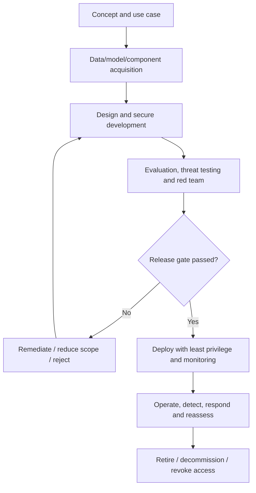
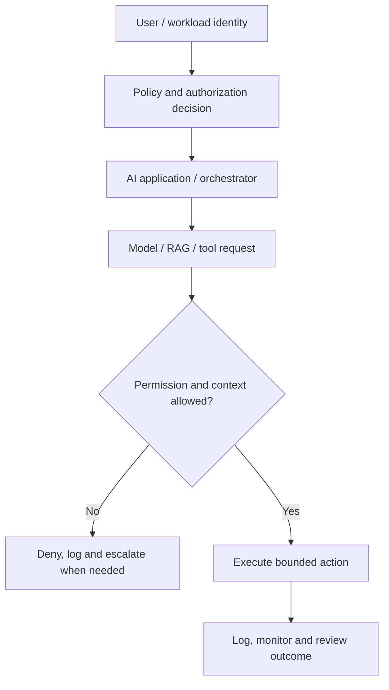
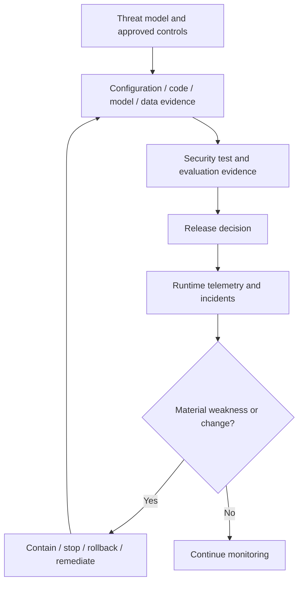

# Manual 07 — AI Security and Lifecycle Implementation Paths

## Essential

Use for bounded AI use cases and smaller environments. Minimum controls:

- inventory, owner, purpose, data/model/component provenance;
- threat model and approved risk treatment;
- least-privilege identities and explicit tool permissions;
- secrets protection and logging;
- secure development/change review;
- pre-deployment evaluation and security testing;
- monitoring, incident escalation, rollback/stop procedures;
- supplier/component tracking and decommissioning evidence.

## Structured

Use for multiple AI systems, cloud services, RAG, external models/APIs, regulated data, or material business impact. Add:

- architecture-level trust-boundary review;
- data/model/supplier lineage;
- prompt-injection and retrieval-boundary testing;
- agent/tool authorization testing;
- adversarial evaluation/red-team scenarios;
- security telemetry and anomaly detection;
- documented release gates and exception governance;
- recurring reassessment after model/data/tool changes.

## Enhanced

Use for high-impact, autonomous/agentic, safety-relevant, enterprise-scale, or highly regulated deployments. Add:

- independent technical challenge and specialized testing;
- strict privilege separation and high-risk action approval;
- sandboxing/containment and egress controls;
- continuous evaluation and attack simulation;
- supplier/component integrity verification;
- resilience, failover, stop/kill and rollback exercises;
- executive risk acceptance and material-incident governance;
- formal retirement, evidence retention, and post-incident lessons learned.

## Lifecycle security route

**Accessible explanation:** Security begins before development and continues through acquisition, design, testing, release, operation, incident response, and retirement. Failed release gates return work for remediation rather than allowing uncontrolled deployment.

## Trust and authorization chain

**Accessible explanation:** Every high-value action should pass through explicit identity, policy, authorization, and context checks. Denied actions fail closed; allowed actions remain bounded and observable.

## Evidence and recovery chain

**Accessible explanation:** Security decisions are traceable from threat models to implementation evidence, testing, release approval, runtime telemetry, and recovery. Material weaknesses or changes trigger containment and renewed evidence rather than relying on stale approval.

## Required control families

1. Governance, ownership, use-case approval, risk appetite, and change authority.
2. Asset, data, model, prompt, vector-store, tool, agent, infrastructure, and supplier inventory.
3. Threat modeling and misuse/abuse-case analysis.
4. Secure SDLC and dependency/component integrity.
5. Data provenance, integrity, privacy, classification, and retention.
6. Model/component provenance and version control.
7. Identity, authentication, authorization, least privilege, and privileged action approval.
8. Prompt injection, indirect injection, RAG poisoning, tool misuse, and agent-control testing.
9. Secrets, keys, tokens, credentials, and service-to-service trust.
10. Evaluation, security testing, red teaming, guardrails, and release criteria.
11. Monitoring, logging, detection, incident response, containment, rollback, and stop mechanisms.
12. Supplier/service risk, contract/evidence requirements, and dependency change monitoring.
13. Retirement, decommissioning, access revocation, data disposition, and evidence retention.

## Security boundary

Defense in depth and testing reduce risk; they do not eliminate it. The manual must distinguish confirmed evidence, assumptions, untested areas, residual risk, and known limitations.
