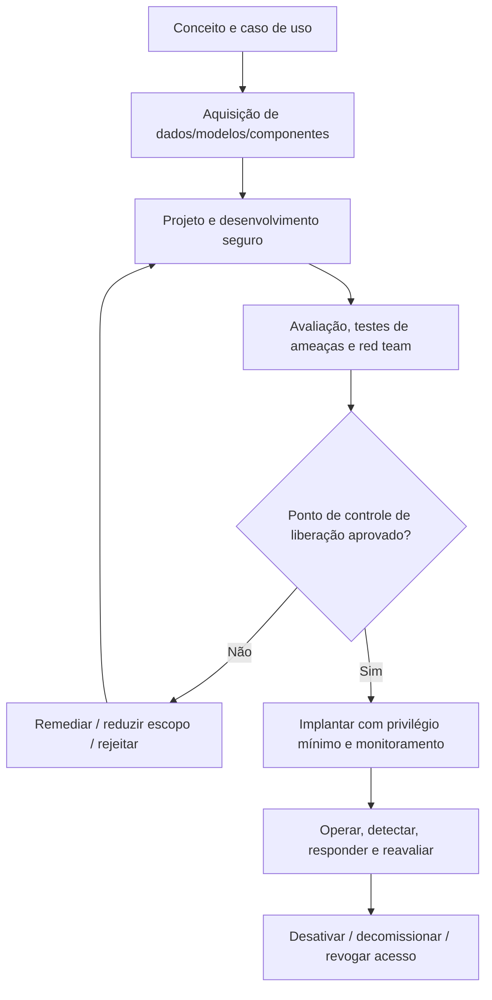
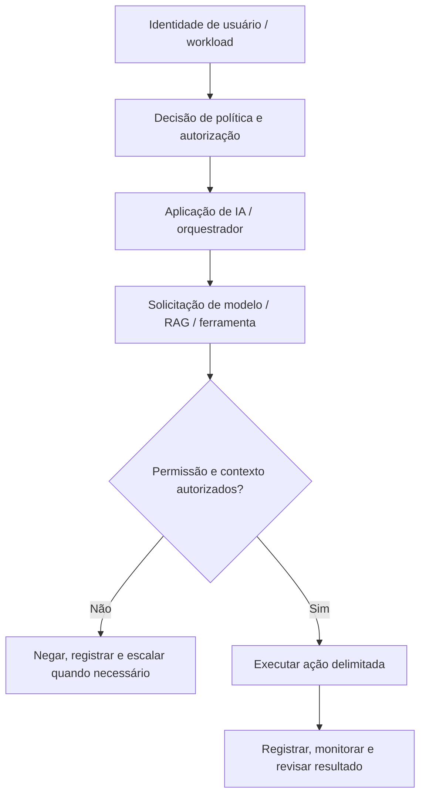
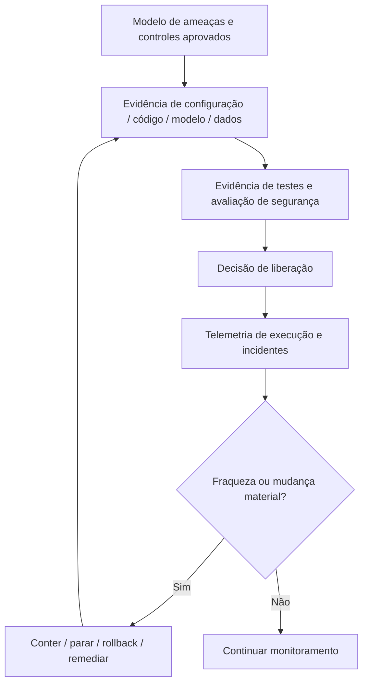

# Manual 07 — Caminhos de Implementação de Segurança e Ciclo de Vida de IA

> Tradução de trabalho sujeita à revisão semântica humana. Este conteúdo preserva o limite de segurança do mestre controlado: reduzir risco não equivale a garantir segurança.

## Essencial

Use para casos de uso de IA delimitados e ambientes menores. Controles mínimos:

- inventário, responsável, finalidade e proveniência de dados/modelos/componentes;
- modelo de ameaças e tratamento de riscos aprovado;
- identidades de privilégio mínimo e permissões explícitas de ferramentas;
- proteção de segredos e logging;
- desenvolvimento seguro e revisão de mudanças;
- avaliação pré-implantação e testes de segurança;
- monitoramento, escalonamento de incidentes e procedimentos de rollback/parada;
- rastreamento de fornecedores/componentes e evidências de decomissionamento.

## Estruturado

Use para múltiplos sistemas de IA, serviços cloud, RAG, modelos/APIs externos, dados regulados ou impacto material de negócio. Acrescente:

- revisão de limites de confiança em nível de arquitetura;
- linhagem de dados/modelos/fornecedores;
- testes de injeção de prompts e limites de recuperação;
- testes de autorização de agentes/ferramentas;
- cenários de avaliação adversarial/red team;
- telemetria de segurança e detecção de anomalias;
- pontos de controle de liberação documentados e governança de exceções;
- reavaliação recorrente após mudanças de modelo/dados/ferramentas.

## Aprimorado

Use para implantações de alto impacto, autônomas/agênticas, relevantes à segurança operacional, de escala empresarial ou altamente reguladas. Acrescente:

- desafio técnico independente e testes especializados;
- separação rigorosa de privilégios e aprovação de ações de alto risco;
- sandboxing/contenção e controles de egress;
- avaliação contínua e simulação de ataques;
- verificação de integridade de fornecedores/componentes;
- exercícios de resiliência, failover, parada/kill e rollback;
- aceitação executiva de riscos e governança de incidentes materiais;
- desativação formal, retenção de evidências e lições pós-incidente.

## Rota de segurança do ciclo de vida

**Explicação acessível:** A segurança começa antes do desenvolvimento e continua durante aquisição, projeto, testes, liberação, operação, resposta a incidentes e desativação. Pontos de controle de liberação reprovados devolvem o trabalho para remediação em vez de permitir implantação sem controle.

## Cadeia de confiança e autorização

**Explicação acessível:** Toda ação de alto valor deve passar por verificações explícitas de identidade, política, autorização e contexto. Ações negadas falham de forma fechada; ações permitidas permanecem delimitadas e observáveis.

## Cadeia de evidências e recuperação

**Explicação acessível:** Decisões de segurança são rastreáveis desde modelos de ameaças até evidências de implementação, testes, aprovação de liberação, telemetria de execução e recuperação. Fraquezas ou mudanças materiais acionam contenção e evidências renovadas, não aprovação obsoleta.

## Famílias de controles obrigatórias

1. Governança, propriedade, aprovação de casos de uso, apetite de risco e autoridade de mudança.
2. Inventário de ativos, dados, modelos, prompts, bancos vetoriais, ferramentas, agentes, infraestrutura e fornecedores.
3. Modelagem de ameaças e análise de casos de uso indevido/abuso.
4. SDLC seguro e integridade de dependências/componentes.
5. Proveniência, integridade, privacidade, classificação e retenção de dados.
6. Proveniência e controle de versão de modelos/componentes.
7. Identidade, autenticação, autorização, privilégio mínimo e aprovação de ações privilegiadas.
8. Injeção direta/indireta de prompts, envenenamento de RAG, uso indevido de ferramentas e testes de controle de agentes.
9. Segredos, chaves, tokens, credenciais e confiança serviço-a-serviço.
10. Avaliação, testes de segurança, red teaming, guardrails e critérios de liberação.
11. Monitoramento, logging, detecção, resposta a incidentes, contenção, rollback e mecanismos de parada.
12. Risco de fornecedores/serviços, requisitos contratuais/de evidência e monitoramento de mudanças de dependências.
13. Desativação, decomissionamento, revogação de acesso, disposição de dados e retenção de evidências.

## Limite de segurança

Defesa em profundidade e testes reduzem risco; não o eliminam. O manual deve distinguir evidência confirmada, premissas, áreas não testadas, risco residual e limitações conhecidas.
