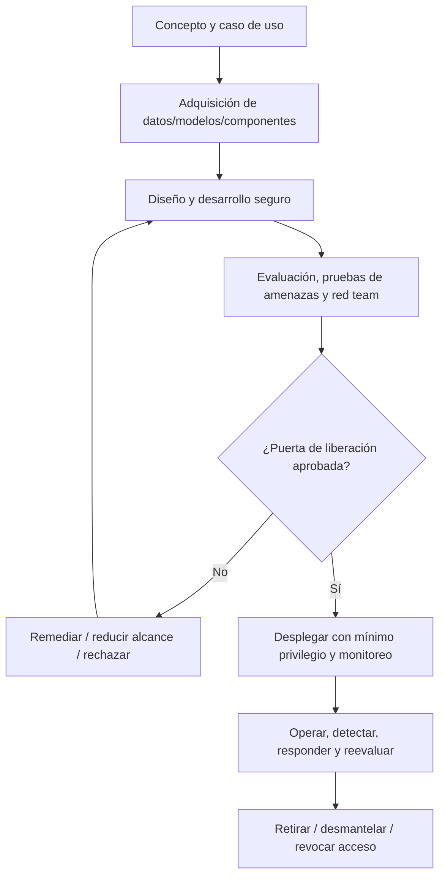
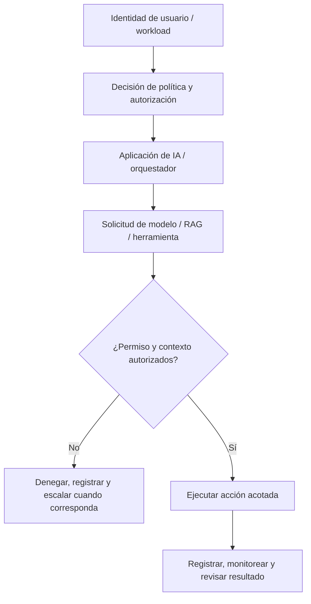
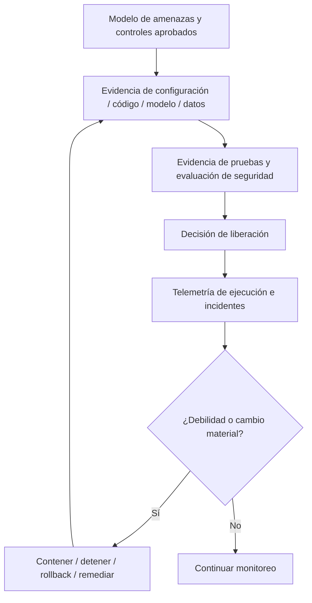

# Manual 07 — Rutas de Implementación de Seguridad y Ciclo de Vida de IA

> Traducción de trabajo para revisión semántica humana. Este contenido conserva el límite de seguridad del maestro controlado: reducir riesgo no equivale a garantizar seguridad.

## Esencial

Úsela para casos de uso de IA acotados y entornos más pequeños. Controles mínimos:

- inventario, responsable, propósito y procedencia de datos/modelos/componentes;
- modelo de amenazas y tratamiento de riesgos aprobado;
- identidades de mínimo privilegio y permisos explícitos de herramientas;
- protección de secretos y logging;
- desarrollo seguro y revisión de cambios;
- evaluación previa al despliegue y pruebas de seguridad;
- monitoreo, escalamiento de incidentes y procedimientos de rollback/detención;
- seguimiento de proveedores/componentes y evidencia de desmantelamiento.

## Estructurada

Úsela para múltiples sistemas de IA, servicios cloud, RAG, modelos/APIs externos, datos regulados o impacto material de negocio. Agregue:

- revisión de límites de confianza a nivel de arquitectura;
- linaje de datos/modelos/proveedores;
- pruebas de inyección de prompts y límites de recuperación;
- pruebas de autorización de agentes/herramientas;
- escenarios de evaluación adversarial/red team;
- telemetría de seguridad y detección de anomalías;
- puertas de liberación documentadas y gobierno de excepciones;
- reevaluación recurrente después de cambios de modelo/datos/herramientas.

## Mejorada

Úsela para despliegues de alto impacto, autónomos/agénticos, relevantes para seguridad operacional, de escala empresarial o altamente regulados. Agregue:

- desafío técnico independiente y pruebas especializadas;
- separación estricta de privilegios y aprobación de acciones de alto riesgo;
- sandboxing/contención y controles de egreso;
- evaluación continua y simulación de ataques;
- verificación de integridad de proveedores/componentes;
- ejercicios de resiliencia, failover, detención/kill y rollback;
- aceptación ejecutiva de riesgos y gobierno de incidentes materiales;
- retiro formal, conservación de evidencia y lecciones posteriores a incidentes.

## Ruta de seguridad del ciclo de vida

**Explicación accesible:** La seguridad comienza antes del desarrollo y continúa durante adquisición, diseño, pruebas, liberación, operación, respuesta a incidentes y retiro. Las puertas de liberación fallidas devuelven el trabajo a remediación en lugar de permitir un despliegue no controlado.

## Cadena de confianza y autorización

**Explicación accesible:** Toda acción de alto valor debe pasar por verificaciones explícitas de identidad, política, autorización y contexto. Las acciones denegadas fallan de forma cerrada; las permitidas permanecen acotadas y observables.

## Cadena de evidencia y recuperación

**Explicación accesible:** Las decisiones de seguridad son trazables desde modelos de amenazas hasta evidencia de implementación, pruebas, aprobación de liberación, telemetría de ejecución y recuperación. Las debilidades o cambios materiales activan contención y evidencia renovada, no aprobación obsoleta.

## Familias de controles requeridas

1. Gobierno, propiedad, aprobación de casos de uso, apetito de riesgo y autoridad de cambio.
2. Inventario de activos, datos, modelos, prompts, almacenes vectoriales, herramientas, agentes, infraestructura y proveedores.
3. Modelado de amenazas y análisis de casos de uso indebido/abuso.
4. SDLC seguro e integridad de dependencias/componentes.
5. Procedencia, integridad, privacidad, clasificación y retención de datos.
6. Procedencia y control de versiones de modelos/componentes.
7. Identidad, autenticación, autorización, mínimo privilegio y aprobación de acciones privilegiadas.
8. Inyección directa/indirecta de prompts, envenenamiento RAG, uso indebido de herramientas y pruebas de control de agentes.
9. Secretos, claves, tokens, credenciales y confianza servicio-a-servicio.
10. Evaluación, pruebas de seguridad, red teaming, guardrails y criterios de liberación.
11. Monitoreo, logging, detección, respuesta a incidentes, contención, rollback y mecanismos de detención.
12. Riesgo de proveedores/servicios, requisitos contractuales/de evidencia y monitoreo de cambios de dependencias.
13. Retiro, desmantelamiento, revocación de accesos, disposición de datos y conservación de evidencia.

## Límite de seguridad

La defensa en profundidad y las pruebas reducen el riesgo; no lo eliminan. El manual debe distinguir evidencia confirmada, suposiciones, áreas no probadas, riesgo residual y limitaciones conocidas.
