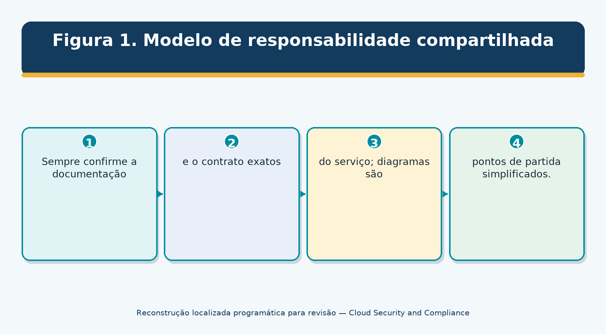
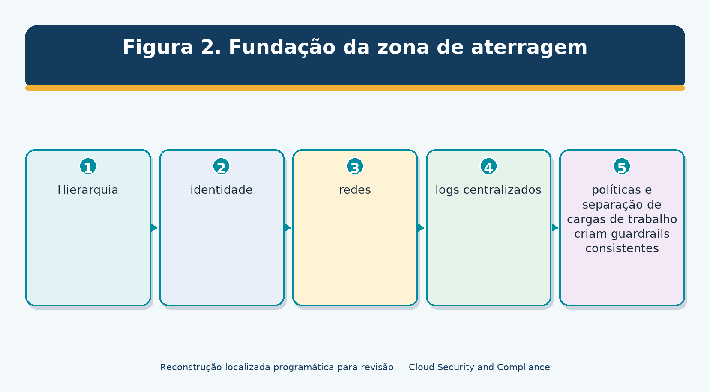
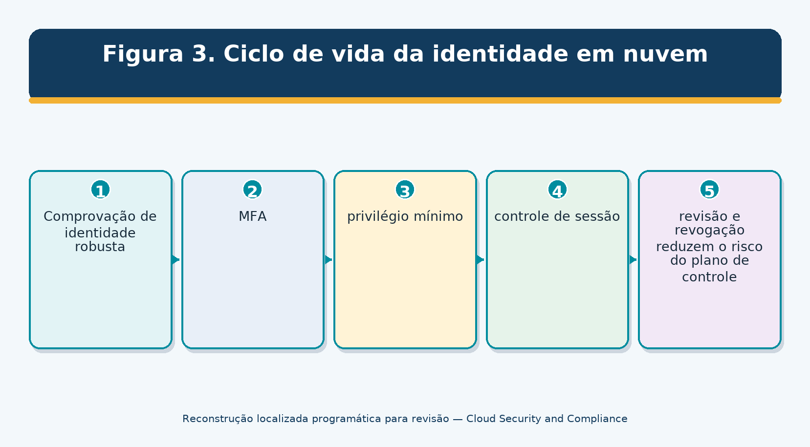
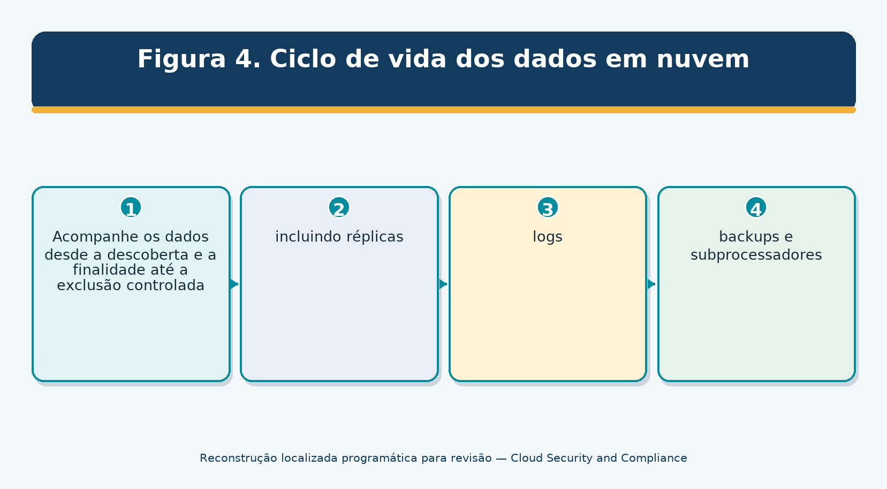
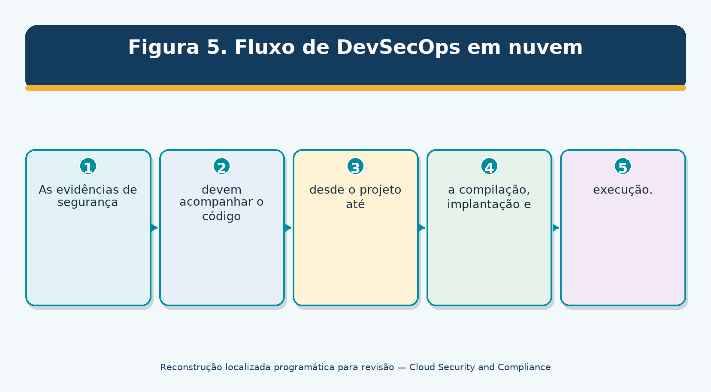
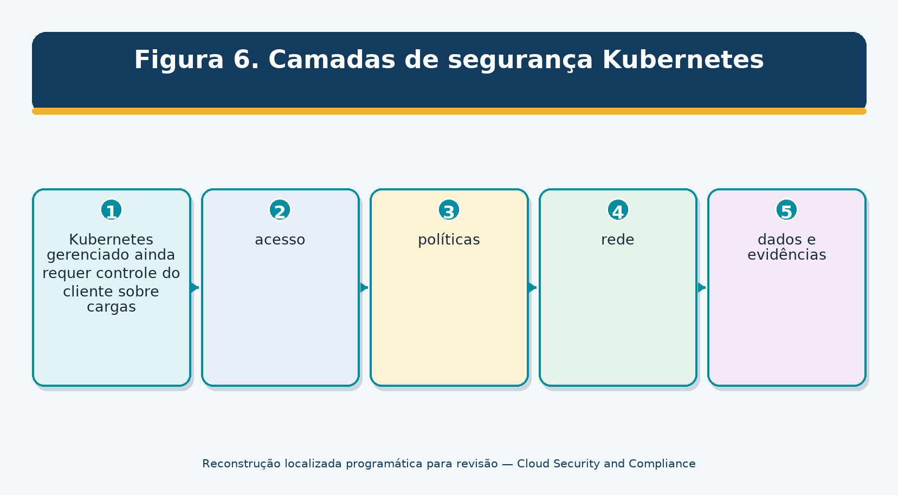
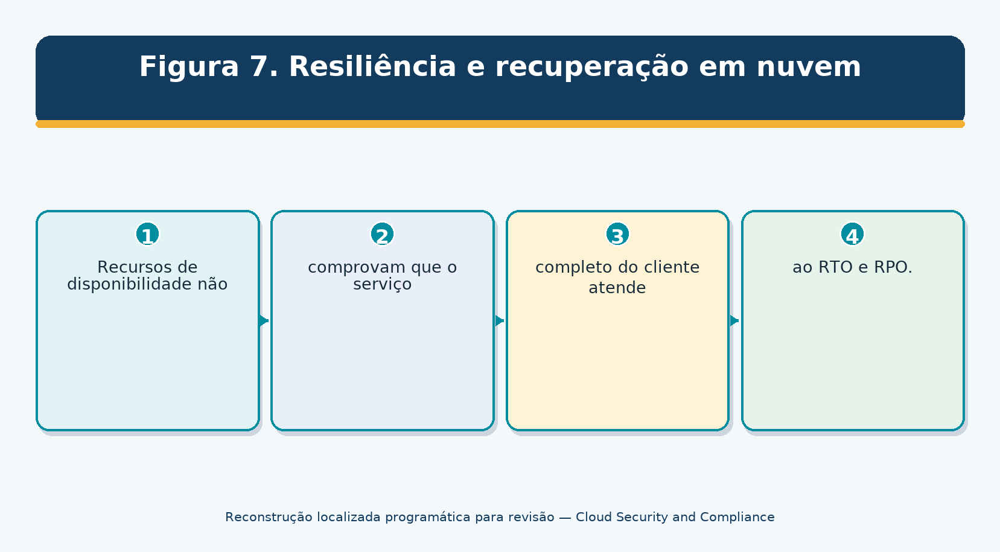
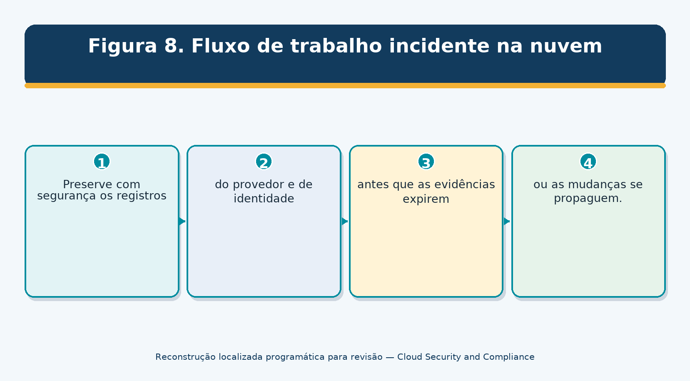
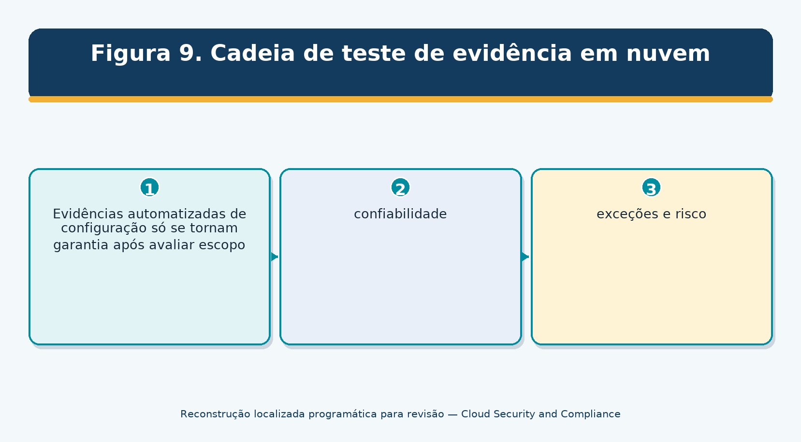
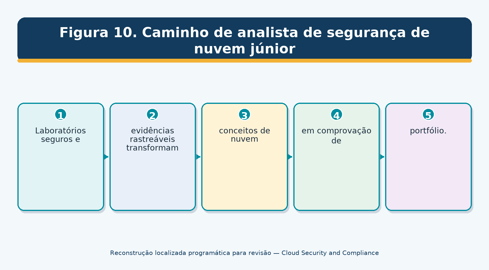

> **Status da revisão:** Rascunho de tradução assistida por máquina. Requer revisão humana de terminologia, significado, links, formatação e atualidade técnica antes de ser marcado como edição final.

** SEGURANÇA DAS CLOUS

** E CONFORMIDADE CLUBE**

Prático Gerente e Manual de Analista Júnior

O que este manual faz: Explica governança segura na nuvem, arquitetura, identidade, redes, dados, cargas de trabalho, aplicativos, Kubernetes, SaaS, monitoramento, resiliência, testes de evidências, CSA CCM v4.1, ferramentas de código aberto, decisões de gerenciamento e trabalho de analista pronto para o trabalho. □
------------------------------------------------------------------------------------------------------------------------------------------------------------------------------------------------------------------------------------

** Alberto (Al) Leiva**

Primeira edição • Julho de 2026

Prefácio

A computação em nuvem muda quem opera tecnologia, como os recursos aparecem rapidamente e onde as responsabilidades de segurança se encontram. Não elimina a responsabilidade. Um provedor seguro ainda pode ter um inquilino inseguro do cliente, design de identidade, aplicação, fluxo de dados, integração ou configuração.

Este manual é neutro e usa linguagem simples. Não é aconselhamento jurídico, uma garantia ou um substituto para a documentação do prestador. Serviços em nuvem, recursos, ameaças, preços, contratos, regiões, padrões e orientação de configuração mudam rapidamente. Confirme fontes oficiais atuais e use nuvem qualificada, segurança, privacidade, legal, arquitetura, engenharia, auditoria e profissionais de negócios para decisões reais.

Nota de informação actual:** Verificado 14 de Julho de 2026. O CSA Cloud Controls Matrix v4.1 é o mais recente lançamento do CCM/CAIQ, lançado em janeiro de 2026, com 207 objetivos de controle em 17 domínios. Recursos CISA SCuBA atuais, orientação de nuvem NIST, CIS Benchmarks, e práticas neutras do provedor são incorporadas.
-----------------------------------------------------------------------------------------------------------------------------------------------------------------------------------------------------------------------------------------------------------------------------------------------------------------------------------------------------------------------------------------------------------------------------------------------------------------------------------------------------------------------------------------------

## Como usar este manual

- Gerentes: comece com Capítulos 1–5, 17–25 e 27.

- Analistas júnior: estudem em ordem, completem os capítulos 26 e 28–29 e usem os modelos.

- Engenheiros em nuvem: foque nos capítulos 4–16 e 19–20.

- GRC e avaliadores: foco nos capítulos 2–5 e 21–24.

- Adapte cada controle e teste ao provedor, serviço, região, arquitetura, dados e responsabilidade do cliente selecionado.

Sumário

Este documento contém uma tabela de conteúdo nativa do Word e um guia de capítulo com número de página permanente.

[Prefácio [2](#preface)](#preface)

[Como usar este manual [2](#how-to-use-this-manual)](#how-to-use-this-manual)

[Quadro de conteúdos [3](#table-of-contents)](#table-of-contents)

[Guia do Capítulo [7](#chapter-guide)](#chapter-guide)

[1. Fundações de segurança em nuvem [8](#cloud-security-foundations)](#cloud-security-foundations)

[1.1 NIST características essenciais [8](#nist-essential-characteristics)](#nist-essential-characteristics)

[2. Modelos de serviço e responsabilidade partilhada [9](#service-models-and-shared-responsibility)](#service-models-and-shared-responsibility)

[2.1 Matriz de responsabilidade [9](#responsibility-matrix)](#responsibility-matrix)

[3. Governança em nuvem, estratégia e apetito de risco [10](#cloud-governance-strategy-and-risk-appetite)](#cloud-governance-strategy-and-risk-appetite)

[3.1 Elementos do programa [10](#program-elements)](#program-elements)

[4. Inventário, Contas, Assinaturas e Propriedade [11](#inventory-accounts-subscriptions-and-ownership)](#inventory-accounts-subscriptions-and-ownership)

[4.1 Inventário [11](#inventory)](#inventory)

[4.2 Reconciliação [11](#reconciliation)](#reconciliation)

[5. Zonas seguras de arquitectura e aterragem [12](#secure-architecture-and-landing-zones)](#secure-architecture-and-landing-zones)

[5.1 Princípios de arquitectura [12](#architecture-principles)](#architecture-principles)

[6. Identidade e acesso privilegiado [13](#identity-and-privileged-access)](#identity-and-privileged-access)

[6.1 Identidade humana [13](#human-identity)](#human-identity)

[6.2 Identidade da carga de trabalho [13](#workload-identity)](#workload-identity)

[7. Segurança da rede e da conectividade [14](#network-and-connectivity-security)](#network-and-connectivity-security)

[7.1 Controlos de rede [14](#network-controls)](#network-controls)

[8. Segurança e privacidade dos dados [15](#data-security-and-privacy)](#data-security-and-privacy)

[8,1 Controlos de dados [15](#data-controls)](#data-controls)

[9. Criptografia, Chaves, Certificados e Segredos [16](#encryption-keys-certificates-and-secrets)](#encryption-keys-certificates-and-secrets)

[9.1 Gestão de chaves [16](#key-management)](#key-management)

[9.2 Segredos e certificados [16](#secrets-and-certificates)](#secrets-and-certificates)

[10. Registo, Monitorização e Detecção [17](#logging-monitoring-and-detection)](#logging-monitoring-and-detection)

[10.1 Desenho de registo [17](#logging-design)](#logging-design)

[10.2 Limitações dos elementos de prova [17](#evidence-limitations)](#evidence-limitations)

[11. Gestão da Vulnerabilidade, Patch e Exposição [18](#vulnerability-patch-and-exposure-management)](#vulnerability-patch-and-exposure-management)

[11.1 Gestão contínua da exposição [18](#continuous-exposure-management)](#continuous-exposure-management)

[12. Calcular, Armazenar, Base de Dados e Segurança de Endpoint [19](#compute-storage-database-and-endpoint-security)](#compute-storage-database-and-endpoint-security)

[13. Segurança de Aplicações e DevSecOps [20](#application-security-and-devsecops)](#application-security-and-devsecops)

[13.1 Entrega segura [20](#secure-delivery)](#secure-delivery)

[14. Infra-estrutura como código e política como código [21](#infrastructure-as-code-and-policy-as-code)](#infrastructure-as-code-and-policy-as-code)

[14.1 Comandos IaC [21](#iac-controls)](#iac-controls)

[14.2 Política como código [21](#policy-as-code)](#policy-as-code)

[15. Containers e Kubernetes [22](#containers-and-kubernetes)](#containers-and-kubernetes)

[15.1 Comandos de agrupamento [22](#cluster-controls)](#cluster-controls)

[16. Serviços sem servidor, APIs e conduzidos a eventos [23](#serverless-apis-and-event-driven-services)](#serverless-apis-and-event-driven-services)

[16.1 Comandos sem servidor [23](#serverless-controls)](#serverless-controls)

[16.2 Segurança API [23](#api-security)](#api-security)

[17. Aplicações de segurança e de negócio da SaaS [24](#saas-security-and-business-applications)](#saas-security-and-business-applications)

[17.1 Revisão SaaS [24](#saas-review)](#saas-review)

[18. Nuvem multinuvem, híbrida e portabilidade [25](#multi-cloud-hybrid-cloud-and-portability)](#multi-cloud-hybrid-cloud-and-portability)

[18.1 Desafios comuns [25](#common-challenges)](#common-challenges)

[18.2 Estratégia [25](#strategy)](#strategy)

[19. Resiliência, Backup e Recuperação de Desastres [26](#resilience-backup-and-disaster-recovery)](#resilience-backup-and-disaster-recovery)

[19.1 Design de resiliência [26](#resilience-design)](#resilience-design)

[20. Resposta a incidentes na nuvem e forenses [27](#cloud-incident-response-and-forensics)](#cloud-incident-response-and-forensics)

[20.1 Preparar [27](#prepare)](#prepare)

[20.2 Responder [27](#respond)](#respond)

[21. Privacy, Legal, Contract, and Data Residency [28](#privacy-legal-contract-and-data-residency)](#privacy-legal-contract-and-data-residency)

[21.1 Privacy and legal review [28](#privacy-and-legal-review)](#privacy-and-legal-review)

[22. CSA Cloud Controls Matrix v4.1 Domínios [29](#csa-cloud-controls-matrix-v4.1-domains)](#csa-cloud-controls-matrix-v4.1-domains)

[22.1 Como utilizar CCM e CAIQ [29](#how-to-use-ccm-and-caiq)](#how-to-use-ccm-and-caiq)

[23. Evidências de segurança e provedor de nuvem [30](#cloud-assurance-and-provider-evidence)](#cloud-assurance-and-provider-evidence)

[24. Avaliação, testes de provas e métricas [31](#assessment-evidence-testing-and-metrics)](#assessment-evidence-testing-and-metrics)

[24.1 Método de ensaio [31](#test-method)](#test-method)

[25. Serviços de IA e risco de nuvem emergente [32](#ai-services-and-emerging-cloud-risk)](#ai-services-and-emerging-cloud-risk)

[25.1 Avaliação da nuvem de IA [32](#ai-cloud-assessment)](#ai-cloud-assessment)

[26. Ferramentas de Código Aberto [33](#open-source-tools)](#open-source-tools)

[26.1 Prowler [33](#prowler)](#prowler)

[26.2 ScoutSuite [33](#scoutsuite)](#scoutsuite)

[26.3 Vapor [34](#steampipe)](#steampipe)

[26.4 Custódia em nuvem [34](#cloud-custodian)](#cloud-custodian)

[26.5 Checkov [34](#checkov)](#checkov)

[26.6 Trivy [34](#trivy)](#trivy)

[26,7 tfsec [34](#tfsec)](#tfsec)

[26.8 Terrascan [35](#terrascan)](#terrascan)

[26. 9 OpenTofu [35] (#opentofu)] (#opentofu)

[26.10 Agente de política aberta [35](#open-policy-agent)](#open-policy-agent)

[26.11 Kyverno [35](#kyverno)](#kyverno)

[26,12 kube-bench [35](#kube-bench)](#kube-bench)

[26.13 kube-hunter [36](#kube-hunter)](#kube-hunter)

[26.14 Falco [36](#falco)](#falco)

[26,15 Gitleaks [36](#gitleaks)](#gitleaks)

[26.16 TruffleHog [36](#trufflehog)](#trufflehog)

[26,17 Wazuh [37](#wazuh)](#wazuh)

[26.18 DefectDojo [37](#defectdojo)](#defectdojo)

[27. Manual de segurança em nuvem para gerentes [38](#managers-cloud-security-playbook)](#managers-cloud-security-playbook)

[27.1 Ritmo operacional [38](#operating-rhythm)](#operating-rhythm)

[28. Guia de carreira do analista júnior [39](#junior-analyst-career-guide)](#junior-analyst-career-guide)

[28.1 Funções comuns [39](#common-roles)](#common-roles)

[28.2 Trabalho típico [39](#typical-work)](#typical-work)

[29. Laboratório Fictício, Plano de Trinta Dias e Preparação de Entrevistas [40](#fictional-laboratory-thirty-day-plan-and-interview-preparation)](#fictional-laboratory-thirty-day-plan-and-interview-preparation)

[29.1 Laboratório de carteira [40](#portfolio-lab)](#portfolio-lab)

[29.2 Plano de trinta dias [40](#thirty-day-plan)](#thirty-day-plan)

[29.3 O que é responsabilidade partilhada? [40](#what-is-shared-responsibility)](#what-is-shared-responsibility)

[29,4 IaaS versus PaaS versus SaaS? [41](#iaas-versus-paas-versus-saas)](#iaas-versus-paas-versus-saas)

[29.5 Por que a identidade é crítica na nuvem? [41](#why-is-identity-critical-in-cloud)](#why-is-identity-critical-in-cloud)

[29.6 O que é uma zona de aterragem? [41](#what-is-a-landing-zone)](#what-is-a-landing-zone)

[29,7 CCPM versus avaliação? [41](#cspm-scan-versus-assessment)](#cspm-scan-versus-assessment)

[29.8 O que é a infraestrutura como código? [41](#what-is-infrastructure-as-code)](#what-is-infrastructure-as-code)

[29.9 Como você protege segredos? [41](#how-do-you-secure-secrets)](#how-do-you-secure-secrets)

[29.10 Como verificar a recuperação da nuvem? [41](#how-do-you-verify-cloud-recovery)](#how-do-you-verify-cloud-recovery)

[29.11 O que é CSA CCM v4.1? [41](#what-is-csa-ccm-v4.1)](#what-is-csa-ccm-v4.1)

[29,12 O que faz um bom analista júnior? [41](#what-makes-a-good-junior-analyst)](#what-makes-a-good-junior-analyst)

[30. Modelos, Glossário, Índice e Referências [42](#templates-glossary-index-and-references)](#templates-glossary-index-and-references)

[30.1 Inventário de nuvem e registro de responsabilidade [42](#cloud-inventory-and-responsibility-record)](#cloud-inventory-and-responsibility-record)

[30.2 Papel de controlo em nuvem [42](#cloud-control-workpaper)](#cloud-control-workpaper)

[30.3 Revisão da garantia do prestador [42](#provider-assurance-review)](#provider-assurance-review)

[30,4 Registo de incidentes e recuperação [42](#incident-and-recovery-record)](#incident-and-recovery-record)

[30,5 Glossário [43](#glossary)](#glossary)

[30,6 Índice de assunto [43](#subject-index)](#subject-index)

[30.7 Referências oficiais [44](#official-references)](#official-references)

Guia do Capítulo

Capítulo** Título** Início na página**
------------------------------------------------------------------------------------------------------------------------------------------
Fundações de segurança em nuvem
2 Modelos de Serviço e Responsabilidade Partilhada
3. Governança em nuvem, estratégia e apetite de risco
Inventário, Contas, Assinaturas e Propriedade
5 . . . Arquitetura segura e zonas de desembarque . . .
6.o Acesso Privilegiado e Identidade
Segurança de Rede e Conectividade
Segurança e Privacidade de Dados ..
9 , Chaves, Certificados e Segredos
O registro, o monitoramento e a detecção
Gestão da Vulnerabilidade, Patch e Exposição ..
Computar, armazenar, banco de dados e segurança de endpoint
Segurança de Aplicação e DevSecOps
. . 14 . . Infraestrutura como código e política como código . . .
15 Recipientes e Kubernetes 19
Serviços sem servidor, APIs e eventos
□ 17 □ SaaS Aplicações de Segurança e Negócios
□ 18 □ Multi-Cloud, Hybrid Cloud e Portabilidade
19 Resiliência, Backup e Recuperação de Desastres
Resposta a Incidentes na Nuvem e Perícias
Privacidade, Jurídico, Contrato e Residência de Dados
Domínios da Matrix v4.1 da CSA Controla a Nuvem
• 23 • Garantia de nuvem e evidência do provedor
Avaliação, Teste de Evidências e Métricas
25 Serviços de IA e risco de nuvem emergente 31
26 Ferramentas Open-Source 32
Livro de jogos de segurança em nuvem do gerente do 27
Guia de carreira do analista júnior
29o Laboratório Fictício, Plano de Trinta Dias e Preparação de Entrevistas
Modelos, Glossário, Índice e Referências

# 1. Cloud Security Foundations

* Segurança em nuvem protege rapidamente a mudança de tecnologia, identidades, dados, aplicações e serviços compartilhados.*

## 1.1 NIST características essenciais

- Auto-serviço sob demanda: os consumidores podem fornecer recursos sem interação manual do provedor.

- Acesso amplo à rede: as capacidades estão disponíveis através de redes através de mecanismos padrão.

- Concentração de recursos: os recursos do fornecedor servem múltiplos consumidores com independência de localização em nível de abstração.

- Rápida elasticidade: os recursos podem escalar rapidamente e podem parecer ilimitados.

- Serviço medido: o uso é monitorado, controlado e relatado.

. . . . . . . . . . . . . .
--------------------------------------------------------
• Nuvem pública • Infraestrutura do provedor compartilhada entre os clientes com isolamento lógico
· Nuvem privada · Capacidade da nuvem dedicada a uma organização • Organização opera mais responsabilidade de infraestrutura
* Nuvem comunitária * Partilhada por organizações com necessidades comuns * Governança conjunta, adesão, requisitos comuns *
□ Nuvem híbrida □ Conectado ambientes de nuvem distintos □ Identidade, dados, rede, política, monitoramento, portabilidade

□ **Cloud não é igual a seguro por padrão:** Velocidade, automação, serviços gerenciados e infraestrutura resistente podem melhorar a segurança, mas os erros também escalam rapidamente. Governança e guardas devem mover-se em velocidade de nuvem.
-------------------------------------------------------------------------------------------------------------------------------------------------------------------------------------------------------------

# 2. Modelos de serviço e responsabilidade compartilhada

*O provedor e o cliente dividem a responsabilidade de forma diferente em IaaS, PaaS e SaaS.*

Figura 1. Modelo de responsabilidade compartilhada

* **Modelo** **O Provider opera geralmente** **O Cliente opera geralmente**
--------------------------------------------------------------------------------------------------------------------------------------------------------------------------------------------------------------------------------------------------------------------
Facilidades, hardware físico, virtualização do núcleo e infraestrutura de serviço
□ PaaS □ IaaS plus managed runtime/platform components
Plataforma de aplicação e infra-estrutura subjacente .Usuários, funções, configurações de inquilino, escolhas de dados, integrações, endpoints, monitoramento .
• FaaS/serverless • Infraestrutura e execução gerenciada em tempo de execução • Código, dependências, permissões, eventos, segredos, dados, configuração, observação

## 2.1 Matriz de responsabilidade

- Para cada controle, provedor de nome, cliente, parcela compartilhada, fonte de evidência, referência de contrato, avaliador, serviço de incidente, e mudança / saída de responsabilidade.

- Um relatório do prestador pode abranger a infra-estrutura enquanto o cliente deve testar a configuração e a utilização do inquilino.

- Gerenciado não significa não propriedade; o cliente ainda escolhe configurações, identidades, dados, integrações e risco aceitável.

# 3. Governança em nuvem, estratégia e apetite de risco

* Conjuntos de governo permitidos uso de nuvem, propriedade, arquitetura, guardrails, risco e escalada.*

## 3.1 Elementos do programa

- Estratégia de nuvem, política, provedores/serviços/regiões aprovados, usos proibidos, regras de dados e processo de exceção.

- Centro de excelência na nuvem ou propriedade equivalente entre segurança, plataforma, arquitetura, finanças, privacidade, compras, equipes legais e empresariais.

- Hierarquia da conta/assinatura/projeto, padrões de zona de aterragem, federação de identidade, modelo de rede, registo, gestão de chaves, nomeação/marcação e controlos de base.

- Risco de apetite e aumento obrigatório para exposição pública, dados sensíveis, acesso privilegiado, serviços não suportados, concentração e restrições legais.

- Diligenciamento do provedor, contratos, registros de responsabilidade compartilhada, garantia, monitoramento, coordenação de incidentes, portabilidade e saída.

- Métricas, melhoria contínua, formação, coordenação custo/segurança e gestão técnica da dívida.

** ** ** ** ** ** **
---------------------------------------------------------
Patrocinador executivo, direção, recursos, risco material, concentração do provedor
Equipe de plataforma em nuvem □ Zonas de desembarque, serviços compartilhados, guardiões, operações
Proprietário de carga de trabalho; finalidade de negócio, dados, configuração, risco, recuperação, custo;
Segurança / GRC Requisitos, revisão de arquitetura, monitoramento, avaliação, descobertas
Equipa de identidade .. Federação, MFA, privilégio, identidades de serviço, ciclo de vida ..
Privacy / legal / concurse . Funções de dados, residência, contrato, direitos, termos do provedor .
FinOps, visibilidade de custos, propriedade, desperdício, compromisso e tradeoffs de risco
• Auditoria interna/avaliador

# 4. Inventário, Contas, Assinaturas e Propriedade

*Recursos de nuvem desconhecidos não podem ser governados, protegidos, monitorados ou aposentados.*

## 4.1 Inventário

- Organizações/donos, grupos de gestão/pastas, contas/assinaturas/projetos, regiões, proprietários de recursos, finalidade de negócios, ambientes e links de faturamento.

- Serviços, recursos, imagens, containers, funções, bases de dados, armazenamento, redes, identidades, políticas, chaves, segredos, certificados, domínios, logs, integrações e provedores.

- Categorias de dados, residência, retenção, exposição, criptografia, backup, recuperação e compartilhamento.

- Endpoints públicos, caminhos privilegiados, confiança entre contas, acesso de terceiros, SaaS não gerenciado e nuvem de sombra.

- Tags / rótulos para proprietário, aplicação, ambiente, classe de dados, custo, criticidade, nível de recuperação, expiração e escopo de conformidade.

4.2 Reconciliação

- Compare APIs de provedor de nuvem com CMDB, repositórios de IAC, identidade, DNS, rede, aquisição, finanças, vulnerabilidade e fontes de monitoramento.

- Investigar recursos órfãos, não marcados, desconhecidos, duplicados, inativos, não aprovados e expostos publicamente.

- Automatizar a descoberta, mas manter o proprietário responsável revisão e desactivar provas.

# 5. Arquitetura segura e zonas de desembarque

*Zonas de terra fornecem bases seguras reutilizáveis antes das cargas de trabalho chegarem.*

Figura 2. Fundação da zona de aterragem

# # 5.1 Princípios de arquitetura

- Produção separada, não produção, segurança, registro, rede, serviços compartilhados e ambientes sandbox de acordo com o risco.

- Centralizar federação de identidade, acesso de emergência, registro de auditoria, monitoramento de segurança, DNS, conectividade, política e imagens aprovadas, quando apropriado.

- Utilizar políticas de negação/guarda-redes para configurações perigosas e controles preventivos para ações de alto risco.

- Domínios de falha de concepção, regiões/zonas, quotas, capacidade, limites de serviço e recuperação de requisitos BIA.

- Documento limites de confiança, caminhos administrativos, fluxos de dados, serviços de provedor, terceiros, e responsabilidades cliente/fornecedor.

- Implantar a configuração da zona de aterragem e da carga de trabalho através do código revisto controlado pela versão.

6. Identidade e Acesso Privilegiado

* Planos de controle em nuvem fazem ativos críticos de identidade, tokens, papéis e principais de serviço.*

Figura 3. Ciclo de vida da identidade em nuvem

6.1 Identidade humana

- Federar a um provedor de identidade autoritário; evitar identidades locais não gerenciadas na nuvem, exceto em emergências controladas.

- Requer MFA resistente ao phishing onde o risco justifique, especialmente administradores e ações sensíveis.

- Use o acesso baseado em funções/atributos, privilégio de just-in-time, aprovação, sessões curtas e identidades administrativas separadas.

- Controle convidado, contratante, suporte, vidro de ruptura, recuperação e acesso ao provedor.

- Rever direitos, contas inactivas, combinações tóxicas, confiança cruzada e utilização efectiva.

6.2 Identidade da carga de trabalho

- Prefere a identidade de carga de trabalho de curta duração e identidade gerenciada sobre chaves estáticas incorporadas.

- Permissões de escopo para obter recursos/ações exatas e separar identidades de compilação, implantação, execução e suporte.

- Donos de inventário, finalidade, credenciais, último uso, rotação, política de confiança e serviços dependentes.

- Detectar novo privilégio, federação, criação chave, consentimento, personificação, e uso token incomum.

# 7. Segurança de Rede e Conectividade

* Redes de nuvem combinam construções de provedor, exposição à internet, conectividade privada e controles de camada de aplicação.*

## 7.1 Controlos de rede

- Documentar redes virtuais, sub-redes, roteamento, gateways, peering, endpoints privados, balanceadores de carga, firewalls, proxies, DNS, endpoints de serviço e links no local.

- Negar padrão onde prático; restringir interfaces de gestão e usar caminhos administrativos controlados.

- Segmento por confiança, ambiente, aplicação, dados e raio de explosão; evitar roteamento transitivo acidental.

- Use proteção consciente de aplicativos, controles DDoS, firewalls de aplicativos web, gateways API, restrições de saída e segurança DNS de acordo com o risco.

- Criptografar tráfego, validar certificados, proteger conectividade privada e monitorar fluxo/DNS/proxy/registros de aplicação.

- Encontrar continuamente IPs públicos, regras abertas, grupos de segurança permissivos, armazenamento/base de dados expostos e túneis de sombra.

# 8. Segurança de Dados e Privacidade

* A segurança dos dados em nuvem começa com finalidade, localização, classificação e minimização.*

Figura 4. Ciclo de vida dos dados em nuvem

8.1 Controlos de dados

- Inventário dados estruturados/não estruturados, objetos, bancos de dados, instantâneos, análises, logs, caches, índices, lojas de IA, backups, exportações e réplicas.

- Classificar por sensibilidade, regulação, contrato, valor comercial e efeito sobre as pessoas.

- Minimizar coleta, campos, retenção, cópias, locais, acesso, compartilhamento e uso de treinamento.

- Usar políticas de recursos, identidade, caminhos de rede, criptografia, mascaramento/tokenização, DLP e monitoramento.

- Proteger metadados e backups; impedir o acesso do público e compartilhamento inter-atendimento/conta, a menos que aprovado.

- Retenção de teste, retenção legal, exportação, correção, exclusão, expiração de backup, e exclusão provedor / subprocessador.

A residência de dados é mais do que um selector de regiões:** Considere armazenamento primário, réplicas, backups, logs, suporte, subprocessadores, telemetria, recuperação de desastres, administração e acesso legal ao governo.
---------------------------------------------------------------------------------------------------------

# 9. Criptografia, Chaves, Certificados e Segredos

* A criptografia falha quando chaves, segredos, certificados, algoritmos e permissões são mal gerenciados.*

## 9.1 Gestão de chaves

- Define as escolhas de chave externa, gerenciadas pelo provedor, gerenciadas pelo cliente ou fornecidas pelo cliente por risco e obrigação.

- Administração de chave separada, uso de chave, administração de nuvem, e auditoria onde prático.

- Controle criação, importação, backup, rotação, versão, desativação, atraso de exclusão, recuperação, garantia e destruição.

- Restrinja políticas-chave e subvenções cruzadas; monitorize todos os usos administrativos e criptográficos.

- Plano perda, compromisso, falha na região, saída do provedor e restauração de backup criptografada.

9.2 Segredos e certificados

- Use gerentes secretos aprovados; nunca coloque segredos em fontes, imagens, logs, tickets, chat, estado de IaC ou arquivos de usuário.

- Prefere credenciais de curta duração e rotação automática; proprietário do inventário, finalidade, escopo, última utilização, expiração e dependências.

- Automatizar emissão/renovação de certificados com confiança controlada, proteger chaves privadas, detectar validade e criação de certificados não autorizados.

# 10. Registro, Monitoramento e Detecção

* Evidências em nuvem são úteis quando os eventos de controle-plano, plano de dados, carga de trabalho, identidade e aplicação são ativados e revisados.*

## 10.1 Desenho de registo

- Definir eventos necessários antes da implantação: administrativa, identidade, política, acesso a dados, rede, carga de trabalho, aplicação, banco de dados, chave, armazenamento, segurança, suporte e eventos de provedor.

- Habilitar a cobertura de toda a organização e de toda a região; contabilizar novas contas/serviços e serviços que exigem configurações de dados-evento separadas.

- Centralizar para uma conta de segurança protegida, restringir alteração/deleção, usar sincronização de tempo e controles de integridade, e reter por risco/obrigação.

- Normalizar identidade, recurso, ação, resultado, fonte, localização, sessão, solicitação de ID, e tempo sem perder evidência bruta.

- Monitorar desativação de registro, exclusões, mudança de retenção, novas ações privilegiadas, exposição pública, eventos chave/secretos e acesso a dados anômalos.

## 10.2 Limitações de evidência

- Os registos dos fornecedores podem ser atrasados, amostrados, opcionais, extra-custos, específicos da região ou indisponíveis após uma retenção curta.

- Criptografia limita a visibilidade do conteúdo da rede; aplicação e contexto de identidade tornam-se mais importantes.

- Validar que alertas criam casos investigados e ações corretivas – não apenas painéis.

# 11. Gestão de Vulnerabilidade, Patch e Exposição

*A exposição à nuvem muda continuamente através da configuração, código, imagens, dependências, identidades e serviços de provedores.*

11.1 Gestão contínua da exposição

- Inventário recursos voltados para a internet, caminhos de ataque, identidades, software, imagens, pacotes, APIs, armazenamento, bancos de dados, funções e conexões de terceiros.

- Utilizar avisos de provedor, feeds de vulnerabilidade, regras de postura/configuração, varreduras autenticadas de carga de trabalho, varreduras de imagem/dependência, varreduras secretas e testes de penetração onde autorizado.

- Priorizar a exploração, a acessibilidade à Internet, privilégio, dados sensíveis, criticidade comercial, controles compensadores e ameaça ativa – não apenas marcar.

- Patch ou mitigar infra-estrutura, SO, tempo de execução, aplicação, container, função, dependência, aparelho e ações do cliente gerenciado.

- Rastreie falhas responsáveis pelo provedor e avisos de serviço; verifique a configuração do cliente e as opções de versão.

- Corrigir retestes e medir cobertura populacional, tempo, exceções e recorrência.

# 12. Calcular, Armazenamento, Banco de Dados e Segurança de Endpoint

*Cada serviço gerenciado remove algum trabalho operacional, mas cria responsabilidades de configuração e integração.*

* Resource** ** Foco de segurança** ** Evidência**
---------------------------------------------------------------------------------------------------------------------------------------------------------------------------------------------------------------------
□ Máquinas virtuais □ Imagens, patching, endurecimento, EDR, discos, metadados, caminho de administração
□ Armazenamento de objetos □ Acesso público, políticas, criptografia, versão, retenção, registro de políticas eficazes, logs de acesso, ciclo de vida, configurações de bloco público
□ Banco de dados gerenciado; Rede, identidade, administrador, criptografia, backups, auditoria, versão; config export, usuários/roles, logs, teste de restauração, manutenção;
□ Armazenamento em bloco/arquivo □ Anexamento, criptografia, instantâneos, compartilhamento, backup, exclusão de inventário, políticas, instantâneos, registros de restauração/deleção
* Gerenciado desktop/endpoint * Identidade, postura do dispositivo, aplicativos, dados, sessões, registro * inscrição, política, acesso, eventos, testes de limpeza/terminação *
□ Marketplace image/service • Publisher, procedência, permissões, atualizações, dados, contrato • aprovação, versão, SBOM/conselheiro, digitalização, evidência do fornecedor

# 13. Segurança de Aplicações e DevSecOps

* Aplicações em nuvem herdam risco de design, código, dependências, pipelines, identidades, APIs e serviços gerenciados.*

Figura 5. Fluxo de DevSecOps em nuvem

# # 13.1 Entrega segura

- Ameaça limites de confiança modelo, dados, casos de abuso, identidade, isolamento do inquilino, dependências do provedor, resiliência e comportamento de falha.

- Use revisão de código, dependência/SBOM, segredos, SAST, IaC, recipiente, API, DAST, e testes manuais adequados ao risco.

- Proteja a fonte, ramos, commits, corredores, sistemas de construção, artefatos, registros, chaves de assinatura, implantações e aprovações de produção.

- Use a identidade de pipeline de curta duração, separação de deveres, ambientes protegidos, procedência assinada, artefatos imutáveis e rollback.

- Implantar observação, manipulação segura de erros, limites de taxa, controles de entrada/saída e ganchos incidentes.

- Rastreie vulnerabilidades e exceções para remediação e reteste verificados.

# 14. Infraestrutura como Código e Política como Código

* Infraestrutura e política como código tornam as decisões na nuvem repetiveis, revetíveis, testáveis e escaláveis.*

# # 14.1 Controlos IaC

- Utilizar módulos aprovados, versões/fornecedores fixos, registos de confiança, propriedade de código, revisão por pares, protecção de sucursais e libertações assinadas sempre que necessário.

- Analisar código e plano para configuração inseguro, segredos, dependências de risco, exposição pública, privilégio, criptografia, registro e resiliência.

- Proteja arquivos de estado, saída de plano, credenciais, infra-estruturas, fechaduras, informações de deriva, e registros de CI.

- Requer revisão do plano e aprovação antes da produção aplicar-se; restringir alterações diretas do console e detectar deriva.

- Teste de retrocesso, proteção de exclusão, importação, migração e comportamento de falha.

## 14.2 Política como código

- Use guardas preventivos para estados proibidos e políticas detetives para condições que exigem investigação.

- Teste permitido, negado, exceção, falta de dados, e casos de mudança de serviço.

- Regra da versão, proprietário, raciocínio, escopo, severidade, data efetiva, mapeamento, exceção e rollback.

- Nunca permitir ampla remediação automatizada sem corrida a seco, revisão de raios de explosão, aprovação, registro e recuperação.

15. Containers e Kubernetes

* Kubernetes distribui responsabilidade através do plano de controle do provedor, configuração de cluster, nós, imagens, cargas de trabalho, rede e identidade.*

Figura 6. Camadas de segurança Kubernetes

## 15.1 Controles de clusters

- Inventário clusters, versões, proprietários, cargas de trabalho, namespaces, nós, registros, identidades, dados, entrada e responsabilidade do provedor.

- Seguro API acesso, federação, RBAC, contas de serviço, identidade de carga de trabalho, admissão, registros de auditoria e acesso de emergência.

- Use imagens assinadas mínimas confiáveis, verificações de vulnerabilidade/SBOM, execução não-root, sistemas de arquivos somente de leitura, recursos abandonados, limites de recursos e gerentes secretos.

- Aplicar namespace e segmentação de rede, controle de saída, criptografia, proteção de armazenamento, backups, aplicação de políticas e detecção de tempo de execução.

- Patch suporta versões de cluster / nó e atualizações de teste, auto-escalamento, recuperação e compatibilidade política.

# 16. Serviços sem servidor, APIs e event-driven

* Sistemas sem servidor e orientados para eventos reduzem o gerenciamento do host, mas aumentam as preocupações de identidade, evento, dependência e observação.*

# # 16.1 Controles sem servidor

- Função de inventário, proprietário, tempo de execução, fonte, pacote de implantação, dependências, gatilhos, destinos, papel, segredos, rede, dados e retenção.

- Use um papel de execução menos privilegiado por finalidade; evite abusos confusos e de contas cruzadas.

- Validar e autenticar eventos, restringir recursão/concurrância, impor prazos/limites, e lidar com mensagens venenosas e novamente com segurança.

- Digitalize código/dependências/IaC, pino de execução e camadas, proteja a implantação e remova funções/versões não utilizadas.

- Log invocation, identidade, metadados de eventos, erro, destino e mudanças administrativas, minimizando conteúdo sensível.

## 16.2 Segurança API

- Inventário de cada API/versão/ambiente e proprietário; use gateways, autenticação, autorização, validação de esquema, quotas, limites de taxa, TLS, erros seguros e registro.

- Autorização de teste objeto/função, validação de token, atribuição de massa, injeção, SSRF, lógica de negócios, inventário e integrações de terceiros.

- Proteja chaves API e webhooks, gire segredos, assine eventos e valide resistência replay.

# 17. SaaS Segurança e Aplicações de Negócios

* Segurança SaaS depende fortemente da configuração do inquilino, identidade, uso de dados, integrações, endpoints e evidência do provedor.*

# # 17.1 Revisão SaaS

- Proprietário, finalidade, usuários, dados, locais, subprocessadores, uso de IA/treinamento, integrações, criticidade, recuperação, contrato, renovação e saída.

- SSO/MFA, funções, administradores, convidados, acesso ao suporte, sessões, compartilhamento, colaboração externa, aplicativos OAuth, tokens API e avaliações de acesso.

- Retenção, exclusão, exportação, retenção legal, criptografia, chaves do cliente, quando disponíveis, DLP, etiquetas, registros de auditoria, alertas e e-descoberta.

- Provedor SOC/ISO/CSA âmbito de garantia, incidentes, práticas de vulnerabilidade, continuidade, disponibilidade, subprocessadores e aviso de mudança.

- Configuração basal, verificações contínuas de deriva, consentimento de aplicação arriscado, compartilhamento de dados, usuários inativos e reconciliação licença/conta.

Ponto cego do SaaS:** A aprovação dos contratos não é uma operação segura. Verifique as configurações do inquilino, aplicativos, papéis, compartilhamento, retenção e mudanças de provedor durante todo o relacionamento.
(----------------------------------------------------------------------------------------------------------------------

# 18. Multi-Cloud, nuvem híbrida e portabilidade

*Projetos multinuvem e híbridos podem reduzir ou aumentar o risco dependendo da capacidade operacional real.*

# # 18.1 Desafios comuns

- Identidade, política, recursos, rede, criptografia, registro, marcação, severidade, região e modelos de responsabilidade diferentes.

- Inventários inconsistentes e ferramentas de segurança duplicadas que criam lacunas e sobrecarga de alerta.

- Confiança cruzada, transferência de dados, saída, DNS, roteamento, certificados, segredos, tempo e coordenação de incidentes.

- Fornecedores compartilhados e tecnologias que criam concentração oculta apesar de múltiplas nuvens.

- Reivindicações de portabilidade que falham por causa de serviços proprietários, volume de dados, formatos, dependências, habilidades, tempo e custo.

# # 18.2 Estratégia

- Definir um padrão de controlo mínimo neutro do fornecedor e mapeá-lo para implementação/evidência nativa do fornecedor.

- Centralizar apenas o que pode ser operado de forma confiável; preservar a profundidade de segurança específica do provedor.

- Teste falha na identidade, perda de conectividade, falha na região, falha no provedor, exportação de dados, reconstrução e saída.

- Usar a diversidade quando reduz uma falha correlacionada credível e as equipes podem operá-la com segurança.

# 19. Resiliência, Backup e Recuperação de Desastres

* A resiliência em nuvem requer metas de negócios, arquitetura, dados de recuperação protegidos e restauração de ponta a ponta testada.*

Figura 7. Resiliência e recuperação em nuvem

## 19.1 Design de resiliência

- Realizar BIA; definir serviços críticos, saída mínima, MTPD/MAO, RTO, RPO, dependências, capacidade e critérios de aceitação.

- Selecione zonas, regiões, contas, provedores, failover, filas, repetições, disjuntores, degradação graciosa, capacidade e soluções manuais.

- Proteja backups/snapshots/configuration/code/keys com separação, imutabilidade ou controle offline, segregação de acesso, retenção e monitoramento.

- Ordem de recuperação de documentos para identidade, rede, DNS, chaves, dados, plataforma, aplicação, integrações, monitoramento e usuários.

- Exercite falhas realistas, corrupção, compromisso de identidade, ransomware, falha do provedor e cenários de dependência do fornecedor.

20. Resposta de Incidente na Nuvem e Perícia

*Resposta ao incidente em nuvem depende de evidências do provedor, identidade do plano de controle, automação segura e deveres compartilhados.*

Figura 8. Fluxo de trabalho incidente na nuvem

## 20.1 Preparar

- Playbooks específicos da nuvem, inventário de inquilinos/contas, diagramas, identidade e recuperação chave, contatos de provedores, planos de suporte, contratos e acesso fora da banda.

- Registros protegidos centrais com retenção suficiente, métodos de coleta de provedor/API, instantâneos, conta de evidências, administração limpa e papéis treinados.

- Isolamento pré-aprovado, revogação de fichas, restrição de políticas, rotação de chaves, quarentena de rede, instantâneo de carga de trabalho e ações de bloqueio de contas.

# # 20.2 Responder

- Preservar identidade, auditoria, API, rede, dados, carga de trabalho, chave, armazenamento, aplicação, faturamento e evidência de suporte.

- Alcance inquilino/conta/projeto, região, identidade, papel, token, chave, recurso, dados, tempo, automação, integração e fornecedor.

- Administração segura e confiável; revogar sessões/tokens; remover funções/aplicações/regras não autorizadas; girar segredos em ordem de dependência.

- Restaurar a partir de código/configuração/dados confiáveis, validar segurança e função de negócio, reconectar em fases e monitorar a recorrência.

- Coordenar provedor, clientes, seguradoras, consultores, autoridades e subprocessadores sob obrigações aprovadas.

# 21. Privacidade, Legal, Contrato e Residência de Dados

*A privacidade e a conformidade em nuvem seguem os princípios de processamento, responsabilidade, contrato, geografia e evidência.*

# # 21.1 Privacidade e revisão legal

- Identificar o controlador/processador ou funções equivalentes, finalidade, autoridade/base jurídica, pessoas, dados, sensibilidade, direitos, retenção, localização, transferência e preocupações de acesso do governo.

- Fornecedor de mapas e cada subprocessador relevante, região de serviço, suporte, telemetria, backup, uso de IA e caminho de eliminação.

- Contrato de segurança, confidencialidade, limitação de finalidade, funções de subprocessador, assistência, aviso de incidente, evidência/auditoria, resiliência, retorno/deleção e mudança.

- Teste de acesso, correção, exportação, exclusão, retenção, retenção legal, comportamento de backup, compartilhamento, consentimento e controles de inquilino.

* ** ** ** ** ** ** ** ** ** ** ** **
---------------------------------------------------------------------------------------------------------------------------------------------------------------------------------------------
SOC 2 sistema de provedores, critérios, período, testes, exceções, CUECs, organizações de subserviço
ISO/IEC 27001 ISMS escopo, uso na nuvem, fornecedores, acesso, operações, incidentes, continuidade .
□ PCI DSS v4.0.1 □ escopo CDE, responsabilidade do provedor de nuvem, segmentação, evidência, deveres incidentes □ Compliance do fornecedor não torna o cliente compatível □
HIPAA Associado empresarial, acordo, análise de risco, salvaguardas, contingências e incidentes
GDPR Termos do processador, segurança, transferências, direitos, violações, exclusão, subprocessadores .
NIST RMF/800-53 □ Alocação de controle, implementação, avaliação, autorização, monitoramento .
□ CSA CCM v4.1 □ Objetivos de controle específicos para a nuvem e garantia CAIQ

# 22. CSA Cloud Controla os Domínios Matrix v4.1

*CSA CCM v4.1 organiza 207 objetivos de controle de nuvem em 17 domínios.*

Código / domínio** Definição**
□---------------------------------------------------------------------------------------------------------------------------------------------------------------------------------------------------------------------------------------------------------------------------------
□ A&A — Auditoria e Garantia • Garantia independente e interna, planeamento de avaliação, provas, resultados e coordenação de auditoria. □
□ AIS — Segurança de Aplicação e Interface □ Design seguro de aplicativos, APIs, desenvolvimento, testes, implantação e proteção de interface. □
□ BCR — Gestão de Continuidade de Negócios e Resiliência Operacional • Continuidade, objetivos de recuperação, backups, exercícios, dependências e prestação de serviços resilientes. □
□ CCC — Controle de alterações e gerenciamento de configuração □ Configurações aprovadas, alterações seguras, inventários, testes, rollback e controle de deriva.
• CEK — Criptografia, Criptografia e Gestão de Chaves • Criptográfica política, chaves, certificados, segredos, algoritmos, rotação, custódia e destruição. □
DCS — Segurança do Datacenter □ Instalações físicas, controles ambientais, equipamentos, mídia, acesso, monitoramento e eliminação.
• DSP — Gestão do ciclo de vida de segurança e privacidade de dados • Inventário de dados, classificação, minimização, uso, compartilhamento, retenção, exclusão, privacidade e proteção. □
GRC — Governança, Risco e Compliance □ Política, responsabilização, gestão de riscos, obrigações legais, supervisão, relatórios e melhoria. □
O HRS — Recursos Humanos O rastreamento, acordos, conscientização, mudanças de papel, rescisão, sanções e responsabilidades da força de trabalho. □
O IAM — Gestão de Identidades e Acessos O ciclo de vida da identidade, autenticação, autorização, privilégio, federação, identidades de serviços e revisão de acesso.
□ IPY — Interoperabilidade e Portabilidade □ Padrões, interfaces, exportação de dados, migração, transparência de dependência e capacidade de saída. □
□ IVS — Infraestrutura e Virtualização Segurança □ Computação, redes, virtualização, containers, hosts, imagens, segmentação e isolamento de carga de trabalho. □
LOG - Logging & Monitoring - Geração de eventos, coleta central, tempo, proteção, retenção, detecção, revisão e resposta de alerta. □
O SEF — Gestão de Incidentes de Segurança, E-Discovery & Cloud Forensics Planos de Incidentes, relatórios, evidências, investigação, cooperação de provedores, recuperação e aprendizagem. □
□ STA — Gestão da Cadeia de Suprimentos, Transparência e Responsabilidade □ Risco, contratos, propriedade, proveniência, monitorização, incidentes e saída do fornecedor e subfornecedor.
□ TVM — Gestão de Ameaças e Vulnerabilidades
UEM — Gestão Universal de Endpoints Gestão e proteção de endpoints que acessam, administram ou processam serviços e dados em nuvem. □

## 22.1 Como usar CCM e CAIQ

- Selecione a fonte exata CCM v4.1 e registro de lançamento/data.

- Determinar provedor, cliente ou aplicabilidade compartilhada para cada objetivo de controle relevante.

- Utilizar as respostas do fornecedor CAIQ como asserções que exigem validação de provas baseadas em risco.

- Mapa controles para arquitetura, proprietário, implementação, evidência, teste, descoberta e remediação.

- Utilizar Orientações de Implementação e Auditoria onde licenciado/disponível, ao mesmo tempo que se adapta ao serviço e risco.

- Não reivindicar nível CSA STAR ou certificação, a menos que a entrada de registo e o âmbito exactos o apoiem.

# 23. Garantia de Nuvem e Evidência do Provedor

* A garantia do fornecedor reduz a incerteza somente quando o escopo e a responsabilidade do cliente correspondem ao uso real.*

* Artifacto** ** Revisão**
---------------------------------------------------------------------------------------------------------------------------------------------------------------------------
□ SOC 2 Tipo 2
O certificado ISO Organização, escopo de serviço/localização, versão padrão, organismo de certificação, acreditação, datas, status
O CSA STAR / CAIQ O nível de registro, versão CCM/CAIQ, serviço/entidade exato, respostas, evidência, data
• Teste de penetração • Escopo, data, testador, metodologia, exclusões, achados, correção, reteste
• Arquitetura/responsabilidade; • Limite do fornecedor/cliente, isolamento do inquilino, caminho de administração, dados, subfornecedores, propriedade do controle;
□ Evidência de resiliência □ Arquitetura, dependências, STO/RPO, exercícios, resultados reais, falhas, correção □
□ Vulnerabilidade/desenvolvimento □ Divulgação, SDLC seguro, SBOM, digitalização/teste, patch targets, alertas, fim de vida
• Contrato / SLA • Segurança, privacidade, aviso, evidência, disponibilidade, suporte, mudança, saída, remédios

Escada de evidência:** Um questionário é útil para a descoberta. A confiança aumenta através de documentos relevantes, garantia independente, testes técnicos, observação, populações completas e remediação verificada. □
□-----------------------------------------------------------------------------------------------------------------------------------------------------------------------------------------------------------------------------------------------------------------------------------------------------------------

# 24. Avaliação, Teste de Evidências e Métricas

* Avaliação em nuvem junta critérios exatos, populações API completas, evidências confiáveis, julgamento humano e reteste.*

Figura 9. Cadeia de teste de evidência em nuvem

## 24.1 Método de ensaio

- Definir exigência, provedor/serviço, inquilino/conta, região, tipos de recursos, período, dados, ambiente e alocação cliente/fornecedor.

- Identificar a população completa utilizando APIs autoritárias e conciliar com fontes independentes de inventário/billing/IaC/identidade.

- Recolher configuração, política, evento, processo, contrato e evidência humana com tempo, fonte, versão, consulta, permissões e limitações.

- Concepção e funcionamento dos ensaios; utilizar a automatização da população completa, sempre que necessário com uma amostragem fiável e defensável.

- Validar permissões efetivas e controles herdados/compartilhados – não apenas configurações pretendidas.

- Escrever condição, população, risco, causa, ação, proprietário, data, controle interino, e reteste.

* Metric** **Exemplo**
----------------------------------------------------------------------------------------------------------------------------------------------------------------------
• Cobertura de recursos próprios • Recursos activos com proprietário válido
• Exposição pública • Recursos acessíveis à Internet por estado aprovado/não aprovado e criticidade
O MFA / Privilégio de cobertura
□ Cobertura de registo □ Contas/serviços no âmbito que enviam os registos necessários
□ Encriptação/compliance de chaves
Cobertura de IaC; Recursos de produção geridos por código aprovado; Recursos de produção;
Encontrar a idade, dias abertos por gravidade, exploração, exposição, proprietário e exceção,
Recuperação de conquistas Testes representativos que atendem aos testes STO e RPO em serviço completo

# 25. Serviços de IA e risco de nuvem emergente

* Serviços de IA em nuvem adicionam modelo, dados, agente, plugin, cadeia de provedores e risco de recursos em rápida mudança.*

## 25.1 Avaliação da nuvem de IA

- Caso de uso aprovado, impacto de decisão, usuários, usos proibidos, supervisão humana e manipulação esperada de falhas.

- Pedidos, uploads, saídas, incorporações, índices, ajustes finos, registros, feedback, retenção, exclusão, localização, transferência e uso de treinamento.

- Modelo/fornecedor/versão, hospedagem, identidade, permissões, ferramentas/agentes/plugins, fontes de dados, redes, segredos e subprocessadores.

- Injeção imediata, vazamento de dados, mau uso de ferramentas, abuso de modelo, saída insegura, filtros de conteúdo, limites de taxa, monitoramento e equipes vermelhas.

- Precisão, viés, robustez, deriva, explanabilidade, conjunto de avaliação, limiar de aceitação, aviso de mudança e reavaliação.

- IP/licenciamento, privacidade, segurança, incidente, evidência, portabilidade, exportação, exclusão e saída do provedor.

Emerging não remove controles básicos:** Os serviços de IA ainda requerem inventário, propriedade, identidade, menos privilégio, governança de dados, desenvolvimento seguro, registro, resposta incidente, gerenciamento de fornecedores, resiliência e exclusão verificada. □
□------------------------------------------------------------------------------------------------------------------------------------------------------------------------------------------------------------------------------------------------------------------------------------------------------------------------------------------------------------------

# 26. Ferramentas de Código Aberto

* Ferramentas de código aberto suportam inventário, postura, IaC, Kubernetes, tempo de execução, segredo, e encontrar evidências.*

*Ferramenta** *Purpose**
----------------------------------------------------------------------------------------------------------------------------------------------------
Positivo de segurança e avaliação de conformidade em nuvem
□ ScoutSuite □ Revisão de configuração de segurança multinuvem
• Steampipe • Consultas e painéis SQL em APIs de nuvem
□ Cloud Custodian □ Cloud governance and policy automation
Verificação de verificação de infraestrutura como código e verificação de configuração
Imagens, repositórios, dependências, segredos, cheques Kubernetes e IAC
Análise de segurança estática da Terraform
Varredura de IaC baseada em políticas
□ OpenTofu □ Fornecimento de infra-estruturas de código em código
□ Agente de Política Aberta
Gestão de políticas nativas de Kyverno
Kubernetes CIS Controlos de referência
Kubernetes descoberta de exposição
* Falco * Detecção de segurança em tempo de execução em nuvem *
Gitleaks - Detecção secreta na origem e na história
□ TruffleHog □ Descobrimento secreto verificado através de repositórios e armazenamento
• Wazuh – Endpoint, carga de trabalho, integridade de arquivos, registro e monitoramento de alerta
* DefectDojo * Encontrar ingestão, deduplicação, remediação e reteste *

Autorização e segurança de custos:** Use ferramentas apenas em contas em nuvem aprovadas, inquilinos, clusters, repositórios, dados e redes. Iniciar somente leitura ou corrida a seco. Proteja credenciais e relatórios. A remediação automatizada pode excluir dados, interromper o serviço, criar custo ou expandir o acesso; requer revisão, aprovação, rollback e registro. □
□-----------------------------------------------------------------------------------------------------------------------------------------------------------------------------------------------------------------------------------------------------------------------------------------------------------------------------------------------------------------------------------------------------------

# # 26.1 Prowler

Objetivo: postura de segurança em nuvem e avaliação de conformidade. Projeto oficial: [<u>Prowler</u>](https://github.com/prowler-cloud/prowler)

Início rápido e seguro: Use um papel de laboratório somente para leitura, escolha o provedor de nuvem e framework corretos, execute uma avaliação limitada, valide os achados, corrija-os e reexecute.

Manter: autoridade, conta/região/escopo, papel/permissões, ferramenta/versão, política/periodização, dados de origem, data, população, resultado, validação do analista, limitação, descoberta, ação e reteste. Remova credenciais temporárias e proteja a saída.

# # 26.2 ScoutSuite

Objetivo: Revisão de configuração de segurança multinuvem. Projeto oficial: [<u>ScoutSuite</u>](https://github.com/nccgroup/ScoutSuite)

Início rápido e seguro: Crie credenciais de laboratório somente de leitura de privilégio, escaneie apenas contas aprovadas, proteja o relatório local, valide as descobertas e remova as credenciais.

Manter: autoridade, conta/região/escopo, papel/permissões, ferramenta/versão, política/periodização, dados de origem, data, população, resultado, validação do analista, limitação, descoberta, ação e reteste. Remova credenciais temporárias e proteja a saída.

# # 26.3 Vapor

Finalidade: Consultas SQL e painéis em APIs de nuvem. Projeto oficial: [<u>Steampipe</u>](https://steampipe.io/)

Início rápido seguro: Configure um plugin de laboratório com acesso somente para leitura, execute uma consulta de inventário estreita, compare resultados com política e salve evidências de consulta/versão.

Manter: autoridade, conta/região/escopo, papel/permissões, ferramenta/versão, política/periodização, dados de origem, data, população, resultado, validação do analista, limitação, descoberta, ação e reteste. Remova credenciais temporárias e proteja a saída.

# # 26.4 Custódia em Nuvem

Objetivo: Governança em nuvem e automação de políticas. Projeto oficial: [<u>Custódia em nuvem</u>](https://cloudcustodian.io/)

Início rápido e seguro: Escreva uma política de laboratório no modo dry-run ou relatório, seleção de testes cuidadosamente, revisão por pares, adicionar portões de aprovação e ativar ações apenas após a autorização.

Manter: autoridade, conta/região/escopo, papel/permissões, ferramenta/versão, política/periodização, dados de origem, data, população, resultado, validação do analista, limitação, descoberta, ação e reteste. Remova credenciais temporárias e proteja a saída.

# # 26.5 Checkov

Objetivo: Verificação de infraestrutura como código e configuração. Projeto oficial: [<u>Chekov</u>](https://www.checkov.io/)

Início rápido e seguro: Examine um repositório de treinamento, reveja políticas e recursos exatos, valide falsos positivos, codigo correto, exceções de documentos e rescan.

Manter: autoridade, conta/região/escopo, papel/permissões, ferramenta/versão, política/periodização, dados de origem, data, população, resultado, validação do analista, limitação, descoberta, ação e reteste. Remova credenciais temporárias e proteja a saída.

# # 26.6 Trivy

Objetivo: Imagens, repositórios, dependências, segredos, verificações Kubernetes e IaC. Projeto oficial: [<u>Trivy</u>](https://trivy.dev/)

Início rápido e seguro: Examine um repositório ou imagem de treinamento autorizado, valide achados, corrija ou aprove exceções e reescane em CI.

Manter: autoridade, conta/região/escopo, papel/permissões, ferramenta/versão, política/periodização, dados de origem, data, população, resultado, validação do analista, limitação, descoberta, ação e reteste. Remova credenciais temporárias e proteja a saída.

# # 26,7 tfsec

Objetivo: Análise de segurança estática da Terraform. Projeto oficial: [<u>tfsec</u>](https://github.com/aquasecurity/tfsec)

Início rápido e seguro: Corra contra uma pasta lab Terraform, inspecione a lógica e o contexto das regras, corrija configurações inseguras, suprime apenas com a lógica aprovada e reexecute.

Manter: autoridade, conta/região/escopo, papel/permissões, ferramenta/versão, política/periodização, dados de origem, data, população, resultado, validação do analista, limitação, descoberta, ação e reteste. Remova credenciais temporárias e proteja a saída.

# # 26.8 Terrascan

Objetivo: Digitalização de IAC baseada em políticas. Projeto oficial: [<u>Terrascan</u>](https://runterrascan.io/)

Início rápido e seguro: Analise exemplos aprovados de Terraform ou Kubernetes, reveja políticas e severidade, corrija e mantenha resultados antes e depois.

Manter: autoridade, conta/região/escopo, papel/permissões, ferramenta/versão, política/periodização, dados de origem, data, população, resultado, validação do analista, limitação, descoberta, ação e reteste. Remova credenciais temporárias e proteja a saída.

# # 26.9 OpenTofu

Objectivo: provisionamento de infra-estruturas de código aberto. Projeto oficial: [<u>OpenTofu</u>](https://opentofu.org/)

Início rápido seguro: Use uma conta sandbox, pin provedores/módulos, reveja o plano, exija aprovação antes de aplicar, proteger o estado e segredos e destruir recursos de laboratório.

Manter: autoridade, conta/região/escopo, papel/permissões, ferramenta/versão, política/periodização, dados de origem, data, população, resultado, validação do analista, limitação, descoberta, ação e reteste. Remova credenciais temporárias e proteja a saída.

# # 26.10 Open Policy Agent

Objecto: Decisões de política geral como código. Projeto oficial: [<u>Open Policy Agent</u>](https://www.openpolicyagent.org/)

Início rápido seguro: Escreva uma política de laboratório pequena, teste permitir/negar e casos de erro, alterações de revisão por pares, decisões de registro e preservar autoridade de exceção humana.

Manter: autoridade, conta/região/escopo, papel/permissões, ferramenta/versão, política/periodização, dados de origem, data, população, resultado, validação do analista, limitação, descoberta, ação e reteste. Remova credenciais temporárias e proteja a saída.

# # 26.11 Kyverno

Objecto: Gestão de políticas nativas do Kubernetes. Projeto oficial: [<u>Kyverno</u>](https://kyverno.io/)

Início rápido e seguro: Aplique uma política de modo de auditoria em um cluster de laboratório, reveja recursos afetados, exceções de teste e, em seguida, execute apenas após as cargas de trabalho estarem prontas.

Manter: autoridade, conta/região/escopo, papel/permissões, ferramenta/versão, política/periodização, dados de origem, data, população, resultado, validação do analista, limitação, descoberta, ação e reteste. Remova credenciais temporárias e proteja a saída.

# # 26.12 kube-bench

Objecto: Kubernetes CIS Verificações de referência. Projeto oficial: [<u>kube-bench</u>](https://github.com/aquasecurity/kube-bench)

Início rápido e seguro: Execute em um cluster de laboratório autorizado, confirme benchmark/versão e responsabilidade gerenciada, valide resultados, corrija e reexecute.

Manter: autoridade, conta/região/escopo, papel/permissões, ferramenta/versão, política/periodização, dados de origem, data, população, resultado, validação do analista, limitação, descoberta, ação e reteste. Remova credenciais temporárias e proteja a saída.

# # 26.13 kube-hunter

Objetivo: Kubernetes descoberta de exposição. Projeto oficial: [<u>kube-hunter</u>](https://github.com/aquasecurity/kube-hunter)

Início rápido seguro: Use apenas um cluster de laboratório isolado com autorização escrita, comece com a descoberta passiva, valide a exposição, correta e reteste.

Manter: autoridade, conta/região/escopo, papel/permissões, ferramenta/versão, política/periodização, dados de origem, data, população, resultado, validação do analista, limitação, descoberta, ação e reteste. Remova credenciais temporárias e proteja a saída.

# # 26.14 Falco

Objetivo: Detecção de segurança em tempo de execução nativa em nuvem. Projecto oficial: [<u>Falco</u>](https://falco.org/)

Início rápido seguro: Implantar em um laboratório, gerar um evento de teste inofensivo, confirmar telemetria e alerta, sintonizar com controle de versão e limites de cobertura de documentos.

Manter: autoridade, conta/região/escopo, papel/permissões, ferramenta/versão, política/periodização, dados de origem, data, população, resultado, validação do analista, limitação, descoberta, ação e reteste. Remova credenciais temporárias e proteja a saída.

# # 26.15 Gitleaks

Objetivo: Detecção secreta na fonte e na história. Projeto oficial: [<u>Gitleaks</u>](https://github.com/gitleaks/gitleaks)

Início rápido e seguro: Examine um repositório de treinamento autorizado, verifique cada achado, revogue segredos de teste expostos, remova com segurança, adicione prevenção e reescane.

Manter: autoridade, conta/região/escopo, papel/permissões, ferramenta/versão, política/periodização, dados de origem, data, população, resultado, validação do analista, limitação, descoberta, ação e reteste. Remova credenciais temporárias e proteja a saída.

# # 26.16 TruffleHog

Objetivo: Descobrimento secreto verificado em repositórios e armazenamento. Projeto oficial: [<u>TruffleHog</u>](https://github.com/trufflesecurity/trufflehog)

Início rápido seguro: Use um repositório de laboratório sintético, proteja a saída, valide o comportamento do detector, rode credenciais afetadas e limpe documentos.

Manter: autoridade, conta/região/escopo, papel/permissões, ferramenta/versão, política/periodização, dados de origem, data, população, resultado, validação do analista, limitação, descoberta, ação e reteste. Remova credenciais temporárias e proteja a saída.

# # 26.17 Wazuh

Objetivo: Endpoint, carga de trabalho, integridade do arquivo, log e monitoramento de alerta. Projecto oficial: [<u>Wazuh</u>](https://wazuh.com/)

Início rápido seguro: Introduza uma carga de trabalho do laboratório, desencadeie um evento inofensivo, verifique coleta e resposta, cobertura de documentos e proteja os resultados.

Manter: autoridade, conta/região/escopo, papel/permissões, ferramenta/versão, política/periodização, dados de origem, data, população, resultado, validação do analista, limitação, descoberta, ação e reteste. Remova credenciais temporárias e proteja a saída.

# # 26.18 DefectDojo

Objetivo: Encontrar ingestão, deduplicação, remediação e reteste. Projeto oficial: [<u>DefectDojo</u>](https://www.defectdojo.org/)

Início rápido seguro: Importar resultados de laboratório seguros, validar duplicatas e severidade, atribuir proprietários/datas, anexar evidência de correção e fechar após o reteste.

Manter: autoridade, conta/região/escopo, papel/permissões, ferramenta/versão, política/periodização, dados de origem, data, população, resultado, validação do analista, limitação, descoberta, ação e reteste. Remova credenciais temporárias e proteja a saída.

# 27. Manual de segurança em nuvem para gerentes

*Gerentes mantêm a velocidade da nuvem alinhada com a propriedade, guardiões, evidências, resiliência e decisões de risco.*

* * * * * * * * * * * * * * * * * * * * * * * * * * * * * * * * * * * * * * * * * *
O que se passa?
□ Inventário □ Todas as contas, recursos, proprietários, dados e custos se reconciliam? Rendimento órfão ou recurso público desconhecido
□ Responsabilidade Cada prestador/cliente/controlo compartilhado é atribuído e evidenciado? Relatório do fornecedor tratado como prova do cliente
□ Identidade □ As permissões de administração e carga de trabalho são mínimas, temporárias, revistas e monitoradas? • Chaves estáticas ou administrador amplo em pé
Dados Onde estão os dados sensíveis, quem pode usá-los e pode ser excluído/exportado? Replicas desconhecidas, subprocessadores ou treinamento de IA
Arquitectura As zonas de aterrissagem, guardas, registros, redes, chaves e recuperação são consistentes? □ Workloads bypass shared foundation
□ Entrega □ Fazer código, IaC, artefatos, oleodutos e mudanças protegeram a procedência? • Mudanças diretas de produção sem deixar rastros
• Monitoramento de exposições e alertas criam investigação e correção? Painel verde com população incompleta
Resiliência Pode o serviço completo atender cenários testados de RTO/RPO e falha do provedor? O backup existe mas a restauração não foi comprovada

## 27.1 Ritmo operacional

- Semanalmente: exposições graves, recursos públicos, mudanças de privilégios, falhas de registro, vulnerabilidades críticas, incidentes e anomalias de custos com impacto de segurança.

- Mensal: conta/recurso de propriedade, deriva, exceções, conselhos de provedor, idade chave/secreto, encontrando remediação, e sombra SaaS/nuvem.

- Trimestralmente: revisão de direitos, testes de recuperação, mudanças de garantia do provedor, concentração, residência de dados, métricas e dívida técnica.

- Em todas as principais mudanças de lançamento/fornecedor: arquitetura, responsabilidade, dados, ameaça, teste, retrocesso, evidência e aceitação de risco.

# 28. Guia de Carreira do Analista Júnior

* Os analistas de segurança da nuvem Júnior criam valor através de inventários precisos, revisão de postura, evidência, remediação e comunicação.*

Figura 10. Caminho de analista de segurança de nuvem júnior

# # 28.1 Funções comuns

- Analista Júnior de Segurança em Nuvem

- Analisador de conformidade GRC / Cloud

- Engenheiro de segurança em nuvem (associado)

- Analista DevSecOps

- Analista de gerenciamento de postura em nuvem

- Analista IAM

- Analista de Garantia de Segurança

- Analisador de resposta de incidentes na nuvem

# # 28.2 Trabalho típico

- Manter inventários de conta/recurso/proprietário/dados e matrizes de responsabilidade.

- Review IAM, rede, armazenamento, registro, chave, backup, SaaS e configurações de provedor usando ferramentas somente de leitura.

- Scan IaC, imagens, dependências, Kubernetes e repositórios sob procedimentos aprovados.

- Validar as descobertas contra o contexto real; escrever risco e correção claros; reteste de pista.

- Recolher provas SOC/ISO/CSA/fornecedor e testar os controlos/CUECs dos clientes.

- Construir painéis com populações definidas, fontes, limitações, limiares e ação.

- Apoiar linhas do tempo de incidentes na nuvem, preservação de provas, contenção e recuperação.

# 29. Laboratório Fictício, Plano de Trinta Dias e Preparação de Entrevistas

* Um ambiente de nuvem fictício pode produzir um portfólio júnior seguro e confiável.*

Regra do laboratório:** Use uma conta sandbox com limites de gastos, dados sintéticos, cargas de trabalho de treinamento isoladas e autorização escrita. Nunca escaneie alvos públicos, empregadores, provedores ou contas que você não possui. Destruir recursos de laboratório e remover credenciais depois.
(---------------------------------------------------------------------------------------------------------------------------------------------------------------------------------------------------------------------------------------------------------------

## 29.1 Laboratório de Portfólio

- Crie uma empresa fictícia de 75 pessoas com um aplicativo web do cliente, armazenamento de objetos, banco de dados gerenciado, carga de trabalho Kubernetes, CRM SaaS, provedor de identidade e piloto de IA.

- Construir hierarquia de conta, padrão de propriedade/tag, fluxo de dados, matriz de responsabilidade compartilhada, diagrama de área de pouso e registro de risco.

- Escreva IaC aprovado para uma pequena caixa de areia usando OpenTofu; digitalize com Checkov, Trivy, tfsec, ou Terrascan antes de aplicar.

- Configure papéis menos privilegiados, MFA, registros centrais, armazenamento privado, criptografia, segredos, controles de rede, backup e limites de custos.

- Execute Prowler ou ScoutSuite somente para leitura; valide cinco descobertas; corrija e repita.

- Use kube-bench/Kyverno/Falco em um cluster de laboratório e responsabilidade e limitações do documento.

- Reveja um fornecedor sintético SOC/ISO/CSA conjunto de evidências e escreva lacunas de controle do cliente.

- Execute uma tabela incidente de identidade de nuvem e um teste de restauração contra RGO/RPO fictício.

- Publique apenas evidências higienizadas e rotule o projeto ficcional, educacional, e não uma certificação de provedor.

# # 29,2 Plano de 30 dias

* Dias** * Foco** * Entrega**
---------------------------------------
Modelos em nuvem , responsabilidade, governança , mapa de conceito e matriz de responsabilidade
4–6 Contas, inventário, zonas de aterragem, hierarquia, etiquetas, arquitetura
□ 7–9 □ Identidade, rede, dados, criptografia
* 10–12 * Logging, postura, vulnerabilidade * Avaliação apenas leitura e achados *
• 13–15 • IaC, política, DevSecOps • IaC escaneado e código corrigido
• 16-18 • Containers, sem servidor, APIs • Kubernetes e listas de verificação API
* 19–21 * SaaS, híbrido, privacidade, evidência do provedor * Avaliação e revisão da garantia SaaS
Resiliência e resposta do incidente
* 25–27 * CCM v4.1 e testes de evidência * Mapa de domínio e cinco testes *
28–30 □ Portfolio e entrevistas □ Painel de bordo, memorando de gerente, cinco histórias de STAR

# # 29,3 O que é responsabilidade compartilhada?

O provedor e o cliente dividem as tarefas de segurança por modelo de serviço, recurso, contrato e configuração. O limite exato deve ser documentado e testado.

## 29.4 IaaS versus PaaS versus SaaS?

IaaS dá ao cliente mais responsabilidade de carga de trabalho; PaaS gerencia mais tempo de execução; SaaS gerencia a plataforma de aplicativos, enquanto o cliente ainda controla usuários, configurações de inquilinos, dados, integrações e endpoints.

## 29.5 Por que a identidade é crítica na nuvem?

APIs e planos de controle permitem que identidades e tokens criem, mudem, acedam ou apaguem recursos em escala.

## 29.6 O que é uma zona de aterragem?

Uma base de nuvem reutilizável para hierarquia, identidade, rede, registro, guardrails, serviços compartilhados e separação de carga de trabalho.

## 29.7 CSPM scan versus avaliação?

Uma varredura detecta as condições configuradas. Uma avaliação valida critérios, escopo total, responsabilidade, confiabilidade de evidências, processo operacional, exceções, risco e reteste.

## 29.8 O que é infraestrutura como código?

Definições declarativas controladas por versões de infraestrutura que podem ser revistas, testadas, implantadas e monitoradas para deriva.

## 29.9 Como é que proteges segredos?

Use uma loja secreta gerenciada, credenciais de curta duração, permissões estreitas, rotação, monitoramento e prevenção em código, registros, imagens e estado.

# # 29.10 Como você verifica a recuperação da nuvem?

Restaure o serviço completo de fontes protegidas, meça o tempo real/perda de dados, valide a segurança, dados, interfaces, desempenho e aceitação de negócios.

# # 29.11 O que é CSA CCM v4.1?

Um framework de controle de nuvem com 207 objetivos de controle em 17 domínios, emparelhado com CAIQ para garantia do provedor.

# # 29.12 O que faz um bom analista júnior?

Escopo cuidadoso, primeiros passos somente leitura, evidência confiável, validação, escrita clara, manipulação segura de credenciais e limitações honestas.

# 30. Modelos, Glossário, Índice e Referências

* Estruturas de trabalho reutilizáveis, termos-chave, índice de assunto e pontos de partida autorizados.*

## 30.1 Inventário de nuvem e registro de responsabilidade

* Campo** * Entrada**
----------------------------------------------------------------------------------------------------------------------------------------------------------------------------------------------------------------------------------------------------------------------------------------------------------------------------------
• Provedor / inquilino / conta / região
Serviço / recurso / proprietário
O objectivo / ambiente / criticidade
Os dados / residência / retenção
Identidade / privilégio / integração
* Rede / exposição * \ \ \ \ \  \ \ \ \ \  \ \ \ \ \  \ \ \ \ \ \ \ \ \ \ \ \ \ \ \ \ \ \ \  \ \ \ \ \ \ \ \  \ \  
□ Responsabilidade do prestador
□ Responsabilidade do cliente
• Provas / avaliação / conclusões
Recuperação / incidente / saída

# # 30.2 Papel de trabalho de controle de nuvem

* Campo** * Entrada**
-------------------------------------------------------------------------------------------------------------------------------------------------------------------------------------------------------------------------------------------------------------------------------------------------------
□ Exigência / quadro / versão
• Âmbito de aplicação / população / responsabilidade
Arquitectura / implementação
IaC / política/configuração
Processo / proprietário / frequência
Fonte de provas / consulta / data
* Teste / resultado / exceções * \ \ \ \ \ \ \ \ \ \  \ \ \ \ \ \ \ \ \ \ \ \ \ \ \ \ \ \ \ \ \ \ \ \  \ \ \ \ \ \ \ \  \ \ \  
* Risco / causa / protecção interina
Acção / proprietário / data de vencimento
Reteste/fechamento

## 30.3 Revisão da garantia do provedor

* Campo** * Entrada**
-------------------------------------------------------------------------------------------------------------------------------------------
* Prestador/serviço/entidade
* Artefacto/emissor/periodo
• Âmbito/regiões/critérios
Opinião/Estatuto do certificado
Testes/excepções/encontramentos
• CUEC / deveres dos clientes
As organizações subservientes são:
* Eventos/mudanças subsequentes
• Gaps de aplicabilidade/evidência
• Acção/decisão de risco

# # 30.4 Incidente e registro de recuperação

* Campo** * Entrada**
--------------------------------------------------------------------------------------------------------------------------------------------
Caso/comandante/severidade
• Rendimento/contas/recursos
Identity/tokens / keys
• Dados/regiões/fornecedores
* Linha do tempo/logs/preservação
• Contencioso/aprovações
* Erradicação / fonte de confiança
* Restaurar / RTO / RPO
* Validação/aceitação
Lições/acção/reteste

# # 30.5 Glossário

* ** ** ** ** ** ** **
---------------------------------------------------------------------------------------------------------------------------------------------------------------------------------------------------------------------------------------
Questionário de Iniciativa de Avaliação de Consenso emparelhado com CSA CCM.
* CCM * Cloud Controls Matrix. *
Plano de controle em nuvem APIs e serviços usados para administrar recursos em nuvem. □
Gerenciamento de postura de segurança da nuvem.
□ Guardrail □ Regra preventiva ou de detetive que restringe o uso da nuvem.
□ IaaS □ Infraestrutura como Serviço.
□ IAC □ Infraestrutura como código.
Zona de desembarque □ Base de nuvem padrão para governança e cargas de trabalho.
Plataforma PaaS como um serviço.
□ Política como código □ Regras de política avaliadas por máquina armazenadas e regidas como código.
Perda máxima de dados toleráveis medida no tempo.
Tempo de destino para restaurar.
Software como um serviço.
A identidade principal do serviço/carregamento de trabalho □
Atribuição de funções de segurança do provedor e do cliente.
CSA Segurança, Confiança, Garantia e Risco programa/registo.

# # 30.6 Índice de assunto

**Sujeito** **Capítulo**
---------------------------
Serviços de IA
• Aplicações / DevSecOps
Avaliação/evidência
□ CSA CCM v4.1
Dados/privacidade
□ Criptografia/chaves/segredos
□ Identidade
IaC / políti ­ cia
Resposta ao incidente
□ Zonas de inventário/aterragem
Kubernetes 15
Registo
Gestor
Rede
Resiliência/recuperação
SaaS 17
• Servidores / APIs
□ Responsabilidade partilhada
Ferramentas
Vulnerabilidade

## 30.7 Referências oficiais

- [<u>CSA Cloud Controls Matrix v4.1</u>](https://cloudsecurityalliance.org/artifacts/cloud-controls-matrix-v4-1)

- [<u>CSA CCM home</u>] (https://cloudsecurityalliance.org/research/cloud-controls-matrix)

- [<u>Recursos STAR CSA</u>](https://cloudsecurityalliance.org/star/resources)

- [<u>NIST SP 800-145 — Definição de computação em nuvem</u>](https://csrc.nist.gov/pubs/sp/800/145/final)

- [<u>NIST SP 800-144 — Segurança e Privacidade em Nuvem Pública</u>](https://csrc.nist.gov/pubs/sp/800/144/final)

- [<u>NIST SP 800-146 — Sinopse e Recomendações em Nuvem</u>](https://csrc.nist.gov/pubs/sp/800/146/final)

- [<u>NIST SP 800-210 — Controle de acesso em nuvem</u>](https://csrc.nist.gov/pubs/sp/800/210/final)

- [<u>NIST Cloud Computing Publications</u>](https://csrc.nist.gov/projects/cloud-computing/publications)

- [<u>CISA SCuBA Project</u>](https://www.cisa.gov/resources-tools/services/secure-cloud-business-applications-scuba-project)

- [<u>CISA Cloud Security Technical Reference Architecture</u>](https://www.cisa.gov/resources-tools/resources/cloud-security-technical-reference-architecture)

- [<u>CIS Benchmarks</u>](https://www.cisecurity.org/cis-benchmarks)

- [<u>CISA Zero Trust Maturity Model</u>](https://www.cisa.gov/resources-tools/resources/zero-trust-maturity-model)

- [<u>OWASP Cloud-Native Application Security Top 10</u>](https://owasp.org/www-project-cloud-native-application-security-top-10/)

**Lembrança final:** Os provedores de nuvem, serviços, recursos, regiões, ameaças, padrões, contratos, preços, ferramentas e recomendações de configuração mudam rapidamente. Verifique o provedor atual e fonte autoritária antes da implementação, avaliação ou aceitação de risco.
----------------------------------------------------------------------------------------------------------------------------------------------------------------------------------------------------------------------------------------------------
