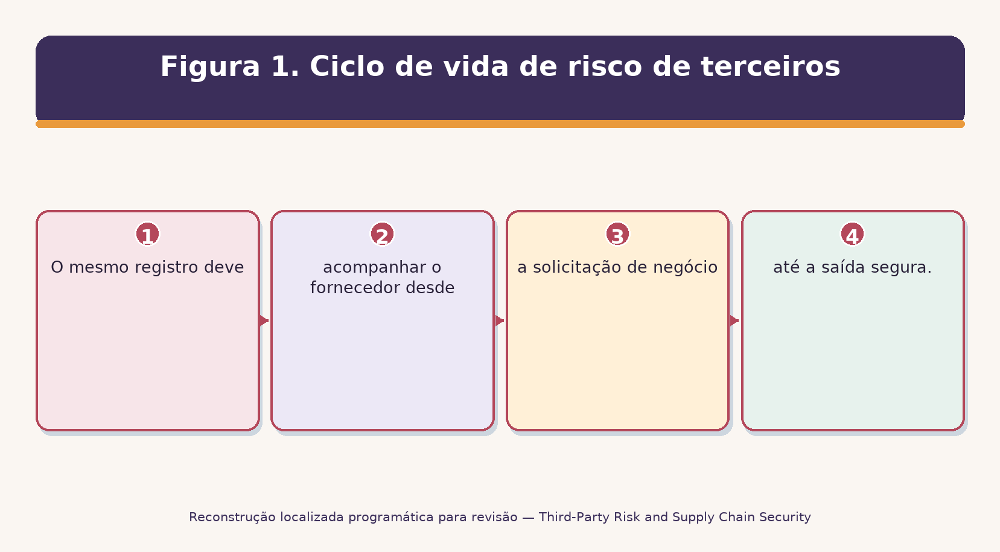
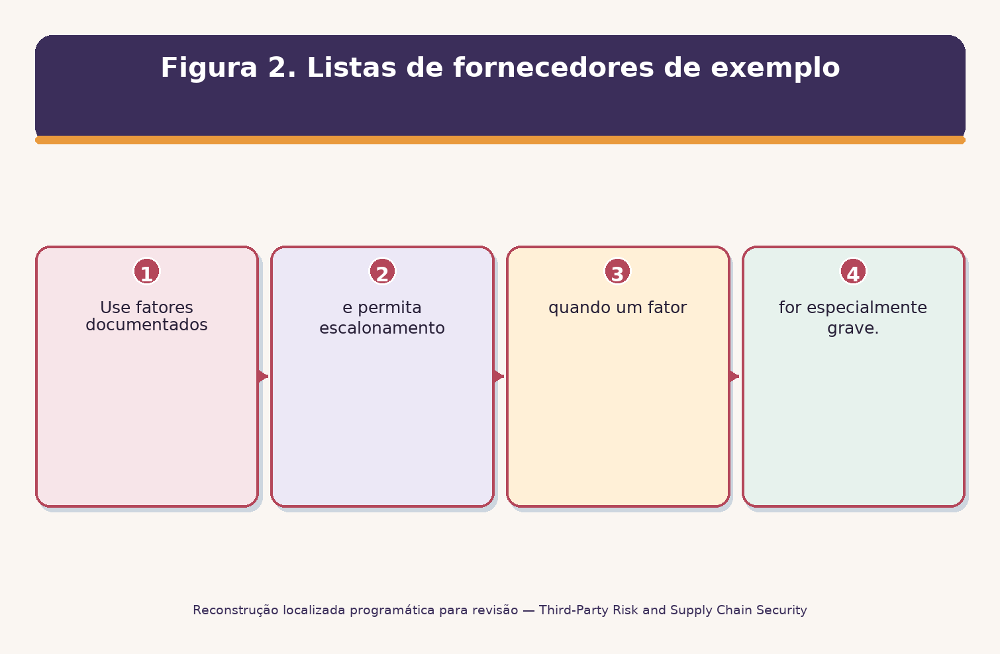
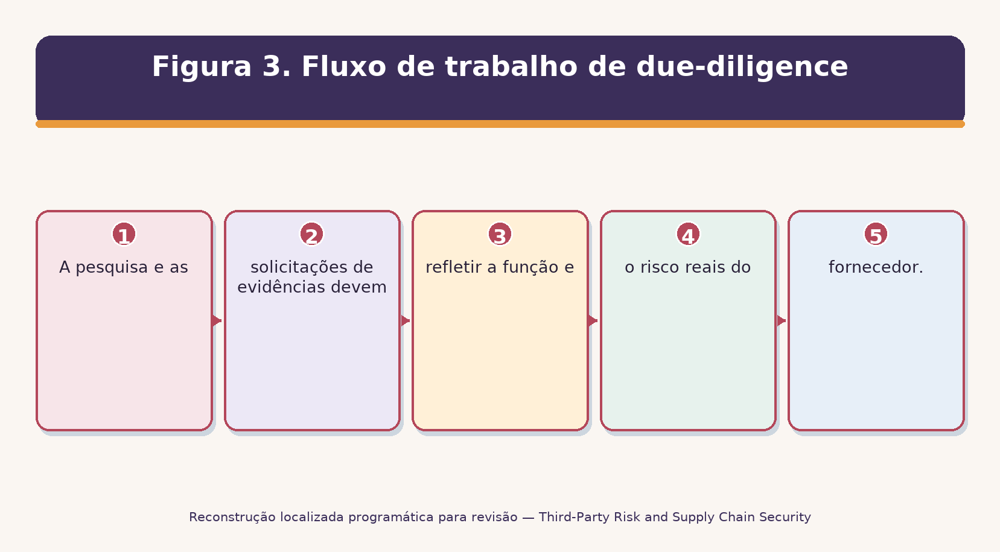
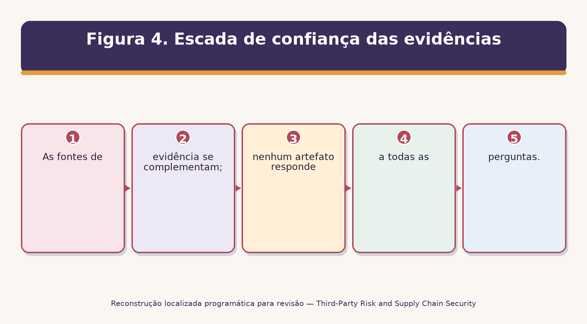
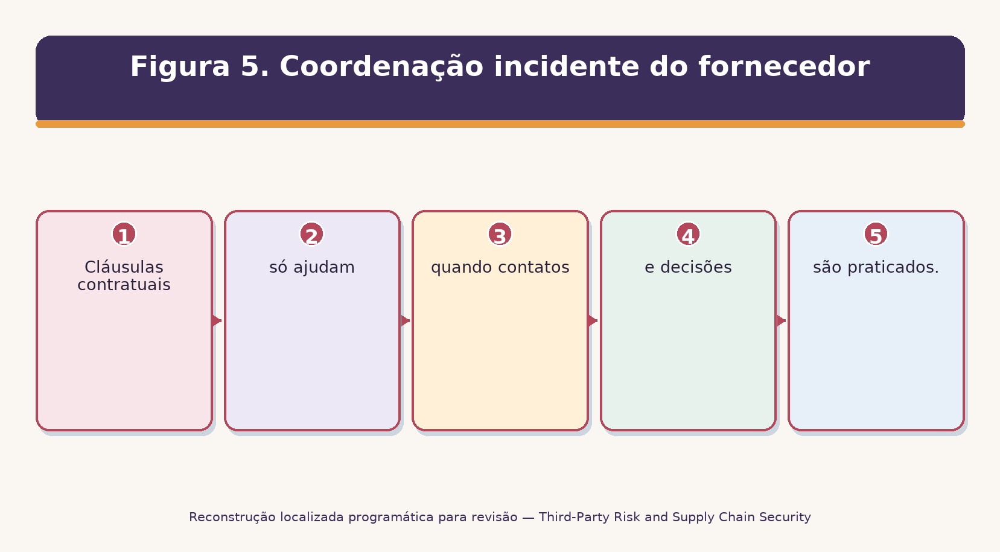
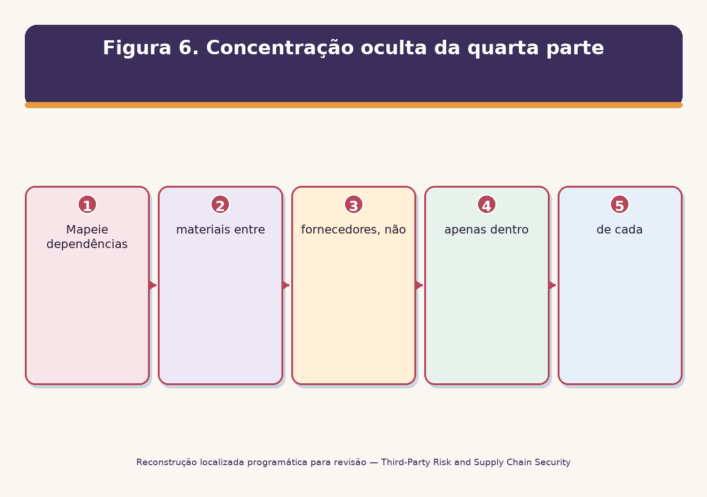
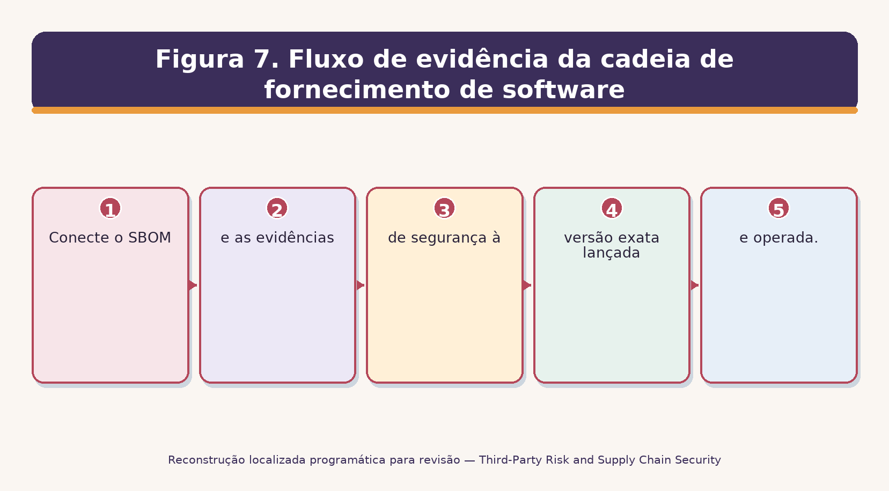
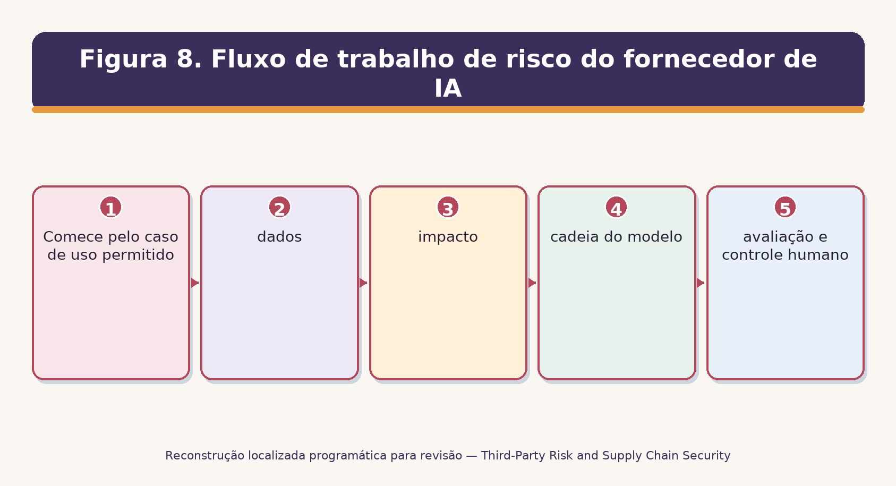
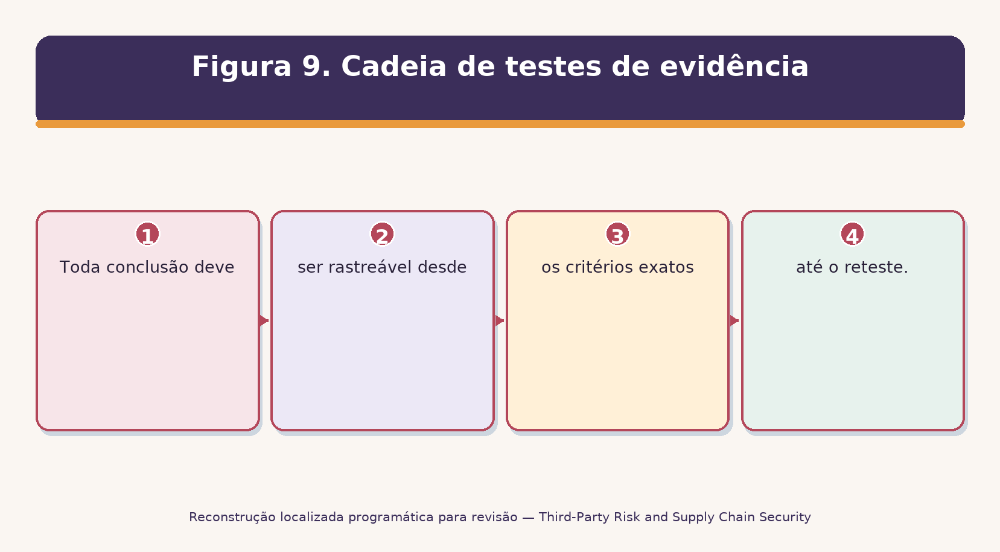
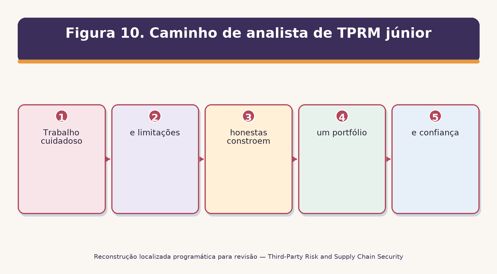

> **Status da revisão:** Rascunho de tradução assistida por máquina. Requer revisão humana de terminologia, significado, links, formatação e atualidade técnica antes de ser marcado como edição final.

**GESTÃO DE RISCOS DE TERCEIROS

** E SEGURANÇA DA CHAIN DA CYBER

Prático Gerente e Manual de Analista Júnior

O que este manual faz: Explica como identificar, avaliar, contratar, monitorar, responder e sair com segurança dos fornecedores. Ele combina governança, testes práticos, orientação NIST atual, ferramentas de código aberto, modelos reutilizáveis e preparação de carreira. □
-----------------------------------------------------------------------------------------------------------------------------------------------------------------------------------------------------------------------

** Alberto (Al) Leiva**

Primeira edição • Julho de 2026

Prefácio

As organizações dependem de plataformas de nuvem, software, processadores de pagamento, consultores, provedores de dados, serviços gerenciados, inteligência artificial e muitos outros forasteiros. A organização pode terceirizar o trabalho, mas não terceirizar o impacto do negócio. Uma falha do fornecedor pode expor dados, interromper operações, enfraquecer produtos ou criar obrigações legais e de clientes.

Este manual ensina um método de ciclo de vida repetitivo. Não é uma opinião legal, uma garantia, ou um programa de certificação universal. Os requisitos variam de acordo com contrato, lei, regulador, setor, cliente, sistema e país. Use profissionais qualificados de direito, privacidade, compras, segurança e auditoria quando as decisões as exigem.

Nota de informação actual:** O manual reflete o material oficial verificado em 14 de julho de 2026, incluindo NIST SP 1326 (final de julho 8, 2026), NIST SP 800-18 Rev. 2 (final de junho 30, 2026), NIST SP 800-161 Rev. 1 Atualização 1, NIST SP 1305 e NIST CSF 2.0.
----------------------------------------------------------------------------------------------------------------------------------------------------------------------------------------------------------------

# # Como usar este manual

- Gerentes: comece com Capítulos 2–4, 8–13, 19 e 25.

- Analistas júnior: estudem em ordem, depois completem os capítulos 26–29 e o laboratório fictício.

- Equipes legais e de aquisição: foco na ingestão, diligência devida, contratos, onboarding, monitoramento, incidentes e saída.

- Equipes técnicas: foco na nuvem, cadeia de suprimentos de software, IA, ferramentas de código aberto, testes de evidências e coordenação de incidentes.

- Use os modelos como pontos de partida; critérios e aprovações personalizados para sua organização.

Sumário

Este é um índice nativo do Word. No Microsoft Word, clique dentro dele, escolha Atualizar Tabela e selecione Atualizar tabela inteira. Word irá reconstruir as entradas e números de página após a edição.

[Prefácio [2](#preface)](#preface)

[Como usar este manual [2](#how-to-use-this-manual)](#how-to-use-this-manual)

[Quadro de conteúdos [3](#table-of-contents)](#table-of-contents)

[Guia do Capítulo [6](#chapter-guide)](#chapter-guide)

[1 (#tprm-and-cyber-supply-chain-foundations)](#tprm-and-cyber-supply-chain-foundations)

[1.1 Que bom TPRM produz [7](#what-good-tprm-produces)](#what-good-tprm-produces)

[1.2 Limites importantes [7](#important-limits)](#important-limits)

[2. O ciclo de vida de terceiros [8](#the-third-party-life-cycle)](#the-third-party-life-cycle)

[3. Governança, Estratégia e Apetito de Risco [9](#governance-strategy-and-risk-appetite)](#governance-strategy-and-risk-appetite)

[3.1 Documentos do programa [9](#program-documents)](#program-documents)

[4. Inventário, classificação e nivelamento [10](#inventory-classification-and-tiering)](#inventory-classification-and-tiering)

[4.1 Campos de inventário [10](#inventory-fields)](#inventory-fields)

[4.2 Factores de nivelamento [10](#tiering-factors)](#tiering-factors)

[5. Risco de admissão e de inércia [11](#intake-and-inherent-risk)](#intake-and-inherent-risk)

[6. Due Diligence and Research [12](#due-diligence-and-research)](#due-diligence-and-research)

[6,1 NIST SP 1326 componentes de avaliação [12](#nist-sp-1326-assessment-components)](#nist-sp-1326-assessment-components)

[6.2 Fontes de investigação [12](#research-sources)](#research-sources)

[7. Revisão de provas e confiança [14](#evidence-review-and-trust)](#evidence-review-and-trust)

[8. Pontuação de risco e tratamento [15](#risk-scoring-and-treatment)](#risk-scoring-and-treatment)

[8,1 Um método defensável [15](#a-defensible-method)](#a-defensible-method)

[9. Requisitos contratuais [16](#contract-requirements)](#contract-requirements)

[10] [17](#secure-onboarding)](#secure-onboarding)

[10.1 Provas de aceitação [17](#acceptance-evidence)](#acceptance-evidence)

[11. Monitorização contínua [18](#continuous-monitoring)](#continuous-monitoring)

[11.1 Frequência [18](#frequency)](#frequency)

[12. Resultados, reparação e exceções [19](#findings-remediation-and-exceptions)](#findings-remediation-and-exceptions)

[12.1 Disciplina de exceção [19](#exception-discipline)](#exception-discipline)

[13. Incidentes do fornecedor e notificação [20](#supplier-incidents-and-notification)](#supplier-incidents-and-notification)

[13.1 Preparar antes de um incidente [20](#prepare-before-an-incident)](#prepare-before-an-incident)

[14. Quartas Partes, Concentração e Risco Sistémico [21](#fourth-parties-concentration-and-systemic-risk)](#fourth-parties-concentration-and-systemic-risk)

[14.1 O que mapear [21](#what-to-map)](#what-to-map)

[14,2 Concentração de tratamento [21](#treat-concentration)](#treat-concentration)

[15. Fornecedores de nuvem e SaaS [23](#cloud-and-saas-vendors)](#cloud-and-saas-vendors)

[16. Redes de fornecimento de software e de código aberto [24](#software-and-open-source-supply-chains)](#software-and-open-source-supply-chains)

[16.1 Verificação do fornecedor e do produto [24](#supplier-and-product-checks)](#supplier-and-product-checks)

[16.2 Limites SBOM [24](#sbom-limits)](#sbom-limits)

[17. Vendedores de Inteligência Artificial [25](#artificial-intelligence-vendors)](#artificial-intelligence-vendors)

[18. Proteção de privacidade e dados [26](#privacy-and-data-protection)](#privacy-and-data-protection)

[19. Resiliência, continuidade e saída [27](#resilience-continuity-and-exit)](#resilience-continuity-and-exit)

[19.1 Ensaio de saída [27](#exit-test)](#exit-test)

[20. NIST CSF 2.0 Resultados do Fornecedor [28](#nist-csf-2.0-supplier-outcomes)](#nist-csf-2.0-supplier-outcomes)

[21. NIST C-SCRM Orientação na Prática [29](#nist-c-scrm-guidance-in-practice)](#nist-c-scrm-guidance-in-practice)

[21.1 Pensamento de três níveis [29](#three-level-thinking)](#three-level-thinking)

[22. Mapeamentos de conformidade e de enquadramento [30](#compliance-and-framework-mappings)](#compliance-and-framework-mappings)

[23. Ensaios de provas e métricas [31](#evidence-testing-and-metrics)](#evidence-testing-and-metrics)

[23.1 Método de ensaio [31](#test-method)](#test-method)

[24. Ferramentas de Código Aberto [33](#open-source-tools)](#open-source-tools)

[24,1 Assistente CISO [33](#ciso-assistant)](#ciso-assistant)

[24,2 Faixa de Dependência [33](#dependency-track)](#dependency-track)

[24.3 CycloneDX [34](#cyclonedx)](#cyclonedx)

[24.4 Syft [34](#syft)](#syft)

[24.5 Grype [34](#grype)](#grype)

[24.6 Trivy [34](#trivy)](#trivy)

[24, 7 OpenSSF Scorecard [34](#openssf-scorecard)](#openssf-scorecard)

[24.8 GUAC [35](#guac)](#guac)

[24,9 OSV-Scanner [35](#osv-scanner)](#osv-scanner)

[24.10 DefectDojo [35](#defectdojo)](#defectdojo)

[24,11 Wazuh [35](#wazuh)](#wazuh)

[24.12 Keycloak [35](#keycloak)](#keycloak)

[24.13 OWASP ZAP [36](#owasp-zap)](#owasp-zap)

[24.14 Greenbone Community Edition [36](#greenbone-community-edition)](#greenbone-community-edition)

[24,15 Nmap [36](#nmap)](#nmap)

[24.16 Agente de política aberta [36](#open-policy-agent)](#open-policy-agent)

[25. Playbook TPRM do gestor [37](#managers-tprm-playbook)](#managers-tprm-playbook)

[25.1 Ritmo de funcionamento do gestor [37](#manager-operating-rhythm)](#manager-operating-rhythm)

[26. Guia de carreira do analista júnior [38](#junior-analyst-career-guide)](#junior-analyst-career-guide)

[26.1 Títulos comuns de funções [38](#common-job-titles)](#common-job-titles)

[26.2 Trabalho júnior típico [38](#typical-junior-work)](#typical-junior-work)

[27. Laboratório Fictício e Portfólio [40](#fictional-laboratory-and-portfolio)](#fictional-laboratory-and-portfolio)

[28. Plano de aprendizagem de trinta dias [41](#thirty-day-learning-plan)](#thirty-day-learning-plan)

[29. Preparação da entrevista [42](#interview-preparation)](#interview-preparation)

[29.1 O que é o TPRM? [42](#what-is-tprm)](#what-is-tprm)

[29,2 TPRM versus C-SCRM? [42](#tprm-versus-c-scrm)](#tprm-versus-c-scrm)

[29,3 Risco inerente versus residual? [42](#inherent-versus-residual-risk)](#inherent-versus-residual-risk)

[29.4 Como você lista um fornecedor? [42](#how-do-you-tier-a-supplier)](#how-do-you-tier-a-supplier)

[29.5 Como você revê um relatório SOC 2? [42](#how-do-you-review-a-soc-2-report)](#how-do-you-review-a-soc-2-report)

[29,6 Limitação do questionário? [42](#questionnaire-limitation)](#questionnaire-limitation)

[29.7 O que é uma SBOM? [42] (#what-is-an-sbom)] (#what-is-an-sbom)

[29,8 Como você fecha um achado? [42](#how-do-you-close-a-finding)](#how-do-you-close-a-finding)

[29.9 E se um fornecedor crítico recusar provas? [42](#what-if-a-critical-supplier-refuses-evidence)](#what-if-a-critical-supplier-refuses-evidence)

[29.10 O que faz um bom analista júnior? [43](#what-makes-a-good-junior-analyst)](#what-makes-a-good-junior-analyst)

[29.11 Perguntas ao empregador [43](#questions-to-ask-the-employer)](#questions-to-ask-the-employer)

[30. Modelos, Glossário, Índice e Referências [44](#templates-glossary-index-and-references)](#templates-glossary-index-and-references)

[30.1 Registo de inventário do fornecedor [44](#supplier-inventory-record)](#supplier-inventory-record)

[30.2 Papel de trabalho de diligenciação devida [44](#due-diligence-workpaper)](#due-diligence-workpaper)

[30.3 Revisão da garantia [44](#assurance-review)](#assurance-review)

[30.4 Registo de procura e excepção [44](#finding-and-exception-record)](#finding-and-exception-record)

[30,5 Lista de verificação do contrato e da saída [45](#contract-and-exit-checklist)](#contract-and-exit-checklist)

[30,6 Glossário [45](#glossary)](#glossary)

[30.7 Índice de assunto [45](#subject-index)](#subject-index)

[30.8 Referências oficiais [46](#official-references)](#official-references)

Guia do Capítulo

# 1. TPRM e Cyber Supply Chain Fundações

* Gerência de risco de terceiros (TPRM) controla riscos colocados por organizações externas, produtos, pessoas e serviços.*

Um terceiro pode hospedar sistemas, processar dados, fornecer software, fornecer pessoal, executar operações críticas ou apoiar clientes. O gerenciamento de risco da cadeia de suprimentos cibernética (C-SCRM) é mais amplo: considera como a tecnologia é projetada, desenvolvida, fabricada, integrada, entregue, operada, mantida e aposentada em muitas camadas.

## 1.1 O que bom TPRM produz

Um inventário completo de fornecedores.

Avaliação baseada no risco antes do compromisso.

Segurança, privacidade, resiliência, auditoria e termos incidentes em acordos.

Acesso controlado e tratamento de dados durante o serviço.

Monitoramento que detecta mudanças materiais e riscos vencidos.

Coordenação de incidentes praticada e um plano de saída executável.

## 1.2 Limites importantes

O que não prova**
□--------------------------------------------------------------------------------------------------------------------------------------------------
Questionário Uma afirmação do fornecedor não é prova independente.
Relatório SOC 2 Abrange sistemas declarados, critérios, período, testes e limitações – nem todos os riscos.
Certificado ISO Aplica-se apenas ao escopo certificado e aos detalhes atuais do certificado.
□ Classificação de segurança; Os sinais externos podem ser úteis, mas podem ser incompletos, obsoletos ou desatribuídos. □
. Contrato . Uma promessa não mostra que um controle opera. □
O resultado da ferramenta da automação suporta o teste; não faz a decisão do negócio. □

Princípio do core:** Terceirizar a atividade, não prestar contas. O proprietário da empresa continua responsável pela compreensão e gestão do impacto.
□-------------------------------------------------------------------------------------------------------------------------------------------------------------------------------------------------

2. O Ciclo de Vida da Terceira Parte

* Um processo de ciclo de vida impede que a avaliação se torne um questionário único.*

Figura 1. Ciclo de vida de risco de terceiros

. . . . . . . . . . . . . . . . . . . . . . . . . . . . . . . . . . . . . . . . . . . . . . . . . .
---------------------------------------------------------------------------------------------------------------------------------
Ingestão Existe uma necessidade válida e proprietário responsável? O pedido, descrição do serviço, proprietário, alternativas
□ Tier □ Quanto dano poderia causar o fracasso? Dados, acesso, dependência, disponibilidade, geografia
Avaliação O risco residual é aceitável? Pesquisa, evidência, testes, achados, tratamento
□ Contrato □ São obrigações executórias? Termos de segurança/privacidade/resiliência assinados
A bordo O acesso é limitado e aprovado? Configuração, conta, fluxo de dados, registros de aceitação
Monitorar o risco ou o desempenho mudou? Eventos, atestados, questões, métricas, reavaliações
□ Sair □ São removidos o acesso, dados, ativos e dependências? • Revogação, exclusão/retorno, transição, confirmação

# 3. Governança, Estratégia e Apetito de Risco

*Governança estabelece direitos de decisão, limites de risco, financiamento e escalada.*

## 3.1 Documentos do programa

- Política e normas TPRM/C-SCRM.

- Risco de apetite e regras obrigatórias de rejeição ou escalada.

- Classificação e método de avaliação do fornecedor.

- Leilão de cláusulas contratuais e aprovação de desvios.

- Procedimentos de monitorização, incidente, exceção e saída.

- Métricas, relatórios, retenção de registros, revisão de qualidade e melhoria do programa.

** ** ** ** ** ** **
----------------------------------------------------------------------------------------------------------------------------------------------------------------------------
□ Conselho/executivo □ Supervisão, direção de risco, recursos, desafio de risco material
O proprietário do negócio □ Necessidade, criticidade, desempenho, propriedade de risco residual, prontidão para sair
□ Aquisições • Aprovisionamento de fluxo de trabalho, termos comerciais, renovação, registro do fornecedor
□ Jurídico/privacy □ Contrato, base jurídica, regulamentação, transferência de dados, aconselhamento de notificação
• Segurança / TPRM
Arquitectura, configuração, acesso, integração, teste, recuperação
• Auditoria interna • Avaliação independente da concepção e funcionamento do programa
□ Fornecedor □ Informação precisa, controles contratados, aviso, correção, cooperação

Decisão de gestão:** Definir quem pode aceitar que nível de risco residual. Um proprietário de risco deve ter autoridade, contexto e responsabilidade – não apenas uma assinatura conveniente. □
---------------------------------------------------------------------------------------------------------------------------------------------------------------------------------------------------------------------------------------------------------------------------------------------------------------------------------------------------------------------------------------------------------------------------------------------

# 4. Inventário, classificação e nivelamento

*Conheça todos os fornecedores e escalas trabalham para provavelmente prejudicar.*

Figura 2. Listas de fornecedores de exemplo

## 4.1 Campos de inventário

- Nome legal, pseudônimos, produto / serviço, proprietário de empresa, proprietário técnico, e proprietário do contrato.

- Finalidade, sistemas, integrações, contas, privilégios, categorias de dados, locais de dados e caminhos de transferência.

- Processos críticos, necessidades de recuperação, dificuldade de substituição, quartas partes, concentração e exposição geográfica.

- Nível, risco inerente, risco residual, estado de avaliação, conclusões, exceções, datas do contrato, renovação e status de saída.

## 4.2 Fatores de nivelamento

Factor** **Exemplo de estado de alto risco**
-----------------------------------------
Os dados são confidenciais pessoal, saúde, pagamento, segredos ou informações regulamentadas
Acesse o acesso Privilegiado, produção remota, persistente ou amplo acesso API
Disponibilidade O fracasso para um produto crítico, operação ou serviço ao cliente
Altere o fornecedor pode atualizar código, firmware, modelos, regras ou infraestrutura
Dependência Poucos substitutos, difícil migração, formato proprietário, recuperação longa
O fornecedor atende muitos sistemas críticos, regiões, clientes ou subsidiárias
O Subprocessador material, nuvem, identidade, modelo ou dependência de software

5. Risco de Ingestão e Inerência

*Intake capta o uso completo proposto antes da pressão comercial torna a revisão difícil.*

1. Descreva a finalidade do negócio e por que um fornecedor externo é necessário.

2. Nomear negócio responsável, técnico, privacidade, segurança, contratos e contatos de contrato.

3. Dados do mapa coletados, criados, acessados, armazenados, transmitidos, treinados, retornados e excluídos.

4. Descreva conexões, privilégios, usuários, locais, quartas partes e acesso ao suporte.

5. Determinar criticidade, expectativas de recuperação, alternativas e dificuldade de saída.

6. Identifique leis, contratos, requisitos do cliente, residência de dados e obrigações do setor.

7. Calcule o risco inerente antes de considerar os controles do fornecedor.

8. Atribuir o caminho de revisão necessário e parar a compra ou conexão não autorizada.

Risco inerente versus residual: O risco inerente é a exposição antes de considerar os controlos. Risco residual é o que permanece após controles verificados, termos contratuais, escolhas de design e outros tratamentos. □
□-----------------------------------------------------------------------------------------------------------------------------------------------------------------------------------------------------------------------------------------------------------------------------------------------------------------

# 6. Due Diligence and Research

*Due diligence reúne informações pertinentes para que a organização possa fazer uma aquisição informada ou decisão de uso contínuo.*

Figura 3. Fluxo de trabalho de due-diligence

6.1 NIST SP 1326 componentes de avaliação

Component** ** Perguntas para investigar**
--------------------------------------------------------------------------------------------------------------------------------------------------------------------------------------------------------------------------------------------------------------------------------------------------------
□ Propriedade estrangeira, controle ou influência □ Quem possui ou influencia o fornecedor? Que jurisdições ou pressões legais importam?
Providência Onde se originou o produto, código, componentes, hardware e dados? As alegações podem ser rastreadas?
• Resiliência • O fornecedor pode resistir, responder e recuperar da perturbação?
□ Práticas cyberfundacionais □ São práticas básicas de governança, acesso, vulnerabilidade, registro, desenvolvimento, resposta e recuperação presentes?
• Listas de cadeias de suprimentos □ Quais organizações a montante e a jusante afetam materialmente o produto ou serviço?

6.2 Fontes de pesquisa

- Fornecedor-fornecido organizacional, técnico, garantia, privacidade, resiliência e evidência de produto.

- Empresa oficial, regulador, certificação, tribunal, sanções, violação, vulnerabilidade e fontes de segurança do produto eram legais e relevantes.

- Relatórios de auditoria ou avaliação independentes e testes técnicos geridos pelo cliente.

- Arquitetura e entrevistas de fluxo de dados com pessoas que operam o serviço – não apenas pessoal de vendas.

** Justeza e precisão:** Verifique a identidade, data, relevância, jurisdição e qualidade da fonte. Dar ao fornecedor uma oportunidade razoável para corrigir erros factuais materiais. Siga a lei e a política para rastreamento e informações pessoais. □
----------------------------------------------------------------------------------------------------------------------------------------------------------------------------------------------------------------------------------------------------------------------------------------------------------------------------------------------------------------------------------------------------------

7. Revisão e Confiança de Evidências

* A evidência é útil apenas quando corresponde ao serviço, período, controle e risco de ser avaliado.*

Figura 4. Escada de confiança das evidências

* Artifact** ** Pontos de revisão** ** Armadilha comum**
-----------------------------------------------------------------------------------------------------------------------------------------------------------------------------------------------------------------------------
□ SOC 2 Tipo 2 □ Âmbito da entidade/sistema, critérios, período, opinião, testes, exceções, CUECs, organizações de subserviço, eventos subseqüentes
ISO/IEC 27001 certificado □ Organização certificada e locais, escopo, versão ISO, corpo certificado, acreditação, datas, status □ Assumindo que a certificação cobre todos os serviços e controle
O relatório do teste da penetração O teste da independência/competência, âmbito, data, método, exclusões, gravidade, remediação, reteste
□ Política / norma □ Aprovação, proprietário, versão, escopo, ação necessária, exceções
Questionário □ Respondente qualificado, resposta precisa, evidência de apoio, lacunas não resolvidas
• Arquitetura / fluxo de dados; • Sistemas, fronteiras de confiança, integrações, locais, criptografia, administradores, quartas partes;
Teste de BC/DR de Cenário, escopo, objetivos de recuperação, resultados observados, falhas, correção, reteste
□ Vulnerabilidade evidência □ Cobertura de ativos, credenciais, data, gravidade, remediação, exceções, reescane a saída da varredura como tratamento de risco

# 8. Pontuação de Risco e Tratamento

*A pontuação de Risk suporta decisões consistentes, mas os números não devem esconder incerteza ou problemas graves.*

## 8.1 Um método defensável

- Definir escalas de probabilidade e impacto em linguagem simples.

- Pontuação por cenário: ameaça ou falha, ativo/processo afetado, fraqueza e consequência.

- Separar o risco inerente da eficácia do controlo e do risco residual.

- Gravar a qualidade das provas, incerteza, suposições e falta de informação.

- Permitir a escalada obrigatória para uso de dados proibidos, acesso privilegiado, dependência crítica, restrições legais ou achados graves não resolvidos.

- Exigir aprovação ao nível correcto da autoridade e revisão/expiração do registo.

Tradução e Legendagem:
---------------------------------------------------------
• Evitar • Escolher outro produto ou manter a actividade interna • Decisão e lógica
• Reduza os dados do limite, remova o acesso do administrador, adicione MFA, corrija vulnerabilidades □ Controle, proprietário, data, teste □
• Transferência/participação; • Seguro, indenização, créditos de serviço, alocação contratual;
Aceitar O proprietário autorizado aceita o risco residual definido por um período
□ Contingência; fornecedor de backup; processo manual; exportação de dados; recuperação testada; gatilho; recursos; resultado do teste;

Aviso de gravação: ** Não é uma questão catastrófica. Relate cenários graves, lacunas de evidência e concentração separadamente da pontuação global.
-------------------------------------------------------------------------------------------------------------------------------------------------------------------

# 9. Requisitos do contrato

*Contratos convertem requisitos selecionados em responsabilidades executórias.*

Área de Cláusula** Perguntas para o acordo**
-------------------------------------------------------------------
□ Programa de segurança Que framework, controles, políticas, testes, treinamento e evidência de garantia são necessários? □
Utilização dos dados Que dados podem ser usados, onde, para que finalidade, por quanto tempo, e para treinamento de modelo? □
Acesso Como são tratados os menores privilégios, MFA, loging, acesso ao suporte e rescisão? □
Vulnerabilidade Que regras de digitalização, divulgação, patch, severidade, remediação e aviso se aplicam?
Incidente Que evento desencadeia aviso, quão rápido, através de qual canal, com que atualizações e cooperação? □
□ Subprocessadores É necessária a homologação ou o aviso? Os deveres equivalentes descem? Existe uma lista atual disponível?
• Auditoria/evidências Quais relatórios, certificações, registros, direitos de teste e prova de remediação podem ser solicitados? □
• Resiliência • Que disponibilidade, recuperação, backup, testes, comunicação de crise e direitos de continuidade se aplicam?
□ Alterar □ Que propriedade, hospedagem, localização, recurso, modelo de IA ou alterações de controle requerem aviso ou aprovação?
Como são gerenciados o acesso, dados, chaves, ativos, logs, suporte de transição, retenção e exclusão? □
Como as limitações, indenização, seguro, remédios e cooperação regulatória se alinham com o risco?

Revisão legal:** A linguagem da cláusula e a aplicabilidade dependem da lei, jurisdição, posição de negociação, fatos e todo o acordo. Use um advogado qualificado.
---------------------------------------------

10. Abordagem segura

*A bordo transforma promessas em configurações técnicas e operacionais seguras.*

- Confirmar aprovação, termos assinados, decisão de risco residual, proprietários, e pré-condições abertas.

- Verificar arquitetura, fluxo de dados, ambientes, locais, subprocessadores e modelo de suporte.

- Criar contas nomeadas; usar SSO/MFA quando apropriado; aplicar menos privilégio, aprovação, expiração e registro.

- Secure API chaves, segredos, certificados, agentes, integrações, caminhos de rede e canais administrativos.

- Configurar retenção, exclusão, compartilhamento, uso de treinamento, backups, exportação, alertas e opções de cliente.

- Teste segurança, privacidade, disponibilidade, suporte, contatos incidentes e requisitos de recuperação/exportação.

- Registre a linha de base de configuração aceita e adicione o fornecedor aos horários de monitoramento, incidente, renovação e saída.

# # 10.1 Evidência de aceitação

- Lista de verificação aprovada e exceções não resolvidas.

- Lista de acesso, papéis, MFA/SSO, caminho privilegiado, expiração e resultados de teste.

- Produção de fluxo de dados e registro de arquitetura.

- Exportação de configuração ou capturas de tela com data, revisor e valores sensíveis protegidos.

- Monitoramento, contato incidente, backup/exportação e teste de prontidão de saída.

# 11. Monitoramento contínuo

*O monitoramento detecta mudanças significativas e verifica que o tratamento continua funcionando.*

*Signal** **Possible action**
------------------------------------------------------------------------------------------------------------------------------------------------------------------------------------------------------------------------
• Nova vulnerabilidade crítica ou exploração • Confirmar produto/versão afetado, exposição, mitigação, patch e reteste
• Incidente, falha ou falha de controle
□ SOC/ISO/alteração do teste da caneta
Novo subprocessador, proprietário, local ou fornecedor de modelos □ Avaliar alterações, direitos de contrato, caminho de dados e concentração
• Desconforto financeiro ou operacional;
□ Repetição do SLA ou falha na detecção de falhas
• Renovação ou mudança de características do material
Não há evidência ou contato defasado . Escada de acordo com a camada e contrato; não marca silenciosamente completo .

11.1 Frequência

1. Use eventos baseados em nível e gatilho, não uma única programação anual universal.

2. Os fornecedores críticos podem necessitar de sinais contínuos, revisão regular do serviço, garantia anual, exercícios e reavaliação orientada pelo evento.

3. Os fornecedores de nível inferior ainda precisam de propriedade, controle sobre contratos/renovações, roteamento de incidentes e revisão orientada para mudanças.

# 12. Achados, Remediação e Excepções

* Um achado é uma lacuna documentada entre critérios e condição observada.*

* **Elemento de localização** **Conteúdo**
-------------------------------------------------------------------------------------------------------------------------
□ Critérios □ Requisitos exatos, termo do contrato, política ou padrão aprovado
Condição O que as evidências mostraram, incluindo população afetada e data
□ Cenário de risco e impacto das empresas
Causa Por que o gap ocorreu; evite palpites não suportados
• Acção • Controlo específico da correcção ou compensação
□ Proprietário / data de vencimento
• Protecção provisória • Medida de curto prazo enquanto se aguarda uma correcção completa
Método, evidência, resultado, revisor e data de encerramento

## 12.1 Disciplina de exceção

Defina escopo, razão, ativos/dados/processos afetados, risco e alternativas.

Requer a aceitação autorizada e uma data de validade.

Adicione condições, compensando controles, monitoramento e gatilhos para revisão anterior.

Renovação da via separadamente da reparação; uma exceção não é a conformidade permanente.

Fecha apenas quando a evidência prova a correção ou o relacionamento afetado termina.

# 13. Incidentes de Fornecedor e Notificação

* Incidentes de fornecedores exigem fatos compartilhados, papéis, relógios, canais e decisões de recuperação.*

Figura 5. Coordenação incidente do fornecedor

# # 13.1 Preparar antes de um incidente

1. Defina eventos relatáveis e tempo de notificação, método, destinatários, fatos necessários, frequência de atualização e escalada.

2. Mapa de acesso ao fornecedor, dados, integrações, ativos, quartas partes, e dependências de negócios.

3. Preaprove canais de comunicação seguros e contatos alternativos.

4. Esclareça a preservação de evidências, o acesso forense, o apoio do regulador/cliente, declarações públicas, contenção, recuperação e responsabilidades de custos.

5. Exercite uma falha realística no fornecedor, violação, compromisso de software, compromisso de identidade e cenários de seleção de dados.

* Primeiras perguntas** Por que elas importam**
-------------------------------------------------------------------------------------------------------------------------------------------------------------------------------------------------------------------------------------------------------------------------------
O que aconteceu e quando? □ Estabelecer prazos e obrigações de notificação
□ Que produto, locatário, região, versão, contas, dados e subprocessadores? □ Determinar o âmbito de aplicação
O evento está contido? O que continua ativo? • Guia de decisões de proteção
□ Que evidência apóia a conclusão atual? □ Facto separado da suposição
□ Que ações do cliente são necessárias? Chaves de coordenadas, acesso, patches, configurações e comunicação
□ Quando é a próxima atualização? Manter um ritmo de operação confiável

# 14. Quartas Partes, Concentração e Risco Sistémico

*Quarto partido e risco de concentração pode transformar muitos registros de fornecedores separados em uma falha compartilhada.*

Figura 6. Concentração oculta da quarta parte

# # 14,1 O que fazer no mapa

- Regiões em nuvem, serviços de identidade, DNS/CDN, trilhos de pagamento, telecomunicações, autoridades de certificados, repositórios de códigos, registros de pacotes, fornecedores de modelos, provedores de dados e operações gerenciadas.

- Donos comuns, geografias, instalações, tecnologias, componentes de software e canais de suporte.

- Dependências do fornecedor que não podem ser substituídas dentro do tempo de recuperação necessário.

- Visibilidade contratual, controles de fluxo-down, aviso de incidente, direitos de prova e apoio de saída para as quartas partes materiais.

# # 14,2 Concentração de tratamento

- Use arquitetura diversificada apenas quando reduz falha correlacionada e pode ser operado com segurança.

- Construir soluções manuais testadas, exportações de dados, caminhos de identidade/recuperação alternativos e planos de substituição.

- Definir limites de exposição e aumento executivo para uma concentração inevitável.

- Exercício de ruptura simultânea em vários fornecedores.

15. Cloud e SaaS Vendedores

* O risco de nuvem e SaaS depende do modelo de responsabilidade compartilhada e da configuração da organização.*

Área** Área** Área** Área
------------------------------------------
□ Segurança de inquilinos □ SSO, MFA, funções, contas de administrador, sessões, acesso de suporte, loging
□ Dados □ Categorias, arrendamento, criptografia, chaves, regiões, réplicas, backups, retenção, exclusão
Integração APIs, tokens, webhooks, agentes, redes, segredos, escopos, limites de taxa
Asseguramento de serviços e locais de nuvem exatos dentro do escopo do relatório/certificado
Operações Vulnerabilidade, mudança, monitoramento, incidente, capacidade, disponibilidade, recuperação
□ Funções do cliente □ Configuração, identidades, endpoints, classificação de dados, logs, backups, resposta
□ Sair □ Exportar formato, completude, timing, custo, dependências, exclusão segura, continuidade

** Responsabilidade compartilhada:** Um provedor seguro não cria automaticamente um inquilino seguro. Teste a configuração do cliente, acesso, integrações, escolhas de dados e monitoramento. □
□------------------------------------------------------------------------------------------------------------------------------------------------------------------------------------------------------------------------------------------------------------------

# 16. Software e correntes de fonte aberta

* Risco de software inclui práticas de fornecedor e cada componente, passo de construção, canal de atualização e dependência.*

Figura 7. Fluxo de evidência da cadeia de fornecimento de software

# # 16.1 Verificação de fornecedores e produtos

- Governança segura de desenvolvimento, modelagem de ameaças, revisão de código, testes, isolamento de construção, segredos, acesso, proveniência, assinatura, aprovação de lançamento e controle de mudança.

- Canal de divulgação de vulnerabilidade, divulgação coordenada, método de gravidade, metas de patch, versões suportadas, aviso de fim de vida e aconselhamentos de clientes.

- Formato SBOM, versão, completude, componentes diretos/transitivos, licenças, hashes e relação com o artefato enviado.

- Atualizar autenticidade, retrocesso, telemetria, administração remota, configurações padrão e falha segura.

- Manutenção de código aberto, confiança do contribuinte, transferência de propriedade, processo de liberação, fixação de dependência e plano de componentes abandonados.

## 16.2 Limites da SBOM

- Um SBOM é um inventário, não uma prova de que o software é seguro.

- Uma correspondência de vulnerabilidade requer aplicabilidade e análise de exposição.

- Um SBOM pode omitir dependências de tempo de execução, serviço, firmware, compilação ou carregadas dinamicamente.

- Proteger SBOMs quando revelam arquitetura sensível; mantê-los atuais para cada liberação de material.

17. Vendedores de Inteligência Artificial

*Fornecedores de IA adicionam modelos, treinamento e dados rápidos, saídas incertas e cadeias de provedores ocultos.*

Figura 8. Fluxo de trabalho de risco do fornecedor de IA

Área** Perguntas**
--------------------------------------------------------------------------------------------------------------------------------------------------------------------------------------------------------------------------------------------------------------------------------------------------------
Caso de uso / impacto Que decisão ou tarefa é apoiada? Quem pode ser prejudicado? A revisão humana é significativa?
Os dados são enviados, uploads, saídas, feedback e logs retidos, compartilhados ou usados para treinamento? □
□ Modele a cadeia Qual modelo, hospedagem, plugins, agentes, fontes de dados e subprocessadores estão envolvidos?
Como são manuseados o isolamento, acesso, segredos, permissões de ferramentas, injeção rápida, abuso e monitoramento? □
Privacidade / IP Que base legal, propriedade, licenciamento, exclusão, localização, transferência e direitos se aplicam?
Como são avaliadas a precisão, viés, robustez, explicabilidade, deriva e saída insegura para este uso?
Alteração Que modelo, política, recurso, provedor ou mudanças de treinamento desencadeiam aviso e reavaliação? □
Incidente Como são tratadas a saída, vazamento, compromisso do modelo, abuso, falha e evidência prejudiciais? □
□ Sair □ Pode prompts, arquivos, índices, ajustes finos, logs e dados derivados serem exportados ou excluídos? □

# 18. Privacidade e Proteção de Dados

*A revisão da privacidade segue os dados através de toda a cadeia de fornecedores.*

- Identificar pessoas, categorias de dados, sensibilidade, fonte, finalidade, base jurídica e usos proibidos.

- Minimize campos, registros, usuários, locais, retenção e acesso antes da transferência.

- Controlador/processador de mapas ou papéis equivalentes e cada subprocessador de material.

- Avaliar avisos, consentimento ou outra base legal, direitos individuais, pedidos governamentais e requisitos de transferência transfronteiriça.

- Exigir segurança, confidencialidade, cooperação de violação, auditoria/evidência, retorno/deleção e condições de fluxo-down.

- Teste o acesso, exportação, correção, exclusão, retenção, comportamento de backup e configuração do inquilino.

- Reavalia quando a finalidade, dados, treinamento de modelo, localização, subprocessador, propriedade ou alterações de recursos.

Minimização de dados:** Os dados mais confidenciais são frequentemente os dados que um fornecedor nunca recebe. Reduza a coleta e o acesso antes de depender de controles complicados.
□----------------------------------------------------------------------------------------------------------------------------------------------------------------------------------------------------------------------------------

# 19. Resiliência, Continuidade e Saída

* Resiliência significa entregar resultados críticos, apesar da interrupção do fornecedor e deixando com segurança quando necessário.*

Capacidade** Prova de teste**
-------------------------------------------------------------------------------------------------------------------------------------------------------------------------------
□ Impacto empresarial □ Serviço crítico, rompimento máximo tolerável, RTO/RPO, dependências
* Backup/recuperação * Escopo, isolamento, restaurar teste, tempo observado, perda de dados, falhas, reteste *
• Continuidade • Pessoas, instalações, tecnologia, comunicações, soluções manuais, exercícios
• Capacidade/disponibilidade • Arquitetura, regiões, limites, monitoramento, incidentes, desempenho SLA
□ Plano de saída, gatilhos, direitos de decisão, alternativa, exportação de dados, remoção de acesso, sequência de migração
□ Deleção; Produção, backup, logs, dispositivos, dados derivados, artefatos de IA, subprocessadores, evidência;
□ Retenção, detenção legal, confidencialidade, vulnerabilidade/notificação de incidente, suporte

# # 19.1 Teste de saída

- Exportar um conjunto de dados representativo e confirmar completitude, formato, metadados, permissões e restauração utilizável.

- Inventário de cada conta de fornecedor, chave, certificado, agente, rota, dispositivo, licença, integração e cópia de dados.

- Estimar tempo de migração e interrupção de negócios de testes observados – não alegações de vendas.

- Documento que confirma retorno/deleção e como as exceções, como a detenção legal ou retenção de backup são controladas.

NIST CSF Resultados do Fornecedor 2.0

*NIST CSF 2.0 coloca a governança da cadeia de suprimentos na categoria GV.SC.*

Resultados** Resultados** Significado plano** Exemplo de evidência**
---------------
□ GV.SC-01 Um programa C-SCRM, estratégia, objetivos, políticas e processos são estabelecidos e acordados pelos stakeholders organizacionais. □ Programa aprovado e registro das partes interessadas
Os papéis e responsabilidades da segurança cibernética para fornecedores, clientes e parceiros são estabelecidos, comunicados e coordenados. RACI, contatos, acordos, exercícios
O GV.SC-03 C-SCRM está integrado na gestão de risco empresarial, avaliação de risco de segurança cibernética e processos de melhoria. □ Ligação ao MTC, registo de risco, lições e melhorias
Os fornecedores são conhecidos e priorizados pela criticidade. □ Inventário completo do fornecedor e método de criticidade
Os requisitos de segurança cibernética da cadeia de suprimentos GV.SC-05 são estabelecidos, priorizados e incluídos em contratos e acordos. □ Biblioteca de requisitos, termos assinados, desvios
O planejamento e a devida diligência são realizados antes de entrar em relações formais de fornecedores. □ Ingestão, pesquisa, evidência, análise, aprovação
Os riscos do fornecedor são compreendidos, registrados, priorizados, avaliados, tratados e monitorados durante todo o relacionamento. □ Registros de risco, monitoramento, achados, tratamento
Os fornecedores relevantes estão incluídos no planejamento, resposta e recuperação de incidentes. Planos, contatos, tabletops, registros de incidentes
As práticas de segurança da cadeia de suprimentos GV.SC-09 são integradas e monitoradas ao longo do ciclo de vida do produto e do serviço tecnológico. • Requisitos do ciclo de vida, evidência do produto/serviço
Os planos da cadeia de suprimentos de segurança cibernética incluem atividades que ocorrem após o término de um acordo de parceria ou serviço. □ Plano de saída, acesso/remoção de dados, direitos pós-terminação

Utilizar GV.SC:** Defina um perfil atual de resultados observados e um perfil alvo de necessidades de negócios. Priorize lacunas, proprietários, recursos e datas; não trate um mapeamento como implementação automática. □
----------------------------------------------------------------------------------------------------------------------------------------------------------------------------------------------------------------------------------------------------------------

# 21. NIST C-SCRM Orientação na Prática

* As publicações atuais NIST fornecem orientações complementares sobre programa, avaliação e planejamento.*

**Publicação** ** Papel actual**
------------------------------------------------------------------------
□ NIST SP 800-161 Rev. 1 Atualização 1 □ Integra C-SCRM na gestão de riscos em toda a organização em níveis de empresa, missão/negócio e sistema; inclui estratégia, política, planos, avaliações e controles.
O NIST SP 1305 usa o NIST CSF 2.0 GV.SC para estabelecer e operar o C-SCRM e comunicar os requisitos do fornecedor.
□ NIST SP 1326 (final de 8 de julho de 2026) • Considerações de início rápido para avaliações de due diligence de fornecedores de TIC: FOCI, procedência, resiliência, práticas cibernéticas fundamentais e níveis de cadeia de suprimentos. □
NIST SP 800-18 Rev. 2 (final 30 de junho de 2026) □ Define elementos essenciais para os planos de segurança do sistema, privacidade e C-SCRM, incluindo propósito, status de controle, responsabilidades e comportamento esperado.

# # 21,1 Pensamento de três níveis

Nível** Foco** Exemplo**
------------------------------------------------------------------------------------
Empreendimento Estratégia, apetite de risco, política comum, recursos, superintendência
□ Missão / processo de negócio □ Serviços críticos e dependências
□ Sistema □ Produto, serviço, arquitetura, controles e planejamento específicos □ Plataforma do cliente usando um provedor de nuvem e identidade

Plano versus prova:** Um plano C-SCRM explica os arranjos pretendidos e implementados. Os avaliadores ainda precisam de provas fiáveis de que os controlos relevantes funcionam.
O que é que se passa?

# 22. Conformidade e Mapeamento de Framework

* Os mapeamentos coordenam o trabalho, mas cada obrigação deve ser interpretada e testada em seus próprios termos.*

* ** ** ** ** ** ** ** ** ** ** ** ** ** ** **
--------------------------------------------------------------------------------------------------------------------------------------------------------------------------------------------------------------------------------------------------------------------------------------------------------
• SOC 2 • Gestão de fornecedores, riscos, compromissos, limites do sistema, organizações subservientes, CUECs • Revisão do escopo exato do relatório, período, critérios, opinião, testes, exceções
ISO/IEC 27001:2022 □ Partes interessadas, relações com fornecedores, cadeia de suprimentos de TIC, uso, monitoramento e mudança de nuvem □ Âmbito de certificação e aplicabilidade de controle variam □
□ PCI DSS v4.0.1 □ Prestadores de serviços de terceiros, responsabilidades, acordos, monitoramento, suporte a incidentes □ Validar o âmbito e as responsabilidades da própria entidade
HIPAA Associações de negócios, acordos, salvaguardas, incidentes, subcontratantes, status legal e deveres dependem de fatos e leis
Os processadores, contratos, subprocessadores, segurança, transferências, assistência, exclusão/auditoria, funções, jurisdição, base legal, e mecanismo de transferência exigem análise legal
Controle 15 serviço-fornecedor inventário, política, classificação, contratos, avaliação, monitoramento, desativação, salvaguardas são uma linha de base priorizada, não universal conformidade legal
NIST CSF 2.0 □ GV.SC plus organization-wide Govern, Identifique, Proteja, Detecte, Responda, Recupere os resultados; CSF não é uma certificação

# 23. Testes de Evidência e Métricas

*Testing pergunta se os controles são corretamente projetados, implementados e operando para o escopo completo.*

Figura 9. Cadeia de testes de evidência

## 23.1 Método de ensaio

Defina critérios exatos, objetivo, período, sistemas, fornecedores, dados, locais e exclusões.

Identificar a população completa e validar a sua exaustividade e precisão utilizando fontes independentes, sempre que possível.

Escolha testes de população completa ou uma amostra defensável; seleção de registros e limitações.

Inspecione, observe, indague e repercute conforme apropriado. O inquérito por si só é geralmente fraco.

Gravar fonte de evidência, data, proprietário, versão, revisor e local protegido.

Descreva as exceções com precisão e avalie os controles de frequência, gravidade, padrão, impacto, causa e compensação.

Corrigir a via e realizar um reteste independente antes do fechamento.

* ** ** ** ** Cálculo de exemplo** ** ** O que ele pode revelar**
--------------------------------------
□ Propriedade do inventário Fornecedores com proprietário válido □ fornecedores ativos
□ Cobertura de avaliação □ Fornecedores no âmbito com avaliação concluída actual
□ Cobertura de contratos □ Fornecedores de alto nível com cláusulas exigidas □ fornecedores de alto nível
□ Idade de descoberta crítica □ Dias desde a data de descoberta até ao encerramento ou hoje
Notificação de incidentes de desempenho . . . . .
Os fornecedores críticos com o plano de exportação/saída testado são fornecedores críticos.
• Concentração • Serviços críticos dependentes do mesmo fornecedor/região/tecnologia

* Qualidade métrica:** Mostrar sempre numerador, denominador, data, regras de inclusão, proprietário de dados, limitações, tendência e ação. Uma percentagem verde pode esconder uma excepção grave. □
□------------------------------------------------------------------------------------------------------------------------------------------------------------------------------------------------------------------------------------------------------------------

# 24. Ferramentas de Código Aberto

* Ferramentas de código aberto podem suportar inventário, evidência, garantia de software, testes técnicos, monitoramento e remediação.*

*Ferramenta** *Purpose**
----------------------------------------------------------------------------------------------------
* Assistente CISO * Risco, controles, avaliações, evidências e achados
• Dependência-Monitoramento da SBOM
Google CycloneDX Google Software de materiais padrão e ferramentas
A geração do SBOM para imagens e sistemas de arquivos
* Varredura de vulnerabilidade para imagens e SBOMs
Repositório, imagem, dependência, segredo e verificação de IAC
O OpenSSF Scorecard Open-source Signals about open-source project security practices
□ GUAC □ Graphing software supply-chain metadados
* OSV-Scanner * Verificações de vulnerabilidade conhecidas para dependências *
* DefectDojo * Encontrar ingestão, deduplicação, remediação e reteste *
* Wazuh * Monitoramento de endpoint, integridade do arquivo, análise de log e alertas
Keycloak, identidade, papéis, MFA, sessões e eventos
OWASP ZAP
Edição da Comunidade Greenbone
* Nmap * Serviço autorizado e descoberta de activos *
□ Agente de Política Aberta

Autorização e limites:** Use ferramentas apenas em sistemas, repositórios, redes, dados e contas que possui ou tem permissão escrita para testar. Proteger os resultados. Uma ferramenta suporta evidências; não certifica um fornecedor ou substitui julgamento legal, comercial e humano. □
----------------------------------------------------------------------------------------------------------------------------------------------------------------------------------------------------------------------------------------------------------------------------------------------------------------------------------------------------------------------------------------------------------------------------------------------------------------------------------------------------------------

# # 24,1 Assistente CISO

Objetivo: Risco, controles, avaliações, evidências e achados. Projeto oficial: [<u>CISO Assistant</u>](https://intuitem.github.io/ciso-assistant-community/)

Início rápido e seguro: Criar um projeto abrangente, definir critérios de risco, atribuir proprietários, anexar evidências revisadas, registrar descobertas e restringir o acesso.

Evidência para reter: aprovação e escopo, ferramenta/versão, configuração ou comando, data, população alvo, resultado bruto, validação do analista, limitação, achado, ação e reteste. Limitar o acesso porque os resultados podem expor arquitetura sensível ou fraquezas.

# # 24.2 Faixa de Dependência

Objetivo: Análise da SBOM e monitoramento do risco-componente. Projeto oficial: [<u>Dependência-Track</u>](https://dependencytrack.org/)

Início rápido seguro: Importe um CycloneDX SBOM de um projeto de laboratório, confirme componentes, revise alertas de vulnerabilidade e políticas, atribua ação e importe um SBOM novo após correção.

Evidência para reter: aprovação e escopo, ferramenta/versão, configuração ou comando, data, população alvo, resultado bruto, validação do analista, limitação, achado, ação e reteste. Limitar o acesso porque os resultados podem expor arquitetura sensível ou fraquezas.

# # 24.3 CycloneDX

Objetivo: Projeto de Software de materiais padrão e ferramentas. Projeto oficial: [<u>CycloneDX</u>](https://cyclonedx.org/)

Início rápido e seguro: Use um gerador oficial para a linguagem do projeto, crie um SBOM, valide-o, proteja metadados sensíveis e forneça-o para ferramentas de análise aprovadas.

Evidência para reter: aprovação e escopo, ferramenta/versão, configuração ou comando, data, população alvo, resultado bruto, validação do analista, limitação, achado, ação e reteste. Limitar o acesso porque os resultados podem expor arquitetura sensível ou fraquezas.

## 24.4 Syft

Objetivo: Geração SBOM para imagens e sistemas de arquivos. Projeto oficial: [<u>Syft</u>](https://github.com/anchore/syft)

Início rápido seguro: Corra contra uma imagem de laboratório autorizada, exporte CycloneDX JSON, reveja a cobertura do pacote, grave a versão e o comando e armazene o resultado com segurança.

Evidência para reter: aprovação e escopo, ferramenta/versão, configuração ou comando, data, população alvo, resultado bruto, validação do analista, limitação, achado, ação e reteste. Limitar o acesso porque os resultados podem expor arquitetura sensível ou fraquezas.

# # 24.5 Grype

Objetivo: Varredura de vulnerabilidade para imagens e SBOMs. Projeto oficial: [<u>Grype</u>](https://github.com/anchore/grype)

Início rápido e seguro: Examine a imagem do laboratório ou sua SBOM, valide resultados importantes, identifique versões fixas, corrija e reescane.

Evidência para reter: aprovação e escopo, ferramenta/versão, configuração ou comando, data, população alvo, resultado bruto, validação do analista, limitação, achado, ação e reteste. Limitar o acesso porque os resultados podem expor arquitetura sensível ou fraquezas.

# # 24.6 Trivy

Objetivo: Repositório, imagem, dependência, segredo e verificação de IAC. Projeto oficial: [<u>Trivy</u>](https://trivy.dev/)

Início rápido seguro: Analise apenas repositórios ou imagens aprovados, escopo de revisão e falsos positivos, achados corretos, exceções de documentos e reescane em CI.

Evidência para reter: aprovação e escopo, ferramenta/versão, configuração ou comando, data, população alvo, resultado bruto, validação do analista, limitação, achado, ação e reteste. Limitar o acesso porque os resultados podem expor arquitetura sensível ou fraquezas.

# # 24.7 OpenSSF Scorecard

Objetivo: Sinais sobre práticas de segurança de projetos de código aberto. Projeto oficial: [<u>OpenSSF Scorecard</u>](https://scorecard.dev/)

Início rápido seguro: Revise um projeto público ou um repositório autorizado, entenda cada verificação, verifique sinais importantes manualmente e não trate a pontuação como prova de segurança.

Evidência para reter: aprovação e escopo, ferramenta/versão, configuração ou comando, data, população alvo, resultado bruto, validação do analista, limitação, achado, ação e reteste. Limitar o acesso porque os resultados podem expor arquitetura sensível ou fraquezas.

# # 24.8 GUAC

Objetivo: Graphing software supply-chain metadados. Projeto oficial: [<u>GUAC</u>](https://guac.sh/)

Início rápido e seguro: Carregue os metadados SBOM e vulnerabilidade aprovados em um laboratório, consulte as relações de componentes, verifique a proveniência e proteja o gráfico, pois ele pode revelar a arquitetura.

Evidência para reter: aprovação e escopo, ferramenta/versão, configuração ou comando, data, população alvo, resultado bruto, validação do analista, limitação, achado, ação e reteste. Limitar o acesso porque os resultados podem expor arquitetura sensível ou fraquezas.

## 24.9 OSV-Scanner

Objetivo: Verificações de vulnerabilidade conhecidas para dependências. Projeto oficial: [<u>OSV-Scanner</u>](https://google.github.io/osv-scanner/)

Início rápido seguro: Examine um arquivo de bloqueio, repositório, imagem ou SBOM autorizado; valide a aplicabilidade; atualize ou mitigue; e preserve resultados antes e depois.

Evidência para reter: aprovação e escopo, ferramenta/versão, configuração ou comando, data, população alvo, resultado bruto, validação do analista, limitação, achado, ação e reteste. Limitar o acesso porque os resultados podem expor arquitetura sensível ou fraquezas.

# # 24.10 DefectDojo

Objetivo: Encontrar ingestão, deduplicação, remediação e reteste. Projeto oficial: [<u>DefectDojo</u>](https://www.defectdojo.org/)

Início rápido seguro: Crie um engajamento de teste, importe resultados seguros, valide a desduplicação, atribua proprietários e datas de vencimento, anexe prova e feche apenas após o reteste.

Evidência para reter: aprovação e escopo, ferramenta/versão, configuração ou comando, data, população alvo, resultado bruto, validação do analista, limitação, achado, ação e reteste. Limitar o acesso porque os resultados podem expor arquitetura sensível ou fraquezas.

# # 24.11 Wazuh

Objetivo: Monitoramento de pontos finais, integridade do arquivo, análise de log e alertas. Projecto oficial: [<u>Wazuh</u>](https://wazuh.com/)

Início rápido e seguro: Inscreva-se em um endpoint de laboratório, produza um evento de teste inofensivo, confirme coleta e alerta, investigue e mantenha evidências de cobertura e resposta.

Evidência para reter: aprovação e escopo, ferramenta/versão, configuração ou comando, data, população alvo, resultado bruto, validação do analista, limitação, achado, ação e reteste. Limitar o acesso porque os resultados podem expor arquitetura sensível ou fraquezas.

# # 24.12 Keycloak

Objetivo: Identidade, papéis, MFA, sessões e eventos. Projeto oficial: [<u>Keycloak</u>](https://www.keycloak.org/)

Início rápido seguro: Crie um reino de laboratório, configure papéis e MFA, teste casos de joiner-mover-leaver e o acesso do fornecedor expiração, em seguida, rever eventos.

Evidência para reter: aprovação e escopo, ferramenta/versão, configuração ou comando, data, população alvo, resultado bruto, validação do analista, limitação, achado, ação e reteste. Limitar o acesso porque os resultados podem expor arquitetura sensível ou fraquezas.

# # 24.13 OWASP ZAP

Objetivo: Teste de aplicação web autorizado. Projecto oficial: [<u>OWASP ZAP</u>](https://www.zaproxy.org/)

Início rápido seguro: Use um aplicativo de treinamento, tráfego proxy, rasteje passivamente, use a varredura ativa apenas com aprovação escrita, valide achados, corrija e reteste.

Evidência para reter: aprovação e escopo, ferramenta/versão, configuração ou comando, data, população alvo, resultado bruto, validação do analista, limitação, achado, ação e reteste. Limitar o acesso porque os resultados podem expor arquitetura sensível ou fraquezas.

# # 24.14 Greenbone Community Edition

Objetivo: Avaliação de vulnerabilidade autorizada. Projeto oficial: [<u>Greenbone Community Edition</u>](https://greenbone.github.io/docs/latest/)

Início rápido e seguro: Atualizar feeds, definir alvos de laboratório aprovados, usar credenciais seguras, rever cobertura, validar achados, corrigir e re-scan.

Evidência para reter: aprovação e escopo, ferramenta/versão, configuração ou comando, data, população alvo, resultado bruto, validação do analista, limitação, achado, ação e reteste. Limitar o acesso porque os resultados podem expor arquitetura sensível ou fraquezas.

# # 24.15 Nmap

Objetivo: Serviço autorizado e descoberta de ativos. Projeto oficial: [<u>Nmap</u>](https://nmap.org/)

Início rápido seguro: Analise apenas faixas autorizadas por escrito com opções limitadas, compare resultados com inventário, investigue serviços desconhecidos e preserve o escopo e as evidências de comando.

Evidência para reter: aprovação e escopo, ferramenta/versão, configuração ou comando, data, população alvo, resultado bruto, validação do analista, limitação, achado, ação e reteste. Limitar o acesso porque os resultados podem expor arquitetura sensível ou fraquezas.

# # 24.16 Open Policy Agent

Objetivo: Decisões de política como código. Projeto oficial: [<u>Open Policy Agent</u>](https://www.openpolicyagent.org/)

Início rápido seguro: Escreva uma política de laboratório pequena para um atributo fornecedor aprovado, teste permitir e negar casos, alterações de revisão por pares, decisões de log e manter aprovação de exceção humana.

Evidência para reter: aprovação e escopo, ferramenta/versão, configuração ou comando, data, população alvo, resultado bruto, validação do analista, limitação, achado, ação e reteste. Limitar o acesso porque os resultados podem expor arquitetura sensível ou fraquezas.

# 25. Playbook de TPRM do gerente

* Os gestores tornam o programa real, definindo prioridades, resolvendo conflitos, financiando tratamento e desafiando evidências.*

* ** Área do tabuleiro** ** Pergunta do gestor** ** Escalar quando**
-------------------------------------------------------------------------------------------------------------------------------------------------
• Inventário • Conhecemos cada fornecedor ativo, proprietário, serviço, caminho de dados e dependência? □ Serviço crítico desconhecido ou proprietário órfão
• Avaliação □ As decisões de alto risco são concluídas antes do compromisso? □ Compra, acesso ou transferência de dados bypassed review
□ Evidência □ A garantia cobre o serviço e o período exatos? • Gap material, exceção, escopo fraco, ou relatório velho
Contratos Os requisitos do material são assinados e os desvios são aprovados? Cláusula crítica ausente ou inexequível
Resultados Quem tem problemas graves e atrasados? O risco grave carece de protecção ou decisão provisória
Incidentes Podemos entrar em contato e coordenar com fornecedores críticos agora? Contatos, relógios ou papéis não testados
• Concentração Onde poderia um evento interromper vários serviços críticos? • A concentração inevitável carece de contingência
□ Sair □ Podemos recuperar dados e substituir o serviço a tempo? □ Nenhum caminho de exportação, alternativa ou eliminação testado

# # 25.1 Gerenciar ritmo de operação

Mensal: revisão de mudanças críticas, achados graves, incidentes, bypass, trabalho atrasado e concentração.

Trimestralmente: desafiar cobertura de alta qualidade, progresso do tratamento, falhas de contrato, qualidade de monitoramento e prontidão para sair.

Pelo menos anualmente: estratégia de revisão, apetite, nivelamento, métodos, recursos, grandes dependências, exercícios, métricas e melhoria do programa.

Na renovação ou mudança material: reavaliar antes de novo compromisso, não após assinatura.

Perguntas que importam: O que pode falhar? Quem é afectado? Que evidência apóia a conclusão? O que permanece incerto? Quem deve agir quando? Como é que sabemos que a solução funcionou? □
□-------------------------------------------------------------------------------------------------------------------------------------------------------------------------------------------------------------------------------------------------------------------

# 26. Guia de Carreira do Analista Júnior

* Os analistas juniores criam valor produzindo inventários precisos, revisões de evidências, descobertas e acompanhamento.*

Figura 10. Caminho de analista de TPRM júnior

# # 26.1 Títulos comuns

Analista de Riscos de Terceiros

Analista de Risco do Fornecedor

Analisador de cadeia de abastecimento cibernético

GRC Analisador

Analista de Garantia de Segurança

Análise de risco ou conformidade de TI

Analista de Segurança do Fornecedor

Analisador de cadeia de fornecimento de software

# # 26.2 Trabalho júnior típico

Reveja formulários de admissão e concilie inventários de fornecedores.

Classificar fornecedores utilizando critérios aprovados e intensificar fatos de alto risco não claros.

Solicitar, rastrear e organizar provas sem alterar os registos de origem.

Leia relatórios SOC 2, certificados, políticas, diagramas, resumos de testes e evidências de resiliência.

Escrever os resultados dos critérios-condição-risco-ação e corrigir o seguimento através do reteste.

Manter o requisito de contrato, subprocessador, contato incidente, reavaliação, renovação e registros de saída.

Use ferramentas autorizadas em laboratórios ou ambientes aprovados e explique limitações.

Preparar resumos claros do gestor sem reivindicar certeza para além dos elementos de prova.

Competência** Comprovação de Portfólio**
---------------------------------------------------------------------------------------------------------------------------------------------------------------------------
□ Ciclo de vida □ Registro do fornecedor da ingestão através da saída □
□ Provas
Risco Três avaliações baseadas em cenários com incerteza
• Alfabetização técnica; análise de vulnerabilidade de um projecto de formação;
□ Escrita □ Encontrando, resumo do gerente, lacuna do contrato, e reteste memorando
Os dados do painel com populações e cálculos definidos
Ético, autorização escrita, dados sintéticos, redação e limitações honestas

# 27. Laboratório Fictício e Portfólio

* Construir um portfólio seguro com uma empresa fictícia, fornecedores sintéticos e laboratórios técnicos isolados.*

Regra do laboratório:** Nunca escaneie ou teste alvos públicos, empregadores, fornecedores ou contas sem autorização escrita. Utilizar dados sintéticos e sistemas de formação intencionalmente vulneráveis. Não publicar segredos ou resultados sensíveis.
□--------------------------------------------------------------------------------------------------------------------------------------------------------------------------------------------------------------------------------------------------------------------------------------------------------------------------------------------------

9. Crie uma empresa fictícia de 75 pessoas com dados de clientes, serviços de nuvem, equipe remota, uma função de pagamento e um piloto de IA.

10. Crie dez fornecedores fictícios e um inventário completo com proprietários, dados, acesso, dependências, datas de contrato e níveis.

11. Escreva os registros de entrada e de risco inerente para um CRM em nuvem, provedor de TI gerenciado, serviço de folha de pagamento, biblioteca de software e assistente de IA.

12. Criar SOC sintético 2, certificado ISO, resumo caneta-teste, política, fluxo de dados e fatos de recuperação-teste; escopo do documento e lacunas.

13. Escreva três avaliações de due-diligence usando os cinco componentes NIST SP 1326.

14. Construa um registro de risco, planos de tratamento, exceção, checklist de contrato, checklist de integração e calendário de monitoramento.

15. Gerar um SBOM para um projeto de treinamento autorizado com Syft ou CycloneDX; analisá-lo com Grype, Trivy, OSV-Scanner, ou Dependência-Track.

16. Crie um mapa de concentração de quarta parte e uma matriz de responsabilidade compartilhada na nuvem.

17. Execute uma mesa de quebra de fornecedor e um exercício de interrupção/saída do fornecedor.

18. Publicar trabalhos higiénicos, um painel, e um relatório de gerente de uma página claramente rotulado de ficção e educacional.

Artifacto** Artifacto** O que demonstra**
(------------------------
Inventário do fornecedor e nivelamento
□ Memo de Due-diligence; Investigação, qualidade de evidência e decisão fundamentada;
• Revisão do seguro □ Âmbito, período, exceções, CUECs e limitações
□ Registro de risco / encontrar □ Cenário, critérios, ação, proprietário e reteste
Lista de verificação do contrato .. Tradução do risco para requisitos aplicáveis .
Laboratório da SBOM componente de software e alfabetização de vulnerabilidade
□ Incidente mesa topo □ Funções, fatos, comunicação e melhoria
□ Sair do teste □ Resiliência, portabilidade, revogação e exclusão
Painel do gerenciador . Limpar métricas, problemas graves, incerteza e ação .

# 28. Plano de Aprendizagem de Trinta Dias

* Um mês focado pode construir uma capacidade de nível de entrada útil.*

* Dias** * Foco** * Entrega**
---------------------------------------------------------------------------------------------------------------------------------------
1–3 termos TPRM/C-SCRM, ciclo de vida, funções . Mapa de conceito e registro de ciclo de vida .
Inventário, criticidade, nivelamento, risco inerente
• 7–10 • Due diligence e NIST SP 1326 • Três avaliações baseadas em investigação
SOC 2, ISO, teste de caneta, política, diagramas .
Risco, resultados, tratamento, excepções .
17–19 Contratos, onboarding, monitoring
• 20–22 • Incidentes, resiliência, saída
Na nuvem, na cadeia de suprimentos de software, na IA, três avaliações focadas
• 26–27; • Laboratório de ferramentas de código aberto;
28–30 Metrics, portfolio, entreviste o Dashboard, memo do gerente, cinco histórias do STAR

29. Preparação da entrevista

* As respostas de entrevista devem ser curtas, precisas e ligadas a exemplos.*

# # 29.1 O que é TPRM?

Um processo de ciclo de vida para identificar, avaliar, contratar, monitorar, responder e sair dos riscos de organizações, produtos, pessoas e serviços externos.

# # 29,2 TPRM versus C-SCRM?

TPRM gerencia relações externas amplamente. O C-SCRM se concentra no risco de segurança cibernética em toda a cadeia de suprimentos de tecnologia e no ciclo de vida do produto ou serviço.

# # 29.3 Risco inerente versus residual?

O risco inerente existe antes dos controlos. O risco residual permanece após controles e tratamento verificados.

## 29.4 Como se classifica um fornecedor?

Use fatores de impacto documentados como dados, privilégios, disponibilidade, autoridade de mudança, substituibilidade, alcance, geografia e dependências a jusante.

## 29.5 Como você revê um relatório SOC 2?

Verifique a entidade e sistema exatos, critérios, período, opinião, testes, exceções, CUECs, organizações de subserviço e eventos subsequentes; em seguida, mapeá-lo para o uso real.

## 29.6 Limitação do questionário?

É uma afirmação de fornecedor. Valido respostas importantes com evidências relevantes, atuais, confiáveis e lacunas de registro.

## 29.7 O que é uma SBOM?

Um inventário estruturado de componentes de software e relacionamentos. Ele melhora a visibilidade, mas não prova segurança ou vulnerabilidade aplicabilidade.

## 29.8 Como se fecha uma descoberta?

Reteste o controle corrigido usando critérios definidos e evidências confiáveis; não feche apenas porque o fornecedor diz que é fixo.

## 29.9 E se um fornecedor crítico recusar provas?

Registre a lacuna, use provas independentes disponíveis, considere opções de design e contrato, avalie incerteza e risco e aumente para o tomador de decisão autorizado.

# # 29.10 O que faz um bom analista júnior?

Escopo cuidadoso, registros completos, ceticismo de evidência, escrita clara, acompanhamento respeitoso, manipulação segura e conclusões honestas.

# # 29.11 Perguntas para fazer ao empregador

Quais fornecedores e riscos são mais importantes para o programa?

Como os inventários são reconciliados com os registros de compras, finanças, identidade, rede e aplicativos?

Que provas e normas contratuais são utilizadas por nível?

Como se agravam as graves descobertas, exceções, incidentes e renovações?

Quais ferramentas são aprovadas, e como é analisado o trabalho do analista?

Como seria o sucesso nos primeiros 90 dias?

# 30. Modelos, Glossário, Índice e Referências

* Estruturas reutilizáveis, termos-chave, índice de assunto e pontos de partida oficiais.*

# # 30.1 Registro de inventário do fornecedor

* Campo** * Entrada**
-------------------------------------------------------------------------------------------------------------------------------------------------------------------------------------------------------------------------------------------------------------------------------------------------------
Nome jurídico / serviço
Os donos de empresas e técnicos
O objectivo e os processos críticos
Dados/localizações/transferências
Acesso / integrações / privilégios
Quartas partes / concentração
* Risco inerente / residual : \ \ \ \ \ \ \ \ \ \ \ \ \ \ \ \ \ \ \ \ \ \ \ \ \ \ \ \ \ \ \ \ \  \ \  \ \ \ \ \ \ \  \ \  \  
Datas do contrato / renovação / anúncio
Avaliação / conclusões / excepções
* Monitorização / incidente / estado de saída

# # 30.2 Papel de trabalho de dupla diligencia

* Campo** * Entrada**
□----------------------------------------------------------------------------------------------------------------
Decisão e âmbito de aplicação
Fontes / datas / fiabilidade
* FOCI * \ \ \  \  \  \ \  \  \  \  \ \  \ \ \ \  \  \ \ \  \ \ \ \ \ \ \ \  \  \  \ \ \ \  \ \  \  \   
Provas
Resiliência
• Práticas cibernéticas fundamentais
* Listas das cadeias de abastecimento
* Gaps/incerteza de provas
Cenários de risco / tratamento
Conclusão / aprovante / expiração

## 30.3 Revisão da garantia

* Campo** * Entrada**
□------------------------------------------------------------------------------------------------------------------------------------------------------------------
Artigo / emissor / data
Entity / system / location scope (Entity / system / location)
□ Critérios / padrão / período
Opinião ou estatuto
Testes/excepções/descobertas
• CUEC / deveres dos clientes
As organizações subservientes são:
□ Eventos posteriores / mudanças
Aplicabilidade à nossa utilização
* Gaps / action / reteste * \ \ \ \  \ \ \  \  \ \ \ \  \ \ \ \ \ \ \ \ \ \ \ \ \ \ \ \ \ \  \ \ \ \ \ \ \ \  \ \  \  \ 

# # 30.4 Registro de busca e exceção

* Campo** * Entrada**
□-------------------------------------------------------------------------------------------------------------------------------------------------
• Critérios:
* Condição / população / evidência
* Cenário de risco / impacto
Causa / incerteza
Acção/protecção provisória
O proprietário / data de vencimento
Aprovador/expirador de excepção
* Monitorização / desencadeamento
O método de reteste / prova
Resultado / data de encerramento

## 30.5 Verificação de contrato e saída

Segurança, privacidade, confidencialidade, acesso, registro, vulnerabilidade, desenvolvimento, uso de dados, treinamento de IA, localização, subprocessador, garantia, auditoria, incidente, resiliência, mudança, seguro/passivo, rescisão, transição, retorno, exclusão e deveres pós-terminação revisados.

Cada desvio material tem uma decisão de risco documentada e proprietário.

O inventário de saída abrange dados, contas, chaves, certificados, agentes, rotas, dispositivos, integrações, subprocessadores, backups, logs, artefatos de IA, porões legais e prova de exclusão.

# # 30.6 Glossário

* ** ** ** ** ** ** **
-----------------------------------------------------------------------------------------------------------------------------------------------------------------------------------------------------------------
□ Atestado : Uma declaração ou relatório que fornece garantias sobre determinado assunto.
Gestão do risco da cadeia de abastecimento de segurança cibernética.
• Risco de concentração • Exposição criada quando vários serviços críticos dependem do mesmo fornecedor, local, tecnologia ou recurso.
(CUEC) Controle complementar da entidade do usuário: um controle que o cliente deve realizar para que os objetivos do relatório sejam alcançados. □
• Due diligence • Investigação investigativa de informações pertinentes sobre o fornecedor ou produto para uma decisão informada. □
Primeiro partido A organização que gere o seu próprio risco.
□ FOCI □ Propriedade estrangeira, controle ou influência.
□ Quarta parte : Um fornecedor ou dependência utilizado por terceiros da organização. □
- Risco inerente - Risco antes de considerar controles ou tratamento. □
□ Provencia □ Origem rastreável e histórico de um produto, componente, código, dados, ou processo.
Risco residual . Risco remanescente após o tratamento.
□ Apetece-se ao risco □ Quantidade e tipo de risco que uma organização está disposta a perseguir ou reter. □
O projeto de lei de software de materiais: um inventário de componentes estruturados.
□ Subprocessador; Uma parte envolvida por um processador para processar dados pessoais. □
□ Terceiros Uma organização externa, produto, serviço ou pessoa que apoia a organização. □
Gestão de riscos de terceiros ao longo do ciclo de vida da relação.

# # 30.7 Índice de assunto

**Sujeito** **Capítulo**
------------------------
Os fornecedores de IA
Nuvem / SaaS 15
• Concentração
Contratos , 9, 30 ,
□ Due diligence 6, 21, 30
□ Evidências
Saída 19, 30
4 partidos 14
Incidentes
Inventário / nivelamento
Analistas júnior
□ Métricas 23, 25
NIST CSF GV.SC .
NIST SP 1326, 21
• Ferramentas de código aberto
Privacidade 18
• Pontuação de risco
* SBOM / software * 16, 24 *
SOC 2 / ISO evidência
Monitoramento do fornecedor .. 11 .

## 30.8 Referências oficiais

[<u>NIST SP 1326 — Guia de Avaliação da Diligência Dude Quick-Start</u>](https://csrc.nist.gov/pubs/sp/1326/final)

[<u>NIST SP 800-18 Rev. 2 — Segurança do Sistema, Privacidade e Planos C-SCRM</u>](https://csrc.nist.gov/pubs/sp/800/18/r2/final)

[<u>NIST SP 800-161 Rev. 1 Actualização 1 — Práticas C-SCRM</u>](https://csrc.nist.gov/pubs/sp/800/161/r1/upd1/final)

[<u>NIST SP 1305 — CSF 2.0 C-SCRM Guia de Início Rápido</u>](https://csrc.nist.gov/pubs/sp/1305/final)

[<u>NIST Cybersecurity Framework 2.0</u>](https://www.nist.gov/cyberframework)

[<u>NIST C-SCRM Publications</u>](https://csrc.nist.gov/Projects/cyber-supply-chain-risk-management/publications)

[<u>CISA ICT Supply Chain Resource Library</u>](https://www.cisa.gov/ict-supply-chain-resource-library)

[<u>CISA ICT SCRM Task Force</u>](https://www.cisa.gov/resources-tools/groups/ict-supply-chain-risk-management-task-force)

[<u> Modelo de Questionário SCRM do Fornecedor CISA</u>] (https://www.cisa.gov/resources-tools/resources/vendor-supply-chain-risk-management-scrm-template)

(https://www.cisa.gov/ict-scrm-small-and-medium-sized-businesses-resource-hub)

[<u>OWASP Software Component Verification Standard</u>](https://scvs.owasp.org/)

[<u> Melhores práticas do OpenSSF</u>](https://www.bestpractices.dev/)

**Lembramento final:** Quadros, orientações, leis, contratos, fornecedores, ameaças, ferramentas, produtos e interpretações oficiais mudam. Confirmar a atual fonte oficial e obrigações aplicáveis antes de uma decisão ou avaliação reais. □
--------------------------------------------------------------------------------------------------------------------------------------------------------------------------------------------------------------------------------------------------------------------------------------------------------------------------------------------------------------------------------------
