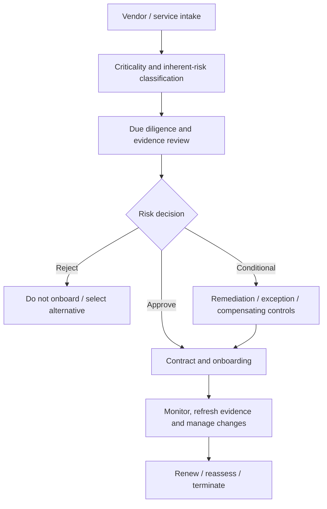
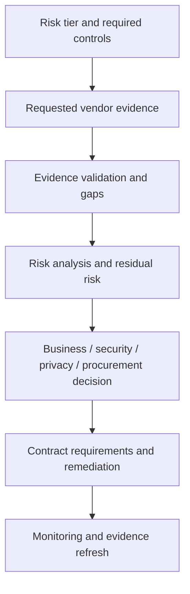
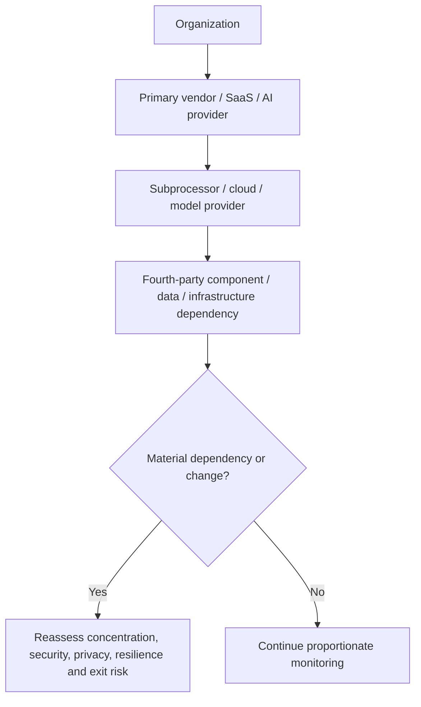

# Manual 08 — Vendor and Third-Party Risk Lifecycle Implementation Paths

## Essential

Use for smaller organizations or bounded supplier ecosystems. Minimum expectations:

- complete vendor/service inventory and accountable owner;
- criticality/inherent-risk classification;
- evidence-based due diligence proportionate to risk;
- documented approve/condition/reject decision;
- required contract/security/privacy clauses;
- onboarding access/data controls;
- incident/change notification route;
- periodic evidence refresh and reassessment;
- offboarding, access revocation, data return/deletion evidence.

## Structured

Use for multiple critical suppliers, regulated data, cloud/SaaS reliance, material outsourcing, or AI/model/API providers. Add:

- standardized tiering methodology;
- control/evidence requirements by tier;
- fourth-party/subprocessor visibility;
- independent evidence validation and exception tracking;
- resilience/BCDR and concentration-risk review;
- continuous monitoring signals and trigger-based reassessment;
- formal remediation plans and risk acceptance;
- renewal gates tied to unresolved issues.

## Enhanced

Use for critical infrastructure, enterprise-scale outsourcing, high-impact AI, systemic cloud dependencies, regulated/high-volume data, or concentrated supplier risk. Add:

- executive risk governance and concentration scenarios;
- architecture/data-flow/component lineage;
- deeper technical testing or independent assurance where justified;
- material fourth-party dependency analysis;
- contractual audit/access/incident/exit protections;
- joint incident and resilience exercises;
- contingency/exit strategy validation;
- continuous evidence and material-change monitoring.

## Lifecycle route

**Accessible explanation:** Every supplier begins with classification and due diligence. Decisions may reject, conditionally approve, or approve the relationship. Approved suppliers move into monitored operation and are reassessed at renewal, material change, or termination.

## Evidence and decision chain

**Accessible explanation:** Vendor decisions are based on required controls, verified evidence, identified gaps, and residual risk. The resulting decision drives contracts, remediation, and ongoing monitoring rather than ending at questionnaire completion.

## Fourth-party and AI dependency chain

**Accessible explanation:** Supplier risk can extend beyond the contracted vendor to subprocessors, cloud/model providers, and fourth-party dependencies. Material dependencies and changes trigger reassessment rather than being hidden behind the primary contract.

## Required lifecycle controls

1. Vendor/service inventory and ownership.
2. Criticality, inherent-risk, data, access, geography, regulatory and concentration classification.
3. Security, privacy, resilience, AI, financial/operational and compliance due diligence as applicable.
4. Evidence validation—including certifications, reports, architecture, policies, test evidence, incidents and remediation—not questionnaire-only assurance.
5. Risk decision and documented exception/risk acceptance.
6. Contract controls: data use, confidentiality, security, incident notice, audit/evidence rights, subprocessors, resilience, AI use, retention, deletion and exit.
7. Onboarding identities, connectivity, data flows, keys/secrets and ownership.
8. Continuous monitoring, evidence refresh and material-change triggers.
9. Incident, breach, service disruption, control failure and remediation management.
10. Renewal and reassessment gates.
11. Offboarding: access revocation, asset/key return, data return/deletion, retention and transition/exit evidence.

## Assurance boundary

Risk-based supplier governance reduces uncertainty but cannot eliminate third-party risk. The manual must preserve known gaps, reliance on external evidence, fourth-party limitations, residual risk, and accountable human decisions.
