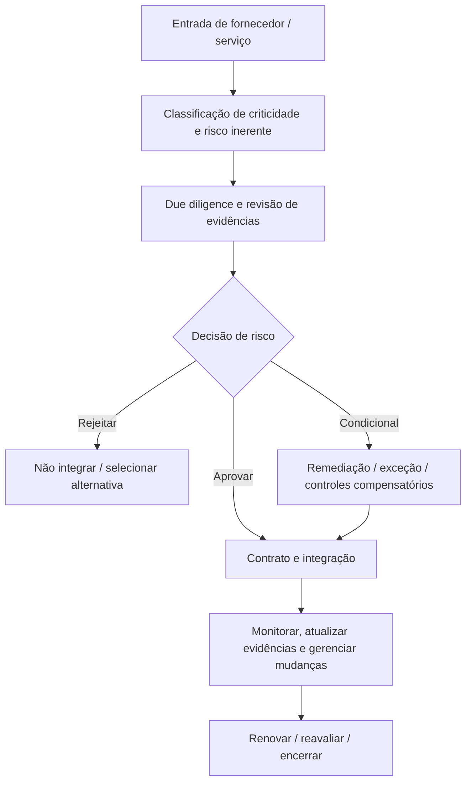
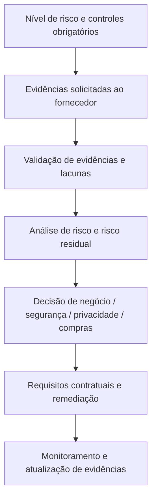
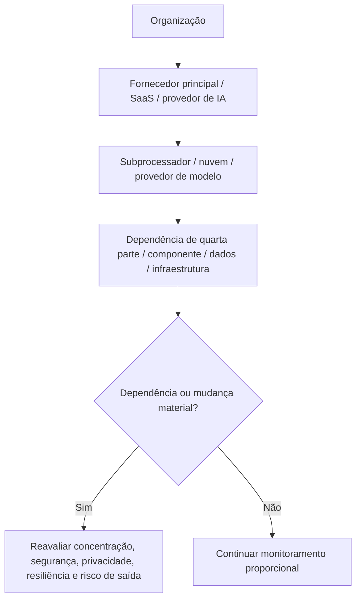

# Manual 08 — Caminhos de Implementação do Ciclo de Vida de Risco de Fornecedores e Terceiros

## Essencial

Use para organizações menores ou ecossistemas de fornecedores delimitados. Expectativas mínimas:

- inventário completo de fornecedores/serviços e responsável definido;
- classificação de criticidade/risco inerente;
- due diligence baseada em evidências e proporcional ao risco;
- decisão documentada de aprovar/condicionar/rejeitar;
- cláusulas contratuais obrigatórias de segurança/privacidade;
- controles de acesso e dados durante a integração;
- rota de notificação de incidentes/mudanças;
- atualização periódica de evidências e reavaliação;
- desligamento, revogação de acesso e evidência de devolução/exclusão de dados.

## Estruturado

Use para múltiplos fornecedores críticos, dados regulados, dependência de nuvem/SaaS, terceirização material ou provedores de IA/modelos/API. Adicione:

- metodologia padronizada de classificação por níveis;
- requisitos de controles/evidências por nível;
- visibilidade de quartas partes/subprocessadores;
- validação independente de evidências e acompanhamento de exceções;
- revisão de resiliência/BCDR e risco de concentração;
- sinais de monitoramento contínuo e reavaliação acionada por eventos;
- planos formais de remediação e aceitação de risco;
- pontos de controle de renovação vinculados a questões não resolvidas.

## Aprimorado

Use para infraestrutura crítica, terceirização em escala empresarial, IA de alto impacto, dependências sistêmicas de nuvem, dados regulados/de alto volume ou risco concentrado de fornecedores. Adicione:

- governança executiva de risco e cenários de concentração;
- arquitetura/fluxo de dados/linhagem de componentes;
- testes técnicos mais profundos ou asseguração independente quando justificado;
- análise de dependências materiais de quartas partes;
- proteções contratuais de auditoria/acesso/incidente/saída;
- exercícios conjuntos de incidentes e resiliência;
- validação de contingência/estratégia de saída;
- evidências contínuas e monitoramento de mudanças materiais.

## Rota do ciclo de vida

**Explicação acessível:** Cada fornecedor começa com classificação e due diligence. As decisões podem rejeitar, aprovar condicionalmente ou aprovar o relacionamento. Fornecedores aprovados passam para operação monitorada e são reavaliados na renovação, em mudanças materiais ou no encerramento.

## Cadeia de evidências e decisão

**Explicação acessível:** As decisões sobre fornecedores se baseiam em controles obrigatórios, evidências verificadas, lacunas identificadas e risco residual. A decisão resultante orienta contratos, remediação e monitoramento contínuo, em vez de terminar no preenchimento de um questionário.

## Cadeia de dependências de quartas partes e IA

**Explicação acessível:** O risco de fornecedores pode se estender além do fornecedor contratado para subprocessadores, provedores de nuvem/modelos e dependências de quartas partes. Dependências e mudanças materiais acionam reavaliação em vez de ficarem ocultas pelo contrato principal.

## Controles obrigatórios do ciclo de vida

1. Inventário e responsabilidade por fornecedores/serviços.
2. Classificação de criticidade, risco inerente, dados, acesso, geografia, requisitos regulatórios e concentração.
3. Due diligence de segurança, privacidade, resiliência, IA, aspectos financeiros/operacionais e conformidade, conforme aplicável.
4. Validação de evidências—incluindo certificações, relatórios, arquitetura, políticas, evidências de testes, incidentes e remediação—não asseguração baseada apenas em questionários.
5. Decisão de risco e exceção/aceitação de risco documentada.
6. Controles contratuais: uso de dados, confidencialidade, segurança, notificação de incidentes, direitos de auditoria/evidência, subprocessadores, resiliência, uso de IA, retenção, exclusão e saída.
7. Integração de identidades, conectividade, fluxos de dados, chaves/segredos e responsabilidade.
8. Monitoramento contínuo, atualização de evidências e gatilhos de mudança material.
9. Gestão de incidentes, violações, interrupções de serviço, falhas de controles e remediação.
10. Pontos de controle de renovação e reavaliação.
11. Desligamento: revogação de acesso, devolução de ativos/chaves, devolução/exclusão de dados, retenção e evidências de transição/saída.

## Limite de asseguração

A governança de fornecedores baseada em risco reduz a incerteza, mas não pode eliminar o risco de terceiros. O manual deve preservar lacunas conhecidas, dependência de evidências externas, limitações de quartas partes, risco residual e decisões humanas responsáveis.
