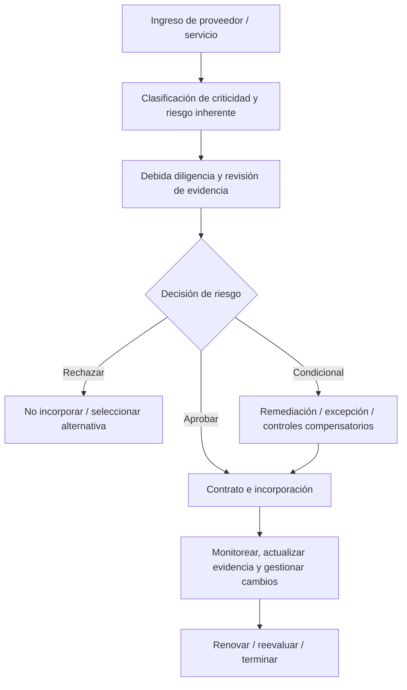
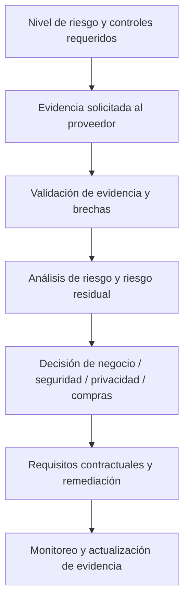
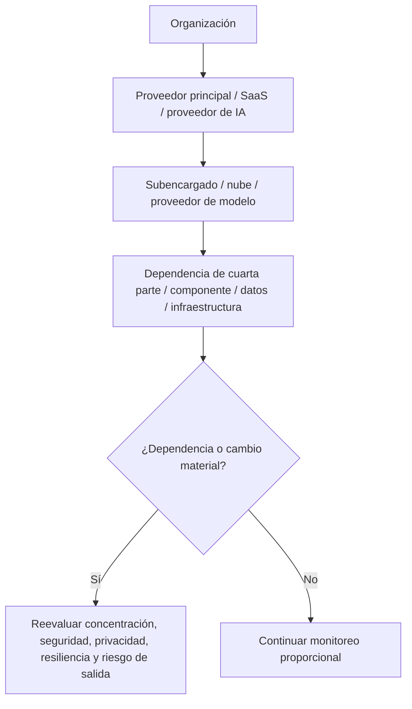

# Manual 08 — Rutas de Implementación del Ciclo de Vida de Riesgo de Proveedores y Terceros

## Esencial

Úselo para organizaciones más pequeñas o ecosistemas de proveedores acotados. Expectativas mínimas:

- inventario completo de proveedores/servicios y propietario responsable;
- clasificación de criticidad/riesgo inherente;
- debida diligencia basada en evidencia y proporcional al riesgo;
- decisión documentada de aprobar/condicionar/rechazar;
- cláusulas contractuales requeridas de seguridad/privacidad;
- controles de acceso y datos durante la incorporación;
- ruta de notificación de incidentes/cambios;
- actualización periódica de evidencia y reevaluación;
- desvinculación, revocación de acceso y evidencia de devolución/eliminación de datos.

## Estructurado

Úselo para múltiples proveedores críticos, datos regulados, dependencia de nube/SaaS, tercerización material o proveedores de IA/modelos/API. Agregue:

- metodología estandarizada de niveles;
- requisitos de controles/evidencia por nivel;
- visibilidad de cuartas partes/subencargados;
- validación independiente de evidencia y seguimiento de excepciones;
- revisión de resiliencia/BCDR y riesgo de concentración;
- señales de monitoreo continuo y reevaluación basada en disparadores;
- planes formales de remediación y aceptación de riesgo;
- puertas de renovación vinculadas a asuntos no resueltos.

## Mejorado

Úselo para infraestructura crítica, tercerización a escala empresarial, IA de alto impacto, dependencias sistémicas de nube, datos regulados/de gran volumen o riesgo concentrado de proveedores. Agregue:

- gobierno ejecutivo del riesgo y escenarios de concentración;
- arquitectura/flujo de datos/linaje de componentes;
- pruebas técnicas más profundas o aseguramiento independiente cuando se justifique;
- análisis de dependencias materiales de cuartas partes;
- protecciones contractuales de auditoría/acceso/incidente/salida;
- ejercicios conjuntos de incidentes y resiliencia;
- validación de contingencia/estrategia de salida;
- evidencia continua y monitoreo de cambios materiales.

## Ruta del ciclo de vida

**Explicación accesible:** Cada proveedor comienza con clasificación y debida diligencia. Las decisiones pueden rechazar, aprobar condicionalmente o aprobar la relación. Los proveedores aprobados pasan a operación monitoreada y se reevaluarán en la renovación, ante cambios materiales o en la terminación.

## Cadena de evidencia y decisión

**Explicación accesible:** Las decisiones sobre proveedores se basan en controles requeridos, evidencia verificada, brechas identificadas y riesgo residual. La decisión resultante impulsa contratos, remediación y monitoreo continuo, en lugar de terminar al completar un cuestionario.

## Cadena de dependencias de cuartas partes e IA

**Explicación accesible:** El riesgo de proveedores puede extenderse más allá del proveedor contratado hacia subencargados, proveedores de nube/modelos y dependencias de cuartas partes. Las dependencias y cambios materiales activan una reevaluación en lugar de quedar ocultos detrás del contrato principal.

## Controles requeridos del ciclo de vida

1. Inventario y propiedad de proveedores/servicios.
2. Clasificación de criticidad, riesgo inherente, datos, acceso, geografía, regulación y concentración.
3. Debida diligencia de seguridad, privacidad, resiliencia, IA, aspectos financieros/operativos y cumplimiento según corresponda.
4. Validación de evidencia—incluidas certificaciones, informes, arquitectura, políticas, evidencia de pruebas, incidentes y remediación—no aseguramiento basado solo en cuestionarios.
5. Decisión de riesgo y excepción/aceptación de riesgo documentada.
6. Controles contractuales: uso de datos, confidencialidad, seguridad, aviso de incidentes, derechos de auditoría/evidencia, subencargados, resiliencia, uso de IA, retención, eliminación y salida.
7. Incorporación de identidades, conectividad, flujos de datos, claves/secretos y propiedad.
8. Monitoreo continuo, actualización de evidencia y disparadores de cambios materiales.
9. Gestión de incidentes, brechas, interrupciones de servicio, fallas de controles y remediación.
10. Puertas de renovación y reevaluación.
11. Desvinculación: revocación de acceso, devolución de activos/claves, devolución/eliminación de datos, retención y evidencia de transición/salida.

## Límite de aseguramiento

El gobierno de proveedores basado en riesgo reduce la incertidumbre, pero no puede eliminar el riesgo de terceros. El manual debe preservar las brechas conocidas, la dependencia de evidencia externa, las limitaciones de cuartas partes, el riesgo residual y las decisiones humanas responsables.
